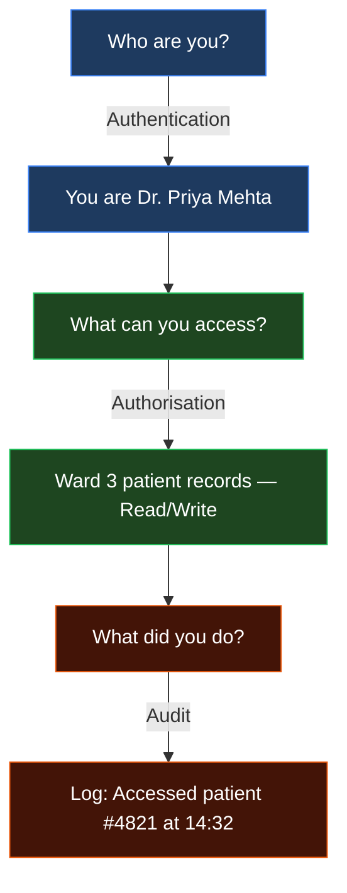
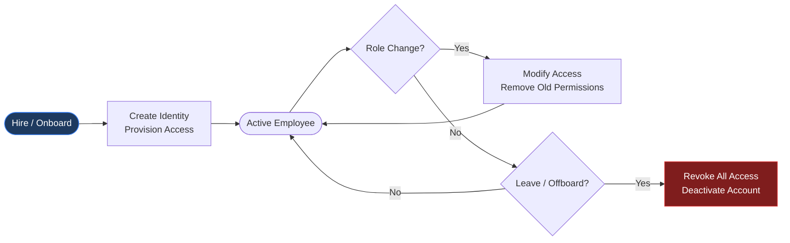
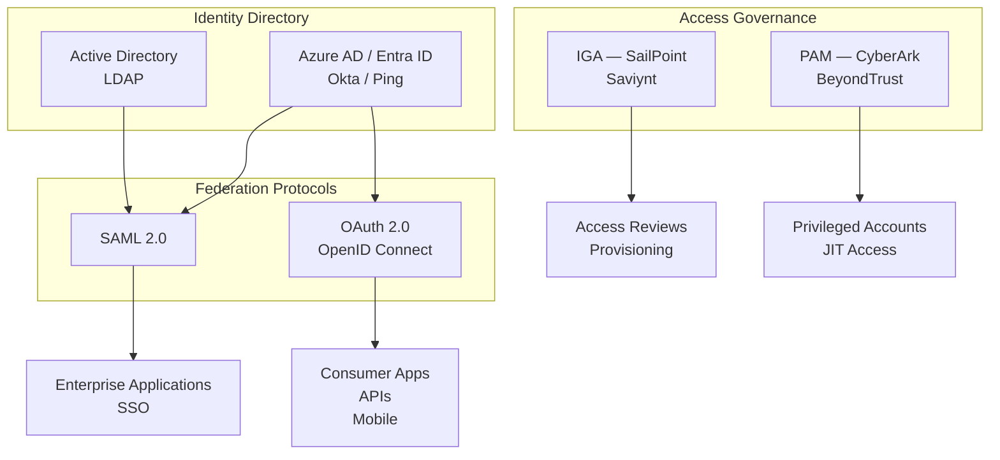

Most security breaches do not start with a sophisticated zero-day exploit. They start with something embarrassingly simple: the wrong person had access to something they should not have had.

That is an IAM failure.

Identity and Access Management — IAM — is the discipline of ensuring that **the right people have the right access to the right resources, at the right time, and for the right reasons**. Every word in that sentence matters, and most organisations struggle with at least two of them.

This post is the first in a series where I will cover IAM concepts from first principles. Whether you are a developer trying to understand why your security team keeps asking questions about your OAuth setup, or an IT professional moving into the security space, this is a good place to start.

---

## The Core Problem IAM Solves

Imagine a large hospital. It has doctors, nurses, administrative staff, external consultants, third-party vendors, and patients who use a portal. Each of these people needs access to different systems — and critically, they need *different kinds* of access within those systems.

A nurse needs to read patient records for patients currently in their ward. A doctor needs to read *and write* records. The billing department needs financial records but not clinical notes. A patient needs to see only their own data.

Now multiply this across thousands of people and dozens of systems — electronic health records, HR systems, finance platforms, email, cloud infrastructure, and so on.

Without a disciplined approach to IAM, you end up with what security teams call **"access sprawl"**: a tangled mess where nobody knows exactly who can access what, permissions are granted and never revoked, and a single compromised account can cascade into a major breach.

---

## The Three Core Pillars of IAM

### 1. Authentication — "Who Are You?"

Authentication is the process of verifying that someone is who they claim to be. The most familiar form is a username and password. But passwords alone are weak — they are guessed, phished, reused, and leaked constantly.

Modern authentication uses **multiple factors**:
- Something you **know** — password, PIN
- Something you **have** — phone, hardware token (YubiKey)
- Something you **are** — fingerprint, face ID

Multi-Factor Authentication (MFA) is the single most impactful IAM control you can implement. Microsoft's research consistently shows MFA prevents over 99% of automated credential-stuffing attacks.

### 2. Authorisation — "What Can You Access?"

Once a user is authenticated, authorisation determines what they are allowed to do. This is where most of the complexity in IAM lives.

The two most common models:

| Model | Full Name | How It Works | Best For |
|-------|-----------|-------------|----------|
| **RBAC** | Role-Based Access Control | Access is assigned based on job roles | Most enterprise applications |
| **ABAC** | Attribute-Based Access Control | Access is decided by policies using attributes (department, location, time) | Complex, fine-grained needs |

**Example — RBAC:**
A `nurse` role gets read access to patient records. A `doctor` role gets read/write. A `billing-staff` role gets access to financial records only. People are assigned to roles; roles carry permissions.

**Example — ABAC:**
"Grant read access to patient records IF the user's department is `clinical` AND the patient is currently admitted AND the access time is between 06:00 and 23:00."

ABAC is more powerful but also significantly more complex to manage. Start with RBAC; move to ABAC where the business genuinely requires it.

### 3. Audit — "What Did You Do?"

Every access event should be logged. Not to spy on employees — but because when something goes wrong (and it will), you need to be able to answer: *what happened, when, by whom, and what did they access?*

Audit logs are also a regulatory requirement in most industries (healthcare, finance, government).

---

## The IAM Lifecycle

IAM is not a static configuration you set once. People join organisations, change roles, go on leave, and eventually leave. Each of these transitions must be handled correctly.

**The most dangerous gap in this lifecycle is offboarding.** When someone leaves and their accounts are not promptly deactivated, those dormant credentials become attack targets. I have seen organisations where ex-employees retained access for months after leaving — sometimes years.

A good rule of thumb: access should be revoked **on the day of departure**, not the day HR closes the ticket.

---

## Where IAM Goes Wrong — Most Common Failures

After working in this space, I have seen the same failure patterns repeat across organisations of every size:

**1. Excessive standing privileges**
Giving users permanent, always-on access to sensitive systems, even when they only need it occasionally. The fix: **Just-In-Time (JIT) access** — grant elevated access only when requested and for a defined time window.

**2. No regular access reviews**
Permissions accumulate over time. Someone gets temporary access to a project, the project ends, the access remains. Schedule quarterly access certifications where managers confirm their team's permissions are still appropriate.

**3. Shared accounts**
Multiple people sharing one login for convenience (e.g., a shared admin account). This destroys accountability — you can never determine *who* did what from the audit log. Every person must have their own identity.

**4. Treating IAM as a one-time project**
IAM is not an IT project with a finish line. It is an ongoing operational discipline. Organisations that treat it as a checkbox exercise inevitably end up with access sprawl.

---

## The IAM Technology Landscape

Here is a simplified map of the technologies you will encounter as you go deeper into IAM:

This map will be the foundation for future posts. Each of these technologies — SAML, OAuth 2.0, OpenID Connect, IGA platforms, PAM solutions — deserves its own deep dive, and that is exactly where this series is going.

---

[*Part of the IAM from First Principles series.*](){:target="_blank"}