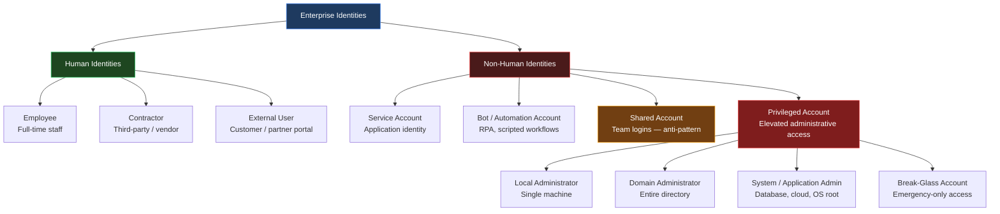
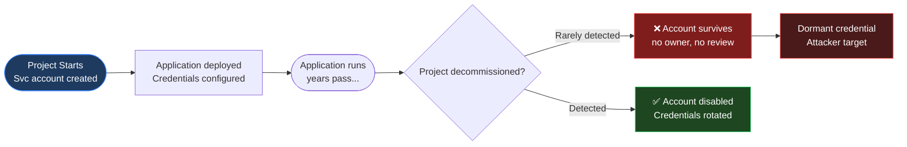
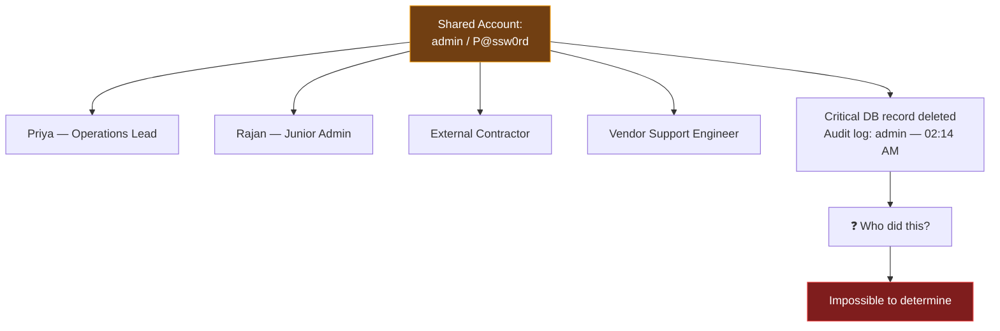
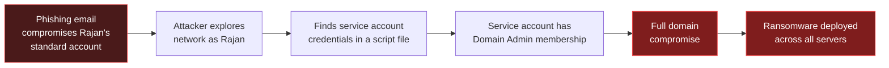
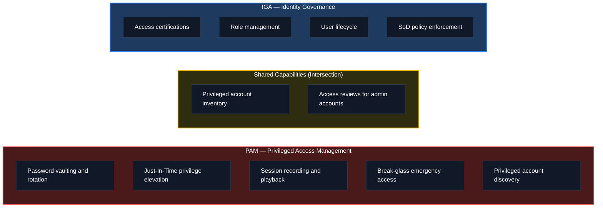
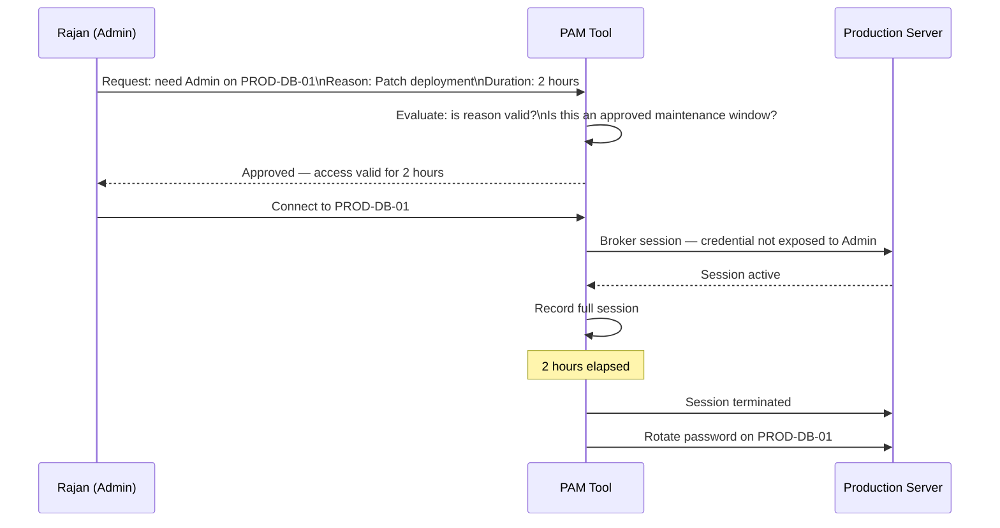
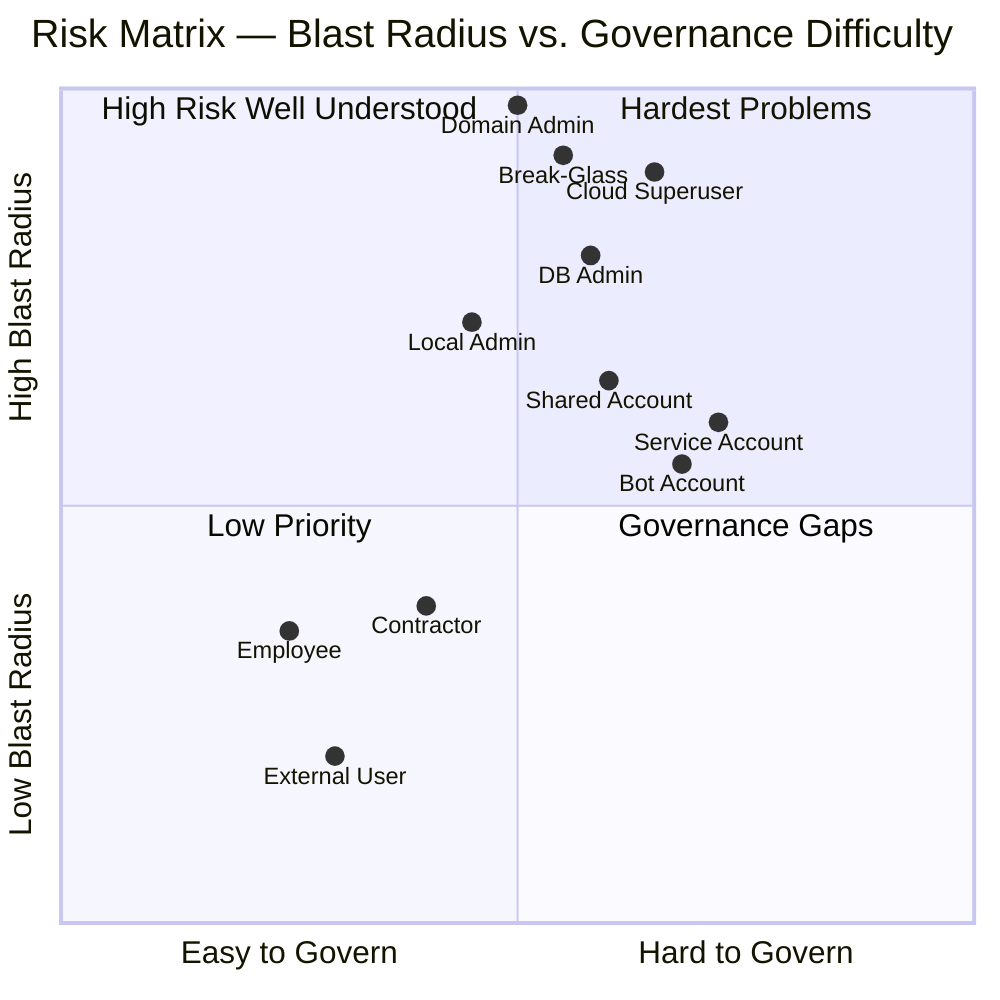
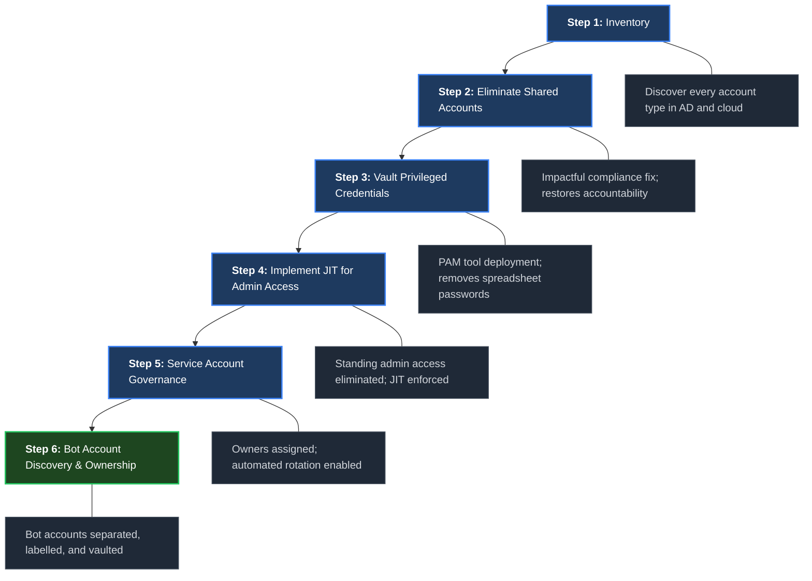

The first post in this series defined IAM as ensuring *the right people have the right access to the right resources, at the right time, and for the right reasons*.

Notice the word "people."

That framing captures a real and important truth — but it is incomplete. Modern enterprise environments contain identities that belong to no person at all: background services that run unattended overnight, administrator accounts that hold the keys to your entire infrastructure, shared logins that three different teams use for "convenience," and automation bots that execute thousands of transactions per hour with no human involvement.

Each of these is an identity. Each carries risk. And most IAM programmes manage them poorly — if at all.

This post introduces the full identity landscape, explains the unique lifecycle and risk profile of each identity type, and introduces **Privileged Identity Management** (the discipline that sits at the high-risk end of this spectrum). Agentic and AI agent identities are intentionally out of scope here — they will receive a dedicated treatment when Non-Human Identity (NHI) governance is covered in a future post.

---

## The Complete Identity Taxonomy

Each category above has a fundamentally different lifecycle, governance requirement, and risk exposure. Let us go through them one by one.

---

## Human Identities — The Baseline

Human identities were covered in depth in [What Is IAM and Why Every Organisation Needs to Get It Right](). A brief summary here to set context for comparison with the non-human types.

| Sub-type | Lifecycle Trigger | Typical Access | Risk if Mismanaged |
|----------|------------------|---------------|-------------------|
| Employee | HR hire event | Role-based, business application | Stale access after role change or departure |
| Contractor | Contract start/end date | Project-scoped, time-limited | Access persists after contract ends |
| External User | Self-registration or invitation | Limited, portal-scoped | Over-provisioned guest access |

The key characteristic of human identities: a **person is accountable**. When something goes wrong, there is a named individual the audit log points to. Every other identity type on this list, when poorly managed, breaks that accountability chain.

---

## Service Accounts — The Invisible Workforce

### What They Are

A service account is an identity created not for a person, but for an **application or background process**. A database backup job, a middleware integration, a monitoring agent, an ETL pipeline — all of these need credentials to authenticate to other systems. Those credentials belong to a service account.

**Simple example:** Your company's HR system needs to read employee data from Active Directory every night to sync profiles. You create a service account `svc-hr-sync` with read-only access to the relevant OU. The HR application uses this account's credentials to authenticate.

**Complex real-world scenario:** A large bank's core banking platform runs 47 microservices. Each service has its own service account for inter-service API calls, database connections, and message queue subscriptions. That is 47 service accounts, each with different permission scopes, potentially across 12 different enterprise systems.

### The Service Account Lifecycle Problem

The lifecycle problem is severe: service accounts are created with intent but rarely decommissioned. Unlike human identities (which are tied to an HR record that becomes inactive when someone leaves), service accounts have **no equivalent off-boarding trigger**. They accumulate silently.

### Key Risks

- **Non-expiring passwords:** Service account passwords are often set to never expire because rotating them requires updating every application that uses them — a co-ordination effort that is hard to schedule.
- **Over-provisioned scope:** The service account was given Domain Admin access "to avoid permission errors" and no one has revisited it since.
- **No MFA:** Applications cannot respond to MFA challenges, so service accounts are typically single-factor — username and password only.
- **No owner:** The engineer who created the account left two years ago. No one knows what it does or whether it is still needed.

### How IAM Tools Handle Service Accounts

Standard IGA tools (SailPoint, Saviynt) can discover and inventory service accounts by connecting to Active Directory and enumerating accounts with certain flag attributes (`IsSvcAccount`). They can assign owners and include service accounts in access review campaigns. However, **the hard problem — secret rotation without breaking the applications that depend on those credentials — requires dedicated tooling**, typically from the PAM (Privileged Access Management) category covered later in this post.

---

## Bot and Automation Accounts

### What They Are

Bot accounts are identities for **Robotic Process Automation (RPA) bots, scheduled scripts, and workflow automation tools**. They look similar to service accounts but differ in one important way: they often simulate human interaction — logging into web portals, filling forms, downloading reports — rather than using machine-to-machine APIs.

Common examples:
- A UiPath or Blue Prism bot that logs into a vendor portal each morning to download invoices
- A Python script that authenticates to an SFTP server to transfer payroll files
- A scheduled task that logs into an ERP system and runs month-end reports

**Why this is riskier than it sounds:** Because bots simulate human login flows, they are often given *human user accounts* rather than dedicated bot accounts. This means the bot is logging in as `jsmith@acme.com` — and when jsmith leaves, the bot breaks. Worse, if jsmith's account is disabled as part of normal offboarding, no one notices the bot failure for days.

### Governance Requirements

- Bot accounts must be distinct identities, clearly labelled (e.g., `bot-ap-invoice-extract@acme.com`)
- They must have an **accountable human owner** — the team responsible for the bot process
- Credentials must be stored in a secret vault, not hardcoded in the RPA project file
- Bot activity must appear in audit logs separately from human activity

---

## Shared Accounts — The Anti-Pattern

### What They Are

A shared account is a single set of credentials used by multiple individuals. The canonical example is the `administrator` or `root` account on a server that everyone on the operations team knows the password for. Other examples:

- A shared `svc-monitoring@acme.com` mailbox that five people check
- A single database admin login (`dbadmin / password123`) that the entire DBA team uses
- A shared social media management account used by the marketing department

### Why They Are Dangerous

The fundamental problem with shared accounts is **the destruction of accountability**. Audit logs record *what was done* and *when*, but not *by whom* — because the "who" is shared across many people.

From a compliance standpoint, shared accounts are a direct violation of most regulatory frameworks (PCI-DSS 8.2, ISO 27001, SOX ITGC controls). Auditors specifically look for and cite shared account usage.

### The Correct Alternative

Every individual must have their own identity, even for administrative tasks. Privileged actions are performed through individual accounts that are *temporarily elevated* to administrator level — not through a permanent shared administrator login. This is the core principle of Just-In-Time (JIT) access, covered under PAM below.

---

## Privileged Accounts — The Crown Jewels

### What They Are

Privileged accounts hold elevated permissions that allow their holder to do things ordinary users cannot: install software, modify system configurations, access all data, create or delete other accounts, manage infrastructure.

These are the highest-value targets in any enterprise environment. Compromising a standard user account gives an attacker access to one person's data. Compromising a Domain Administrator account gives them access to everything.

### Types of Privileged Accounts

| Account Type | Scope | Example | Risk Level |
|-------------|-------|---------|-----------|
| Local Administrator | Single machine | `.\Administrator` on a Windows server | Medium — lateral movement risk |
| Domain Administrator | Entire Active Directory | `ACME\DomainAdmin` | Critical |
| Database Administrator | Entire database instance or cluster | `sa` on SQL Server, `SYSDBA` on Oracle | High |
| Cloud Superuser | Entire cloud account/subscription | AWS root account, Azure Global Admin | Critical |
| Application Administrator | All data within an application | CRM admin, ERP admin | High |
| Break-Glass Account | Emergency full access | Used only when normal access fails | Critical — requires strict controls |

### The Privilege Escalation Threat

The reason privileged accounts dominate breach post-mortems is not that attackers start by compromising an admin account. They almost never do — admin accounts are more heavily watched. Instead:

This is **privilege escalation through lateral movement** — starting with a low-privilege account and finding a path to high privilege. The path almost always runs through a poorly managed service account or an overly permissive local administrator account.

---

## Introducing Privileged Access Management (PAM)

Privileged Access Management is the discipline — and the category of tooling — specifically designed to secure, control, monitor, and audit privileged account usage.

Where IGA tools (SailPoint, Saviynt) manage access governance for the broader identity population, **PAM tools focus exclusively on the highest-risk accounts** and add controls that standard IGA cannot provide.

### Core PAM Capabilities

**1. Password Vaulting**

All privileged account credentials are stored in an encrypted vault, not in spreadsheets, sticky notes, or application config files. When an administrator needs to use a privileged account, they check out the credential from the vault. The vault logs the checkout, who took it, and for how long.

Many PAM tools support **automatic password rotation** — after a session ends, the vault generates a new random password and pushes it to the target system. The administrator never even sees the password; they simply request access and the tool brokers the connection.

**2. Just-In-Time (JIT) Access**

Instead of permanently holding privileged account membership, users request elevation *only when they need it*, for a defined time window.

The result: no standing privileged access, full audit trail, automatic de-escalation, and the administrator never needs to know the actual system password.

**3. Session Recording**

Every privileged session is recorded — keystrokes, commands, screen activity. Recordings are stored tamper-evidently and are searchable. When an incident occurs, security teams can replay exactly what was done during any privileged session.

**4. Break-Glass Accounts**

For genuine emergencies — a production system is down, normal authentication is broken, all other access paths have failed — break-glass accounts provide emergency super-administrator access. The key controls are:

- The credential is sealed until the break-glass process is invoked
- Invoking break-glass generates an immediate alert to the security team
- The session is recorded in full
- A post-incident review is mandatory before the account is re-sealed

---

## Leading PAM Vendors

| Vendor | Product | Positioning |
|--------|---------|------------|
| CyberArk | Privileged Access Manager (PAM) / Conjur | Market leader; strongest enterprise feature set; deepest integration library |
| BeyondTrust | BeyondTrust Privileged Access Management | Strong endpoint privilege management; good for Windows-heavy environments |
| Delinea (formerly Thycotic + Centrify) | Secret Server / Privilege Manager | Cloud-first; competitive pricing; growing cloud entitlement capabilities |
| Saviynt | Enterprise Identity Cloud | IGA + PAM convergence; one platform for governance and privileged access |
| HashiCorp Vault | Vault (open source / Enterprise) | Developer-native secrets management; strong for cloud and DevOps environments |

**Note on IGA + PAM convergence:** Saviynt has been the most deliberate about merging IGA and PAM into a single platform. The traditional view — IGA for provisioning governance, PAM for privileged session control — is giving way to platforms that handle both. This matters because the boundary between "standard user with elevated role" and "privileged user" is increasingly blurry in cloud environments.

---

## How IAM Tools Handle Each Identity Type

The table below shows what mainstream IAM tooling can and cannot do across identity categories:

| Identity Type | Standard IGA (SailPoint, Saviynt) | PAM (CyberArk, BeyondTrust) | AD / Directory |
|--------------|----------------------------------|-----------------------------|-|
| Employee | Full lifecycle — provision, review, offboard | Can manage admin accounts for employees | Source of truth for group membership |
| Contractor | Time-bounded provisioning, auto-expiry | Same as employee for elevated access | Same |
| Service Account | Discovery + inventory; access reviews; owner assignment | Password vaulting, rotation, dependency mapping | Account storage |
| Bot Account | Limited — often treated as service account | Same as service account | Account storage |
| Shared Account | Can flag and certify — cannot eliminate the anti-pattern | Can vault shared credentials, enforce checkout | Account storage |
| Privileged Account | Access reviews for admin roles; SoD on admin role assignments | Full lifecycle — vault, JIT, session recording, rotation | Group membership only |
| Break-Glass Account | Can include in review campaigns | Native break-glass workflows, emergency access management | Account storage |

The key insight: **no single tool covers the entire matrix well**. IGA tools govern *who has access to what*. PAM tools control *how that access is used in real time*. A mature IAM programme needs both, ideally integrated so that IGA certifications can trigger PAM policy changes and PAM session data feeds back into governance dashboards.

---

## The Risk Matrix — Prioritising Your Controls

Not all identity types carry equal risk. Use this as a starting framework for prioritising where to invest controls:

**Quadrant 1 (High Blast Radius, Hard to Govern):** Cloud superusers, service accounts with privileged scope, break-glass accounts. These demand PAM tooling and the strictest controls.

**Quadrant 2 (High Blast Radius, Easier to Govern):** Domain administrators, local admins. Easier to inventory through directory tools; the challenge is enforcing JIT and eliminating standing access.

**Quadrant 4 (Lower Blast Radius, Hard to Govern):** Service accounts for non-privileged workloads, bot accounts. Large in volume, hard to track, lower individual risk — but the aggregate risk from dozens of unmanaged service accounts is significant.

---

## Where to Start — A Practical Sequence

For an organisation building or maturing its identity programme, the sequencing matters:

Step 2 — eliminating shared accounts — is the highest-impact compliance fix and the one auditors will look for first. Step 3 is the most direct risk reduction: vaulting privileged credentials immediately removes the largest attack surface.

---

## Key Takeaways

- **Enterprises contain at least six distinct identity types**, each with different lifecycle patterns, risk profiles, and governance requirements. IAM programmes that focus only on employees are managing a fraction of the actual attack surface.

- **Service accounts are the most under-managed identity type** in most organisations. They accumulate silently, carry non-expiring passwords, often hold excessive privileges, and rarely have a named owner after the original creator leaves.

- **Shared accounts destroy accountability** and violate most regulatory frameworks. They must be eliminated and replaced with individual accounts and JIT privilege elevation.

- **Privileged accounts are the highest-value target for attackers** — not because attackers start there, but because privilege escalation paths almost always run through a poorly managed service account or an overly permissive local admin account.

- **PAM is a distinct discipline** from IGA. IGA governs who has access. PAM controls how that access is used at runtime — through vaulting, JIT elevation, session recording, and automatic rotation.

- **CyberArk, BeyondTrust, and Delinea** are the leading dedicated PAM vendors. For organisations already on Saviynt or SailPoint, both platforms are building PAM convergence capabilities that reduce the need for a separate PAM tool.

- **The governance sequence matters.** Inventory first, eliminate shared accounts second, vault privileged credentials third. Each step meaningfully reduces risk before the next one begins.

---

*Part of the IAM from First Principles series. Previous: [What Is IAM and Why Every Organisation Needs to Get It Right](/posts/2026-05-01-what-is-iam-and-why-it-matters)*
