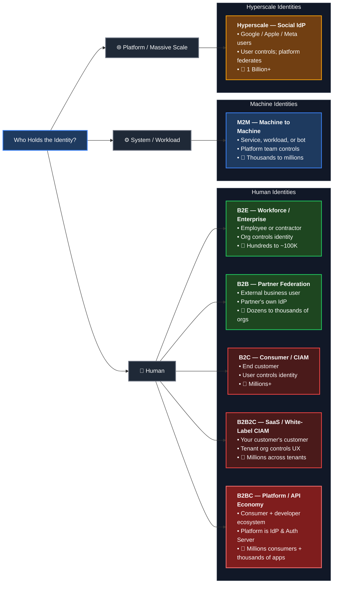
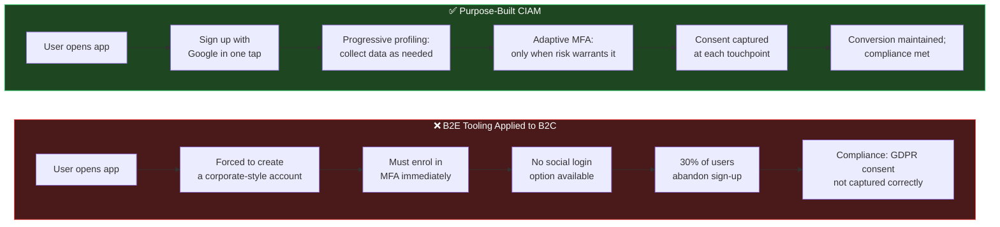
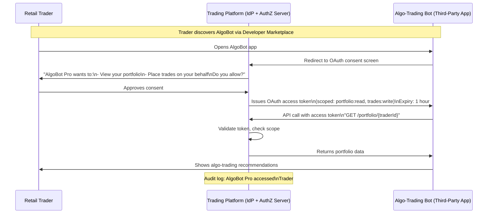
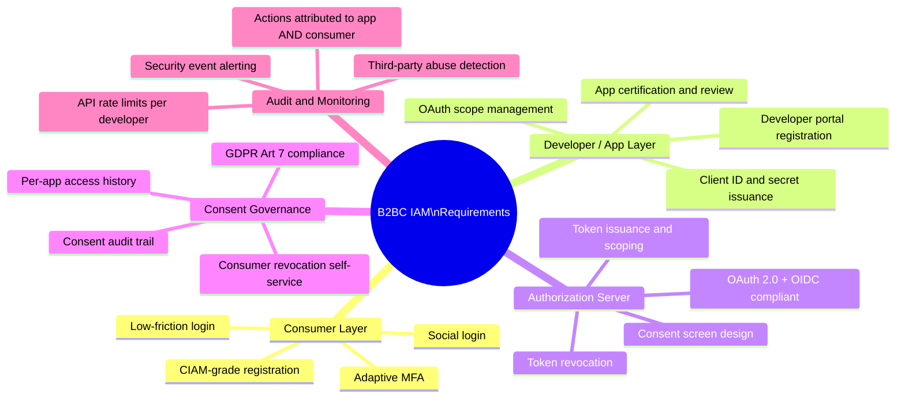
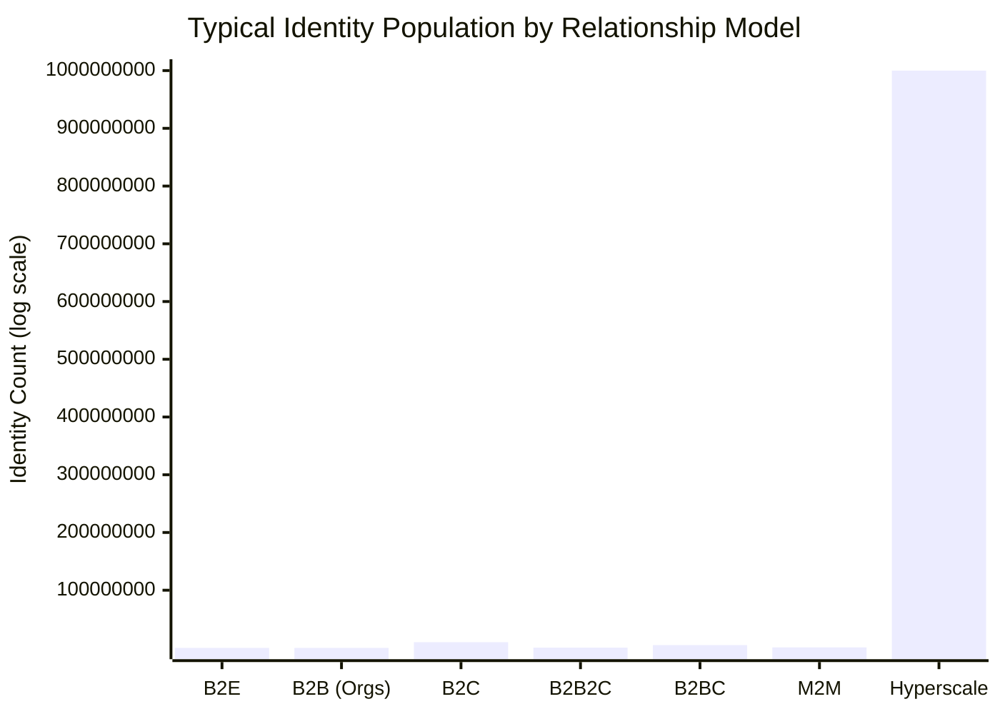
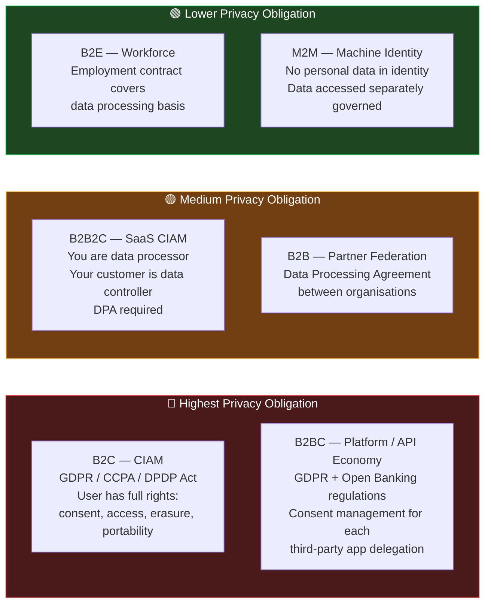

Before you choose a protocol, pick a vendor, or design a login screen, there is one question that determines every architectural decision that follows:

**What is the relationship between your organisation and the identities you are managing?**

An employee is not the same as a customer. A business partner is not the same as an API consumer. A microservice calling another microservice is not the same as either. And yet, teams routinely apply enterprise workforce tooling to consumer applications, or consumer CIAM (Customer Identity and Access Management) platforms to business partner integrations, and then spend months debugging why the architecture is fighting them.

This post maps the seven identity relationship models that exist in the real world, explains what makes each architecturally distinct, and shows why the tooling, protocols, and design patterns that work for one fail badly for another.

---

## The Seven Identity Relationship Models

Each model has a fundamentally different answer to three questions:
- Who *holds* the identity?
- Who *controls* the identity?
- At what *scale* does this operate?

The answers determine your authentication UX, your protocol choice, your privacy obligations, and which vendor category to shortlist.

---

## B2E — Workforce / Enterprise Identity

**The organisation controls everything.** Employees and contractors are given identities by IT, governed by HR data, and have those identities revoked when they leave. The user has no say in whether the identity exists.

**Simple example:** A new joiner at an insurance company is onboarded by HR. IT automatically creates an Active Directory account and provisions access to email, the claims management system, and the VPN. The employee logs in with SSO on day one. When they resign three months later, IT deactivates the account on the last working day.

**Complex real-world scenario:** A large bank with 40,000 employees, 8,000 contractors, and 600 outsourced staff across 12 countries. Different employment types carry different access profiles. Regulatory frameworks (SOX, SEBI, RBI guidelines) require quarterly access reviews. Role changes must trigger automatic access modifications within 24 hours.

**Key characteristics:**

| Dimension | B2E Reality |
|-----------|------------|
| Authentication | MFA is mandatory; passkeys and hardware tokens are common |
| Protocol | SAML 2.0 for SSO to enterprise apps; SCIM for provisioning |
| UX expectation | Friction is acceptable — security over convenience |
| Privacy obligation | Limited — employment contract covers data processing |
| Scale | Predictable; managed headcount |
| Tooling | Okta Workforce, Microsoft Entra ID, Ping, JumpCloud |

B2E is covered in depth in [What Is IAM and Why Every Organisation Needs to Get It Right]() and [Beyond the Employee — Every Type of Identity Your IAM program Must Manage]().

---

## B2B — Partner Federation

**Two organisations, each with their own IdP (Identity Provider) , establishing a federated trust.** There is no shared identity store. The partner's users authenticate against their own organisation's identity system and present a verified assertion to yours.

**Simple example:** A manufacturing company allows its logistics supplier to access a partner portal showing shipment schedules. The supplier's employees log in using their own company credentials (for example: Entra ID), and the manufacturing company trusts the assertion without creating duplicate accounts always, (May create to keep a local reference).

**Complex real-world scenario:** A global insurance group has 200 independent broker firms as distribution partners. Each broker firm has its own identity infrastructure (some use Okta, some use Entra, some have legacy LDAP). The insurance group must federate with all 200, map their claims (department, job role) to internal access tiers, and enforce that a broker from Firm A cannot access Firm B's commission data.

**Key characteristics:**

| Dimension | B2B Reality |
|-----------|------------|
| Authentication | Handled by the partner's IdP — you trust the assertion |
| Protocol | SAML 2.0 federation (Legacy); increasingly moving towards OIDC federation for modern orgs |
| UX expectation | Standard enterprise login — users expect their own org's flow |
| Privacy obligation | Data processing agreement (DPA) between the two organisations |
| Scale | Dozens to thousands of partner organisations; thousands to hundreds of thousands of federated users |
| Tooling | Ping Federate, Okta Org2Org, Azure AD B2B, ADFS |

**The key architectural point:** You do not own or manage partner identities. Your job is to correctly interpret and authorize based on claims you receive. Claim mapping (their `job-title` → your `partner-tier-2` access group) is where B2B complexity lives.

---

## B2C — Consumer Identity (CIAM)

**The user controls the identity.** Consumers self-register, choose their own credentials, and expect the organisation to respect their privacy choices. The architecture must optimise for scale, low friction, and privacy compliance — which are all in tension with the controls that work well for B2E.

**Simple example:** A user downloads a food delivery app, signs up with their email and Google account as a backup, enables face ID, and places an order in under two minutes. The app must handle millions of such sign-ups without adding friction that kills conversion (Literally - Hungry users have low patience and high impulsivity; a simple authentication delay will force them to switch Apps).

**Complex real-world scenario:** A large private sector bank or trading platform (like HDFC, BoFA or RobinHood Trading platform) launches a retail consumer banking app. The user base is 30 million customers. Login must support: password, OTP to registered mobile, biometric, and "Sign in with Google/Apple" for easy onboarding. Europe's GDPR and India's DPDP Act mandate explicit consent tracking. A consumer closing their account must trigger data deletion within 72 hours.

**Key characteristics:**

| Dimension | B2C Reality |
|-----------|------------|
| Authentication | Passwordless preferred; OTP, social login, passkeys; MFA optional or adaptive risk-based |
| Protocol | OAuth 2.0 + OIDC; social federation (Google, Apple, Meta) |
| UX expectation | Zero friction — every extra click reduces sign-up conversion |
| Privacy obligation | GDPR, CCPA, DPDP Act — explicit consent, right to erasure, portability |
| Scale | Millions to hundreds of millions; burst traffic on events (IPO listing day, festival sale) |
| Tooling | Auth0 (Okta CIC), Transmit Security Mosaic, Ping DaVinci, AWS Cognito, Firebase Auth |

### What Breaks When You Apply B2E Tooling to B2C

This is the most expensive mistake in IAM architecture:

Okta Workforce Identity, Microsoft Entra ID, and Ping enterprise platforms are optimised for B2E. Using them for B2C is possible but architecturally painful — they lack native progressive profiling, social login breadth, consent management designed for privacy regulation, and the self-service password recovery flows consumers expect. CIAM platforms exist because the B2C use case is genuinely different.

---

## B2B2C — SaaS / White-Label CIAM

**You build identity infrastructure. Your business customers use it to serve their own consumers.** The end consumer typically has no direct relationship with your platform — they interact with your customer's brand.

**Simple example:** A digital banking platform (like [Thought Machine](https://www.thoughtmachine.net){:target="_blank"} or [Mambu](https://mambu.com/en){:target="_blank"}) provides core banking capabilities to three [neobanks](https://en.wikipedia.org/wiki/Neobank){:target="_blank"}. Each neobank has its own branded consumer app. The platform provides white-labelled CIAM — login pages match each neobank's brand, but the identity engine is the same underneath. [example Neo banks](https://neolista.com/neobanks){:target="_blank"}.

**Complex real-world scenario:** A fintech infrastructure firm provides KYC, onboarding, and identity to 12 regional co-operative banks across Maharashtra and Gujarat. Each bank has its own branding, its own user base (50K to 2 million customers per bank), its own regulatory reporting obligations. The infrastructure firm must:
- Maintain tenant isolation (Bank A's customers cannot be accessed by Bank B's admins)
- Allow each bank to configure their own MFA policies
- Produce per-bank compliance reports
- Manage their own developer portal for bank IT teams

**Key characteristics:**

| Dimension | B2B2C Reality |
|-----------|--------------|
| Authentication | Configured per tenant; consumer-grade UX for end users |
| Protocol | OAuth 2.0 + OIDC with multi-tenant authorization servers |
| UX expectation | Your customer's consumer sees their tenant's branded experience |
| Privacy obligation | Layered — you process on behalf of your customer (data processor); your customer is the data controller |
| Scale | Sum of all tenants' consumer bases; multi-tenant architecture must isolate data and policy |
| Tooling | Auth0 Organisations, Okta Customer Identity Cloud with multi-tenancy, Ping Identity |

**The architectural anchor:** Multi-tenancy. Each tenant (your business customer) must be able to customise their experience, enforce their own policies, and have full data isolation — while you manage the underlying identity infrastructure centrally.

---

## B2BC — Platform / API Economy Identity

**This is the most architecturally complex model.** The primary business simultaneously serves consumers directly (B2C) and operates a developer platform so third parties can build solutions on top — serving the same consumer base. The platform is the IdP and the Authorization Server for everyone.

**The trading platform example:**

A trading platform such as Zerodha/ ICICI / E*Trade serves retail traders directly (B2C). It also launches a developer portal — third-party fintech firms, advisory houses, and algorithmic trading tool providers can build on its APIs. The same retail trader can:
- Use the native trading platform  app directly
- Use a third-party algo-trading bot that accesses their trading platform account via OAuth

The trader has **one identity** on trading platform. The third-party app accesses that identity's resources **only with the trader's explicit consent**, via OAuth.

**Real-world examples of this exact model:**
- [ETrade Developer Portal](https://developer.etrade.com/home){:target="_blank"} - US based Broker provides E*TRADE API which makes it easy to build innovative applications.
- [Zerodha Kite API](https://kite.trade/){:target="_blank"} — Zerodha is the broker and the Authorization Server; third-party algo-trading tools authenticate via OAuth; same Zerodha customer uses both
- [Open Banking / PSD2 in Europe](https://www.eba.europa.eu/regulation-and-policy/payment-services-and-electronic-money/regulatory-technical-standards-on-strong-customer-authentication-and-secure-communication-under-psd2){:target="_blank"} — banks are mandated to be Authorization Servers; Third-Party Providers (TPPs) are OAuth clients; bank customers grant consent
- [Salesforce AppExchange](https://appexchange.salesforce.com/){:target="_blank"} — Salesforce is the IdP; ISV applications use OAuth to access customer data within Salesforce
- [NPCI / UPI ecosystem](https://www.npci.org.in/){:target="_blank"} — UPI acts as the underlying payment identity fabric; third-party apps (PhonePe, GPay, Paytm) access the same bank accounts via consent-based delegation

**The IAM requirements B2BC creates:**

**The governance gap most platforms miss:** When a third-party app takes an action using a consumer's delegated token, whose audit log does it appear in? The answer must be: *both* — the consumer's activity history AND the developer app's API usage log, with the action attributed to the app, not to the consumer directly. Most legacy IAM tools log this indistinguishably from the consumer's own actions. This destroys forensic accountability.

---

## M2M — Machine-to-Machine Identity

**No human is involved on either side.** A service, workload, or script authenticates to another service to perform a task. The relationship is between two systems, not between a business and a person.

**Simple example:** A Lambda function in AWS runs nightly to archive old records from a production database to S3. It assumes an IAM Role with S3 write permissions for the target bucket. No human credential is used.

**Complex real-world scenario:** A large payment processor runs 47 microservices across three Kubernetes clusters. Each service has its own SPIFFE identity (SVID certificate, auto-rotated every hour). Inter-service calls use mTLS with SPIFFE/SPIRE — the payment service authenticates to the fraud-detection service, which authenticates to the risk-scoring service. Service mesh enforces that only the payment service can call fraud-detection; nothing else can, even if it tries.

**Key characteristics:**

| Dimension | M2M Reality |
|-----------|------------|
| Authentication | OAuth client_credentials grant; mTLS certificates; SPIFFE/SPIRE SVIDs; API keys (legacy) |
| Protocol | OAuth 2.0 client_credentials; mTLS; SPIFFE; vendor-specific (AWS IAM Roles, GCP Service Accounts) |
| UX expectation | None — no human sees the authentication flow |
| Privacy obligation | Minimal for the identity itself; significant for the *data* it accesses |
| Scale | Can reach millions of service identity instances in microservices at hyperscale |
| Tooling | HashiCorp Vault, SPIFFE/SPIRE, AWS IAM Roles for Service Accounts, cloud-native workload identity |

**Why M2M is distinct from service accounts discussed in earlier :**
[Beyond the Employee — Every Type of Identity Your IAM program Must Manage](){:target="_blank"} covers service accounts as *entities* — static credentials assigned to applications. M2M as a *relationship model* goes further: the credentials are ephemeral (rotated every hour or per-request), the authentication is mutual (both parties verify each other), and the scale can reach millions. At microservices scale, M2M identity volume is closer to B2C than to B2E — but the governance model is entirely different from both.

---

## Hyperscale — Social IdP / Federation Provider

**The platform is so large that it becomes identity infrastructure for the rest of the internet.** Google, Apple, and Meta operate at a scale where their user bases dwarf any single organisation's. When they offer "Sign in with Google," they are acting as an Identity Provider (IdP) for millions of other applications.

**Simple example:** A news aggregator app offers "Sign in with Google." The user taps the button, Google authenticates the user, and sends an OIDC token to the news app with the user's name and email. The news app never handles a password.

**As an IdP:** Google issues OIDC tokens. Relying parties (the apps using "Sign in with Google") consume them. The user's identity is anchored at Google, and Google's MFA, account recovery, and device trust flow down to every relying party.

**What this means for organisations building on social IdPs:**
- You offload authentication complexity to a massively scaled, well-maintained system
- You have no control over the user's credential security (if Google changes their MFA policy, you inherit the change)
- You have limited access to user attributes — social IdPs deliberately restrict what they share
- Privacy risk: users can audit and revoke your app's access through their Google/Apple account settings

---

## The Comparison Framework

### Scale by Relationship Type

### Authentication Protocol by Relationship Type

| Relationship | Primary Protocol | Cookie/Session Management Mechanism | Why / How Cookies Are Used |
| :--- | :--- | :--- | :--- |
| **B2E** | SAML 2.0 / OIDC | **SSO Cookies   & App Session Cookies** | IdP drops an SSO cookie for cross-app single sign-on;   individual enterprise apps drop secure cookies for local sessions. |
| **B2B** | SAML 2.0 Federation | **Cross-Domain Session Cookies** | The home organization maintains the login state via an identity provider (IdP) cookie;   the target app drops a local cookie after a successful handshake. |
| **B2C** | OAuth 2.0 / OIDC / Social | **BFF (Backend-For-Frontend)  Secure Cookies** | To prevent token theft (XSS),   tokens are encrypted and stored in browser-managed `HttpOnly` `SameSite=Strict` cookies instead of JavaScript memory. |
| **B2B2C** | Multi-Tenant OIDC | **Tenant-Isolated  Session Cookies** | Application issues a session cookie   scoped strictly to the customer's specific sub-domain or tenant space. |
| **B2BC** | OAuth Code + Consent | **Platform Login Cookies** | Core developer platform uses cookies to keep the human consumer logged in   while API access tokens are delegated to third-party apps. |
| **M2M** | OAuth Client Credentials / mTLS | **None  (Stateless Token / TLS Context)** | **No cookies.** Machine-native communication is entirely   programmatic and stateless. Credentials or bearer tokens are passed directly in headers or TLS wrappers. |
| **Hyperscale** | OpenID Connect (OIDC) | **Social Session Cookies** | Social networks (Google, Apple) drop long-lived session cookies   to keep users authenticated globally, allowing frictionless federation across the web. |

### Privacy Obligations by Relationship Type

### Tool Selection by Relationship Type

| Relationship | Shortlist | What to Avoid |
|---|---|---|
| B2E | Okta Workforce, Entra ID, Ping, JumpCloud | CIAM platforms (designed for different UX/scale patterns) |
| B2B | Ping Federate, Okta Org2Org, Azure AD B2B | Consumer platforms without enterprise federation support |
| B2C | Auth0 (Okta CIC), Transmit Security, Ping DaVinci, AWS Cognito | Workforce IAM (too much friction, wrong consent model) |
| B2B2C | Auth0 Orgs, Okta multi-tenant, Ping | Single-tenant CIAM platforms without multi-tenancy |
| B2BC | Purpose-built OAuth Authorization Server (Ping, Okta + API gateway, WSO2, or build on open standards) | Any platform not designed to be both an IdP and an Authorization Server at the same time |
| M2M | HashiCorp Vault, SPIFFE/SPIRE, AWS IAM Roles, cloud-native workload identity | Human-oriented IAM platforms; static API key management |
| Hyperscale | Relying party integration to Google/Apple/Meta via OIDC | Building your own social IdP-equivalent |

---

## The Two Architecture Mistakes That Cost the Most

**Mistake 1: Using B2E tooling for B2C users**

The symptoms: high drop-off at sign-up, consumer complaints about MFA being mandatory, inability to support social login, GDPR consent managed through IT tickets. The cause: the team chose Okta Workforce or Entra ID for their consumer app because the security team already had it. The fix: a purpose-built CIAM platform.

**Mistake 2: Using B2C tooling for B2B federation**

The symptoms: partner users cannot use their own organisation's SSO, you end up creating shadow accounts for partner staff, partner IT teams demand SAML federation and the platform does not support it natively. The cause: Auth0 or AWS Cognito was chosen for a consumer app and the team tried to extend it to enterprise partner access. The fix: a federation-capable enterprise IdP (Ping Federate, Okta Org2Org) alongside or instead.

Both mistakes have the same root cause: the relationship model was never explicitly defined before tooling was selected.

---

## The Dual-Role Problem — A Special Case

Some organisations have a population of identities that exist in two relationship models simultaneously. A banker at HDFC who also has a personal savings account with HDFC. An E*Trade employee who uses E*Trade platform products as a personal customer.

This is an **identity unification** challenge, not a separate relationship model. The person has two identities — one governed as B2E, one governed as B2C — and the challenge is linking them in a controlled way so the system knows they are the same person without collapsing the two governance regimes into one. There is no clean standard for this yet; current approaches use explicit linking flows (the user proves both identities and consents to the link) or inference-based matching (email/phone match) with privacy guardrails. Most platforms solve it case-by-case.

---

## Key Takeaways

- **The relationship model is the first architectural decision**, not the protocol or vendor. Every downstream choice — authentication UX, protocol, privacy controls, tooling — follows from it.

- **B2E and B2C are fundamentally different paradigms**, not different scales of the same thing. B2E: organisation controls, security over friction. B2C: user controls, conversion over friction, privacy-first. Building one with the other's tools creates structural debt.

- **B2BC (Platform / API Economy)** is the most complex model and the most underappreciated. When a business simultaneously serves consumers directly AND opens developer APIs so third parties serve the same consumers, the platform must operate as both an IdP and an OAuth Authorization Server. This is the Zerodha Kite model, the Open Banking model, the Salesforce AppExchange model. Getting this architecture right requires explicit OAuth consent design, per-app audit trails, and consumer-facing grant management.

- **M2M is not just a service account at scale** — it is a relationship model where neither party is human, credentials are ephemeral, and authentication must be mutual. At microservices scale, M2M identity volume approaches B2C numbers but requires completely different tooling.

- **Privacy obligations intensify as user autonomy increases.** B2E users have the least privacy leverage (employment contract). B2C and B2BC consumers have the most (GDPR, CCPA, DPDP Act — right to consent, access, erasure, and portability).

- **Explicitly naming your relationship model before selecting tooling saves months.** The two most expensive architectural mistakes in IAM — B2E tooling for B2C, and B2C tooling for B2B — both trace back to skipping this step.

---

[*Part of the IAM from First Principles series.*](){:target="_blank"}