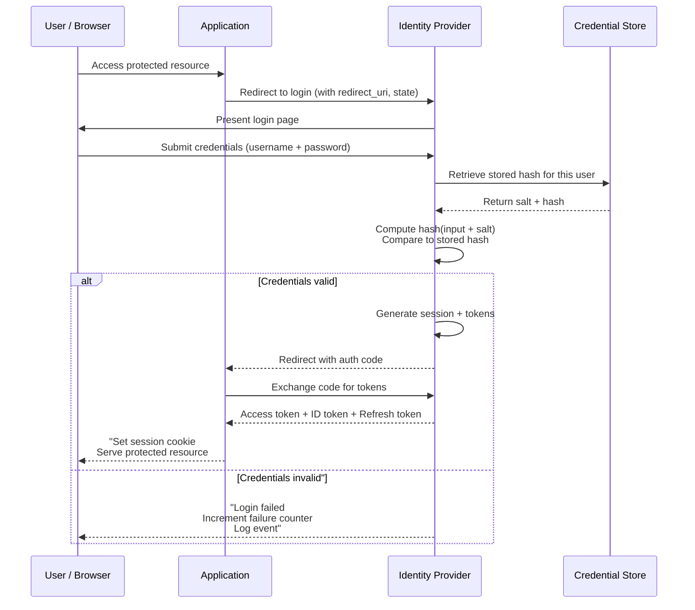
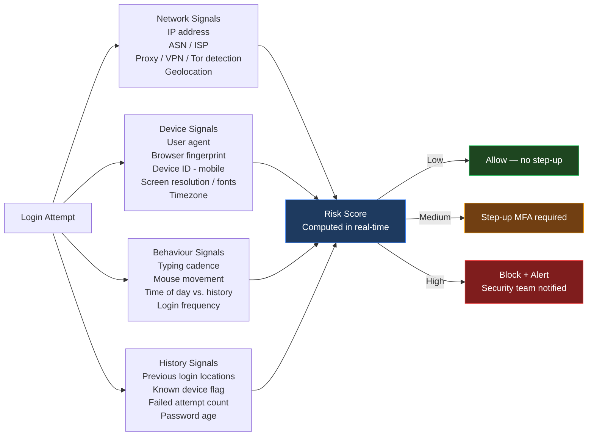
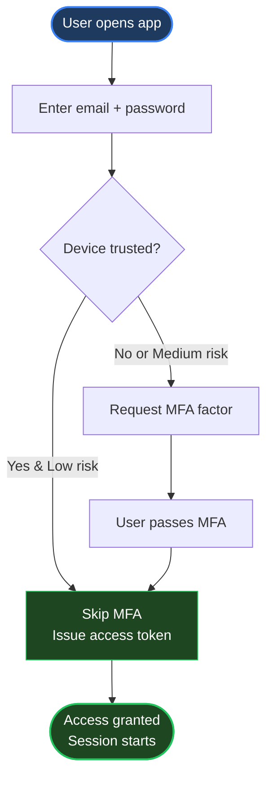
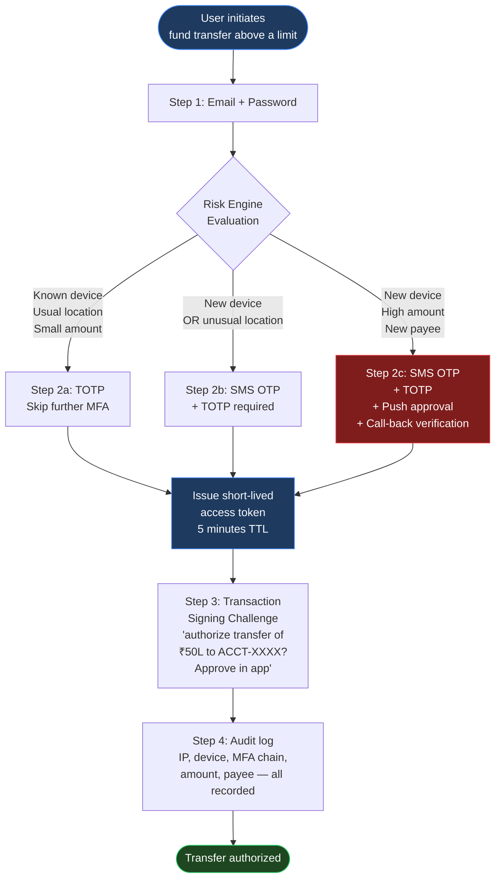
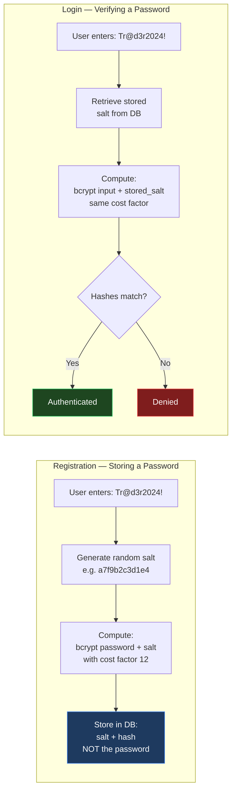
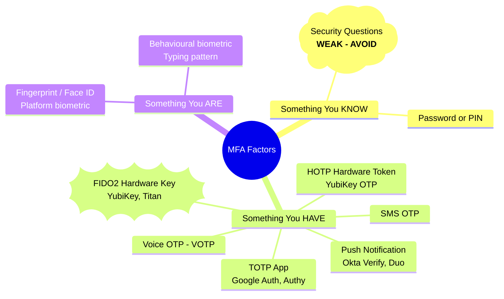
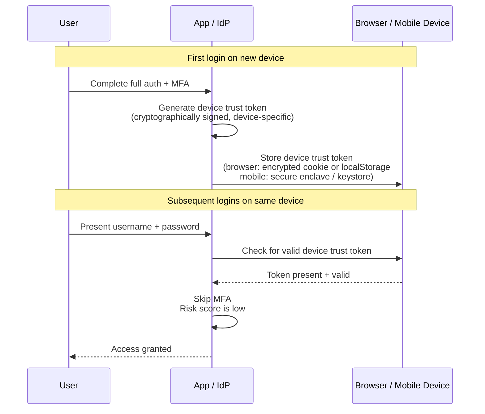
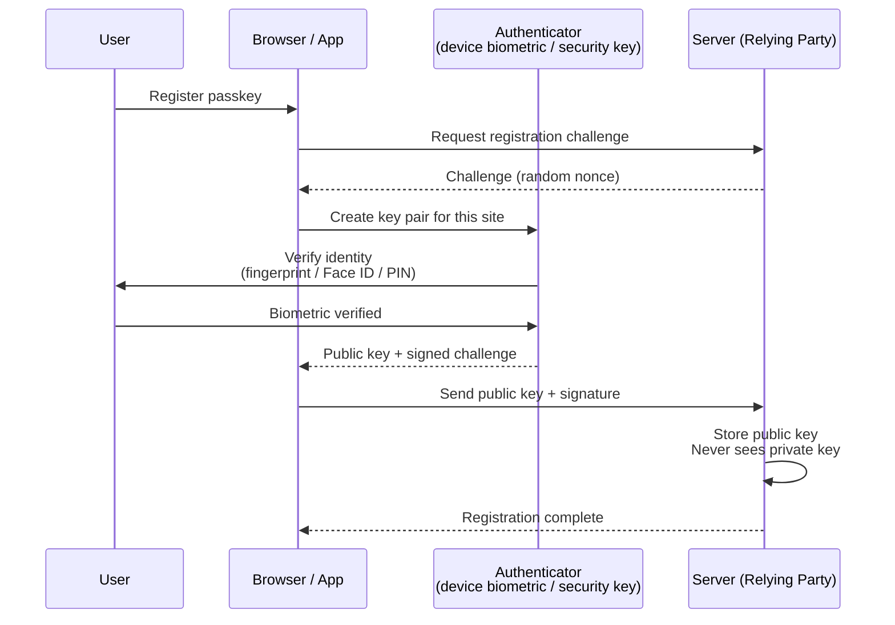
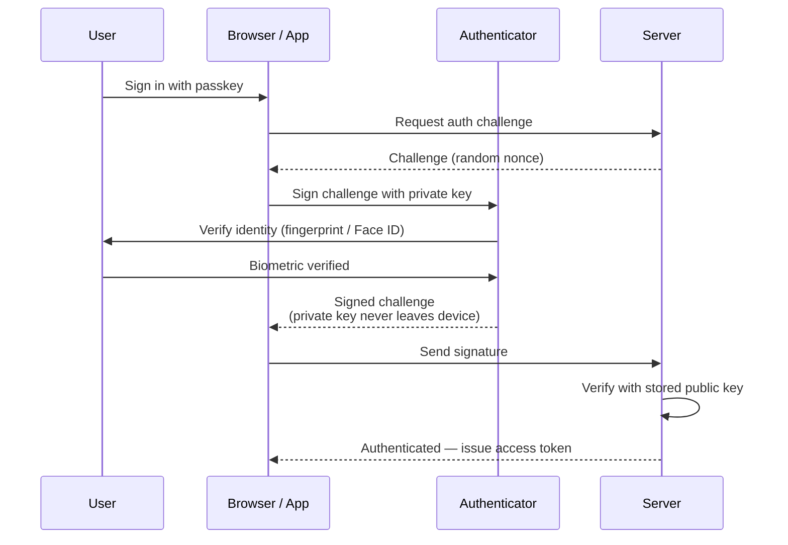

Authentication is the act of proving you are who you claim to be. It sounds simple. In practice, it is a chain of cryptographic operations, risk evaluations, session management decisions, and trust signals — all executing in under a second, every time someone opens a given application.

Most developers understand the surface layer: user enters a password, system checks it, access is granted. That mental model breaks the moment you need to add MFA, support passkeys, implement device trust, or explain to a security auditor what telemetry your login page collects.

This post builds the complete picture — from credential verification to what lands in the browser, from password hashing internals to why a TOTP code changes every 30 seconds. Each section here has a dedicated deep dive later in this series; the goal now is to give you the full map so the individual pieces make sense in context.

---

## How Authentication Actually Works

Authentication is a challenge-response process. The system challenges the user to prove knowledge or possession of a credential. The user responds. The system verifies the response and, if valid, issues proof of authentication.



Three things happen in parallel that most flow diagrams omit:
1. **Telemetry collection** — the IdP is gathering context signals throughout this exchange
2. **Risk evaluation** — a score is computed from the telemetry before the credential check even completes
3. **Step-up decision** — if risk is above threshold, additional factors are requested even when the primary credential was valid

---

## What the Client Receives After Authentication

Authentication does not just "let you in." It issues a proof — a credential the client presents for every subsequent request. There are three main forms this takes.

### 1. Session Cookie

The server creates a session record and sends back an opaque identifier as a cookie. All session state lives server-side.

```
Set-Cookie: sessionid=a3f9b2c1d4e5; HttpOnly; Secure; SameSite=Strict; Path=/
```

- **HttpOnly**: JavaScript cannot read it — prevents XSS theft
- **Secure**: Only sent over HTTPS
- **SameSite=Strict**: Not sent on cross-site requests — CSRF protection

On each request, the browser sends this cookie. The server looks up the session record and validates it. This is the classic web application model.

### 2. JWT — JSON Web Tokens

[JSON Web Tokens](https://jwt.io/introduction){:target="_blank"} are self-contained, signed tokens that carry claims about the user. The server does not need to look up a session record — it verifies the signature and reads the payload directly.

A JWT has three parts separated by `.`:
```
eyJhbGciOiJSUzI1NiJ9  ← Header (Base64: algorithm)
.
eyJzdWIiOiJ1c2VyMTIzIiwicm9sZXMiOlsiYWRtaW4iXSwiZXhwIjoxNzE3MDAwMDAwfQ==  ← Payload
.
<signature>  ← RSA/HMAC signature over header + payload
```

In OAuth 2.0 + OIDC flows, you typically receive three tokens:

| Token | Purpose | Lifetime | Sent to |
|-------|---------|---------|--------|
| **Access Token** | Proves the holder is authorized to call an API | Short — 5 to 60 minutes | Resource servers / APIs |
| **Refresh Token** | Used to get a new access token without re-authenticating | Long — hours to days | Only to the token endpoint |
| **ID Token** | Contains claims about *who the user is* (name, email, sub) | Short — consumed once | The client application only |

### 3. SAML Assertion

[SAML 2.0](https://docs.oasis-open.org/security/saml/Post2.0/sstc-saml-tech-overview-2.0.html){:target="_blank"} uses XML-based signed assertions rather than JSON tokens. Common in enterprise B2E and B2B scenarios. The assertion is POST-ed to the service provider's [Assertion Consumer Service (ACS)](https://en.wikipedia.org/wiki/SAML){:target="_blank"} URL after successful authentication at the IdP.

| Format | Protocol | Typical Use |
|--------|---------|------------|
| Session Cookie | HTTP | Traditional web apps |
| JWT | OAuth 2.0 / OIDC | APIs, SPAs, mobile apps |
| SAML Assertion | SAML 2.0 | Enterprise SSO, B2B federation |

---

## Authentication Telemetry — What the Platform Sees

Every login attempt generates a rich context signal. A mature Identity Provider collects and evaluates these signals before, during, and after the credential check. This data feeds the risk engine.



This risk-based approach is what enables [adaptive authentication](https://www.okta.com/identity-101/adaptive-authentication/){:target="_blank"} — where MFA is skipped for low-risk logins from trusted devices, and stepped up or blocked for anomalous ones.

---

## The Authentication Journey — Simple and Complex

### Simple Journey (Consumer App — Known User, Known Device)



### Complex Journey (Banking App — High-Assurance Transaction)



The key pattern in the complex journey: **step-up authentication** — the level of assurance required increases with the risk of the action being authorized. Simply being logged in is not enough to authorize a high-value transaction.

---

## Password Storage — What Actually Happens in the Backend

Passwords are **never stored in plain text**. If an attacker obtains your database and sees raw passwords, that is a fundamental engineering failure. The correct approach uses a one-way cryptographic hash with a salt.

### How Password Hashing Works



A [bcrypt](https://en.wikipedia.org/wiki/Bcrypt){:target="_blank"}-hashed password stored in a database looks like this:

```
$2b$12$LQv3c1yqBWVHxkd0LHAkCOYz6TtxMQJqhN8/lewdZ5FHV.7KCM8xC
```

Breaking it down:
- `$2b$` — bcrypt algorithm version
- `$12$` — cost factor (2¹² = 4,096 iterations — takes ~100ms to compute, makes brute force expensive)
- Next 22 characters — the random salt (Base64-encoded)
- Remaining characters — the hash

**Why the cost factor matters:** A cost factor of 12 takes ~100ms on modern hardware. An attacker with a GPU can attempt [~100 billion MD5 hashes per second](https://www.password-hashing.net/){:target="_blank"} but only ~20,000 bcrypt/second at cost 12. The slowness is the point.

Modern algorithms:

| Algorithm | Designed For | Key Feature |
|-----------|-------------|-------------|
| [bcrypt](https://en.wikipedia.org/wiki/Bcrypt){:target="_blank"} | Password hashing | Adjustable cost factor |
| [Argon2](https://en.wikipedia.org/wiki/Argon2){:target="_blank"} | Password hashing | Memory-hard, [PHC winner 2015](https://www.password-hashing.net/){:target="_blank"} |
| [PBKDF2](https://en.wikipedia.org/wiki/PBKDF2){:target="_blank"} | Password derivation | NIST-recommended, FIPS-compliant |
| SHA-256 / MD5 | Data integrity (NOT passwords) | Fast — wrong choice for passwords |

**Never use SHA-256 or MD5 alone for passwords.** They are fast by design, which is exactly wrong for credential storage.

---

## MFA — A Map of Every Factor Type

[Multi-Factor Authentication (MFA)](https://en.wikipedia.org/wiki/Multi-factor_authentication){:target="_blank"} adds a second (or third) challenge after the password. The factors come from three categories:



### TOTP — Time-based One-Time Password

[TOTP](https://datatracker.ietf.org/doc/html/rfc6238){:target="_blank"} generates a 6-digit code that changes every 30 seconds. The algorithm: `HMAC-SHA1(secret_key, floor(current_time / 30))`. Both the app and the server know the same shared secret (established at enrolment via QR code). Because time is synchronised, both compute the same code at any given moment. Apps: Google Authenticator, Authy, Microsoft Authenticator.

### HOTP — HMAC-based One-Time Password

[HOTP](https://datatracker.ietf.org/doc/html/rfc4226){:target="_blank"} is counter-based rather than time-based. Each code is used once and advances a counter. Used in hardware tokens (YubiKey in OTP mode). Less common in consumer apps — if the counter desynchronises between device and server, codes stop working.

### SMS OTP

A 6-digit code delivered via text message. Widely understood by consumers. Vulnerable to [SIM swapping](https://en.wikipedia.org/wiki/SIM_swap_scam){:target="_blank"} — an attacker convinces the mobile operator to port your number to their SIM. [NIST SP 800-63B](https://pages.nist.gov/800-63-3/sp800-63b.html){:target="_blank"} (2017) deprecated SMS OTP as a primary MFA factor for high-assurance scenarios. Still widely used world wide, for example: In India (UPI, banking) given high mobile penetration and lower smartphone capability SMS OTP is one of the choice. - (I believ it is time to find suitable alternative for this.)

### Voice OTP (VOTP)

Code delivered via automated phone call. Accessibility use case — useful for users who cannot receive SMS or use apps. Lower security than TOTP (can be intercepted or social-engineered). Generally offered as a fallback, not a primary factor.

### Push Notification

The authenticator app displays a push: "Are you trying to log in from Mumbai? [Approve] [Deny]". Harder to phish than OTP because the user sees context. Vulnerable to [MFA fatigue attacks](https://www.cisa.gov/sites/default/files/publications/fact-sheet-implement-number-matching-in-mfa-applications-508c.pdf){:target="_blank"} — bombarding the user with push requests until they approve. **Number matching** mitigates this: the login screen shows a 2-digit number; the push asks "Enter the number shown on screen" — the attacker cannot know it.

| Factor | Phishing Resistant | SIM Swap Risk | User Friction | Recommended For |
|--------|-------------------|---------------|--------------|----------------|
| SMS OTP | ❌ | ✅ High | Low | Consumer apps, fallback only |
| TOTP | ❌ | None | Medium | B2E, developer apps |
| Push Notification | Partially (with number match) | None | Low | B2E — Okta, Duo, Entra |
| HOTP / Hardware Token | ✅ | None | Low-Medium | High-security enterprise |
| FIDO2 / Passkey | ✅ | None | Very low | All — the future standard |

---

## Device Binding and Trusted Device Tokens

Device binding links a specific physical device to a user's authenticated session. Once a device is bound, the user does not have to complete full MFA on every login from that device.

**How device binding works:**



Device fingerprinting components used to establish device identity:
- **Browser**: [Canvas fingerprint](https://browserleaks.com/canvas){:target="_blank"}, WebGL renderer, installed fonts, screen resolution, timezone, language 
                [Check your Browser print now](https://fingerprintjs.github.io/fingerprintjs/){:target="_blank"} ; [FingerPrintJs Code](https://github.com/fingerprintjs/fingerprintjs/){:target="_blank"}; [FringerPrint JS](https://openfpcdn.io/fingerprintjs/v5){:target="_blank"}
- **Mobile**: Device ID (IDFV on iOS, Android ID), hardware attestation via [SafetyNet/Play Integrity](https://developer.android.com/google/play/integrity){:target="_blank"} (Android) or [DeviceCheck](https://developer.apple.com/documentation/devicecheck){:target="_blank"} (iOS)

---

## Passkeys and WebAuthn — How MFA Gets Eliminated, Not Skipped

[Passkeys](https://passkeys.dev/){:target="_blank"} are the modern replacement for both the password AND the MFA step. They use the [FIDO2](https://fidoalliance.org/fido2/){:target="_blank"} / [WebAuthn](https://www.w3.org/TR/webauthn-2/){:target="_blank"} standard. No shared secret is stored on the server — only a public key.

### How Passkey Registration Works



### How Passkey Authentication Works



**Why this eliminates both password and MFA:**
- No password to phish — there is no shared secret
- The biometric step satisfies "something you are"
- Device possession satisfies "something you have"
- One gesture does the work of `password + OTP entry`

Two types of authenticator under FIDO2:
- **Platform authenticator**: Built into the device — Touch ID, Face ID, Windows Hello, Android biometric. Passkey is bound to that device. If you lose the device, you use account recovery.
- **Roaming authenticator**: External hardware key — [YubiKey](https://www.yubico.com/){:target="_blank"}, [Google Titan Key](https://store.google.com/us/product/titan_security_key){:target="_blank"}. Portable — works on any device you plug it into.

[Synced passkeys](https://fidoalliance.org/passkeys/){:target="_blank"} (Apple iCloud Keychain, Google Password Manager, 1Password) sync the private key across your devices via end-to-end-encrypted cloud backup — so a passkey created on your iPhone also works on your iPad.

---

## Key Takeaways

- **Authentication is a pipeline, not a checkpoint.** Credential verification, telemetry collection, risk scoring, MFA step-up, and token issuance all happen in sequence on every login attempt.

- **After authentication, the client receives a proof** — a session cookie for web apps, a JWT (access + refresh + ID token) for APIs and modern apps, or a SAML assertion for enterprise SSO.

- **Passwords are never stored as-is.** They are hashed with a salt using a deliberately slow algorithm (bcrypt, Argon2). The database stores `salt + hash`. The cost factor makes brute-force attacks computationally expensive.

- **MFA factors vary by phishing resistance.** SMS OTP is the weakest (SIM swap risk). TOTP apps are better. Hardware tokens and passkeys are phishing-resistant — the only options suitable for high-assurance scenarios.

- **Device binding enables selective MFA bypass** — once a device is trusted, subsequent logins skip MFA for low-risk sessions. This is a controlled, auditable bypass, not a security gap.

- **Passkeys (FIDO2/WebAuthn) replace both password and MFA** with a single biometric gesture backed by asymmetric cryptography. The server stores only a public key. Nothing on the server side can be phished or leaked.

- **Adaptive authentication uses telemetry** — IP, device, behaviour, time — to calibrate the required assurance level per session. High-risk signals trigger step-up; trusted signals allow step-down.

---

[*Part of the IAM from First Principles series.*](){:target="_blank"}