If you have ever clicked an app tile in your company portal and been instantly logged in — no second password, no redirect visible to you — you have experienced [SAML 2.0](https://www.oasis-open.org/committees/security/){:target="_blank"} in action. It is the protocol that makes that seamless jump between your identity provider and any of the thousands of enterprise applications it is connected to.

SAML 2.0 is not glamorous. It is verbose XML and browser redirects. But it is the foundation of virtually every enterprise SSO integration deployed in the last 20 years — and understanding it is unavoidable if you work in enterprise IAM.

---

## What SAML 2.0 Is

[Security Assertion Markup Language (SAML) 2.0](https://docs.oasis-open.org/security/saml/v2.0/saml-core-2.0-os.pdf){:target="_blank"} is an XML-based open standard for exchanging authentication and authorisation data between parties. Published by [OASIS](https://www.oasis-open.org/){:target="_blank"} in 2005, it defines:

- A **data format** (the XML assertion) for making claims about a user
- A set of **protocols** (AuthnRequest, LogoutRequest, etc.) for requesting and responding to assertions
- A set of **bindings** (HTTP POST, HTTP Redirect, Artifact) defining how these messages travel over HTTP
- A set of **profiles** (Web Browser SSO, Single Logout, ECP) combining the above for specific use cases

It does not handle authentication itself — that is the IdP's job. SAML defines how the IdP communicates the result to the service provider.

## The Three Roles

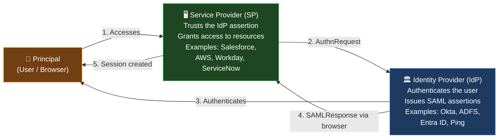

---

## The Two SSO Flows

### SP-Initiated SSO (Most Common)

The user starts at the Service Provider. The SP detects no valid session and redirects to the IdP.

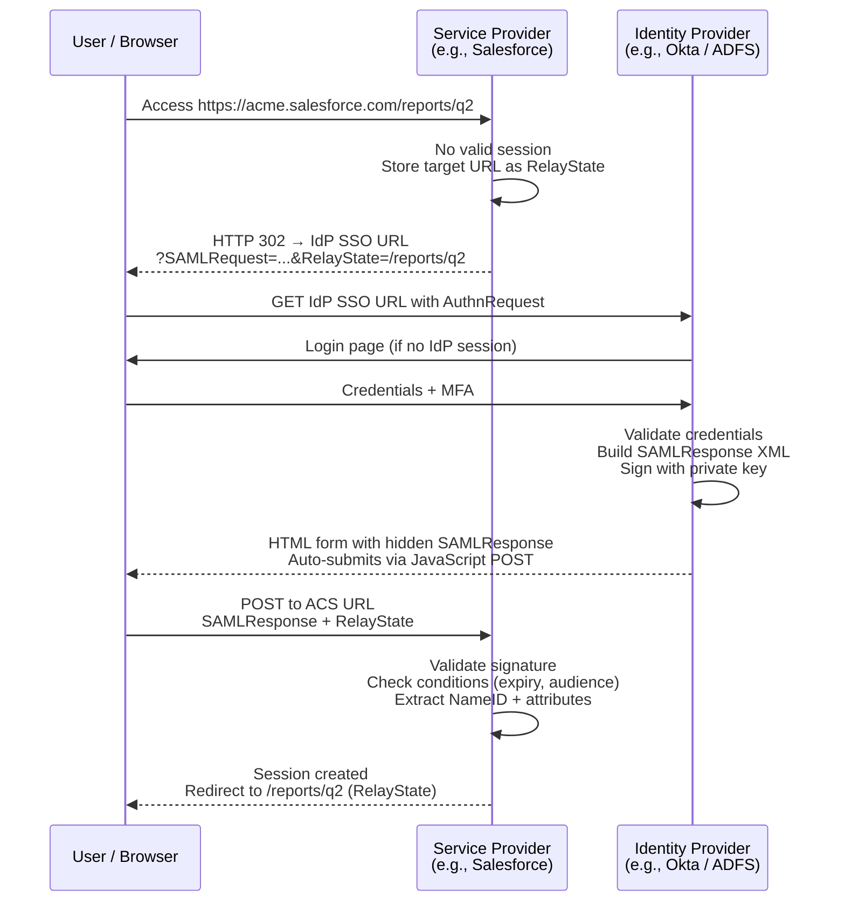

### IdP-Initiated SSO

The user starts at the IdP portal (e.g., company intranet tile). No AuthnRequest is sent — the IdP generates the response without being asked.

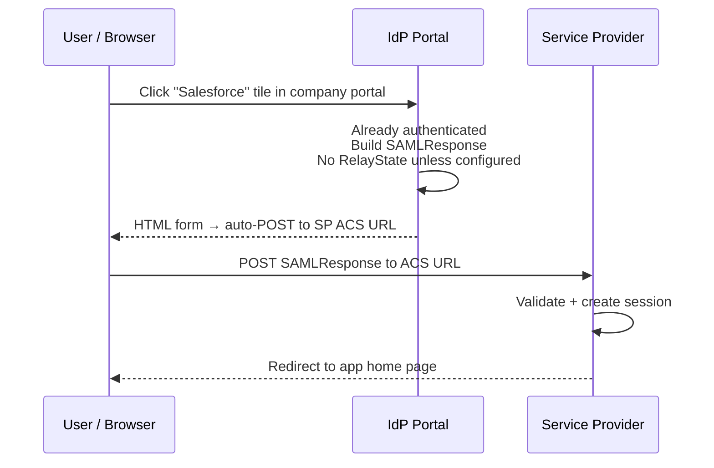

**Security note on IdP-initiated:** There is no AuthnRequest, therefore no `InResponseTo` field and no CSRF protection. A malicious actor could potentially craft a response and POST it to the SP. SPs that accept IdP-initiated flows must validate all other conditions rigorously (signature, conditions, audience, time window). Some security-conscious SPs disable IdP-initiated altogether.

---

## Anatomy of a SAML Assertion

A `SAMLResponse` is a Base64-encoded XML document. Below is a simplified structure:

```xml
<samlp:Response xmlns:samlp="urn:oasis:names:tc:SAML:2.0:protocol"
  ID="_abc123" InResponseTo="_req456" IssueInstant="2026-05-11T09:30:00Z">

  <saml:Issuer>https://okta.acme.com</saml:Issuer>

  <samlp:Status>
    <samlp:StatusCode Value="urn:oasis:names:tc:SAML:2.0:status:Success"/>
  </samlp:Status>

  <saml:Assertion ID="_asn789" IssueInstant="2026-05-11T09:30:00Z">
    <saml:Issuer>https://okta.acme.com</saml:Issuer>

    <!-- WHO the assertion is about -->
    <saml:Subject>
      <saml:NameID Format="urn:oasis:names:tc:SAML:1.1:nameid-format:emailAddress">
        priya.mehta@acme.com
      </saml:NameID>
      <saml:SubjectConfirmation Method="urn:oasis:names:tc:SAML:2.0:cm:bearer">
        <saml:SubjectConfirmationData
          NotOnOrAfter="2026-05-11T09:35:00Z"
          Recipient="https://acme.salesforce.com/saml/SSO/saml2"/>
      </saml:SubjectConfirmation>
    </saml:Subject>

    <!-- WHEN the assertion is valid -->
    <saml:Conditions NotBefore="2026-05-11T09:29:55Z"
                     NotOnOrAfter="2026-05-11T09:35:00Z">
      <saml:AudienceRestriction>
        <saml:Audience>https://acme.salesforce.com</saml:Audience>
      </saml:AudienceRestriction>
    </saml:Conditions>

    <!-- HOW the user authenticated -->
    <saml:AuthnStatement AuthnInstant="2026-05-11T09:29:58Z">
      <saml:AuthnContext>
        <saml:AuthnContextClassRef>
          urn:oasis:names:tc:SAML:2.0:ac:classes:PasswordProtectedTransport
        </saml:AuthnContextClassRef>
      </saml:AuthnContext>
    </saml:AuthnStatement>

    <!-- USER ATTRIBUTES passed to the SP -->
    <saml:AttributeStatement>
      <saml:Attribute Name="department">
        <saml:AttributeValue>Engineering</saml:AttributeValue>
      </saml:Attribute>
      <saml:Attribute Name="role">
        <saml:AttributeValue>SalesAdmin</saml:AttributeValue>
      </saml:Attribute>
    </saml:AttributeStatement>

  </saml:Assertion>

  <!-- XML Digital Signature over the Assertion -->
  <ds:Signature>...</ds:Signature>

</samlp:Response>
```

**Key fields explained:**

| Field | Purpose |
|-------|---------|
| `InResponseTo` | Ties response to the AuthnRequest ID — prevents replay attacks |
| `NameID` | The user's identity as the IdP presents it to the SP — often email, sometimes an opaque ID |
| `NotBefore` / `NotOnOrAfter` | The validity window — SPs must reject assertions outside this window (typically 5 minutes) |
| `Audience` | SP entity ID — prevents using an assertion issued for one SP at another SP |
| `AuthnContextClassRef` | How strongly the user was authenticated (password, MFA, Kerberos, etc.) |
| `AttributeStatement` | User attributes the IdP passes — email, department, role — used by SP for authorisation |

---

## XML Signatures — How Trust Is Established

The SP has no way to verify the user's identity directly. It trusts the IdP's signed assertion. The signature mechanism:

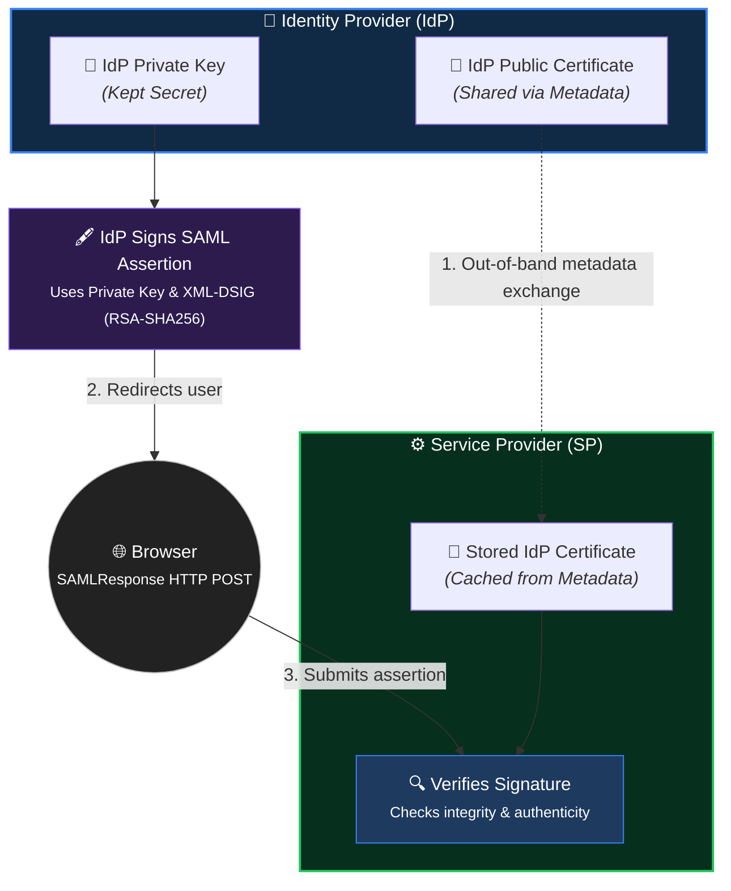

**How certificates are exchanged — SAML Metadata:**

Each party publishes an [XML Metadata document](https://docs.oasis-open.org/security/saml/v2.0/saml-metadata-2.0-os.pdf){:target="_blank"} containing:
- Entity ID (the unique identifier for this IdP or SP)
- SSO / ACS endpoint URLs
- X.509 certificate (public key)
- Supported NameID formats and bindings

In Okta, you download the IdP metadata XML and upload it to Salesforce. Salesforce's SP metadata XML is uploaded to Okta. This exchange happens once during setup. When the certificate expires or is rotated, metadata must be updated on both sides — a common source of outages.

---

## Assertion Encryption — Protecting Attribute Values

By default, the SAMLResponse travels through the user's browser — Base64-encoded but not encrypted. Any browser extension, proxy, or MITM (over HTTP) could read the attributes. For sensitive attributes (salary grade, clearance level, HR data), [assertion encryption](https://docs.oasis-open.org/security/saml/v2.0/saml-core-2.0-os.pdf){:target="_blank"} is used.

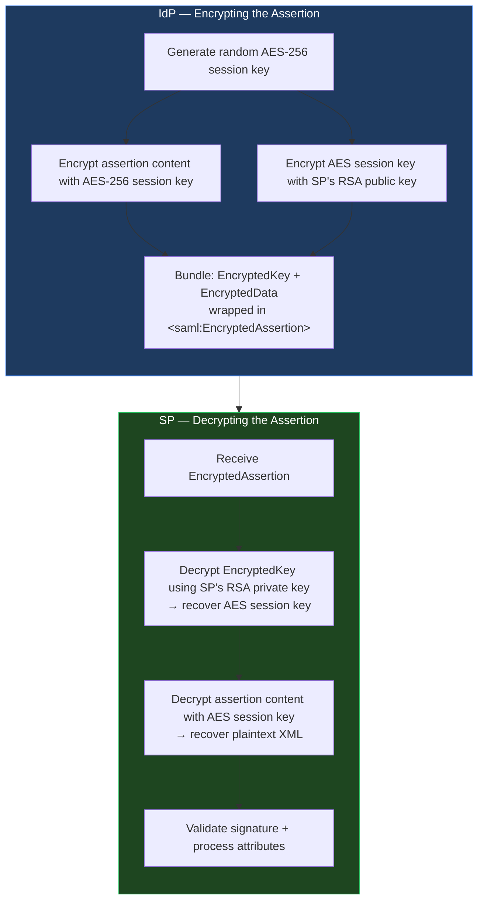

This is hybrid encryption (RSA + AES) — the same pattern used in TLS. RSA encrypts a small symmetric key; AES encrypts the large payload. The SP's public key is taken from the SP metadata XML.

---

## SAML Bindings — How Messages Travel

A [SAML binding](https://docs.oasis-open.org/security/saml/v2.0/saml-bindings-2.0-os.pdf){:target="_blank"} defines the transport mechanism. The message content is the same; the binding changes how it gets from A to B.

| Binding | Direction | Mechanism | Typical Use |
|---------|----------|-----------|------------|
| **HTTP Redirect** | SP → IdP | AuthnRequest in URL query param (Base64 + DEFLATE compressed) | AuthnRequest, LogoutRequest from SP |
| **HTTP POST** | IdP → SP | SAMLResponse in hidden HTML form field, auto-submitted | SAMLResponse to SP ACS URL — most common |
| **HTTP Artifact** | Both | Short artifact ID exchanged via browser; full message fetched by SP via backchannel SOAP call | High-security; assertion never touches browser |
| **SOAP / ECP** | Direct | For thick clients (not browsers) using [Enhanced Client or Proxy profile](https://docs.oasis-open.org/security/saml/v2.0/saml-profiles-2.0-os.pdf){:target="_blank"} | Non-browser clients (e.g., CLI tools, desktop apps) |

**Why HTTP Redirect for requests, HTTP POST for responses:**
- AuthnRequests are small — they fit in a URL
- SAMLResponses contain the full assertion with attributes and signature — often 3–10KB, far too large for a URL (browsers cap URLs at ~2,048 characters for compatibility)
- HTTP POST bindings have no size limit

**Artifact Binding — the high-security option:**

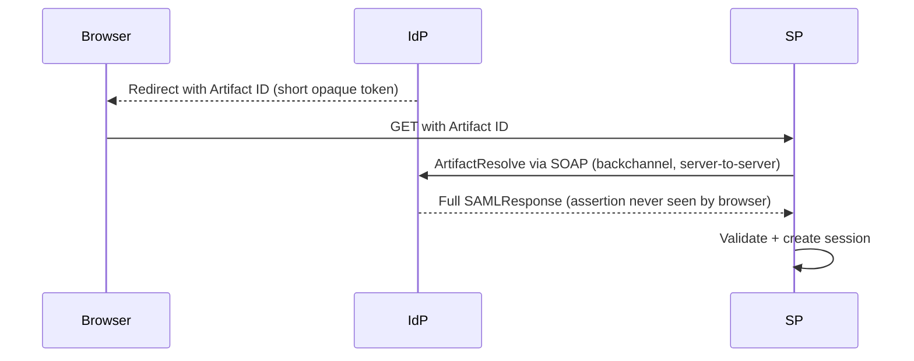

Useful when the SP operates in an environment where browser traffic may be intercepted (shared/public machines). Adds latency due to the backchannel call.

---

## ADFS / WS-FED vs SAML

[Active Directory Federation Services (ADFS)](https://learn.microsoft.com/en-us/windows-server/identity/ad-fs/ad-fs-overview){:target="_blank"} is Microsoft's on-premise federation server. It is **not** a different protocol from SAML — it is an **implementation** of SAML 2.0 (and also [WS-Federation](https://learn.microsoft.com/en-us/dotnet/framework/wcf/feature-details/federation){:target="_blank"}).

| Aspect | SAML 2.0 | ADFS |
|--------|---------|------|
| What it is | Open standard (protocol + format) | Microsoft's IdP product |
| Who publishes it | OASIS | Microsoft |
| Supports SAML? | Is SAML | Yes — ADFS is a SAML IdP |
| Also supports | — | WS-Federation (older Microsoft protocol) |
| Identity source | Any | On-premise Active Directory (LDAP) |
| Typical use | Any federation scenario | Bridging on-prem AD to cloud apps |
| Cloud equivalent | Any cloud IdP (Okta, Entra, Ping) | Azure Entra ID (ADFS successor in cloud) |

**ADFS's primary purpose:** Allow on-premise Active Directory (where user accounts live) to act as an IdP for cloud applications that speak SAML. Without ADFS, a Salesforce integration with on-prem AD would require syncing every user account to the cloud — ADFS avoids this by federating.

[WS-Federation](https://docs.oasis-open.org/wsfed/federation/v1.2/ws-federation.pdf){:target="_blank"} is an older Microsoft protocol that predates SAML 2.0 and is used by some Microsoft products (SharePoint, older Dynamics). Functionally similar to SAML SSO but with different XML namespaces and message formats. Modern integrations prefer SAML 2.0 even for Microsoft products.

---

## SAML Deployment Scenarios

### Scenario 1 — Cloud to Cloud (Okta → Salesforce)

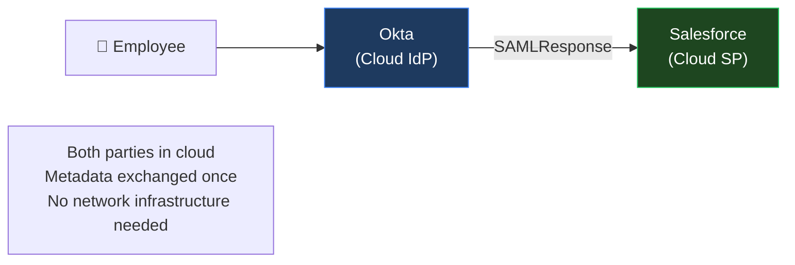

Simplest scenario. Both parties are SaaS platforms. Okta has pre-built connectors for Salesforce (and [7,000+ other applications](https://www.okta.com/integrations/){:target="_blank"}). Setup is metadata exchange + attribute mapping.

### Scenario 2 — On-Prem to Cloud (ADFS → Microsoft 365)

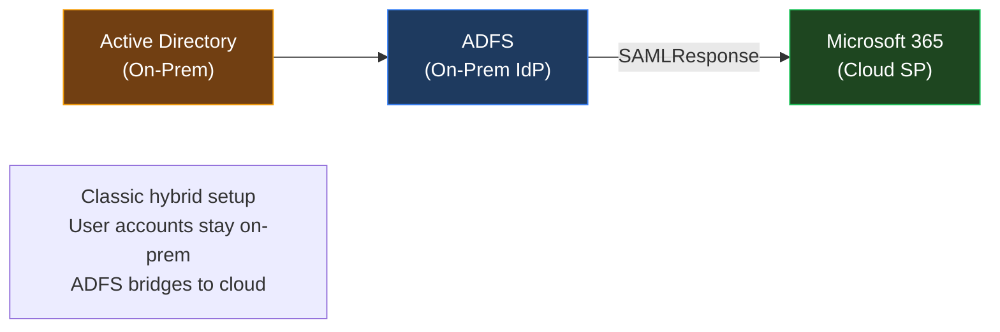

ADFS acts as the on-prem IdP. Microsoft 365 trusts assertions from ADFS. User accounts never leave the corporate Active Directory. [Azure AD Connect](https://learn.microsoft.com/en-us/entra/identity/hybrid/connect/whatis-azure-ad-connect){:target="_blank"} (now Entra ID Connect) is the modern replacement for this ADFS pattern — it syncs identities to Entra ID and lets Entra be the IdP instead.

### Scenario 3 — Cloud IdP to On-Prem App (Okta → Internal Web App)

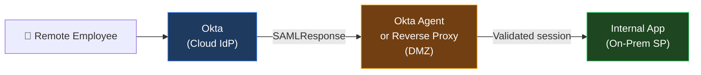

The on-prem app cannot reach the internet to validate tokens. An Okta agent or reverse proxy (e.g., [Okta Access Gateway](https://www.okta.com/products/okta-access-gateway/){:target="_blank"}) sits in the DMZ: it receives the SAMLResponse, validates it locally (using cached IdP metadata), and injects a trusted header or creates a local session for the internal app.

### Scenario 4 — Cross-Domain B2B Federation (Partner to Client App)

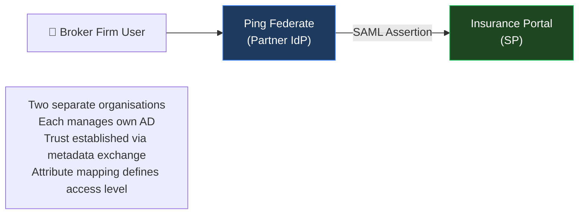

The broker firm's IT team does not create accounts on the insurance company's AD. SAML federation means users log in using their own firm's credentials, and the insurance SP maps the asserted role (`broker-tier-2`) to its own permission set.

---

## Single Logout (SLO)

[SAML Single Logout (SLO)](https://docs.oasis-open.org/security/saml/v2.0/saml-profiles-2.0-os.pdf){:target="_blank"} terminates sessions at the IdP **and** all participating SPs simultaneously — global sign-out, not just local.

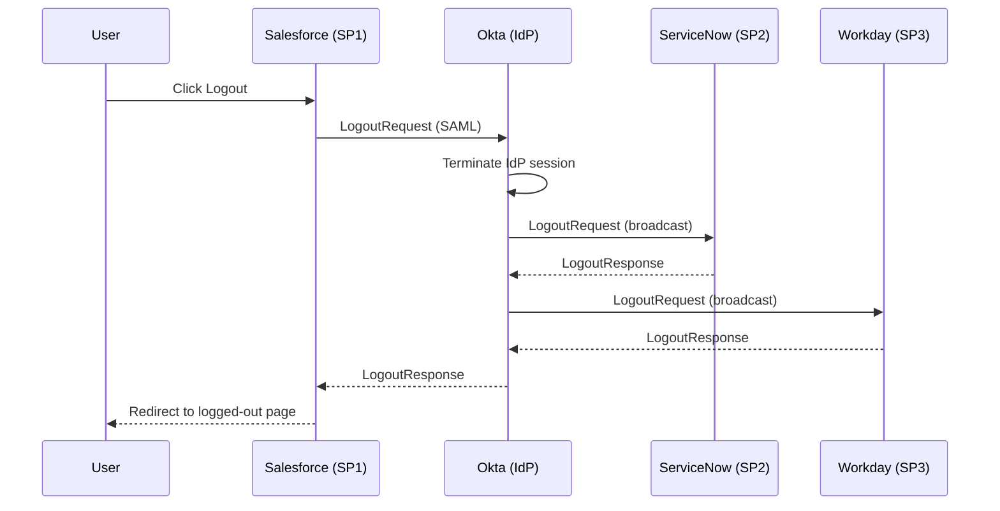

**The SLO reality:** SLO is often partially implemented. If any SP is offline during the logout broadcast, that SP's session remains active. Most enterprise implementations accept best-effort SLO and rely on short session timeouts as the safety net. Applications with highly sensitive data (banking, healthcare) implement SLO strictly and verify acknowledgement from all SPs.

---

## Deep Links with SAML — The RelayState Parameter

When a user bookmarks a deep URL (e.g., `/reports/q2-2026`) and then accesses it after their session has expired, SAML must bring them back to exactly that page after authentication.

The mechanism: **RelayState**.

1. User visits `https://acme.salesforce.com/reports/q2-2026` — no session
2. Salesforce stores the target URL and encodes it as `RelayState=/reports/q2-2026`
3. AuthnRequest is sent with `&RelayState=%2Freports%2Fq2-2026` in the URL
4. IdP authenticates, appends RelayState to the POST body of the SAMLResponse
5. SP reads RelayState after validating the assertion, and redirects the user to `/reports/q2-2026`

**Size limitations:** RelayState is limited in the HTTP Redirect binding (URL length limits). For deep links to long or parameterised URLs, use HTTP POST binding for the AuthnRequest, which has no such limit.

---

## Why Cloud IdPs Prefer SAML for Enterprise Integration

SAML is the common denominator for enterprise application integration for three reasons:

1. **Universal SP support.** Virtually every enterprise SaaS application — Salesforce, Workday, ServiceNow, AWS, GitHub Enterprise, Jira — ships with native SAML SP support. Okta alone lists [7,000+ pre-built SAML integrations](https://www.okta.com/integrations/){:target="_blank"}.

2. **Works with legacy apps.** Applications built before OAuth 2.0 was finalised (pre-2012) only speak SAML. Replacing them is expensive. SAML keeps them in the SSO fabric without re-engineering.

3. **Strong security model.** XML Digital Signatures, audience restrictions, time-bounded assertions, and replay prevention (`InResponseTo`) form a robust security baseline when correctly implemented.

---

## Problems with SAML

SAML's age and design show in several areas:

**1. XML complexity and verbose debugging**
A SAMLResponse is 3–15KB of XML. Debugging a failed SSO requires Base64-decoding, XML parsing, and checking signatures. Tools like [SAML Tracer](https://addons.mozilla.org/en-US/firefox/addon/saml-tracer/){:target="_blank"} (Firefox/Chrome browser extension) are essential. Without them, SAML errors are opaque.

**2. Historical XML signature vulnerabilities**
XML canonicalisation — the process of normalising XML before signing — has produced multiple critical vulnerabilities. The [SAML authentication bypass (CVE-2017-11427)](https://github.com/jitsi/jitsi-saml2js/issues/10){:target="_blank"} and related issues affected multiple implementations where comment nodes or whitespace inside signed elements allowed signature bypass. Keeping SAML libraries updated is non-negotiable.

**3. No native mobile or API support**
SAML was designed for browser-based SSO flows with HTML form POSTs. It does not map to:
- Native mobile apps (no browser, no HTML form submission)
- REST APIs (cannot pass XML assertions in `Authorization` headers)
- SPAs (cannot redirect the entire app for a server-side form POST)

**4. Session management limitations**
SAML does not define a refresh token equivalent. Once the assertion is consumed, session management falls entirely to the SP. Cross-SP session synchronisation (beyond SLO) is not standardised.

**5. Certificate management operational risk**
SAML trust depends on X.509 certificates. When an IdP certificate expires and the SP's metadata is not updated in time, SSO breaks for all users. Certificate rotation requires co-ordinated updates at both ends — a common source of unplanned outages.

---

## Why APIs and Mobile Apps Prefer OAuth / OIDC

| Requirement | SAML 2.0 | OAuth 2.0 + OIDC |
|------------|---------|-----------------|
| Mobile app login | ❌ No native flow (requires browser embed) | ✅ PKCE flow designed for native apps |
| REST API authorisation | ❌ Cannot use XML assertion as bearer token | ✅ JWT in `Authorization: Bearer` header |
| Machine-to-machine | ❌ No equivalent | ✅ client_credentials grant |
| Refresh tokens | ❌ Not standardised | ✅ Native concept |
| Token format | ❌ Large XML | ✅ Compact JSON (JWT ~500 bytes) |
| Developer experience | ❌ Complex XML + signature libraries | ✅ Simple JSON, widely supported SDKs |
| Fine-grained API scopes | ❌ Attribute-based only | ✅ OAuth scopes natively |

**The practical rule:** Use SAML for enterprise application SSO integrations (the app already has a SAML SP built in). Use OAuth 2.0 + OIDC for everything built after 2015 — APIs, mobile apps, SPAs, and microservices. Most cloud IdPs (Okta, Entra ID, Ping) support both protocols on the same platform, allowing gradual migration.

---

## Key Takeaways

- **SAML 2.0 is an XML-based standard for federated SSO** — not a product. ADFS, Okta, Ping, and Entra ID are all SAML IdP implementations.

- **The assertion is the core unit** — a signed XML document containing who the user is, how they authenticated, validity conditions, and user attributes. The SP validates the XML signature and reads the attributes to determine access.

- **Trust is established by public key exchange via metadata XML.** The IdP signs with its private key; the SP verifies using the IdP's certificate from the metadata. Attribute encryption uses the reverse — IdP encrypts with SP's public key; SP decrypts with its private key.

- **HTTP POST binding for responses, HTTP Redirect for requests.** Artifact binding adds security at the cost of latency (backchannel fetch). Choose based on sensitivity requirements.

- **ADFS is a SAML IdP, not a competing protocol.** Its primary role is bridging on-premise Active Directory to cloud SAML Service Providers. Azure Entra ID is the cloud successor to this pattern.

- **Single Logout is correct in theory, incomplete in practice.** Design around best-effort SLO with short session timeouts as the safety net.

- **Deep links work via RelayState** — the SP stores the target URL before the SAML redirect and restores it after authentication completes.

- **SAML's weaknesses are mobile, APIs, and XML complexity.** For anything built today, OAuth 2.0 + OIDC is the right choice. SAML remains essential for enterprise application integrations that predate OAuth's maturity.

---

*Part of the IAM from First Principles series.*
