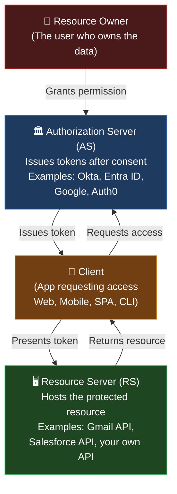
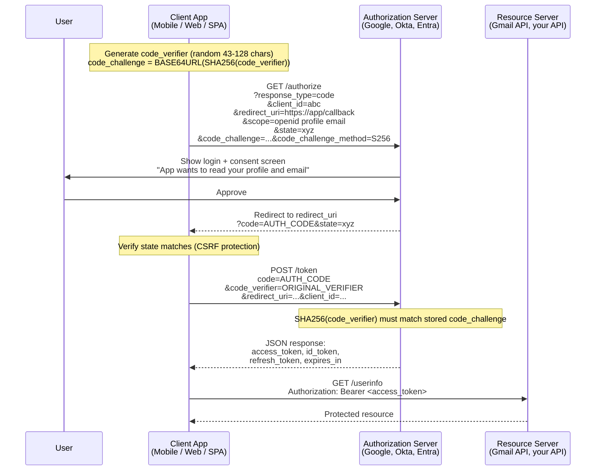
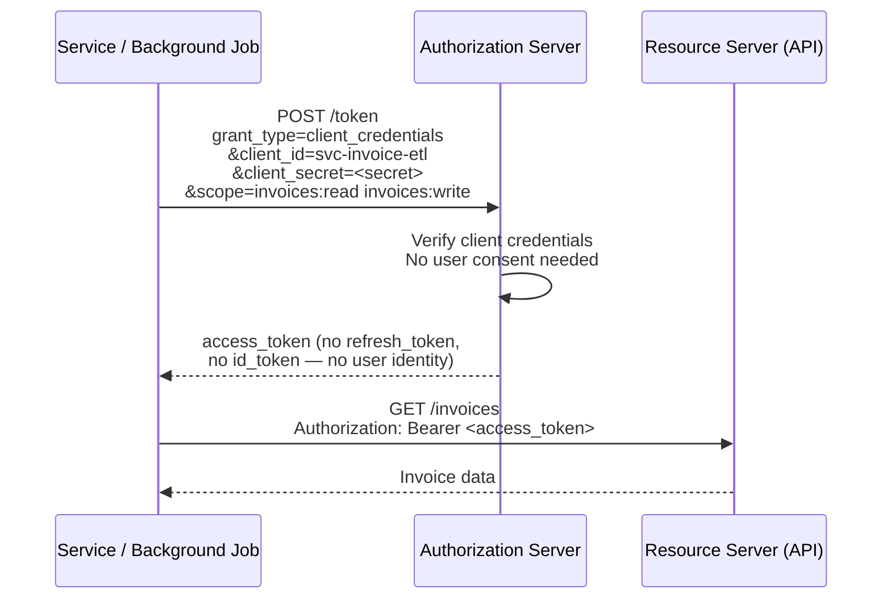
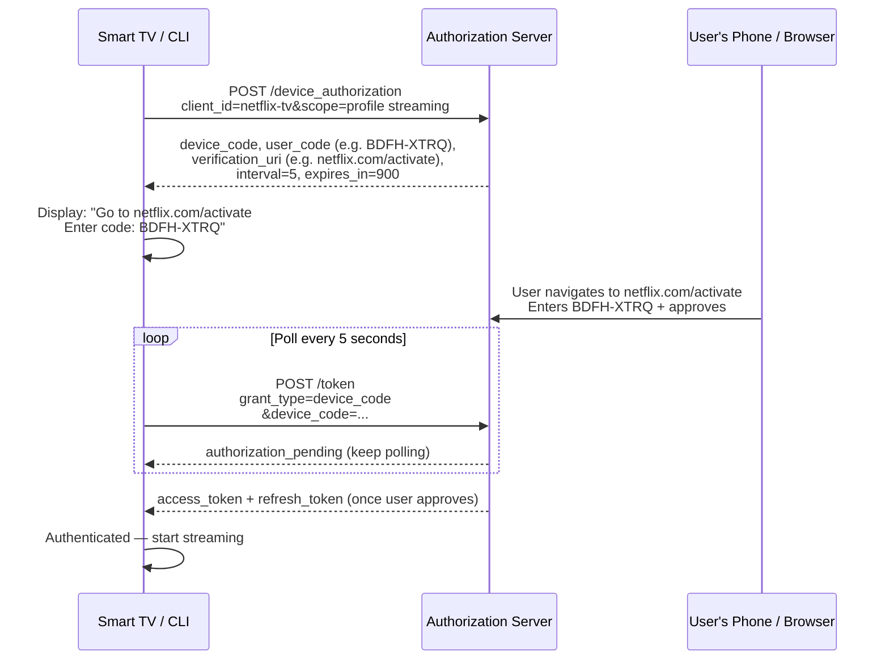
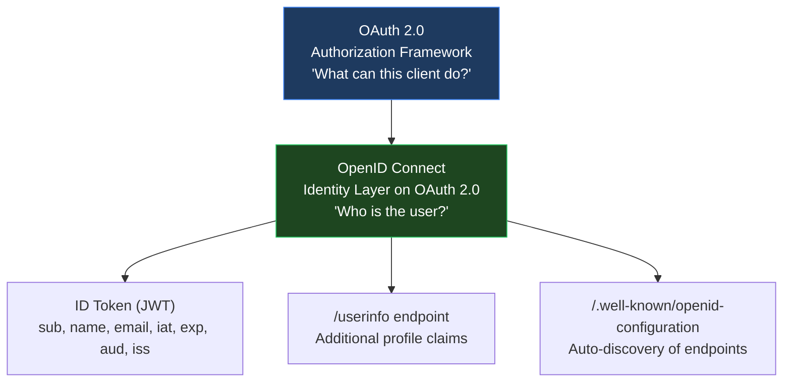
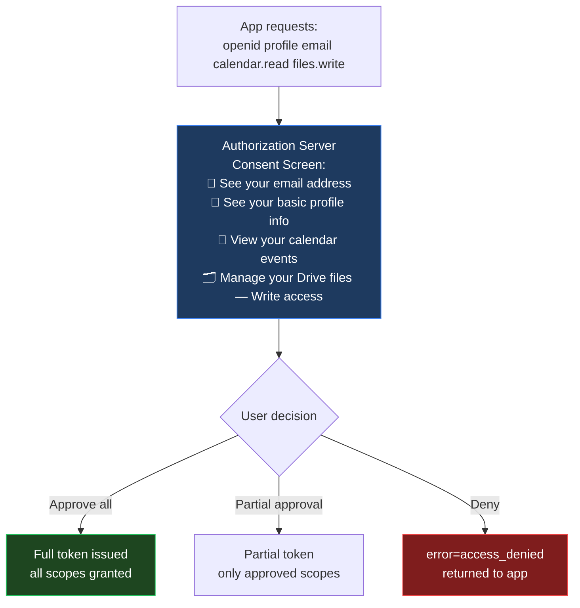
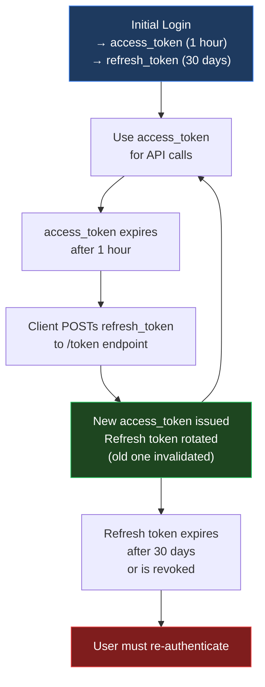
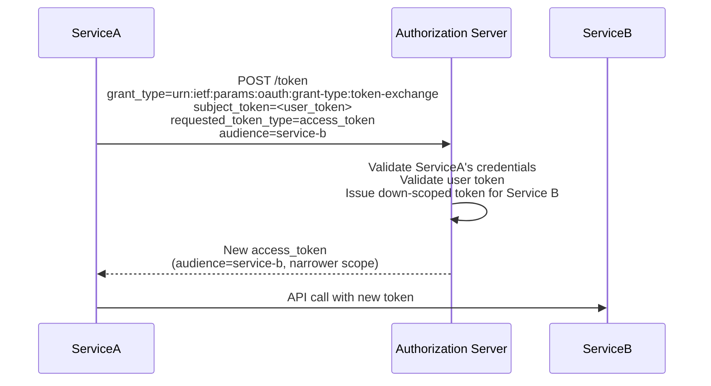
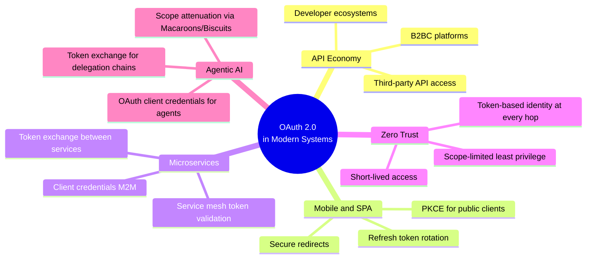

In 2006, Twitter needed a way to let third-party apps post on a user's behalf — without the user giving their Twitter password to the third-party. The solution they built was the direct ancestor of OAuth. By 2010, OAuth 1.0 was a standard. By 2012, [OAuth 2.0 (RFC 6749)](https://datatracker.ietf.org/doc/html/rfc6749){:target="_blank"} was published, addressing OAuth 1.0's complexity and lack of mobile support.

Today, every API you call that requires permission — from Google to Netflix to your bank — uses OAuth 2.0. It is not a single protocol but a framework: a set of flows for delegating access, a token format, and an extensible consent model. [OpenID Connect (OIDC)](https://openid.net/connect/){:target="_blank"} sits on top as a thin identity layer.

This post covers the full picture — flows, tokens, endpoints, consent, claims, delegation patterns, and where the standard is heading.

---

## Why OAuth Over SAML

[SAML 2.0]() solved enterprise browser SSO. OAuth 2.0 solved a different and broader set of problems:

| Need | SAML 2.0 | OAuth 2.0 |
|------|---------|----------|
| Browser SSO for enterprise apps | ✅ Designed for this | Works but non-native |
| REST API access control | ❌ XML assertions don't fit | ✅ Core use case |
| Mobile app authentication | ❌ Requires browser embeds | ✅ PKCE flow designed for native apps |
| Machine-to-machine | ❌ Not supported | ✅ client_credentials grant |
| Delegated access (act on user's behalf) | ❌ Limited | ✅ Core design intent |
| Refresh tokens | ❌ Not standardised | ✅ Native concept |
| Fine-grained API scopes | ❌ Attribute-based only | ✅ OAuth scopes |
| Token format | Large XML | Compact JWT (~500 bytes) |

OAuth 2.0 was designed for API-first, mobile-first, delegated-access scenarios. Use SAML for legacy enterprise SSO; use OAuth 2.0 for everything built after 2015.

---

## The Four Roles in OAuth 2.0



**Scopes** are the mechanism for limiting what a token allows. When a client requests access, it specifies scopes: `openid profile email calendar.read`. The AS presents these to the user in a consent screen. The issued token carries only the approved scopes. The Resource Server enforces them on every API call.

---

## The Authorization Code Flow + PKCE

This is the flow you interact with every time you click "Sign in with Google." It is the standard for any application where a user is present — web apps, mobile apps, SPAs.

[PKCE (Proof Key for Code Exchange)](https://datatracker.ietf.org/doc/html/rfc7636){:target="_blank"} was added to prevent authorization code interception attacks on mobile/public clients. It is now mandatory in [OAuth 2.1](https://datatracker.ietf.org/doc/draft-ietf-oauth-v2-1/){:target="_blank"} for all clients.



**Why PKCE?** On mobile, the `redirect_uri` is a custom scheme (`myapp://callback`). Any app on the device can register the same scheme and intercept the authorization code. PKCE ensures that even if someone intercepts the code, they cannot exchange it for a token without the original `code_verifier` — which only the legitimate app holds.

**The `state` parameter** is a random nonce the client generates and verifies on return. It protects against CSRF attacks — an attacker cannot initiate an authorization flow on behalf of the user and then have the user accidentally approve it.

---

## Token Response — What You Actually Receive

```json
{
  "access_token": "eyJhbGciOiJSUzI1NiIsImtpZCI6ImtleS0xIn0...",
  "token_type": "Bearer",
  "expires_in": 3600,
  "refresh_token": "dGhpcyBpcyBhIHJlZnJlc2ggdG9rZW4...",
  "id_token": "eyJhbGciOiJSUzI1NiIsImtpZCI6ImtleS0xIn0...",
  "scope": "openid profile email"
}
```

| Field | Purpose | Who uses it |
|-------|---------|------------|
| `access_token` | Proves the holder has the granted scopes; passed to Resource Server | Client → API |
| `expires_in` | Seconds until access_token expires (typically 3,600 = 1 hour) | Client (schedules refresh) |
| `refresh_token` | Long-lived token used to get a new access_token without re-authenticating | Client → Token endpoint only |
| `id_token` | OIDC addition — contains identity claims about the user; for the client to read | Client only |
| `scope` | What was actually granted (may differ from what was requested) | Client verifies |

---

## Client Credentials Flow — Machine to Machine

When no user is present — a background job, a microservice, a scheduled task — the client authenticates with its own credentials directly.



No user is involved. No consent screen. The client IS the resource owner. Refresh tokens are not issued — the client simply re-authenticates when the access token expires. For higher security, replace `client_secret` with client certificate authentication ([mTLS](https://datatracker.ietf.org/doc/html/rfc8705){:target="_blank"}) or [private_key_jwt](https://openid.net/specs/openid-connect-core-1_0.html#ClientAuthentication){:target="_blank"}.

---

## Device Authorization Flow — TVs, CLIs, Smart Devices

When an input-constrained device (smart TV, CLI tool, IoT device) cannot open a browser or receive a redirect, the [Device Authorization Grant](https://datatracker.ietf.org/doc/html/rfc8628){:target="_blank"} is used.



---

## Deprecated Flows — Why They Were Removed

**Implicit Flow:** Issued access tokens directly in the URL fragment after authorization (`#access_token=...`). Tokens were visible in browser history, referrer headers, and server logs. Browsers' inability to keep secrets made this insecure. Removed in OAuth 2.1.

**Resource Owner Password Credentials (ROPC):** The client collected the user's username and password and sent them directly to the AS. Violated the principle that clients should never see user credentials. Only ever appropriate for legacy migration scenarios. Deprecated in OAuth 2.1.

---

## OpenID Connect — The Identity Layer OAuth Was Missing

OAuth 2.0 is an **authorization** framework — it answers "what can this client do?" It does not answer "who is the user?" That gap led to each AS inventing its own `/userinfo` endpoint with its own format.

[OpenID Connect (OIDC)](https://openid.net/specs/openid-connect-core-1_0.html){:target="_blank"} standardises the identity layer on top of OAuth 2.0. It adds:
- The **ID Token** — a JWT containing standard identity claims
- The **/userinfo endpoint** — for fetching additional claims
- Standard **scopes** (`openid`, `profile`, `email`, `address`, `phone`) that map to standard claims
- **Discovery endpoint** — for auto-configuration

OIDC is requested by including `openid` in the scope. If `openid` is absent, it is a pure OAuth flow (authorization only). If present, OIDC layer activates and the ID Token is issued.



---

## Real-World OAuth in Action

**Netflix:** When you log in to Netflix on your TV (Device flow), PC (Authorization Code), or phone (Authorization Code + PKCE), each device gets its own access token and refresh token. Netflix's Resource Servers validate the token's `scope` to determine what content tier you can stream. Your subscription data lives on their Resource Server — protected by OAuth.

**Shopping / Saved Cards:** When you tap "Pay with Google Pay," Google acts as an OAuth Resource Server. Your shopping app presents an access token with `payments:charge` scope. Google verifies the scope and charges the saved card. The merchant app never sees your card number.

**Sign in with Google:** This is the Authorization Code flow + OIDC. Your app requests `openid profile email`. Google authenticates you, presents a consent screen, and issues an ID Token containing your `sub` (Google's unique user ID), `name`, and `email`. Your app creates a local account mapped to that `sub`. Next time you sign in, Google issues a new ID Token with the same `sub` — your app recognises you.

---

## JWT — The Token Format

A [JSON Web Token (JWT)](https://datatracker.ietf.org/doc/html/rfc7519){:target="_blank"} is a compact, signed data structure used for both access tokens and ID tokens. It has three Base64URL-encoded parts separated by `.`:

```
HEADER.PAYLOAD.SIGNATURE
```

**Decoded Header:**
```json
{
  "alg": "RS256",
  "typ": "JWT",
  "kid": "key-2026-05"
}
```

**Decoded Payload (ID Token example):**
```json
{
  "iss": "https://accounts.google.com",
  "sub": "108543291847362019",
  "aud": "client-id-of-your-app",
  "iat": 1748668200,
  "exp": 1748671800,
  "email": "super.man@gmail.com",
  "name": "super man",
  "picture": "https://...",
  "email_verified": true
}
```

**Standard claims explained:**

| Claim | Meaning |
|-------|---------|
| `iss` | Issuer — who issued this token |
| `sub` | Subject — the user's unique ID at this IdP (immutable) |
| `aud` | Audience — which client/API this token is for |
| `iat` | Issued At — Unix timestamp |
| `exp` | Expiry — Unix timestamp; reject if past this |
| `jti` | JWT ID — unique ID, used for revocation lists |

The **signature** is computed as: `RSA-SHA256(BASE64URL(header) + "." + BASE64URL(payload))` using the AS's private key. The Resource Server validates with the AS's public key — no round-trip to the AS needed for stateless verification.

## Opaque Tokens vs JWT

| Type | Format | Validation | Use when |
|------|--------|-----------|----------|
| **JWT** | Self-contained, parseable | Local — verify signature with public key | Standard API access, OIDC |
| **Opaque** | Random string (reference token) | Introspection — call AS `/introspect` endpoint | When you cannot trust clients with token contents; or for instant revocation |

Opaque tokens are better for revocation — the AS can invalidate them immediately. JWTs are valid until `exp` regardless of revocation (mitigated by short TTLs and key rotation).

---

## Consent Management



**Consent persistence:** Most AS platforms remember consent decisions. Returning to the same app with the same scopes does not re-prompt the user. If the app requests new scopes, the consent screen appears again for only the new scopes.

**Consent revocation:** Users can revoke an app's consent at any time through the AS's account settings (e.g., `myaccount.google.com/permissions`). The AS marks the refresh token as revoked. The next time the app tries to refresh, it gets an error and must re-initiate the flow.

---

## .well-known Endpoints — Auto-Discovery

[OAuth 2.0 Authorization Server Metadata (RFC 8414)](https://datatracker.ietf.org/doc/html/rfc8414){:target="_blank"} and [OIDC Discovery](https://openid.net/specs/openid-connect-discovery-1_0.html){:target="_blank"} publish all endpoint URLs and capabilities at a standard location:

```
GET https://accounts.google.com/.well-known/openid-configuration
```

Response (abbreviated):
```json
{
  "issuer": "https://accounts.google.com",
  "authorization_endpoint": "https://accounts.google.com/o/oauth2/v2/auth",
  "token_endpoint": "https://oauth2.googleapis.com/token",
  "userinfo_endpoint": "https://openidconnect.googleapis.com/v1/userinfo",
  "jwks_uri": "https://www.googleapis.com/oauth2/v3/certs",
  "revocation_endpoint": "https://oauth2.googleapis.com/revoke",
  "introspection_endpoint": "https://oauth2.googleapis.com/tokeninfo",
  "scopes_supported": ["openid", "profile", "email", "..."],
  "response_types_supported": ["code"],
  "grant_types_supported": ["authorization_code", "refresh_token", "client_credentials"],
  "id_token_signing_alg_values_supported": ["RS256"]
}
```

**JWKS — JSON Web Key Set:** The `jwks_uri` points to the AS's public keys used to sign tokens:

```json
{
  "keys": [
    {
      "kty": "RSA",
      "kid": "key-2026-05",
      "use": "sig",
      "alg": "RS256",
      "n": "<modulus>",
      "e": "AQAB"
    }
  ]
}
```

Resource Servers fetch the JWKS periodically (or on cache miss). When a JWT arrives, the RS reads the `kid` (key ID) from the JWT header, finds the matching public key in the JWKS, and verifies the signature locally — no call back to the AS per request.

---

## Refresh Tokens and Token Lifecycle



**Refresh token rotation:** Modern AS platforms issue a new refresh token with every refresh request and immediately invalidate the previous one. If an old refresh token is used (indicating theft and reuse), the AS can invalidate the entire token family and force re-authentication.

**Absolute vs sliding expiry:** Refresh tokens have both a sliding expiry (extended on each use) and an absolute maximum lifetime. A refresh token used every day may live indefinitely within the sliding window, but the absolute maximum (often 90 days) forces periodic re-authentication regardless.

---

## Customising Claims — Policy-Based Token Generation

Out-of-the-box, an access token carries standard claims. In practice, APIs need richer context — department, clearance level, subscription tier. AS platforms let you add custom claims via policy:

**In [Okta](https://developer.okta.com/docs/guides/customize-tokens-returned-from-okta/main/){:target="_blank"}:** Custom claims are added via Expression Language rules on the Authorization Server. A rule might say: `user.department == "Finance" ? "finance-tier-1" : "standard"` — injecting a custom `access_tier` claim based on the user's directory attribute.

**In [Microsoft Entra ID](https://learn.microsoft.com/en-us/entra/identity-platform/active-directory-optional-claims){:target="_blank"}:** Optional claims are configured in the app registration manifest. Claims mapping policies allow mapping directory attributes to token claims. Entra also supports [custom security attributes](https://learn.microsoft.com/en-us/entra/fundamentals/custom-security-attributes-overview){:target="_blank"} as claim sources.

**Example — enriched access token payload:**
```json
{
  "sub": "108543291847362019",
  "iss": "https://acme.okta.com",
  "aud": "api://trading-platform",
  "scope": "portfolio:read trades:write",
  "exp": 1748671800,
  "department": "Equities",
  "trader_tier": "institutional",
  "risk_limit_usd": 5000000,
  "clearance": "L3"
}
```

The trading platform's API reads `trader_tier` and `risk_limit_usd` directly from the token — no database lookup needed for authorization decisions.

---

## Token Delegation Patterns

### OAuth 2.0 Token Exchange (RFC 8693)

[Token Exchange](https://datatracker.ietf.org/doc/html/rfc8693){:target="_blank"} allows a service to exchange one token for a different token — for a different audience, a different scope, or to impersonate a user.



Used in microservice chains where Service A calls Service B on behalf of the user — the token carries both Service A's identity and the user's delegated authority.

### On-Behalf-Of (OBO) Flow

Microsoft Entra ID's [On-Behalf-Of flow](https://learn.microsoft.com/en-us/entra/identity-platform/v2-oauth2-on-behalf-of-flow){:target="_blank"} is a specific implementation of Token Exchange: a middle-tier service presents the user's access token and receives a new token scoped for a downstream API. The audit trail shows: user → Service A → Service B, with all three parties identified.

### Macaroons and Biscuits — Offline Scope Attenuation

[Macaroons](https://research.google/pubs/macaroons-cookies-with-contextual-caveats-for-decentralized-authorization-in-the-cloud/){:target="_blank"} and [Biscuits](https://www.biscuitsec.org/){:target="_blank"} are capability-based token formats that enable **offline scope attenuation** — restricting a token further without calling the AS.

A service receives a token with `trades:read trades:write`. It creates a restricted sub-token with only `trades:read` and passes it to a sub-agent. The sub-agent cannot expand the scope — Macaroon/Biscuit caveats only restrict, never expand. The original AS does not need to be contacted during attenuation.

This directly addresses the recursive delegation problem in agentic AI systems, will be discussed in the agentic identity posts — standard OAuth cannot enforce that permissions only narrow through a delegation chain without a round-trip to the AS.

---

## DPoP — Proof-of-Possession Tokens

Bearer tokens have one weakness: anyone who steals the token can use it. [DPoP (Demonstrating Proof-of-Possession)](https://datatracker.ietf.org/doc/html/rfc9449){:target="_blank"} binds an access token to a key pair held by the client:

1. Client generates an ephemeral key pair
2. Client POSTs a signed DPoP proof (containing the public key and request details) alongside every API request
3. The RS verifies that the token is bound to this public key — a stolen token is useless without the private key

DPoP is now widely adopted in financial-grade APIs ([FAPI 2.0](https://openid.net/specs/fapi-2_0-security-profile.html){:target="_blank"}) and is the recommended approach for high-value OAuth deployments.

---

## OAuth 2.1 — The Consolidated Standard

[OAuth 2.1](https://datatracker.ietf.org/doc/draft-ietf-oauth-v2-1/){:target="_blank"} consolidates the lessons of a decade of OAuth 2.0 deployment into a single clean document. Key changes from OAuth 2.0:

- **PKCE is mandatory** for all Authorization Code flows (not just public clients)
- **Implicit grant is removed** (tokens in URL fragments are insecure)
- **ROPC grant is removed** (clients should never see user passwords)
- **Refresh token rotation is required** for public clients
- **Redirect URI exact match** — no partial matching or wildcards

OAuth 2.1 is not a breaking change for most implementations — it is a tightening of the security baseline that reflects current best practice.

---

## Why OAuth Is Critical for Modern Systems



---

## Key Takeaways

- **OAuth 2.0 is an authorization framework, not an authentication protocol.** It delegates access — "this app may read my calendar" — but does not define who the user is. OIDC adds that identity layer.

- **There are four active grant types:** Authorization Code (+ PKCE) for user-present flows; Client Credentials for M2M; Device Authorization for input-constrained devices; Refresh Token for silent renewal. Implicit and ROPC are deprecated in OAuth 2.1.

- **PKCE is non-negotiable** for any public client (mobile, SPA). It prevents authorization code interception even if a redirect is hijacked.

- **JWTs are stateless and locally verifiable** — the Resource Server validates the signature using the AS's public key from the JWKS endpoint. No call to the AS per request.

- **Opaque tokens are better for immediate revocation.** JWTs are valid until `exp` — short TTLs (15–60 minutes) are the mitigation.

- **The `.well-known/openid-configuration` endpoint** is the single source of truth for all AS endpoints and capabilities. Client libraries should always use discovery rather than hardcoded URLs.

- **Custom claims** let you embed authorization context (role, tier, risk limit) directly in the token — enabling stateless, database-free authorization at the Resource Server.

- **Token exchange (RFC 8693)** enables controlled delegation across service chains. Macaroons/Biscuits enable offline scope attenuation for agentic and distributed systems.

- **DPoP** binds tokens to a client's key pair — stolen bearer tokens become useless without the corresponding private key. Required for financial-grade APIs.

- **OAuth 2.1** tightens the baseline: PKCE mandatory, Implicit removed, ROPC removed. Implementing against 2.1's constraints is the correct default for any new system.

---

[*Part of the IAM from First Principles series.*](){:target="_blank"}