Every organisation that has been running for more than five years has the same hidden problem: access that was granted but never removed, roles that were created for one project and applied to dozens of users, and accounts in production systems that no longer belong to anyone who still works there.

This is not a failure of security tooling. It is a failure of the process that governs identity over time — what the industry calls Identity Governance and Administration (IGA).

IGA is the discipline of ensuring that every identity in your enterprise has the right access — no more, no less — and that this remains true as people join, move, and leave.

---

## The Origin of IGA — Why It Emerged

Before IGA platforms existed, enterprises managed access through a combination of helpdesk tickets, spreadsheets, and manual IT operations. A manager emailed IT to grant access. A departure notification went to a different team who removed access — sometimes. Nobody had a complete picture of who had access to what.

Two forces made this untenable:

**Regulatory pressure** arrived first. [Sarbanes-Oxley (SOX)](https://en.wikipedia.org/wiki/Sarbanes%E2%80%93Oxley_Act){:target="_blank"} in 2002 required public companies to demonstrate that their financial systems had proper access controls and audit trails. [HIPAA](https://en.wikipedia.org/wiki/Health_Insurance_Portability_and_Accountability_Act){:target="_blank"} required healthcare organisations to prove who had access to patient data and that access was appropriate. Auditors began asking questions that manual processes could not answer reliably: *Who approved this access? When was it reviewed? Why does a departed employee still have an active account?*

**Scale pressure** arrived as enterprises deployed more software.** An organisation with 5,000 employees may have 80–150 applications. Each application has its own access model. Manually tracking which of those 5,000 people has what access across 150 systems — and keeping it current through daily joiner, mover, and leaver events — is simply not tractable. The first commercial IGA platforms ([IBM Tivoli Identity Manager](https://en.wikipedia.org/wiki/IBM_Security_Identity_Manager){:target="_blank"}, early [SailPoint](https://www.sailpoint.com/){:target="_blank"}, Sun Identity Manager) emerged in the early 2000s to automate this operational burden.

The discipline formalised around three core commitments:
1. **Provisioning:** Automatically grant the right access when someone joins or changes role
2. **Governance:** Ensure access is reviewed, certified, and compliant with policy over time
3. **Deprovisioning:** Automatically revoke access when the basis for it no longer exists

---

## Where IGA Is Actually Needed — Enterprise vs Consumer

[IGA](https://www.gartner.com/en/information-technology/glossary/identity-governance-and-administration-iga){:target="_blank"} and [CIAM (Consumer Identity and Access Management)](https://en.wikipedia.org/wiki/Customer_identity_and_access_management){:target="_blank"} solve fundamentally different problems. Applying one to the other is a common and expensive mistake.

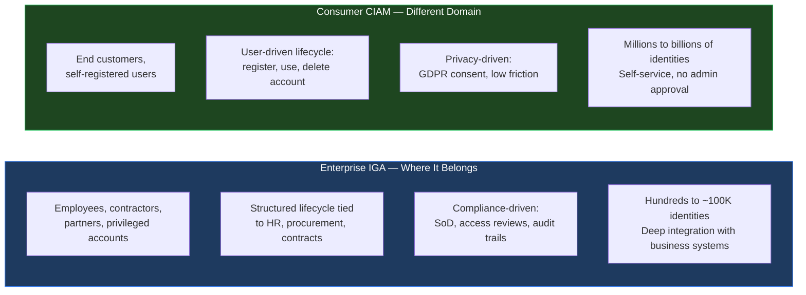

**The costly mistake:** Enterprises sometimes deploy their IGA platform to manage customer identities — or use a CIAM platform for employee governance. The governance workflows, SoD rules, and HR-triggered lifecycle that work for employees do not translate to consumers. A customer creating an account cannot go through a manager approval workflow. An employee role model cannot be self-selected from a consumer app.

IGA is most valuable — and most needed — where access has **regulatory consequences**: financial services ([SOX](https://en.wikipedia.org/wiki/Sarbanes%E2%80%93Oxley_Act){:target="_blank"}, [PCI-DSS](https://en.wikipedia.org/wiki/Payment_Card_Industry_Data_Security_Standard){:target="_blank"}), healthcare ([HIPAA](https://en.wikipedia.org/wiki/Health_Insurance_Portability_and_Accountability_Act){:target="_blank"}), government ([FedRAMP](https://en.wikipedia.org/wiki/FedRAMP){:target="_blank"}), and any environment where a failed access review can trigger a regulatory sanction.

---

## Identity — The Foundation Everything Else Rests On

IGA is only as good as the identity data it works with. Poor identity data quality is the most common reason IGA implementations fail silently — policies are correctly written but applied to the wrong person, or not applied at all because the system cannot determine who someone is.

### The Unique Identity Problem

Every person in your organisation must have **one and only one** identity record as the anchor — an immutable identifier that never changes regardless of name changes, role changes, or organisational restructuring.

#### Why Sequential Numeric Employee IDs Break at Scale

Many organisations start with a simple sequential numeric ID: `EMP-001`, `EMP-002`. This works when you have 500 employees. It breaks — silently at first, then expensively — when you grow:

| ID Format | Ceiling | Problem |
|-----------|---------|---------|
| 3-digit numeric (`001`) | 999 employees | Breaks at 1,000; retrofitting all systems is painful |
| 4-digit numeric (`0001`) | 9,999 employees | Fine for small enterprises; breaks at Series C+ |
| 6-digit numeric (`000001`) | 999,999 employees | Adequate, but still encodes a sequence — IDs reveal headcount history |

**The right approach: a short, randomly generated alphanumeric identifier.** Something like `01BHS` or `CHY782`. Six alphanumeric characters drawn from the [Base36](https://en.wikipedia.org/wiki/Base36){:target="_blank"} alphabet gives `36^6 ≈ 2.17 billion` unique values — no organisation will ever exhaust that. The ID is immutable, scale-independent, and encodes nothing that can become stale (no seniority, no department, no join sequence).

#### The Two-Layer Email Strategy

Email is the most common correlation attribute in IGA — but using it as the primary unique identifier is one of the most common and costly design mistakes. The correct model separates the email into two distinct layers:

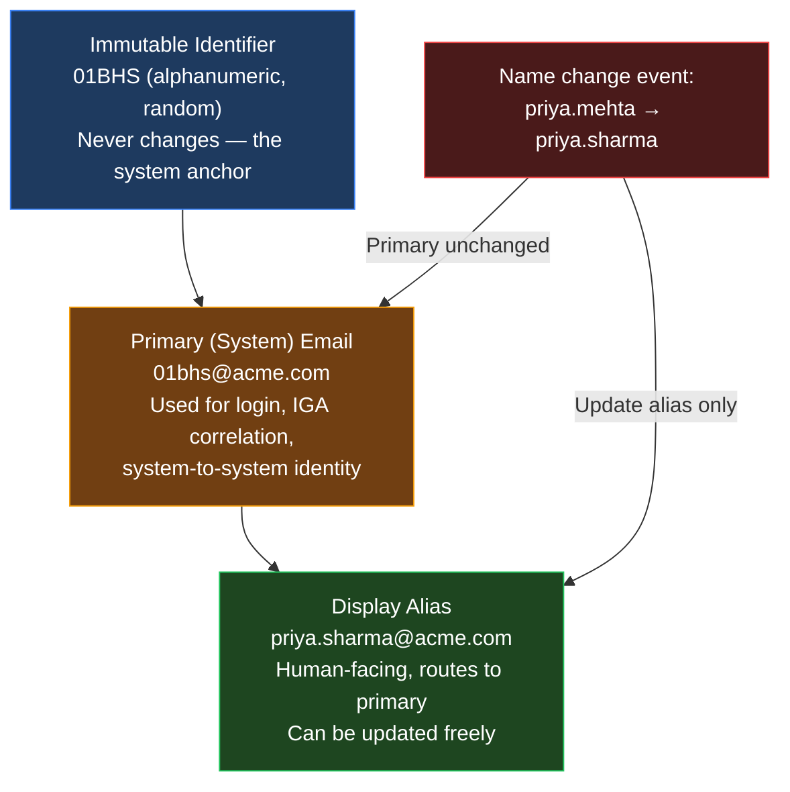

**Primary email** (`01bhs@acme.com`) is the immutable routing address. It is used as the login identifier and the correlation key in every downstream system. It never changes.

**Display alias** (`priya.sharma@acme.com`) is the human-facing address. It is what appears in email clients and on business cards. On a name change, only the alias is updated — all systems correlated via the primary remain intact, and IGA does not need to re-correlate anything.

#### Anti-Patterns in Username and Email Design

The most common naming anti-patterns, and why they fail:

| Pattern | Example | Failure Mode |
|---------|---------|-------------|
| `firstname.lastname@` as primary | `priya.mehta@acme.com` | Name changes break correlation; multiple identity records accumulate |
| `{first_initial}{last_name}` as username | `pmehta` | Collisions at scale — `jsmith`, `jsmith1`, `jsmith2`, `jsmith.j` — naming inconsistency breaks every IGA rule written against username |
| Sequential numeric ID as display identifier | `EMP-10432` shown to users | Employees treat it as identity — confusion when the sequence reveals headcount or seniority |
| Department code prefix in ID | `FIN-0023` | ID encodes department; when person moves, the ID is wrong or must change — defeating the purpose of immutability |

**The "John Smith" problem:** Large organisations have multiple people with identical names. Name-based correlation produces false merges — two distinct people treated as one. The alphanumeric generated ID, not display name or email alias, must be the primary key and correlation anchor in every IGA implementation.

### Critical Identity Metadata — The Policy Engine's Fuel

Access control policies are only as precise as the attributes they can evaluate. The following are the minimum metadata attributes required to write meaningful IGA policies:

| Attribute | Why It Matters | Policy Example |
|-----------|----------------|----------------|
| `employee_type` | FTE, Contractor, Vendor, Service Account | Contractors cannot access customer PII |
| `department` | Finance, Engineering, Legal, HR | SoD rule: Finance cannot approve their own purchases |
| `cost_centre` | Budget allocation unit | Restrict access to that cost centre's financial data |
| `manager` | Approval chain for access requests | Manager certifies team's access in quarterly review |
| `location` / `country` | Regulatory jurisdiction | GDPR-restricted data blocked from non-GDPR jurisdictions |
| `contract_end_date` | Deprovisioning trigger | Access expires 24 hours before contract end |
| `clearance_level` | Security classification | L3 documents restricted to clearance ≥ L3 |
| `employment_start_date` | Seniority, clearance eligibility | Senior employees eligible for elevated access tiers |

### HR as Source of Truth — and What Happens When Quality Fails

The HR system ([Workday](https://www.workday.com/){:target="_blank"}, [SAP HCM](https://www.sap.com/products/hcm.html){:target="_blank"}, [PeopleSoft](https://www.oracle.com/applications/peoplesoft/){:target="_blank"}) is the authoritative source for all the attributes above. When HR data quality is poor, every downstream IGA decision is wrong.

Common HR quality failures and their IGA consequences:

| HR Data Problem | IGA Consequence |
|-----------------|-----------------|
| Department field blank or incorrect | Role assignment rules cannot fire; user gets no access or wrong access |
| Contract end date not populated for contractors | Contractors never auto-deprovisioned; access persists indefinitely |
| Manager field incorrect or stale | Access review certifications sent to the wrong person |
| Re-hire creates new employee record (new EMP ID) | Prior access history lost; IGA treats returning employee as brand new |
| Position change delayed in HR (common 2–4 week lag) | Mover entitlements not updated until HR catches up; SoD violations exist during gap |

**The practical implication:** No IGA program should go live without an HR data quality assessment first. IGA amplifies whatever is in HR — accurate data at scale becomes accurate governance at scale; inaccurate data at scale becomes inaccurate governance at scale, enforced automatically.

---

## The Core Data Model — Identities, Accounts, Roles, Entitlements

IGA operates on a four-tier model. Understanding each tier and how they relate is the foundation of every IGA implementation.

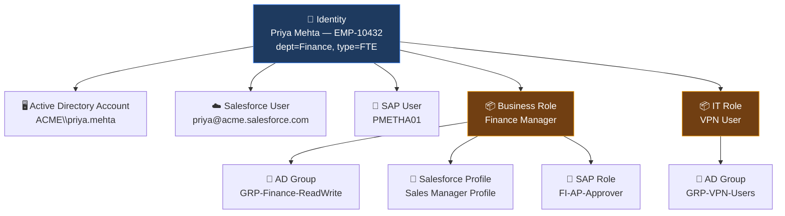

**Identity:** The person. One per human. The anchor for everything else.

**Account:** A login record in a specific target system. One identity can — and typically does — have multiple accounts across different systems. IGA must know which accounts belong to which identity.

**Role:** A named bundle of entitlements representing a job function. "Finance Manager" is a role. Roles are the governance unit — they mean something to the business. Entitlements are the technical unit — they mean something to the application.

**Entitlement:** The actual permission in a target system — an AD group, a Salesforce profile, an SAP transaction code, an AWS permission set. This is what the application enforces. IGA does not create entitlements — it assigns and revokes them.

### Identity Correlation — Linking Multiple Accounts to One Human

**Account correlation** is the process by which IGA matches accounts in target systems back to the single identity that owns them. This is one of the most technically challenging parts of any IGA implementation.

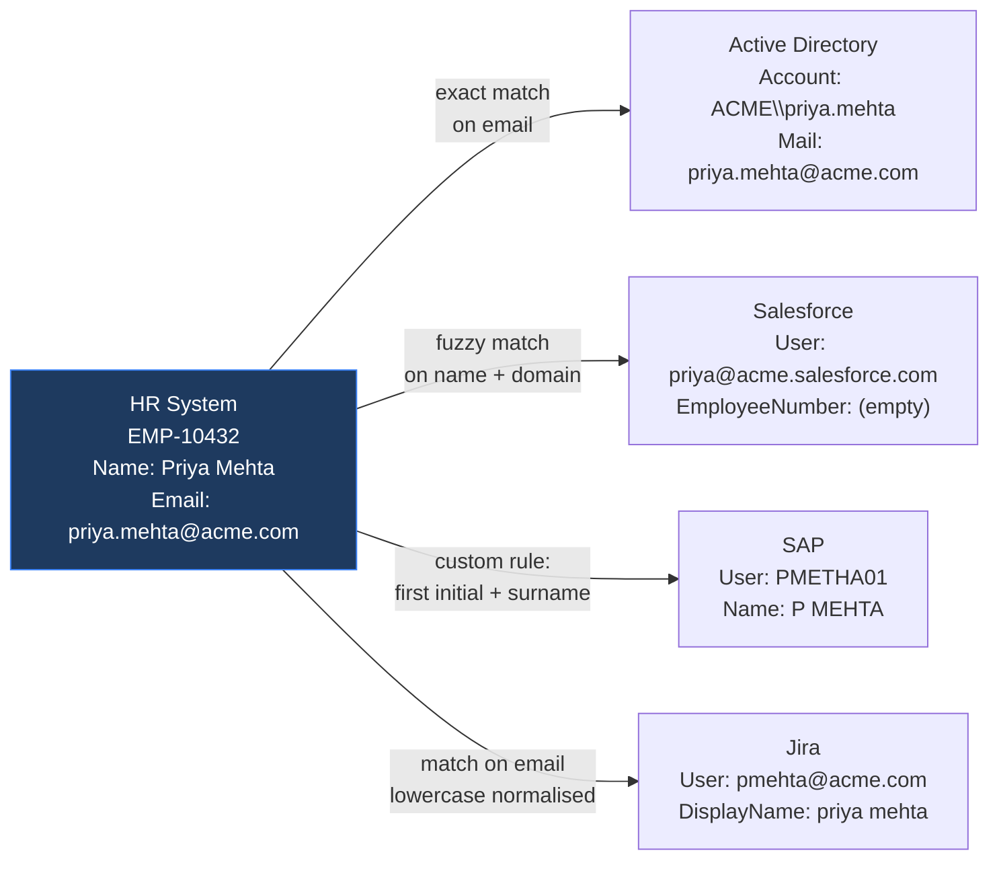

Correlation strategies in order of reliability:
1. **Exact match on employee ID** — most reliable, requires the application to store the employee ID field
2. **Exact match on email** — reliable for modern SaaS; breaks when email changes or multiple email formats exist
3. **Pattern-based matching** — first initial + surname, username derivation rules — fragile, needs ongoing maintenance
4. **Fuzzy name matching** — last resort; produces false positives; requires manual review

**Unmatched accounts** — accounts in target systems that IGA cannot correlate to any identity — are flagged for manual review. These become the **orphaned account** problem.

### Handling Multiple Accounts Per Application

Some applications legitimately require multiple accounts per person:

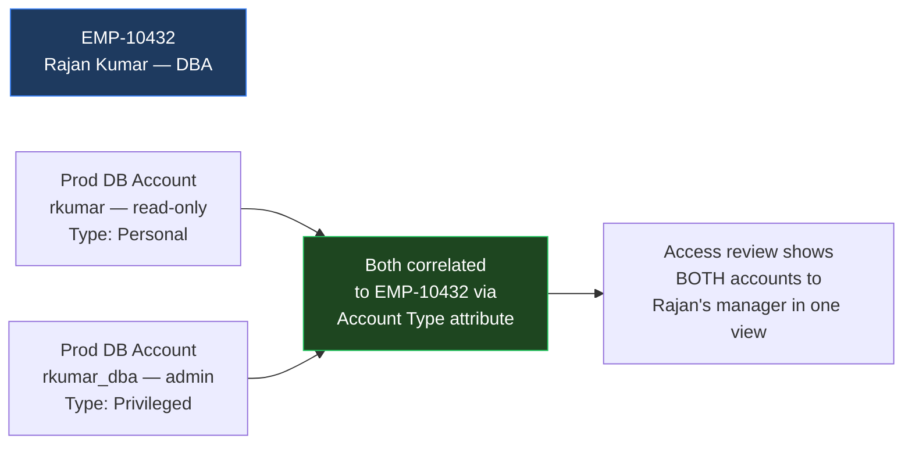

The principle: every account — standard or privileged — must be correlated to a named identity with an Account Type attribute. IGA should surface all accounts for a given identity in a single review view. Enterprises should try to avoid multiple accounts per application for the same person; when unavoidable (privileged access patterns, break-glass accounts), the accounts must be explicitly typed and mapped.

### Orphaned Accounts and Ghost Accounts

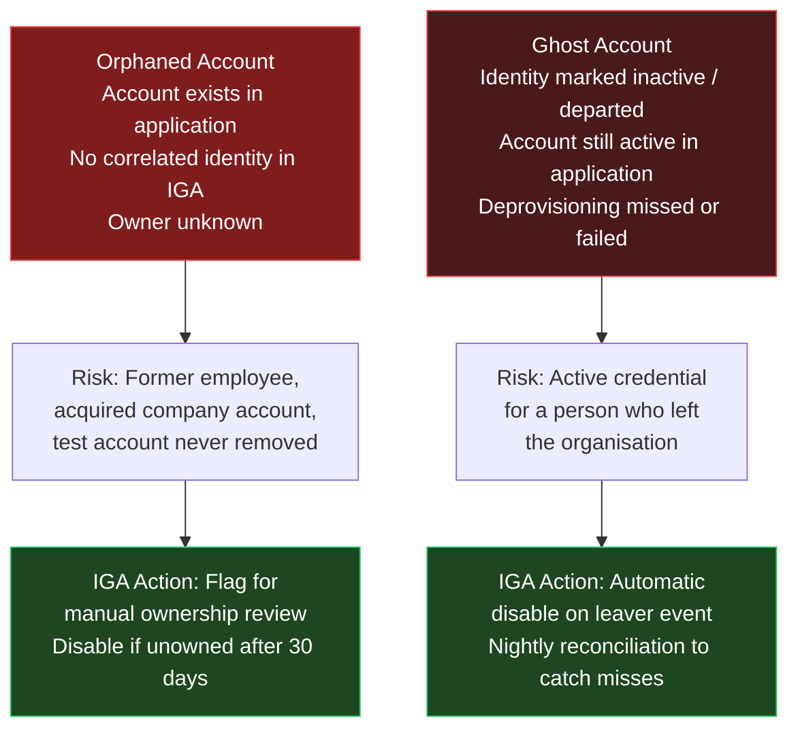

Orphaned and ghost accounts are two of the most common audit findings in any IGA program. The [2024 Verizon Data Breach Investigations Report](https://www.verizon.com/business/resources/reports/dbir/){:target="_blank"} found that credential abuse — including the use of stale, forgotten accounts — remains a leading initial access vector. IGA's nightly reconciliation scan is the primary control that identifies and remediates these.

---

## Identity Management Is a Complex ETL Process

The closest analogy to what IGA does under the hood is an enterprise [ETL (Extract, Transform, Load)](https://en.wikipedia.org/wiki/Extract,_transform,_load){:target="_blank"} pipeline — and the operational challenges are identical.

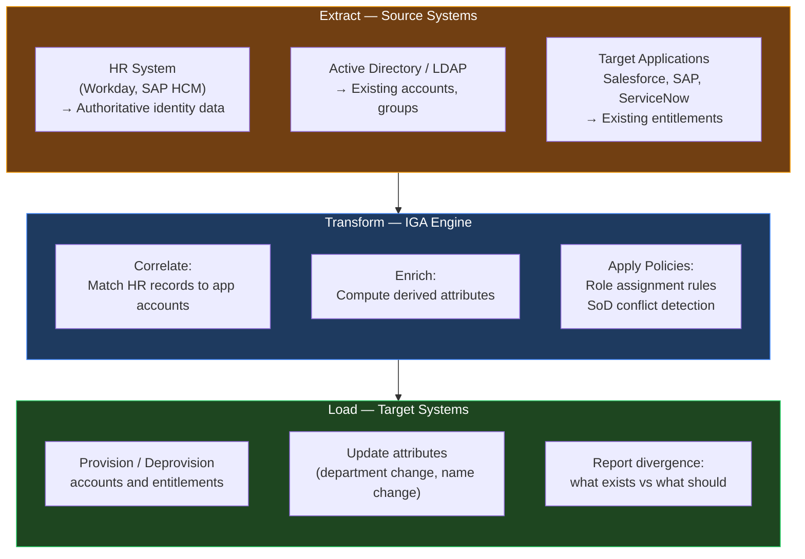

**Reconciliation** is the IGA equivalent of a data quality check. The platform periodically scans target applications to compare what *should* exist (the authoritative model) against what *actually* exists. Divergences — entitlements granted outside IGA, stale accounts, renamed groups — are reported and queued for remediation.

Partial provisioning is a real operational failure mode: some entitlements granted, some failed. IGA must detect this state and retry or escalate rather than silently leaving access in a partial state.

---

## Application Onboarding — How IGA Learns About an Application

Before IGA can govern access to an application, the application must be onboarded: connected, its entitlement structure mapped, and its accounts correlated to identities. Onboarding is typically the longest and most underestimated phase of an IGA program.

**What onboarding produces:**
1. **Connector configuration:** Protocol, credentials, attribute mapping
2. **Entitlement schema:** Types of access in the application and their names
3. **Account correlation rule:** How to match application accounts to IGA identities
4. **Initial import:** A snapshot of all existing access — the "Day 1 state"

### Provisioning Protocols

| Protocol | Description | Typical Use |
|----------|-------------|-------------|
| [SCIM 2.0](https://scim.cloud/){:target="_blank"} | REST + JSON; RFC 7643/7644. The modern standard. | Modern SaaS (Salesforce, ServiceNow, GitHub Enterprise) |
| REST (custom) | Application-specific API. No standard schema. | Most SaaS that predates SCIM adoption |
| [SPML](https://www.oasis-open.org/committees/provision/){:target="_blank"} (legacy) | XML/SOAP. OASIS standard ~2003. Largely replaced by SCIM. | Legacy banking, telco applications |
| [LDAP](https://en.wikipedia.org/wiki/Lightweight_Directory_Access_Protocol){:target="_blank"} write | Direct directory write for AD/LDAP-backed apps | Active Directory, Oracle Directory |
| Database connector | Direct SQL to application user tables | Legacy on-prem with no API — highest maintenance risk |
| Flat file / CSV | IGA generates file; app reads via scheduled job | Mainframe, AS/400 legacy systems |

**SCIM 2.0 is the target state for any modern application.** Custom REST connectors are maintenance-intensive and break on every API version change. If a SaaS vendor does not support SCIM 2.0, that is a vendor selection consideration worth raising.

---

## The JML Lifecycle — Joiner, Mover, Leaver

The [Joiner-Mover-Leaver (JML)](https://www.lumos.com/topic/lifecycle-management-jml){:target="_blank"} model is the operational backbone of IGA. Every change to an employee's relationship with the organisation triggers an identity lifecycle event.

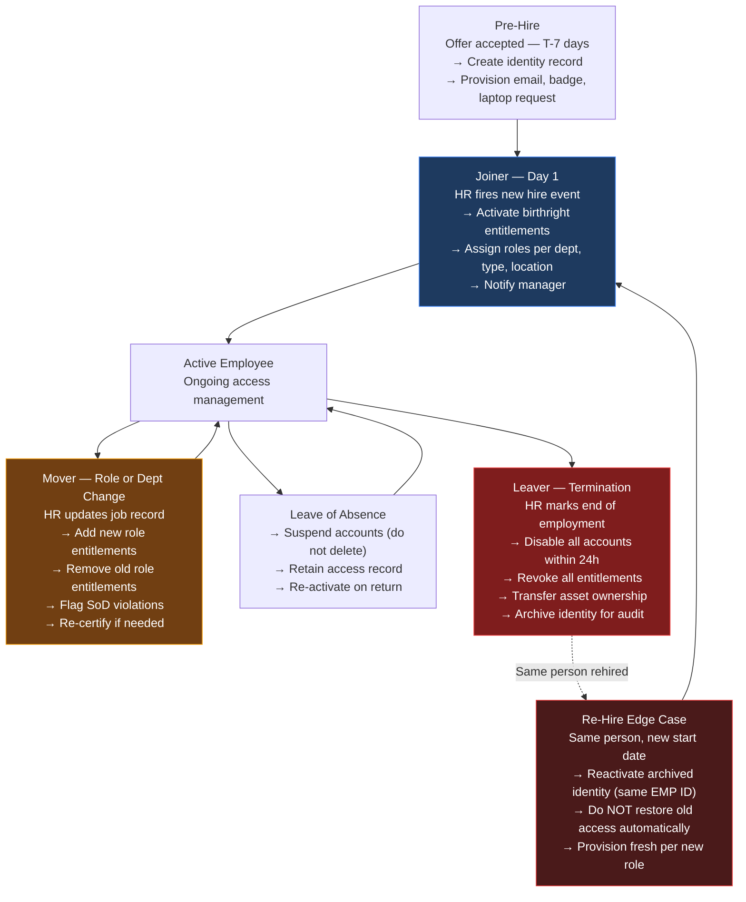

**The Mover event is where most implementations fail.** When Priya moves from Finance to Engineering, her Finance entitlements must be removed and Engineering entitlements added — simultaneously. Implementations that add correctly but forget to remove produce **permission creep**: accumulated access from every team a person has ever been part of. This is the most common finding in any access certification campaign.

**The Re-hire edge case consistently breaks naive implementations.** Correct behaviour: reactivate the archived identity (preserving audit history under the same Employee ID), provision fresh access based on the *new* role, and require explicit approval for any access from the prior role.

**The Leaver SLA matters.** In manually managed environments, the median time to deprovisioning a departed employee is 2–3 weeks. Every day that window stays open, the former employee's credentials remain a live attack surface.

### Birthright Access vs Requested Access

**Birthright access** is the set of entitlements automatically granted on Day 1 based on attributes alone — no approval required. Examples: VPN access for all employees, corporate email, read-only HR portal. Birthright is defined in role-assignment policies and should be the minimum access needed to be productive on Day 1.

**Requested access** is any entitlement beyond birthright. The user self-requests it, an approval workflow routes it to the right approver, and IGA provisions it only on approval. Requested access should always have a time limit — it should not become permanent without a periodic re-certification.

The principle: grant the minimum access automatically, and make additional access require justification and approval.

---

## Role Engineering — The Right Approach and the Common Failures

Roles are the governance abstraction between human identities and technical entitlements. Done well, they make access governance manageable. Done poorly, they create a different kind of chaos.

### Top-Down vs Bottom-Up — and Why Hybrid Is Right

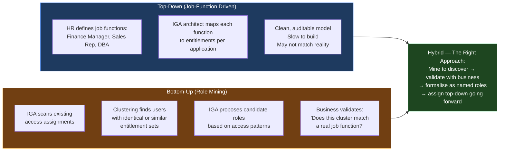

**[Role mining](https://omadaidentity.com/resources/blog/ai-role-mining-in-iga/){:target="_blank"}** uses statistical clustering on existing access data. If 200 Finance users all have the same 12 entitlements, that cluster is a candidate for a "Finance Analyst" role. Role mining reveals the *de facto* roles that already exist in your organisation — even if they were never formally defined. Starting with role mining anchors the governance model in reality rather than theory.

### The Role Explosion Problem

Without discipline, role counts grow out of control:

| Scenario | What Happens | Outcome |
|----------|-------------|---------|
| Role created per project | "Project Atlas Role", "Project Orion Role"... | 500 project roles that outlive the projects |
| Role created per access exception | Exception granted → new role to hold it | 1,000 single-user roles |
| Overlapping roles never rationalised | "Finance Analyst" and "Finance Senior Analyst" differ by 2 entitlements | Redundancy, impossible to certify |
| IT roles conflated with business roles | Technical AD groups promoted to business roles | Non-auditable, meaningless for access reviews |

A healthy IGA implementation maintains a **role hierarchy**: Business Roles (what a person does) map to IT Roles (how they access systems) which map to Entitlements (the actual permissions in applications).

**Rule of thumb:** If a role is assigned to only one person, it is not a role — it is an exception. Exceptions must be tracked explicitly and time-limited. They must not be formalised as singleton roles that permanently inflate the role catalogue.

---

## Segregation of Duties — Why Conflicting Access Is a Business Risk

[Segregation of Duties (SoD)](https://en.wikipedia.org/wiki/Separation_of_duties){:target="_blank"} is the principle that no single person should be able to execute a transaction from start to finish without independent verification. It is the access-level implementation of the four-eyes principle.

**Simple example:** The person who creates a vendor record should not also be the person who approves payments to that vendor. If one person can do both, they could create a fictitious vendor and authorize payments to themselves.

**Complex real-world scenario (Financial Institution):**

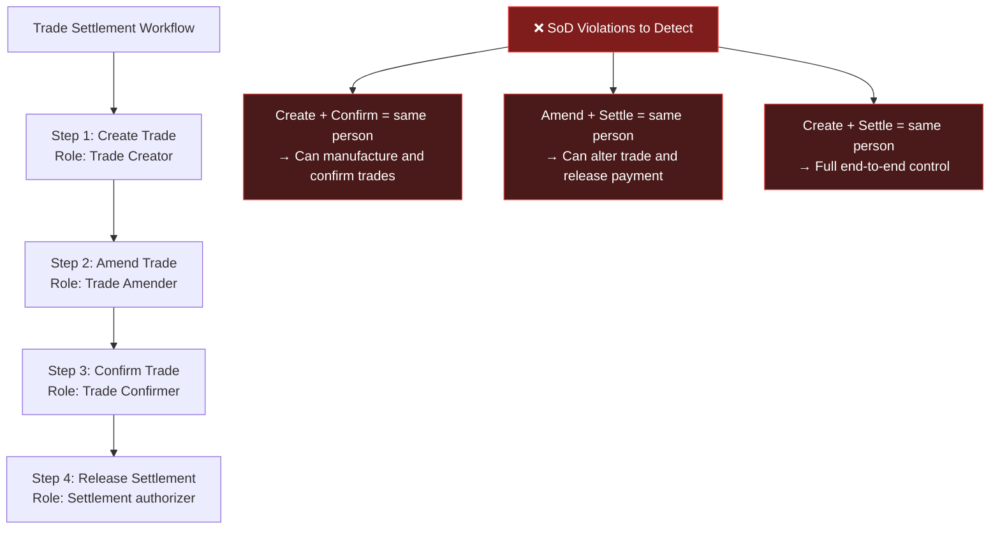

IGA enforces SoD at two points:
1. **Preventive control (provisioning time):** When a user is assigned a new role, IGA checks whether the combined entitlement set creates an SoD conflict. If it does, the assignment is blocked or flagged for approval before provisioning.
2. **Detective control (access review time):** Periodic scans detect conflicts that crept in through direct system access, emergency grants, or IGA bypasses.

**Compensating controls** apply when a legitimate business reason requires one person to hold conflicting access — common in small teams where separation is structurally impossible. The compensating control is documented and signed off (typically: enhanced monitoring + executive approval). IGA logs these exceptions explicitly so auditors can account for them during certification.

---

## Workflows, Request Management, and Governance

IGA manages access through two channels: automatic policy enforcement (roles, birthright, JML) and **request-based access** for entitlements beyond what policy automatically assigns.

**The request lifecycle:**

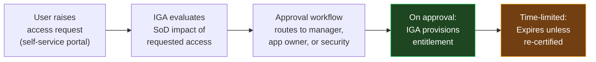

**Reporting and compliance dashboards** give CISO, Internal Audit, and Risk teams visibility into: outstanding SoD violations, orphaned accounts, roles with excessive membership, overdue certifications, and provisioning failures awaiting remediation.

**Access reviews and certifications** — where managers periodically confirm that their users still need current access — are the governance heartbeat of IGA. This is a deep enough topic to deserve its own dedicated post: [*Access Reviews — The Operational Heart of IAM Governance*](){:target="_blank"}.

---

## How IGA Guards Organisations Silently

IGA does not have a dramatic security event to point to. Firewalls log blocks. SIEMs generate alerts. IGA just quietly prevents a class of risk from ever materialising.

Without IGA, the following accumulates silently over time:

- Employees who left still have active accounts *(median deprovisioning time without automation: 2–3 weeks)*
- A person who moved from Finance to IT three years ago still has full Finance access — and IT access
- A contractor whose contract ended six months ago still has VPN access
- An application account for a departed employee that still receives approval emails for financial transactions

Each is a dormant risk. The [2024 Verizon Data Breach Investigations Report](https://www.verizon.com/business/resources/reports/dbir/){:target="_blank"} found credentials and access abuse remain among the top initial access vectors in confirmed breaches. IGA is the control that prevents these dormant credentials from existing in the first place.

The investment calculus: IGA is expensive to implement — a mature deployment in a large enterprise typically takes 12–18 months. It is measurably less expensive than a breach traced to a deprovisioned employee's credentials, or an emergency remediation of thousands of access exceptions triggered by a failed regulatory audit.

As the identity population in any organisation grows — employees, contractors, service accounts, APIs, AI agents (covered in [earlier posts in this series]()) — the case for IGA moves from "nice to have" to unavoidable infrastructure. Access sprawl is the default outcome in the absence of automation. IGA is the only mechanism that keeps it in check at scale.

---

## IGA Vendor Landscape — A Brief Overview

*(A dedicated vendor comparison post is planned. This is a summary only.)*

| Vendor | Product | Positioning |
|--------|---------|-------------|
| [SailPoint](https://www.sailpoint.com/){:target="_blank"} | Identity Security Cloud / IdentityIQ | Market leader; deepest IGA feature set; mature SoD and role management; 20+ years in the space |
| [Saviynt](https://saviynt.com/){:target="_blank"} | Enterprise Identity Cloud | IGA + PAM convergence on one platform; cloud-native; strong cloud entitlement management |
| [One Identity](https://www.oneidentity.com/){:target="_blank"} | One Identity Manager | Strong European presence; Active Directory-centric; good SoD engine |
| [Omada](https://omadaidentity.com/){:target="_blank"} | Omada Identity Cloud | Cloud-native; strong GDPR compliance posture; growing mid-market presence |
| [ConductorOne](https://www.c1.ai/){:target="_blank"} | ConductorOne Platform | Gen3 AI-native; developer-first; built-in NHI governance |
| [Veza / ServiceNow](https://veza.com/){:target="_blank"} | Access Graph | Graph-native permission mapping; strongest for cloud and data system governance |

**Vendor selection considerations:** SailPoint and Saviynt are the enterprise default for complex, regulated environments. Saviynt stands out for IGA-PAM convergence on a single platform. Omada and One Identity are strong mid-market options. ConductorOne and Veza/ServiceNow target cloud-first organisations where NHI governance and access graph visibility are priorities.

---

## Key Takeaways

- **IGA emerged from two forces:** regulatory requirements (SOX, HIPAA) that demanded auditability, and operational scale that made manual access management infeasible. It is infrastructure, not a luxury.

- **Identity quality is the foundation.** Immutable employee IDs, clean HR data, and rich metadata attributes determine how precisely policies can be applied. A 3% error rate in HR propagates to 3% incorrect access governance — silently, at scale.

- **The data model is hierarchical:** Identity → Account → Role → Entitlement. Roles are the governance unit; entitlements are the technical unit. All access should flow through named, auditable roles.

- **IGA is a complex ETL process.** Correlation, transformation, and load to target applications carries all the challenges of enterprise data integration — plus regulatory consequences when it fails.

- **Role mining is the right starting point.** Mine to discover de facto access patterns, validate with the business, formalise as named roles, assign top-down going forward. Never design roles in a vacuum.

- **The Mover event is where implementations fail.** Old entitlements must be removed when new ones are added. Permission creep — accumulated access from past roles — is the most common compliance finding in access reviews.

- **SoD is the access-level four-eyes principle.** Detect conflicts at provisioning time (preventive) and at review time (detective). Document compensating controls where separation is structurally impossible.

- **Orphaned and ghost accounts are the most common audit findings.** Nightly reconciliation is the primary control. Any account with no correlated identity owner must be disabled within a defined SLA.

- **IGA guards silently.** Its value is the risk that never materialises: the deprovisioned account that was never exploited because it did not exist, the SoD conflict that was blocked before a fraudulent transaction could be executed.

---

[*Part of the IAM from First Principles series.*](){:target="_blank"}