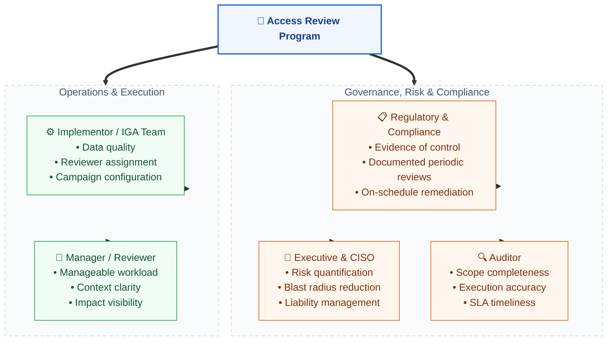
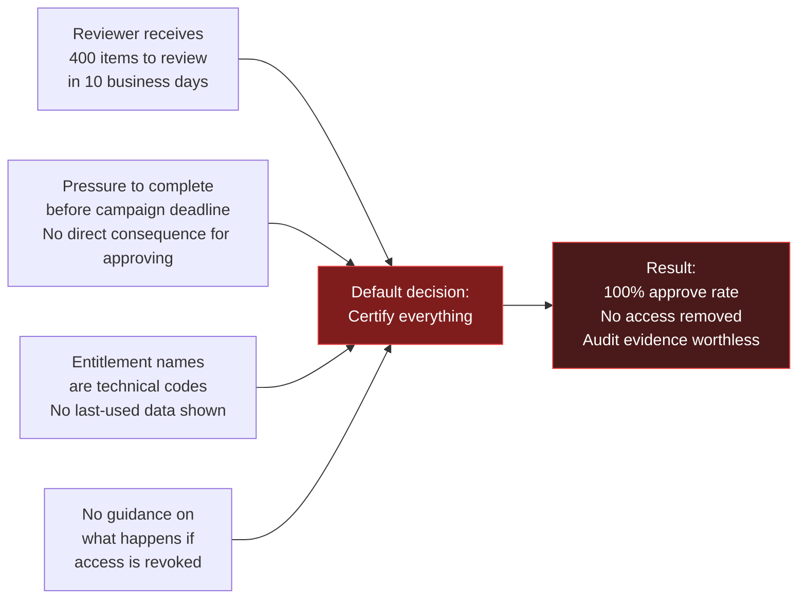
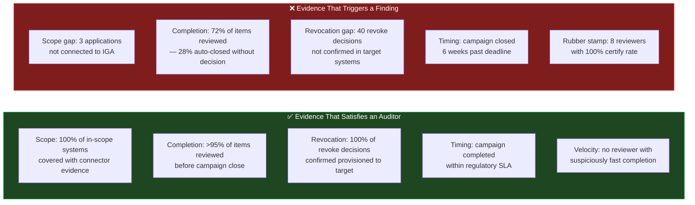
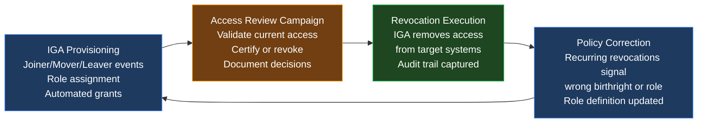

The previous post in this series established how [IGA](){:target="_blank"} automates the provisioning and deprovisioning of access across the enterprise. IGA ensures that the *right* access is granted when someone joins and removed when they leave. But there is a fundamental gap in provisioning alone: it only corrects access at the moment of a lifecycle event. It does not answer the question that keeps regulators and CISOs awake at night — **Is the access that was granted last year still appropriate today?**

That question is the domain of access reviews. Provisioning is the mechanism that grants access. Access reviews are the mechanism that validates it remains justified over time. Without reviews, even a well-configured IGA system allows accumulated, unchecked access to persist indefinitely.

---

## The Origin of Access Reviews — Where the Requirement Came From

Access reviews did not emerge from security best practice. They emerged from regulatory mandate — specifically, from the realisation that granting access without periodically verifying its appropriateness is a control gap that auditors cannot accept.

The key regulatory sources that formalised the requirement:

### Global

| Regulation | Specific Control | Requirement |
|------------|-----------------|-------------|
| [PCI-DSS Requirement 7 & 8](https://www.pcisecuritystandards.org/document_library/){:target="_blank"} | Restrict access by business need; manage user IDs | Periodic review of user access rights to cardholder data environments. |
| [ISO 27001 A.9.2.5](https://www.iso.org/standard/27001){:target="_blank"} | Review of user access rights | Asset owners must review access rights at regular intervals. |

### United States

| Regulation | Specific Control | Requirement |
|------------|-----------------|-------------|
| [SOX Section 404](https://www.sec.gov/spotlight/sarbanes-oxley.htm){:target="_blank"} | Internal controls over financial reporting - it has Global Outreach| Evidence that access to financial systems is reviewed and appropriate. Stale access = a control deficiency. |
| [HIPAA Minimum Necessary Standard](https://www.hhs.gov/hipaa/for-professionals/privacy/guidance/minimum-necessary-requirement/index.html){:target="_blank"} | 45 CFR § 164.514(d) | Access to Protected Health Information must be limited to what is necessary; periodic review required. |
| [NIST SP 800-53 AC-2](https://nvlpubs.nist.gov/nistpubs/SpecialPublications/NIST.SP.800-53r5.pdf){:target="_blank"} | Account Management - US Govt - used GLobally| Review accounts for compliance with account management requirements at a defined frequency. |

### India

| Regulation | Specific Control | Requirement |
|------------|-----------------|-------------|
|[DPDP -2023](https://www.meity.gov.in/static/uploads/2024/06/2bf1f0e9f04e6fb4f8fef35e82c42aa5.pdf){:target="_blank"}|All Data Fiduciaries handling digital personal data of Indian citizens.|Section 8 (Obligations of Data Fiduciary) requires implementing "reasonable security safeguards" to prevent data breaches.|
|[RBI Cyber Security Framework for Banks](https://sectona.com/blogs/technology/rbi-guidelines-for-cybersecurity-framework/){:target="_blank"}|All Scheduled Commercial Banks and financial institutions operating in India.| Banks must systematically review and audit user access rights at regular, defined intervals and ensure the immediate revocation of privileges for departing employees.|
|[SEBI Cyber Security & Cyber Resilience Framework (CSCRF)](https://www.apmiindia.org/storagebox/images/Important/Presentation%20-%20CSCRF.pdf){:target="_blank"}|Regulated Entities (REs) including stockbrokers, asset management companies, and clearing corporations.|Mandatory Cyber Audits require independent CERT-In empanelled auditors to verify that 100% of critical systems undergo user access reviews.|

### EU

| Regulation | Specific Control | Requirement |
|------------|-----------------|-------------|
|[EU GDPR](https://commission.europa.eu/law/law-topic/data-protection/rules-business-and-organisations/application-regulation/who-does-data-protection-law-apply_en){:target="_blank"}|Any Organization processing personal data of EU residents.|Article 32 (Security of Processing) requires companies to implement a process for regularly testing, assessing, and evaluating the effectiveness of technical measures. |
|[NIS2 Directive (EU 2022/2555)](https://nis2directive.eu/){:target="_blank"}|Essential and Important Entities across 18 critical sectors (e.g., energy, transport, finance, digital infrastructure).|Article 21 (Cybersecurity Risk-Management Measures) establishes access control policy as a foundation.|
|[DORA (Digital Operational Resilience Act)](https://www.eiopa.europa.eu/digital-operational-resilience-act-dora_en){:target="_blank"}|Financial Entities in the EU (banks, investment firms, insurance companies, and ICT third-party providers)|Article 9 (ICT Risk Management) dictates that entities must maintain absolute control over ICT access rights|

Before these mandates, most organisations reviewed access only when a problem surfaced — a breach, an audit finding, a suspicious transaction. Regulation made periodic review a continuous operational discipline rather than an incident-driven reaction.

---

## Five Perspectives on Why Access Reviews Matter

Access reviews mean different things to different stakeholders. Understanding each perspective is essential for designing a programme that satisfies all of them.

**Regulatory/Compliance perspective:** The requirement is to demonstrate a control exists — that access rights are periodically reviewed, that findings are documented, and that inappropriate access is revoked within a defined SLA. Evidence format matters as much as the act.

**Executive/CISO perspective:** Access reviews provide a periodic snapshot of the organisation's access risk posture — how many entitlements exist, how many were revoked as inappropriate, and what the trend looks like quarter over quarter. They quantify blast radius: if one set of credentials is compromised, how much damage can be done with the access attached to them?

**Auditor perspective:** Auditors focus on three things: *completeness* (was every in-scope system covered?), *accuracy* (were revoke decisions actually executed in target systems?), and *timeliness* (were reviews completed before the campaign deadline?). An incomplete campaign is a finding. A revocation that was approved but never provisioned is a more serious finding.

**Implementor perspective:** The IGA team cares about data quality — whether identity data is accurate enough for meaningful reviews, whether connector coverage is complete enough to include all in-scope applications, and whether reviewer assignments are correct so reviews reach the right people.

**Manager/Reviewer perspective:** The person actually doing the review sees a workload problem. They may receive hundreds of access items to review in a campaign window of two to three weeks, often with no clear indication of what each entitlement does or when it was last used. This pressure is the root of the rubber stamping problem — which is covered in detail below.

---

## What Exactly Is an Access Review?

An access review — also called an **access certification** — is a structured, time-bound process in which designated reviewers confirm or revoke the access rights of specific users to specific systems or entitlements.

The core question asked of every reviewer is: *Does this person still need this access to do their job?*

The review does not grant new access. It is not a provisioning event. It is a validation exercise — confirming that access previously granted remains appropriate, or flagging it for removal when it is not.

Access reviews operate on the four-tier data model established in the previous post:

- A **user** has access to an **application** via an **account** that carries specific **entitlements**
- The review asks whether the combination of user + entitlement remains justified
- If the reviewer says *no*, the IGA platform revokes the entitlement from the account in the target system

Without IGA, this exercise must be done manually — extracting access data from each application, distributing it to reviewers via spreadsheet, collecting responses, and manually submitting IT tickets for each revocation. For small organisations (under 200 users, fewer than 10 applications), this can be made to work and can satisfy an auditor. At enterprise scale, manual access reviews become unreliable: spreadsheets diverge, items are missed, revocations depend on IT tickets that get lost. IGA provides a single system of record for the entire campaign.

---

## Types of Access Reviews

Access reviews are not one-size-fits-all. Different review types serve different governance purposes:

| Review Type | Reviewer | What Is Being Reviewed | Typical Frequency |
|-------------|----------|------------------------|-------------------|
| **User Access Certification** | Direct manager | All entitlements held by each member of their team, across all applications | Quarterly or semi-annual |
| **Entitlement Owner Review** | Application owner | All users who have access to a specific application or entitlement | Annual or on significant change |
| **Role Membership Review** | Role owner / governance team | All users assigned to a specific business or IT role | Annual or after role changes |
| **Privileged Access Review** | Security team or manager | Elevated accounts, admin roles, PAM-vaulted credentials | Monthly or quarterly |
| **SoD Conflict Review** | Risk / Compliance team | All known SoD conflicts and their compensating controls | Quarterly |
| **Orphaned Account Review** | IGA team / app owners | Accounts with no correlated identity owner | Monthly (automated scan) |
| **Service Account / NHI Review** | Application team | Non-human accounts, API credentials, service accounts | Quarterly or on rotation |

Each type produces different evidence and satisfies different audit controls. A mature access governance programme runs multiple review types on staggered schedules — not one annual campaign that covers everything at once.

---

## The Certification Campaign — Anatomy

A certification campaign is the operational vehicle for conducting access reviews at scale. Understanding its lifecycle is essential for both running an effective programme and for interpreting the evidence it produces.

```mermaid
flowchart TD
    Scope["1. Scope Definition<br/>Which systems, users, entitlements<br/>are in scope for this campaign?<br/>Risk-based: not everything, every time"]

    Data["2. Data Collection<br/>IGA pulls current access snapshot<br/>from all in-scope connectors<br/>Reviewer assignments resolved from identity data"]

    Launch["3. Campaign Launch<br/>Reviewers notified via email / portal<br/>Each item assigned: certify / revoke / delegate<br/>Campaign window opens (typically 2–4 weeks)"]

    Review["4. Review Period<br/>Reviewers act on each item<br/>IGA tracks: reviewed / pending / overdue<br/>Escalations fire at SLA breach"]

    Escalate["5. Escalation<br/>Overdue items escalated to reviewer's manager<br/>Or auto-revoked per policy<br/>(auto-revoke is the safer default for high-risk entitlements)"]

    Close["6. Campaign Close<br/>Remaining unreviewed items resolved<br/>Campaign locked — no further changes<br/>Final state captured"]

    Revoke["7. Revocation Execution<br/>IGA provisions all 'revoke' decisions<br/>to target systems via connectors<br/>Failures queued for retry and escalation"]

    Report["8. Evidence Package<br/>Campaign report generated:<br/>completion rate, action summary,<br/>revocation follow-through, SoD exceptions"]

    Scope --> Data --> Launch --> Review --> Escalate --> Close --> Revoke --> Report

    style Scope fill:#1e3a5f,stroke:#3b82f6,color:#fff
    style Data fill:#713f12,stroke:#f59e0b,color:#fff
    style Launch fill:#1e3a5f,stroke:#3b82f6,color:#fff
    style Review fill:#1e3a5f,stroke:#3b82f6,color:#fff
    style Escalate fill:#7f1d1d,stroke:#ef4444,color:#fff
    style Close fill:#713f12,stroke:#f59e0b,color:#fff
    style Revoke fill:#1e4620,stroke:#22c55e,color:#fff
    style Report fill:#1e4620,stroke:#22c55e,color:#fff
```

**Step 7 (Revocation Execution) is where most audit failures occur.** A reviewer approving a revocation is not the same as that access being removed. The revocation must be provisioned to the target system — and if the connector fails, or the revocation queue is not monitored, the access remains in place. Auditors check both the campaign report (showing the revoke decision) and the target system state (showing whether the access is actually gone). A gap between the two is a significant control failure.

---

## Data Quality and Planning — The Prerequisite That Cannot Be Skipped

A certification campaign is only as reliable as the data it is built on. Poor data quality does not just make reviews difficult — it makes them meaningless, because reviewers are certifying a distorted picture of reality.

The critical data quality requirements before launching any campaign:

**1. Identity-to-account correlation must be complete.**
If accounts in target systems are not correlated to the correct identity (as described in the IGA post), those accounts will not appear in any reviewer's queue. Orphaned or incorrectly correlated accounts are invisible to the campaign — and therefore never reviewed, regardless of how many campaigns are run.

**2. Reviewer assignment must be accurate.**
The reviewer for a given item is typically the direct manager, derived from the `manager` attribute on the identity record. If that attribute is stale, incorrect, or blank, the review item routes to the wrong person — or to nobody at all. A campaign completed by the wrong reviewers provides no assurance and invalid audit evidence.

**3. Application coverage must be complete.**
Applications that are not connected to the IGA platform do not appear in campaigns. An organisation may have a thorough campaign covering 80 of its 100 applications, while the 20 uncovered applications — often legacy systems with the most persistent stale access — are never reviewed. Auditors covering those systems will find no certification evidence.

**4. The access snapshot must reflect the current state.**
Campaigns are based on a point-in-time snapshot pulled at campaign launch. If access changed significantly between the snapshot and the review date, reviewers are certifying data that is already out of date. Frequent, smaller campaigns are preferable to infrequent, large ones for exactly this reason.

---

## The Entitlement Description Problem — Why Context Determines Quality

A reviewer cannot make a meaningful decision without understanding what they are being asked to review. This is where many access review program fail before they begin.

Consider a manager reviewing their team's access. They see:

> **Entitlement:** `GRP-FIN-0023`
> **Application:** SAP ECC
> **User:** Priya Mehta
> **Action:** Certify / Revoke

Without more context, the manager has two choices: approve because they are afraid of breaking something legitimate, or reject and risk impacting Priya's ability to do her job. Most managers choose to approve — not because the access is appropriate, but because they do not have enough information to know either way.

Now consider the same item with a proper entitlement description:

> **Entitlement:** `GRP-FIN-0023 — Accounts Payable Approver`
> **Application:** SAP ECC (Finance Module)
> **Risk Level:** High — allows payment approvals up to ₹50 lakh without secondary authorization
> **Last Used:** 14 months ago
> **SoD Note:** Conflicts with Vendor Master Maintenance role (create + approve = SoD violation)
> **Action:** Certify / Revoke

The manager can now make an informed decision. The last-used date alone (14 months) is often enough to trigger a revoke decision — it is a clear signal that the access is no longer actively needed.

**What a good entitlement description must contain:**

| Field | Purpose |
|-------|---------|
| Human-readable name | What the entitlement is called in business terms |
| System and module | Which application and functional area |
| What it allows | A plain-language description of the permissions granted |
| Risk classification | Low / Medium / High / Critical — based on data sensitivity and function |
| Last access date | When the account last used this entitlement (most powerful signal) |
| SoD flag | Whether this entitlement is part of any known conflict pair |

Entitlement descriptions are not automatically generated — they must be curated during application onboarding and maintained over time. This is one of the most consistently underestimated effort areas in any IGA programme.

---

## The Rubber Stamping Problem — The Elephant in the Room

Access reviews are only effective if reviewers actually review. The most common and most studied failure mode in access governance is **rubber stamping**: reviewers approving every item without genuine evaluation.

**How to detect rubber stamping:**

- Completion velocity: a reviewer who certifies 200 items in under 15 minutes has not reviewed them
- Approve rate anomaly: a reviewer with a 100% certify rate across every campaign, including items for users who have left the organisation
- Pattern matching: all items certified in a single batch at the same timestamp — a sign of "select all, approve"

**How to reduce rubber stamping:**

1. **Show last-used data.** A reviewer who sees "last accessed 18 months ago" is far more likely to revoke than one who sees only a username and an entitlement code. Usage data is the single most effective input for driving genuine decisions.

2. **Reduce volume through risk-based scoping.** Not every access item needs to be reviewed every quarter. High-risk and privileged entitlements should be reviewed frequently; low-risk, high-confidence entitlements can be reviewed annually or driven by change events only. Drowning reviewers in low-risk items creates the fatigue that leads to rubber stamping.

3. **Require justification for high-risk certifications.** If a reviewer certifies an entitlement that is high-risk or that has not been used in over six months, the platform should require a text justification. This slows rubber stamping without blocking legitimate certifications.

4. **Sample-check the reviewers.** The security team or internal audit function should periodically pick a random sample of certified items and verify that the access is genuinely appropriate. If the sample reveals obviously wrong certifications, the reviewer is held accountable. Accountability changes behaviour.

5. **Enforce auto-revocation for inactivity.** Establish a policy: any entitlement unused for more than 90 days is automatically staged for revocation at the next campaign, and the reviewer must actively justify retaining it rather than the default being to retain. This inverts the default and shifts the burden of justification to the certify decision rather than the revoke decision.

---

## Reporting and Audit Evidence — What Good Looks Like

A campaign report is not just an operational summary — it is the primary evidence artifact presented to auditors. It must answer the auditor's three questions: *Was all in-scope access reviewed? Were revocations executed? Was the process completed on time?*

**Key metrics every campaign report must contain:**

| Metric | What It Demonstrates |
|--------|---------------------|
| **Scope coverage** | % of in-scope systems, users, and entitlements that were included in the campaign |
| **Completion rate** | % of assigned review items that were acted on before campaign close |
| **Action distribution** | % certified / % revoked / % delegated / % auto-resolved |
| **Revocation follow-through** | % of revoke decisions where the access was actually removed from the target system |
| **Time-to-completion** | Distribution of when reviewers acted — highlights stragglers and rubber stampers |
| **Escalation count** | How many items required escalation to a manager above the primary reviewer |
| **SoD exceptions** | Count of active SoD conflicts, with compensating control references |
| **Open findings** | Items from the campaign where issues were found but not yet remediated |

**The revocation follow-through gap is the most serious audit finding.** An auditor who finds that 40 access items were marked for revocation but remain active in target systems will question the integrity of the entire programme — not just those 40 items. This gap typically occurs when connectors fail silently, when manual revocation was required (for apps without automated provisioning), or when the revocation queue is not monitored.

**Evidence retention** is also important. Campaign reports, reviewer action logs, and revocation confirmation records must be retained for the duration required by the applicable regulation — typically [three to seven years](https://www.sec.gov/rules/final/33-8220.htm){:target="_blank"} for SOX-covered entities.

---

## How Access Reviews Connect Back to IGA Automation

Access reviews and IGA automation are not separate program — they are two phases of the same governance cycle. IGA provisions access based on policy; access reviews validate that the policy-derived access remains appropriate; review outcomes feed back into IGA as policy corrections.

When the same access is revoked in every campaign — the same entitlement, revoked from the same type of user — it is a signal that the underlying role definition or birthright policy is wrong. Access reviews surface these signals. IGA automation acts on them. Over time, the feedback loop produces a cleaner access model that requires fewer revocations in each successive campaign.

This is the difference between an access review programme that reduces risk over time and one that merely produces evidence without improving the underlying posture.

---

## Key Takeaways

- **Access reviews exist because of regulation, not best practice.** SOX, PCI-DSS, HIPAA, and ISO 27001 all mandate periodic review of user access rights. The question is not whether to run them — it is whether to run them well.

- **Five stakeholders, five success criteria.** Regulators want evidence of control. Executives want risk quantification. Auditors want completeness and accuracy. Implementors want data quality. Managers want clarity and manageable volume. A programme that ignores any of these perspectives will fail one of these audiences.

- **Campaign completeness and revocation follow-through are the two metrics auditors care about most.** Completing 95% of a campaign with confirmed revocations in target systems is stronger evidence than completing 100% with unexecuted revocations.

- **Data quality determines campaign quality.** Incomplete correlation, wrong reviewer assignments, and missing application coverage make every subsequent step unreliable. Fix the data first.

- **Entitlement descriptions are not optional.** A reviewer cannot make a meaningful decision without understanding what they are reviewing. Last-used data is the single most effective input for driving genuine revoke decisions.

- **Rubber stamping is the most common way access reviews fail.** It is detectable (velocity analytics, approve rate anomalies) and preventable (usage data, risk-based scoping, inactivity auto-revocation, accountability sampling).

- **Access reviews and IGA automation form a feedback loop.** Reviews surface policy errors; IGA corrects them. program that treat the two as independent miss the compounding governance benefit of connecting them.

---

[*Part of the IAM from First Principles series.*](){:target="_blank"}