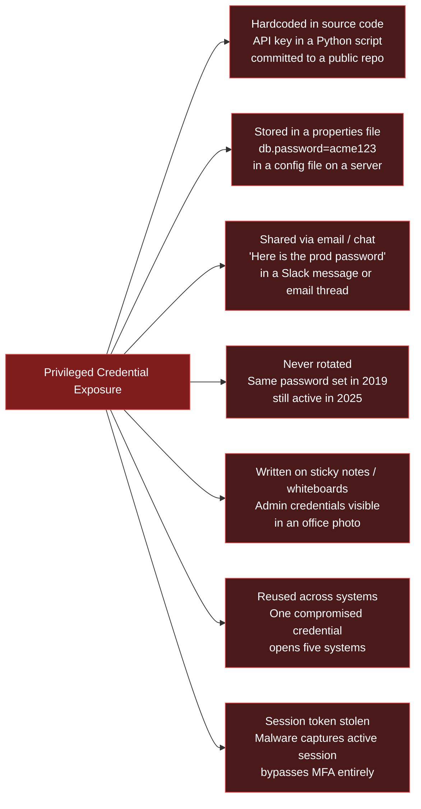
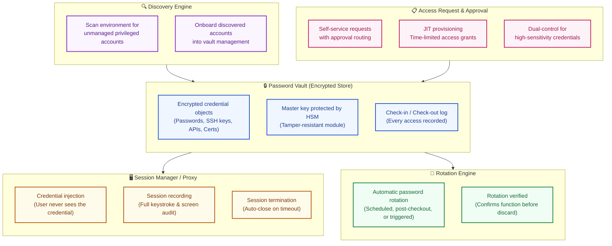
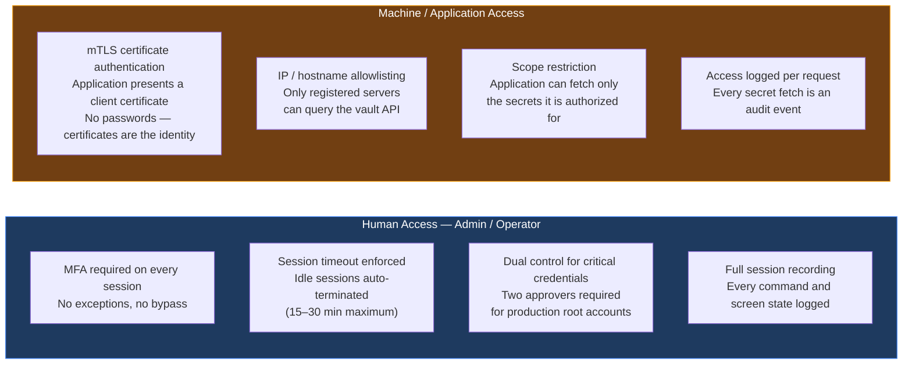
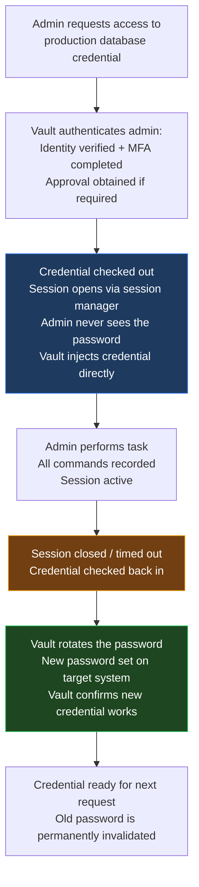
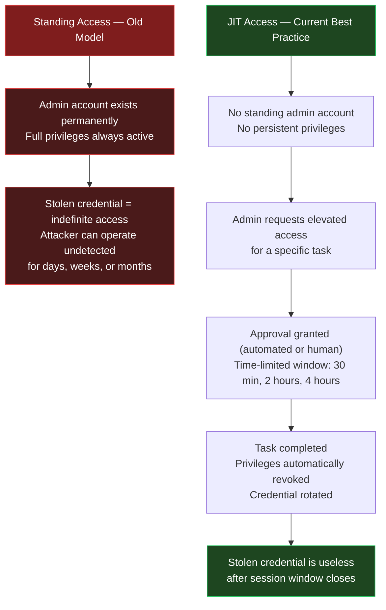
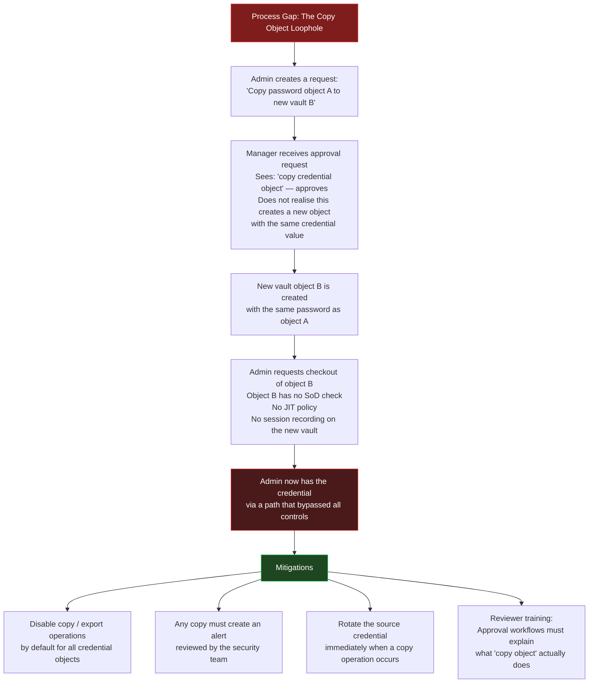

The previous posts in this series established how [IGA](){:target="_blank"} governs access for the entire identity population, and how [access reviews](){:target="_blank"} keep that access appropriate over time. Both disciplines apply broadly — to every employee, contractor, and system account.

Privileged Access Management narrows the focus to a specific, high-consequence subset: the credentials that grant control over infrastructure, data, and the systems that govern everything else. A compromised employee account is a problem. A compromised domain administrator credential, a root AWS key, or a database superuser password is a crisis.

---

## How Credentials Get Exposed — The Origin of PAM

Privileged Access Management did not emerge from a theoretical security model. It emerged from a pattern of real failures — repeated across industries, organisations, and decades — where powerful credentials were handled carelessly and the consequences were severe.

Each of these failure modes is not hypothetical. Every one of them has resulted in a publicly disclosed breach.

---

## When Credential Mismanagement Becomes a Headline

Four publicly documented incidents illustrate what credential mismanagement produces at scale:

**Toyota, 2022 — Five Years of Exposed Cloud Keys**
A Toyota contractor accidentally committed a cloud access key to a public GitHub repository in 2017. The key was not discovered until [Toyota's own investigation in 2022](https://blog.gitguardian.com/toyota-accidently-exposed-a-secret-key-publicly-on-github-for-five-years/){:target="_blank"} — five years of potential exposure. The key could have provided access to location data for up to [296,019 customers](https://global.toyota/en/newsroom/corporate/39241625.html){:target="_blank"}. The root cause: no automated secret scanning on repositories, and no credential rotation policy that would have invalidated the key even if exposed.

**Uber, 2022 — Hardcoded Admin Credentials in a PowerShell Script**
An attacker social-engineered an Uber contractor's VPN credentials. Once inside the network, they discovered a PowerShell script stored on an internal network share containing hardcoded [PAM admin credentials](https://www.uber.com/newsroom/security-update/){:target="_blank"}. Those credentials gave full administrative access to Uber's PAM system — and through it, to essentially all of Uber's infrastructure. A PAM tool was deployed; the implementation gap was a single unprotected script that bypassed it entirely.

**CircleCI, 2023 — Session Tokens That Bypassed MFA**
Malware installed on a CircleCI employee's laptop captured a session token while the employee was authenticated. The attacker used this token to access customer secrets stored in CircleCI's systems — [without needing the employee's password or MFA code](https://circleci.com/blog/jan-4-2023-incident-report/){:target="_blank"}, because the session was already established. The lesson: MFA protects the login event, not the ongoing session. Session timeout and session recording are the controls that close this gap.

**SolarWinds, 2019 — "solarwinds123" in a Public GitHub Repository**
A security researcher discovered that the password `solarwinds123` — an FTP server credential — had been committed to a [public GitHub repository](https://thehackernews.com/2021/03/solarwinds-blame-intern-for-weak.html){:target="_blank"}. The credential was reported to SolarWinds in 2019. This preceded and was separate from the SUNBURST attack, but demonstrates the same root cause: credentials treated as configuration values rather than secrets requiring vault-grade protection.

These are not incidents at small or poorly resourced organisations. They occurred at companies with active security program and, in Uber's case, a deployed PAM tool. Technology is necessary but not sufficient.

---

## Six Perspectives on Why PAM Matters

PAM has different implications for each group that interacts with it. Building a programme that works requires understanding all of them.

| Perspective | What They See | What They Need |
|-------------|--------------|----------------|
| **Regulatory / Compliance** | PAM as a control mandated by PCI-DSS Req. 8, SOX, HIPAA, NIST 800-53 | Evidence that privileged access is inventoried, controlled, reviewed, and rotated on schedule |
| **Executive / CISO** | A compromised admin credential = enterprise-wide breach; blast radius of one stolen key is the entire estate | Reduced standing privileges; proof that admin access cannot be used indefinitely if credentials are stolen |
| **Auditor** | Privileged accounts as the highest-risk access category; looking for over-provisioning, shared accounts, unrotated passwords, and missing session logs | Complete inventory of privileged accounts; rotation timestamps; session recordings for all elevated activity |
| **Implementor / IGA Team** | PAM as a separate but connected layer — PAM-managed accounts should feed into IGA's access model | Clean handoff between IGA (who has access) and PAM (how privileged access is exercised) |
| **Administrator** | A tool that adds friction to their daily work | Minimal friction for legitimate tasks; fast checkout; workflow that does not slow incident response |
| **Developer / Application Team** | A secrets management requirement for their services | A simple, well-documented SDK or API to retrieve credentials at runtime without storing them in config files |

The administrator and developer perspectives are the most commonly ignored — and the root cause of most adoption failures, as discussed later.

---

## Vault Architecture — What PAM Actually Is

A PAM solution is not a single product. It is a set of components that together control how privileged credentials are stored, accessed, monitored, and rotated.

The **[Hardware Security Module (HSM)](https://en.wikipedia.org/wiki/Hardware_security_module){:target="_blank"}** is the root of trust for the vault. It is a tamper-resistant hardware device that holds the master encryption key for the vault. If the HSM is not accessible, the vault cannot decrypt credentials. This means a stolen vault database is useless without the HSM — the design ensures that even physical theft of the vault server does not expose credentials.

**Credential injection** is the design principle that means a human never needs to see a password to use it. The session manager establishes the connection on behalf of the user, inserting the credential transparently. The user gets a session; the credential stays in the vault.

---

## Who Gets Access and How — Human vs Machine Authentication

The access model for a vault must distinguish between human users and machine/application consumers. The authentication requirements are fundamentally different.

**MFA every time for humans — no exceptions.** A PAM UI that stays open after the initial login is a security control waiting to be bypassed. The CircleCI incident (session token stolen from a logged-in machine) demonstrates exactly this risk. Session timeout is not a convenience feature — it is a security control. A maximum idle timeout of 15–30 minutes should be enforced at the vault layer, not left to the user's discretion.

**mTLS and IP allowlisting for machines.** An application service fetching a database password should authenticate with a client TLS certificate and be called from an IP address or hostname pre-registered in the vault. This means a rogue process from an unregistered host cannot fetch credentials even if it has valid API credentials. The scope restriction ensures the application can only retrieve the specific secrets it needs — not browse the entire vault.

---

## The Check-In / Check-Out Model and Password Rotation

The fundamental operational model for privileged credentials is check-in/check-out — treating credentials like a library book rather than a permanent possession.

**Rotation after every checkout** is the gold standard — it ensures that even if someone recorded the credential during a session, it is useless the moment the session ends. For environments where rotation after every use is operationally intensive (due to service restarts or application reconfiguration), a defined rotation frequency must be established: daily, weekly, or monthly depending on the risk classification of the credential.

**Rotation must be verified.** The vault should confirm that the new password successfully authenticates to the target system before discarding the old one. Rotation that fails silently — the new password is set on the vault but not accepted by the target system — is a common operational failure that can lock administrators out of critical systems during an incident.

---

## Session Recording — Why Every Action Must Be Captured

Session recording is not surveillance for its own sake. It is the audit trail that makes privileged access accountable, investigations possible, and compliance demonstrable.

What a PAM session recording captures:
- Every command entered in a terminal session
- Every SQL query submitted to a database console
- Screen capture (video-level) for RDP and GUI sessions
- Timestamps for every action
- The identity of who initiated the session and under what approval

When a suspicious event is detected — a file unexpectedly deleted, a configuration changed, a large data export — session recordings allow the security team to play back exactly what happened, under which credentials, at what time, and following which approval. Without recordings, an investigation depends on system logs that may have been cleared by the attacker.

Session recordings are also a direct answer to [NIST SP 800-53 AU-12](https://nvlpubs.nist.gov/nistpubs/SpecialPublications/NIST.SP.800-53r5.pdf){:target="_blank"} (Audit Record Generation) and [PCI-DSS Requirement 10](https://www.pcisecuritystandards.org/document_library/){:target="_blank"} (Log and Monitor All Access to System Components). Auditors increasingly require not just access logs but session-level evidence that privileged activity was recorded and reviewable.

---

## Just-in-Time Access — No Standing Privileges

Traditional PAM gave administrators permanent privileged accounts that they used when needed. The account existed continuously; the privileges were always active. This means a stolen credential is immediately usable with full privileges — there is no time window that limits exposure.

[Just-in-Time (JIT)](https://www.cyberark.com/what-is/just-in-time-access/){:target="_blank"} access eliminates standing privileges entirely. Privileges are granted for a specific task, for a defined time window, and automatically revoked when the window closes.

JIT access is the operational expression of the [principle of least privilege](https://csrc.nist.gov/glossary/term/least_privilege){:target="_blank"}: grant only the access needed, only when needed, for only as long as needed. In a JIT model, the blast radius of a stolen credential is bounded by the time window — not unlimited.

---

## The Process Gap — What Technology Alone Cannot Fix

A PAM tool can enforce access controls on credentials stored within it. It cannot enforce good governance around how those credentials are handled outside its control boundaries. The Uber incident is the clearest illustration: a PAM tool was deployed, but a single script on a network share contained hardcoded admin credentials that bypassed it entirely.

A subtler process gap illustrates the same risk from inside a PAM deployment:

**The lesson from this scenario:** PAM controls the operations it was configured to control. Copy, export, and cloning operations are not always blocked by default — they may be available as administrative features that bypass the controls on the original object. Process discipline — restricting these operations, logging them, alerting on them, and training approvers on what they are authorizing — is the only control that closes this gap. Technology cannot compensate for an approver who does not understand what they are approving.

Process compliance in PAM is as important as technical configuration. Every approval workflow, every exception granted, every copy or export operation is a potential gap. PAM audits should include a review of approval decisions — not just whether the workflow was followed, but whether the approvals made sense.

---

## The Hardcoded Credential Problem in Application Teams

Application teams building new services or integrating with vendor products frequently encounter a specific failure pattern: credentials end up in properties files — sometimes in plain text, sometimes encrypted — rather than being fetched from a vault at runtime.

The typical sequence:

1. Development team needs a database password to configure a service
2. The vault integration is not yet available, is complex, or is not prioritised in the sprint
3. The password goes into `application.properties` or `config.yml` as a placeholder
4. The service ships to production; the placeholder becomes permanent
5. The team moves on to the next project; the credential stays in the file, unrotated, potentially in version control

The "product limitation" exception is a real and common variant of this pattern. A vendor product genuinely may not support vault integration — it may only support a static password in a configuration file. The exception is legitimate in the short term. The failure is that no remediation plan is documented, no timeline for rotation is set, and no escalation path exists when the exception is not resolved.

**The controls that prevent this from becoming permanent:**

- Any deployment requiring a credential exception must be documented with a named owner, a remediation plan, and a deadline
- Credentials in configuration files — even encrypted — must be rotated on the same schedule as vault-managed credentials
- Pipeline-level checks should fail a deployment if a known credential pattern is detected in a configuration file that is not vault-integrated
- Encrypted credentials in configuration files are a mitigation, not a solution. If the encryption key is also in the file, the encryption provides no protection

The principle: a credential in a configuration file is always one repository access or one server compromise away from being exposed. A credential fetched from a vault at runtime — with mTLS authentication and IP allowlisting — is not.

---

## Credential Scanning — Finding Secrets Before Attackers Do

The most effective time to detect an exposed credential is before an attacker finds it. Credential scanning is the proactive practice of searching codebases, configuration files, and cloud storage for credentials, API keys, private keys, and tokens that should not be there.

**Where to scan:**

| Target | Common Finding | Tool Examples |
|--------|---------------|---------------|
| Git repositories (internal and external) | API keys, passwords in commit history | [GitLeaks](https://github.com/gitleaks/gitleaks){:target="_blank"}, [TruffleHog](https://github.com/trufflesecurity/trufflehog){:target="_blank"}, [GitHub Advanced Security](https://docs.github.com/en/code-security/secret-scanning){:target="_blank"} |
| CI/CD pipeline configurations | Service account tokens, deploy keys | Same tools applied to pipeline YAML files |
| Server filesystems | Credentials in application config files | Periodic scan scripts, file integrity monitoring |
| Cloud object storage (S3, Azure Blob) | Backup files, exported configs with embedded credentials | [AWS Macie](https://aws.amazon.com/macie/){:target="_blank"}, [Wiz](https://www.wiz.io/){:target="_blank"}, cloud-native DLP |
| Container images | Credentials baked into Docker layers | Image scanning tools (Trivy, Snyk Container) |

**Scanning git history is not optional.** A credential removed from the current HEAD of a repository is still present in git history. An attacker with read access to the repository can recover it. When a credential is found in a repository, the credential must be rotated — removing it from the current code is not sufficient.

**Scanning should be continuous, not periodic.** Pre-commit hooks can prevent credentials from being committed in the first place. Repository-level scanning can catch what pre-commit hooks miss. Cloud storage scanning should run on a defined schedule. The goal is to reduce the time between exposure and detection to as close to zero as possible.

---

## Making PAM Adoption Easy — The Ops Team's Responsibility

The most technically correct PAM architecture fails in practice if developers and application teams find it too difficult to use. When integration is hard, teams take exceptions. When exceptions are normalised, the programme's coverage — and therefore its security guarantee — degrades.

The PAM operations team has a responsibility that is often understated: **provide the tools that make vault integration the easy path, not the hard one.**

What this means in practice:

- **SDK and library wrappers** for every major language and framework used in the organisation (Python, Java, Go, Node.js). A developer should be able to fetch a secret from the vault in three lines of code, not thirty.
- **Infrastructure-as-code templates** (Terraform, CloudFormation, Helm charts) that include vault integration by default. If the standard template already wires up the vault agent, no developer needs to build it themselves.
- **Vault agent sidecar patterns** for containerised workloads. Rather than requiring each application to implement vault integration, a sidecar pattern runs a vault agent alongside the application container — the agent fetches and renews credentials, and the application reads them from a local file or environment variable that the agent manages.
- **Clear documentation and worked examples** for every integration pattern: web service to database, batch job, Lambda function, serverless, legacy on-prem application.
- **A fast path for exceptions** — not to avoid vault integration, but to document it properly with a rotation plan and a remediation deadline. A developer who cannot integrate with the vault today should have a clear, simple process to raise and track the exception rather than silently leaving credentials in a config file.

When integration is straightforward, the developer's default choice becomes the secure choice. When it is difficult, workarounds become the default.

---

## PAM Vendor Landscape — A Brief Overview

*(A dedicated vendor comparison post is planned. This is a summary only.)*

| Vendor | Product | Positioning |
|--------|---------|-------------|
| [CyberArk](https://www.cyberark.com/){:target="_blank"} | CyberArk Identity Security Platform | Market leader; deepest PAM capability; vault, session management, JIT, secrets management; dominant in regulated industries |
| [BeyondTrust](https://www.beyondtrust.com/){:target="_blank"} | Privileged Access Management Suite | Strong endpoint privilege management; robust remote access PAM; good for mixed environments |
| [Delinea](https://delinea.com/){:target="_blank"} | Secret Server, Privilege Manager | Formed from Thycotic + Centrify merger; strong mid-market; user-friendly vault |
| [HashiCorp Vault](https://developer.hashicorp.com/vault){:target="_blank"} | Vault (open source and enterprise) | Developer-first secrets management; dynamic secrets; Kubernetes-native; widely adopted for application secrets |
| [AWS Secrets Manager](https://aws.amazon.com/secrets-manager/){:target="_blank"} / [Azure Key Vault](https://azure.microsoft.com/en-in/products/key-vault){:target="_blank"} / [GCP Secret Manager](https://cloud.google.com/secret-manager){:target="_blank"} | Cloud-native secrets | Excellent for cloud-native workloads; limited for human session management and cross-cloud governance |

**Vendor selection considerations:** CyberArk and BeyondTrust are the enterprise defaults for full PAM coverage including session recording and JIT. HashiCorp Vault and cloud-native secrets managers are the right choice for application secrets and developer workflows. Most mature PAM program use both: a human-access PAM platform for administrators and a developer-facing secrets manager for applications.

---

## Key Takeaways

- **Privileged credentials are the highest-value target in any environment.** A compromised admin password, root key, or database superuser token is not a single-account problem — it is a potential full-environment breach. The blast radius is different in kind from a standard user account.

- **The credential exposure vectors are consistent and well-documented.** Hardcoded in source code, stored in config files, never rotated, shared via email — these patterns appear in every publicly disclosed credential breach. PAM exists specifically to eliminate them.

- **Real breaches at credible organisations prove the point.** Toyota (five years of an exposed cloud key), Uber (hardcoded PAM admin credentials in a PowerShell script), CircleCI (session tokens bypassing MFA), SolarWinds (password in a public GitHub repo). In every case, technical controls existed but process or implementation gaps defeated them.

- **Vault architecture has three critical components:** encrypted storage with HSM-backed keys; session management with credential injection and recording; rotation engine that invalidates credentials after use. All three must be operational for the vault to provide meaningful security.

- **Human and machine authentication paths are different.** Human administrators require MFA on every session with aggressive timeouts. Machine/application access requires mTLS certificates and IP/hostname allowlisting. Both are auditable at the request level.

- **JIT access eliminates standing privileges.** Privileges granted for a time-limited task window bound the blast radius of a stolen credential. Standing admin accounts with persistent privileges are the opposite design.

- **Process discipline closes gaps that technology cannot.** Copy/export operations on vault objects, approval workflows that are not understood by approvers, and hardcoded credentials in application config files are governance failures, not technical failures. PAM compliance requires both correctly configured technology and correctly understood processes.

- **Credential scanning must be continuous.** Scanning git history, CI/CD configs, server filesystems, and cloud storage is the proactive control that finds exposures before attackers do. Removing a credential from current code without rotating it is not remediation.

- **Adoption depends on making the right path easy.** SDKs, code templates, sidecar patterns, and clear documentation are the PAM ops team's responsibility. When vault integration is the easy path, it becomes the default path.

---

[*Part of the IAM from First Principles series.*](){:target="_blank"}