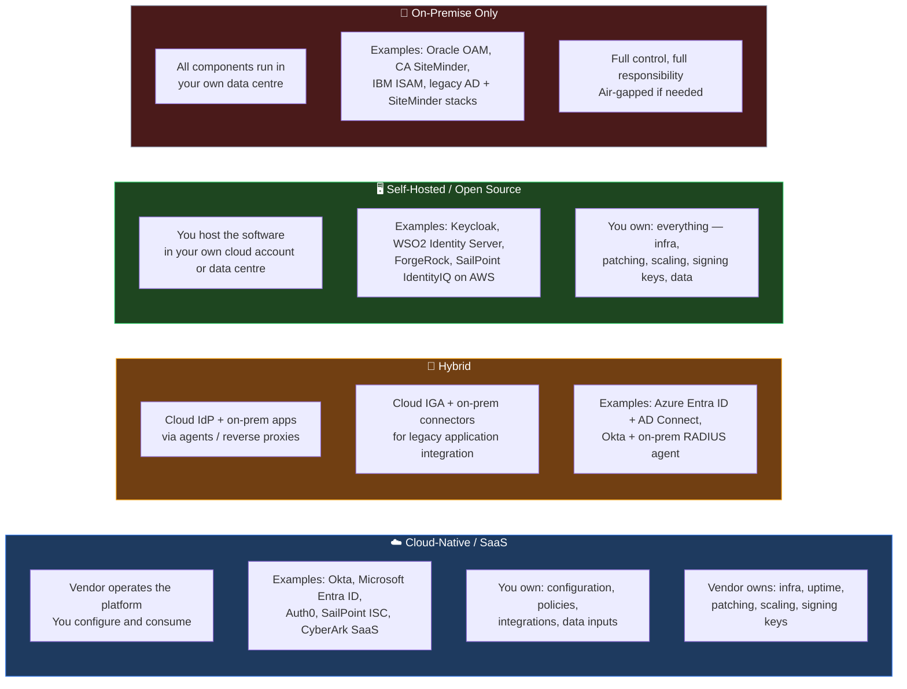
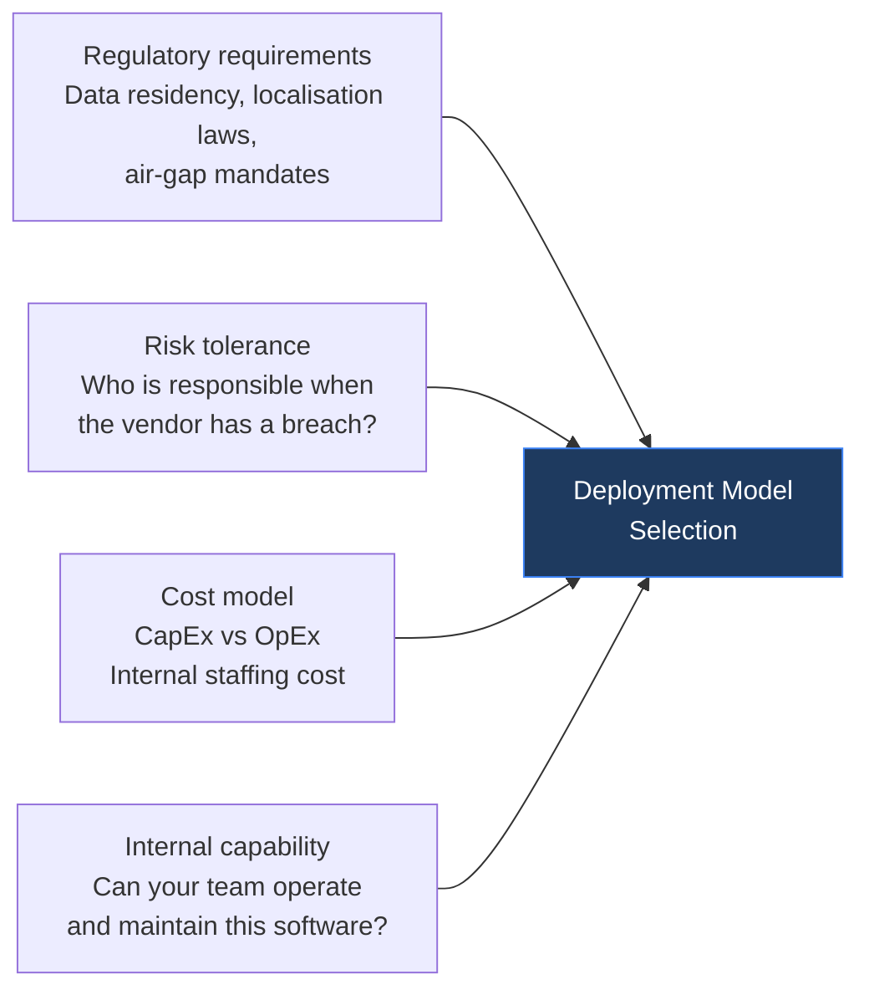
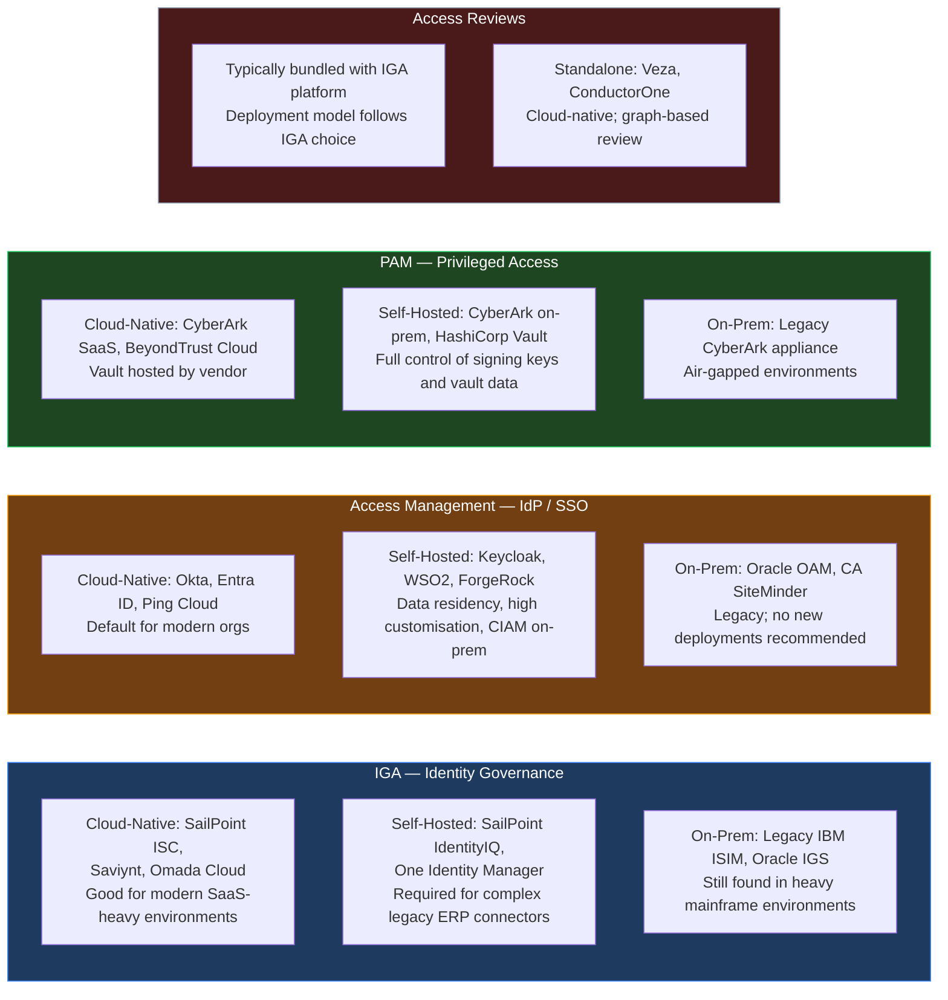
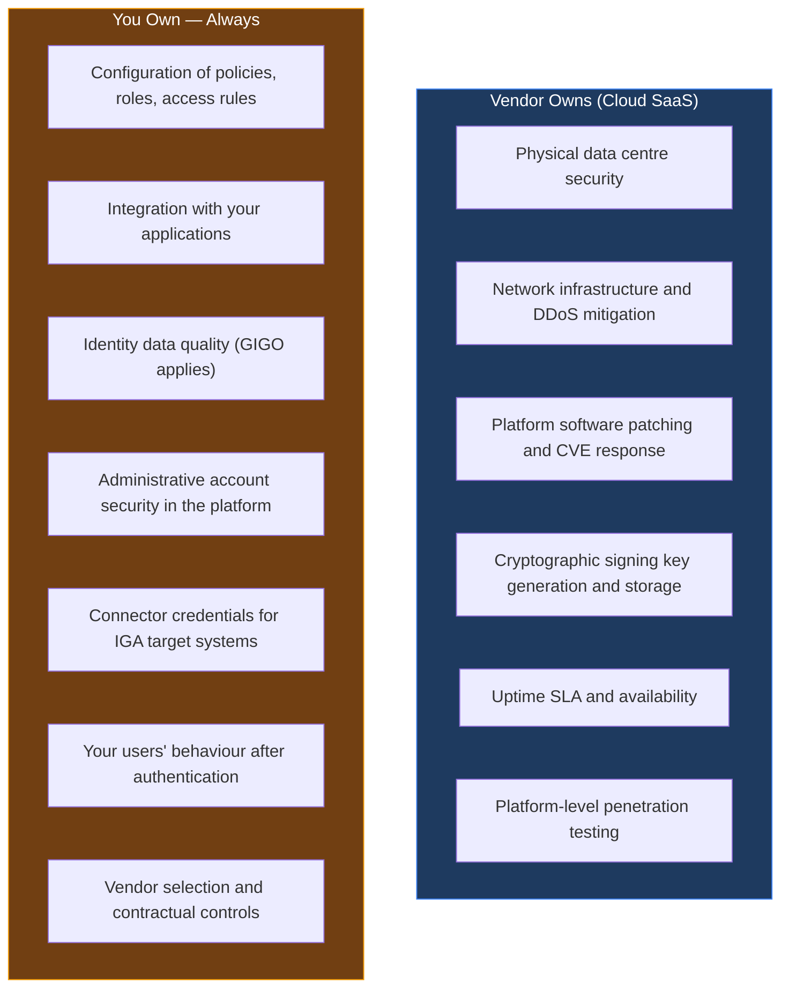

The previous posts in this series covered the four operational pillars of enterprise IAM: [IGA](){:target="_blank"}, [Access Reviews](){:target="_blank"}, and [PAM](){:target="_blank"}, plus the [authentication and protocol layer](){:target="_blank"}. All of those disciplines assume that software is deployed, running, and integrated with your systems. What they do not answer is: *where* does that software run, who is responsible for it, and what changes when it moves from one model to another?

That question — the deployment model question — is where most IAM program encounter their most consequential and longest-lived decisions.

---

## The Deployment Landscape — Four Models

IAM software can be deployed across four broad models, which can be combined in a hybrid configuration:

The majority of organisations today operate a **hybrid** model by necessity rather than by design: they adopted cloud IdPs (Okta, Entra ID) for modern workloads, while their legacy ERP systems, mainframes, and on-prem databases still depend on on-prem IAM components. The decision is rarely made cleanly from scratch.

---

## The Selection Framework — Who Should Choose What

There is no universally correct deployment model. The selection is driven by the intersection of four factors:

**Regulatory requirements** are the first filter and often non-negotiable. An organisation subject to data localisation rules (RBI in India, [DPDP Act 2023](https://meity.gov.in/writereaddata/files/Digital%20Personal%20Data%20Protection%20Act%202023.pdf){:target="_blank"}, [GDPR](https://gdpr.eu/){:target="_blank"} in Europe, [MAS Notice on Outsourcing](https://www.mas.gov.sg/regulation/guidelines/guidelines-on-outsourcing-banks){:target="_blank"} in Singapore), [SAMA](https://rulebook.sama.gov.sa/en/entiresection/3963){:target="_blank"} by Saudi Central Bank may be legally prohibited from sending identity data to a foreign-jurisdiction cloud. This may eliminates cloud-only models before any other consideration.

**Risk tolerance** determines whether the organisation is comfortable delegating infrastructure responsibility — including the security of its IAM signing keys — to a vendor. The implications of this decision are discussed in detail in the shared responsibility section below.

**Cost** determines feasibility. Cloud SaaS subscriptions are OpEx — predictable, scalable, no upfront hardware. On-premise deployments require CapEx for hardware, perpetual software licences, and ongoing engineering headcount to operate and maintain the platform. At small scale, cloud is almost always cheaper. At large enterprise scale with hundreds of thousands of identities, the calculus reverses.

**Internal capability** is the most commonly underestimated factor. Self-hosted or on-premise deployments require a team with deep expertise to maintain the platform, manage upgrades, respond to incidents, and tune performance. If that capability does not exist, the technical costs of on-prem are amplified significantly.

---

## Six Perspectives on Deployment Choice

| Perspective | Cloud-Native SaaS | Self-Hosted / Hybrid | On-Premise Only |
|-------------|------------------|----------------------|-----------------|
| **Regulatory** | Jurisdiction risk if data crosses borders; vendor must be audit-ready | Data can stay in-region; you control what leaves | Full data sovereignty; easiest for air-gap mandates |
| **Executive** | Lower capex; vendor absorbs operational risk; reputational risk if vendor is breached | Balanced — you control sensitive components; some vendor dependency | Full control + full accountability; highest internal investment |
| **Auditor** | Vendor SOC 2 Type II + penetration test reports; shared responsibility model must be documented | Audit covers both your config and your hosting environment | Full audit scope — every control is yours to evidence |
| **Implementor** | Fast time-to-value; limited deep customisation; connector library covers most SaaS apps | Flexible integration; complex to maintain; connector development needed for legacy apps | Maximum customisation; very slow initial delivery; high ongoing maintenance |
| **Administrator** | Vendor-managed upgrades; outages are the vendor's problem; limited control over release schedule | Mixed — cloud-managed core, self-managed components | Upgrade windows are your responsibility; patching is your risk |
| **Developer** | SDKs and documentation are vendor-provided; modern API-first design | Depends on product; open-source options have community support | Legacy products often have poor developer experience; custom integrations common |

---

## Cost as the Dominant Selection Driver

In practice, the deployment model is often determined by cost before all other factors are evaluated. This is not always wrong — cost is a legitimate constraint — but it produces poor outcomes when it is the *only* factor.

**Cloud SaaS cost structure:**

- Subscription fee per user per month (identity-count based)
- Additional cost per authentication, per API call (in some models)
- Implementation and integration professional services (one-time)
- Internal staff: primarily configuration and integration, not infrastructure operations

**On-premise / self-hosted cost structure:**

- Perpetual licence or annual software support fees
- Hardware procurement and data centre costs (or private cloud hosting costs)
- Internal engineering team: platform administration, patching, capacity management, upgrade coordination
- Disaster recovery infrastructure (secondary data centre or cloud DR)

**The hidden cost of on-prem that organisations frequently underestimate:**

| Cost Category | Cloud | On-Prem |
|--------------|-------|---------|
| Major version upgrades | Vendor handles; potentially disruptive to your config | Full project every 2–3 years; regression testing; downtime |
| Security patching | Vendor-managed, often same-day | Your team; testing + approval cycle; weeks to months |
| Scaling for peak load | Vendor scales; you may pay more | You provision; over-provision is waste, under-provision is an outage |
| 24×7 platform operations | Vendor | Your on-call team |
| Penetration testing evidence for audit | Vendor SOC 2 report | Your own pentest programme |

At mid-market scale (under 10,000 users), cloud SaaS is almost always the lower total cost option when internal staffing is included. At large enterprise scale (100,000+ users), the subscription cost alone can exceed the cost of a self-hosted deployment with dedicated staff — particularly for IGA platforms where per-user pricing compounds.

---

## Deployment Models Across All Four IAM Pillars

The four pillars of IAM (IGA, Access Management, PAM, and Access Reviews) have different maturity levels in cloud deployment and different tradeoffs by model.

**CIAM on-premise is a specific and important scenario.** Most organisations default to cloud CIAM (Auth0, Okta Customer Identity, AWS Cognito). However, some situations genuinely require on-premise or self-hosted CIAM deployment:

- **Regulated financial services in India:** RBI data localisation requirements mean customer identity data (PAN, Aadhaar-linked data) may need to remain in-country on infrastructure the firm controls.
- **High-customisation requirements:** A consumer banking platform with complex step-up authentication flows, non-standard MFA, or deep core banking integration may need customisation depth that cloud CIAM platforms do not permit.
- **Air-gapped or classified environments:** Government or defence organisations that cannot connect to the public internet require fully on-prem or sovereign cloud deployment.

**Tools for on-prem CIAM:** [Keycloak](https://www.keycloak.org/){:target="_blank"} (open source, widely used), [WSO2 Identity Server](https://wso2.com/identity-server/){:target="_blank"} (enterprise open source), and [Ping Identity](https://www.pingidentity.com/){:target="_blank"} (on-prem / self-hosted). These provide the OIDC, SAML, and OAuth 2.0 capabilities of cloud platforms but require internal teams to operate them.

---

## Server-Based vs Container-Based Infrastructure

For self-hosted or hybrid deployments, the infrastructure choice between traditional servers and containerised deployments has significant operational implications.

| Factor | Server-Based (VMs) | Container-Based (Kubernetes) |
|--------|------------------|------------------------------|
| **Scaling** | Manual vertical or horizontal; slow to provision | Horizontal pod autoscaling; minutes to scale |
| **Upgrade complexity** | Rolling upgrades require coordination; downtime possible | Blue/green or canary deployments; zero-downtime upgrades possible |
| **IAM product support** | Universally supported by all IAM vendors | Not all IAM products have production-grade Helm charts; check vendor support |
| **Operations skill requirement** | Standard Linux/Windows administration | Kubernetes administration; more specialised skill set |
| **Security surface** | Larger OS footprint; more patching surface | Smaller container image; but Kubernetes itself adds a security layer to manage |
| **Disaster recovery** | Snapshot-based; recovery time measured in hours | GitOps-driven; recovery time measured in minutes |

**PAM vaults on containers require special consideration.** A Kubernetes-hosted vault must account for persistent storage (the vault database must survive pod restarts), HSM connectivity (HSM integrations are typically hardware-dependent), and secrets at rest in etcd (Kubernetes secrets must be encrypted). [HashiCorp Vault](https://developer.hashicorp.com/vault/docs/platform/k8s){:target="_blank"} has a mature Kubernetes operator and is well-suited to containerised deployment. Legacy PAM platforms designed for appliance-based or VM-based deployment may not be.

---

## Load Testing and Capacity Planning — The Decision Inputs Most Organisations Skip

Authentication systems must perform at the moment of highest demand — not during average load. An IAM platform that works perfectly under normal traffic and fails during a Monday morning login surge, a product launch, or an emergency remote-work event is worse than useless: it becomes the failure point for every other system.

**What must be load tested before committing to a deployment model:**

- **Peak authentication throughput:** What is the maximum concurrent login rate expected? (e.g., 5,000 employees logging in over a 15-minute window at 9:00 AM)
- **Token issuance and validation rate:** For M2M and service-to-service scenarios, how many OAuth tokens per second must the platform issue?
- **IGA sync duration under load:** How long does a full identity sync take when run concurrently with peak provisioning requests?
- **Access review portal performance:** Can the review portal serve 500 simultaneous reviewers during a campaign without timeouts?

Cloud SaaS platforms absorb peak load automatically — the vendor scales. This is one of the strongest arguments for cloud deployment in consumer-facing CIAM scenarios, where traffic spikes can be 10–100× baseline on a product launch or a market event.

For self-hosted deployments, load testing results must directly inform infrastructure sizing — and the sizing must account for growth over the next 3–5 years, not just the current user count. Undersized on-prem IAM infrastructure is among the most common causes of availability incidents that affect the entire organisation.

---

## The Shared Responsibility Model — What the Vendor Owns and What You Own

Cloud deployment does not mean outsourcing responsibility for security. It means redistributing it. The shared responsibility model defines precisely who is accountable for what.

The critical implication: the vendor owns the **signing keys** for your IAM platform. If those keys are compromised, every token your platform has ever issued — and every token it issues until the keys are rotated — is forgeable. This is not a theoretical risk.

---

## When the Vendor Has a Breach — Your Reputation Is the Collateral

Cloud IAM is only as secure as the weakest point in the vendor's infrastructure. Two publicly documented incidents demonstrate the stakes:

**Okta, October 2023 — Support System Compromise**.
A threat actor used [stolen credentials to access Okta's customer support case management system](https://sec.okta.com/articles/2023/10/tracking-unauthorized-access-oktas-support-system/){:target="_blank"}. The attacker ran a report that extracted data for all Okta customer support system users; [Root Cause](https://sec.okta.com/articles/2023/11/unauthorized-access-oktas-support-case-management-system-root-cause/){:target="_blank"}. Customers including [1Password](https://blog.1password.com/okta-incident/){:target="_blank"}, [Cloudflare](https://blog.cloudflare.com/how-cloudflare-mitigated-yet-another-okta-compromise/){:target="_blank"}, and [BeyondTrust](https://www.beyondtrust.com/blog/entry/okta-support-unit-breach){:target="_blank"} disclosed that their environments were affected. Okta's initial disclosure was incomplete — Cloudflare and others detected the breach before Okta confirmed its full scope.

The reputational consequence: customers who had deployed Okta as their IdP — trusting Okta with the authentication of their own employees and customers — had to communicate a breach to *their* stakeholders that originated from *their vendor's* systems.

**Microsoft, July 2023 — Storm-0558 Forged Authentication Tokens**
[Microsoft disclosed](https://www.microsoft.com/en-us/security/blog/2023/07/14/analysis-of-storm-0558-techniques-for-unauthorized-email-access/){:target="_blank"} that a Chinese state-sponsored threat actor (Storm-0558) had forged authentication tokens using a stolen Microsoft Account (MSA) consumer signing key. The key had been inadvertently included in a crash dump during a 2021 incident. The forged tokens gave the attacker access to US government email accounts hosted on Outlook.com and Exchange Online. The signing key — which is the root of trust for an entire class of Microsoft authentication — had been in the attacker's possession for two years before the breach was discovered.

The implication for cloud IAM: when you use a cloud IAM platform, you are trusting that vendor's key management with the validity of every authentication token in your environment.

---

## What On-Premise Often Lacks — Honest Security Gaps

On-premise IAM is not automatically more secure. It removes vendor supply-chain risk but introduces a different set of risks:

| Security Control | Cloud Vendor (Typical) | On-Premise (Typical) |
|-----------------|----------------------|----------------------|
| Automated CVE patching | Same-day / next-day | Weeks to months (testing + approval cycle) |
| DDoS mitigation | Vendor-provided, enterprise-grade | Depends on your network controls |
| HSM-backed key storage | Standard for major vendors | Requires separate HSM procurement and integration |
| 24×7 security monitoring of the IAM platform | Vendor SOC | Your team |
| Penetration testing cadence | Vendor program + your right to test | Your responsibility |
| Cryptographic agility (key rotation) | Vendor-managed | Manual; often deferred |
| Compliance certifications (SOC 2, ISO 27001) | Vendor-certified | You must certify your own deployment |

This does not mean cloud is always more secure — the Okta and Microsoft incidents demonstrate genuine cloud risks. It means the *type* of security risk differs. **Cloud outsources infrastructure security to the vendor and takes on vendor-dependency and supply-chain risk. On-premise retains infrastructure responsibility and takes on operational security risk.** Neither is zero-risk.

---

## When On-Premise Is Genuinely the Right Choice

Despite the cost and operational challenges, on-premise deployment is the correct choice in specific, well-defined scenarios:

1. **Data localisation mandates that prohibit foreign cloud processing.** GDPR (EU), RBI (India), PDPA (Thailand), SAMA (ME), MAS (Singapore) and certain SEBI/IRDAI requirements may prohibit sending identity data to cloud infrastructure outside the country.

2. **Air-gapped or classified environments.** Defence, intelligence, and critical national infrastructure environments that cannot connect to the public internet have no viable cloud option.

3. **Deep customisation requirements that no cloud platform supports.** A CIAM implementation that requires integration with a proprietary identity resolution engine, a national ID verification system, or a core banking system via an on-prem API may need on-prem deployment to achieve the necessary integration depth.

4. **Legacy application estate where cloud connectors do not exist.** An enterprise with a significant mainframe or AS/400 application estate may find that cloud IGA cannot connect to these systems — requiring a self-hosted IGA deployment with custom connectors.

5. **Cost economics at very large scale.** For an organisation with 500,000+ identities and stable growth, the per-user cloud subscription cost may exceed the total cost of a self-hosted deployment with a dedicated platform team.

---

## Management Complexity — Day-2 Operations

Choosing a deployment model is a one-day decision. Operating it is a multi-year commitment.

The most commonly underestimated day-2 operational challenge is the **major version upgrade**. Cloud vendors upgrade automatically — sometimes forcing breaking changes on a release schedule outside your control. On-premise deployments require a coordinated upgrade project every 2–3 years: infrastructure refresh, regression testing across all integrated applications, rollback planning, and downtime scheduling.

**Hybrid deployments compound management complexity** — you must manage the cloud component (configuration, integration, policies) and the on-premise component (infrastructure, patching, connector maintenance) simultaneously. When an incident occurs, the diagnostic path spans both environments: is the issue in the cloud platform, the on-prem agent, the network between them, or your application?

---

## Key Takeaways

- **The deployment model decision is a business decision, not a technology decision.** Regulatory requirements, risk tolerance, cost, and internal capability must all be evaluated before infrastructure choices are made.

- **Hybrid is the most common enterprise reality**, not because it was chosen deliberately, but because cloud adoption and legacy systems co-exist. A defined hybrid architecture is better than an unplanned one.

- **Cloud SaaS lowers CapEx and operational burden but transfers infrastructure security risk to the vendor.** You own the configuration, policies, and administrative account security — always, regardless of deployment model.

- **CIAM on-premise is a legitimate requirement** in regulated industries with data localisation mandates, for deep customisation needs, or for air-gapped environments. Keycloak, WSO2, and ForgeRock/Ping are the production options.

- **Cost economics reverse at scale.** Cloud SaaS wins for small and mid-market organisations; self-hosted may win at very large enterprise scale when per-user subscription costs are included.

- **Load testing before deployment model commitment is not optional.** Peak authentication throughput, IGA sync duration, and access review portal concurrency must be tested against the chosen platform before go-live.

- **The shared responsibility model has a critical implication for cloud IAM:** the vendor holds your signing keys. A vendor signing key compromise (as in the Microsoft Storm-0558 incident) means forged tokens are indistinguishable from legitimate ones until the key is rotated.

- **Vendor breaches affect your users and your reputation.** Okta's 2023 support system compromise meant that customers — including Cloudflare and 1Password — had to communicate a vendor-originated breach to their own stakeholders.

- **On-premise deployments are not automatically more secure.** They eliminate vendor supply-chain risk but require internal teams to own CVE patching, key management, DDoS mitigation, and 24×7 platform monitoring. If that capability does not exist, on-prem creates more risk than it eliminates.

---

*Part of the IAM from First Principles series.*