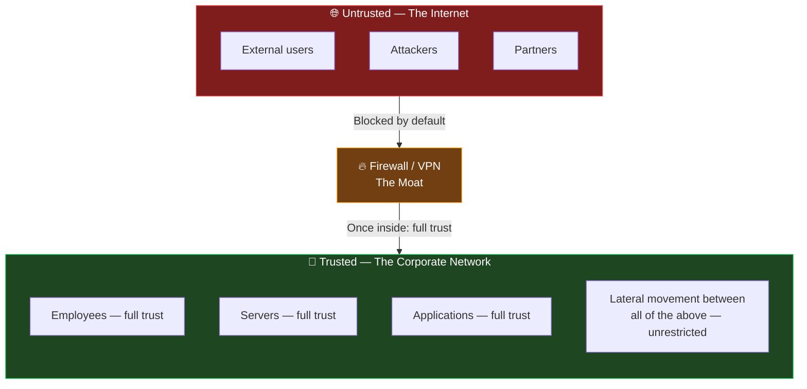
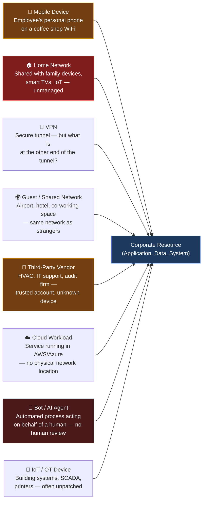
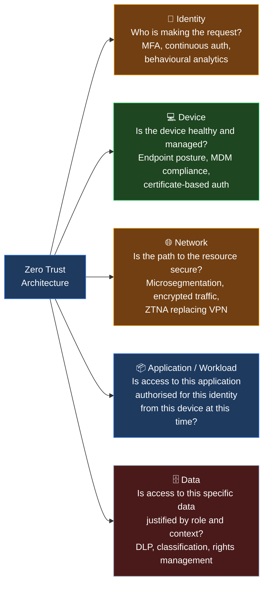
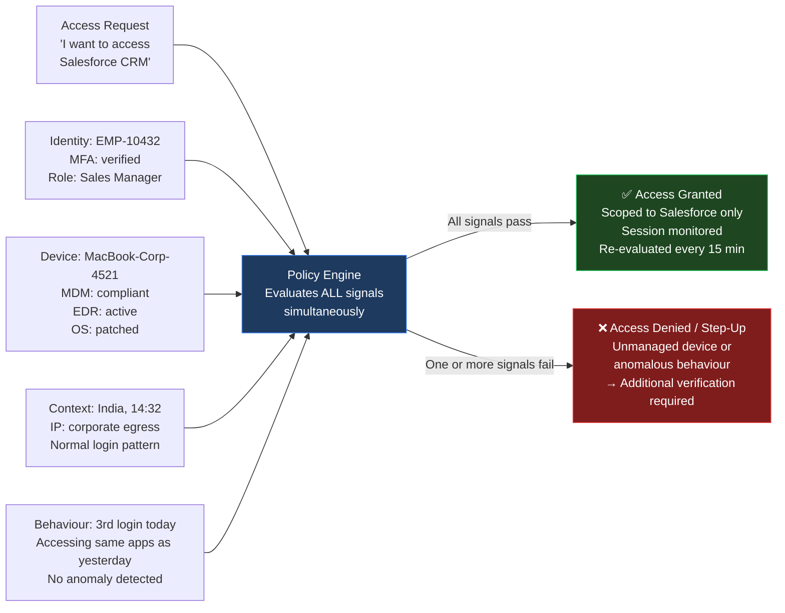
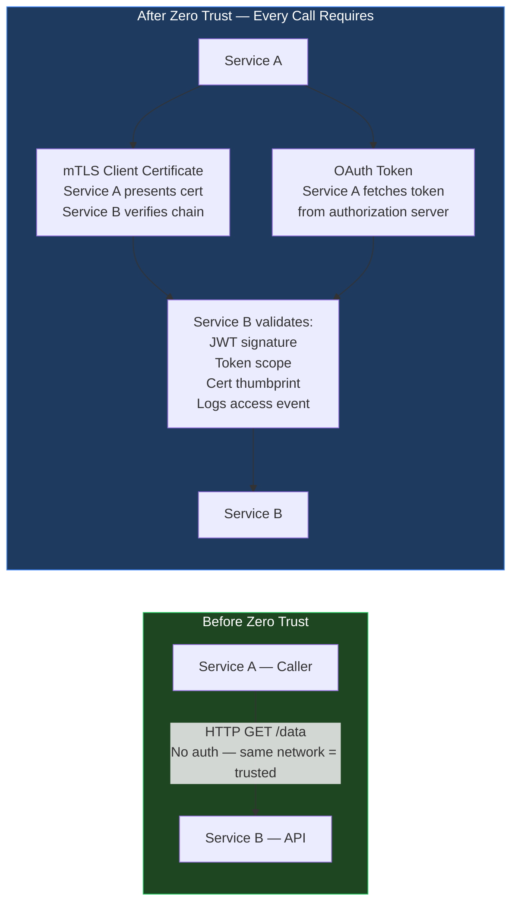
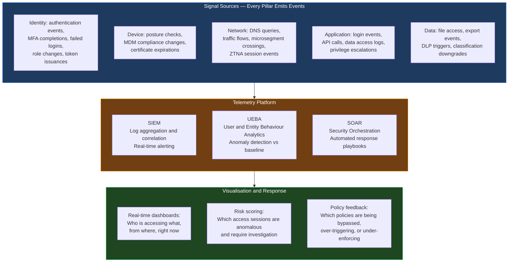
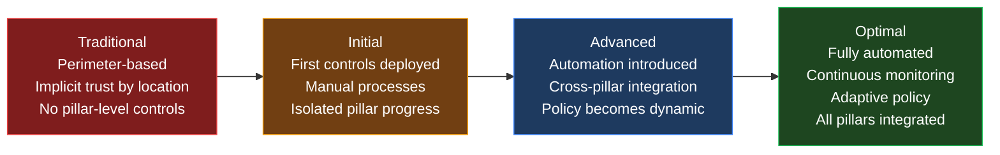

The [previous post](){:target="_blank"} established where IAM infrastructure runs — cloud, on-premise, or hybrid. But deployment location answers only half the question. The other half is: once a user, device, or workload reaches that infrastructure, what do you trust?

For thirty years, the answer was: *trust anything inside the network perimeter*. Firewalls, VPNs, and network segmentation defined a boundary. Inside was trusted. Outside was not. This model had a name — the castle-and-moat architecture — and it worked reasonably well when employees sat at fixed desks on corporate hardware connected to a corporate network.

That world no longer exists.

---

## The Castle-and-Moat Model — and Why It Failed

The traditional perimeter model is simple in concept:

The fatal flaw is in the last line: *once inside — full trust*. Any entity that crosses the perimeter — whether a legitimate employee or a threat actor using a compromised credential — receives the same level of trust. There is no further verification. There is no restriction on lateral movement between systems. One breached account can become a breach of everything the network contains.

This was an acceptable tradeoff when the perimeter was relatively small and the number of ways to cross it was limited. Neither condition is true today.

---

## The Attack Surface Explosion — How the Perimeter Dissolved

The perimeter did not fail because security teams made poor decisions. It failed because the environment it was designed to protect changed faster than any perimeter could adapt.

Every arrow in that diagram is a path to a corporate resource that bypasses or complicates the traditional perimeter. There is no longer a meaningful boundary that separates "inside" from "outside." The resource is in the cloud. The employee is at home. The device is unmanaged. The agent is a software process with no human supervising it. The vendor is on your network with credentials that were provisioned three years ago and never reviewed.

The numbers amplify the problem. According to [CyberArk's 2023 Identity Security Threat Landscape Report](https://www.cyberark.com/resources/ebooks/cyberark-2023-identity-security-threat-landscape-report){:target="_blank"}, machine and non-human identities now significantly outnumber human identities in most enterprise environments — each with their own access path, credential, and trust assumption. The [2024 Verizon DBIR](https://www.verizon.com/business/resources/reports/dbir/){:target="_blank"} consistently shows that compromised credentials combined with trusted-network assumptions are the dominant enabler of breach propagation.

---

## What Lateral Movement Looks Like in Practice — Three Breaches

The consequence of the castle-and-moat model is not just a theoretical risk. It is the documented mechanism behind three of the most significant security incidents of the last decade.

**SolarWinds, 2020 — Inside the Moat for Nine Months**
[CISA's advisory](https://www.cisa.gov/news-events/cybersecurity-advisories/aa20-352a){:target="_blank"} on the SolarWinds supply chain compromise documents how attackers (APT29/Cozy Bear) entered via a tampered software update. Once inside the networks of affected organisations — including US federal agencies — they moved laterally for months. The network treated the attacker's tools as trusted internal traffic. No re-verification was required to access high-value systems. A Zero Trust model, requiring explicit authorisation for each resource access, would not have prevented the initial entry but would have severely constrained the lateral movement.

**Colonial Pipeline, 2021 — One VPN Password, No MFA**
[CISA's advisory](https://www.cisa.gov/news-events/cybersecurity-advisories/aa21-131a){:target="_blank"} confirms that attackers used a single compromised VPN password — with no multi-factor authentication on the account — to gain access. The VPN credential was sufficient. The network granted full internal access. A Zero Trust model with mandatory MFA and device health verification on VPN authentication would have blocked the initial entry.

**Target, 2013 — Trusted Vendor, Unguarded Lateral Path**
Attackers entered Target's network via credentials belonging to a third-party HVAC vendor. Target's network did not segment the vendor's access from the payment systems — a trust assumption embedded in the network architecture. The HVAC vendor was trusted; therefore, anything reachable from the HVAC vendor's session was also trusted. Microsegmentation — a core Zero Trust control — would have isolated the vendor's access to only HVAC-related systems.

The pattern across all three: an entity gained a foothold via a trusted path, and the network offered no further resistance to lateral movement. Zero Trust addresses this by eliminating the concept of "trusted by location."

---

## What Zero Trust Actually Means — The NIST Foundation

[NIST Special Publication 800-207](https://doi.org/10.6028/NIST.SP.800-207){:target="_blank"} is the authoritative definition of Zero Trust Architecture. It defines Zero Trust through seven tenets:

1. **All data sources and computing services are considered resources** — there is no distinction between on-prem and cloud, corporate and personal device.
2. **All communication is secured regardless of network location** — encryption and authentication apply to traffic inside the network, not just crossing the perimeter.
3. **Access to individual enterprise resources is granted on a per-session basis** — previous authentication to one resource does not grant trust for another.
4. **Access to resources is determined by dynamic policy** — the decision considers identity, device health, behaviour, time, and context — not just username and password.
5. **The enterprise monitors and measures the integrity and security posture of all owned and associated assets** — continuous monitoring, not one-time verification.
6. **All resource authentication and authorisation are dynamic and strictly enforced before access is allowed** — access is evaluated at request time, every time.
7. **The enterprise collects as much information as possible about the current state of assets** and uses it to improve its security posture — telemetry drives the policy engine.

The practical summary of these seven tenets is three words: **never trust, always verify.**

---

## The Five Pillars — What Zero Trust Covers

The [CISA Zero Trust Maturity Model](https://www.cisa.gov/zero-trust-maturity-model){:target="_blank"} organises Zero Trust across five pillars, each of which requires dedicated controls:

Each pillar has its own technology stack, its own governance discipline, and its own maturity level. Zero Trust is not achieved by advancing one pillar to full maturity while leaving others at zero — the model only holds when all five pillars work together. An organisation with perfect Identity controls but no microsegmentation still allows an attacker who compromises one workload to move freely across the network layer.

---

## Identity Is the New Perimeter — Where IAM Connects

When the network perimeter is dissolved, something must replace it as the enforcement point for every access decision. That something is identity.

In a Zero Trust model, every access request — regardless of where it originates — must be evaluated against a policy that considers:

- **Who is asking:** authenticated identity, MFA status, role, group membership
- **What device they are using:** managed vs unmanaged, patch status, EDR presence, certificate validity
- **Where they are asking from:** IP reputation, geolocation, time of day, network type
- **What they are asking for:** specific application, specific data, specific entitlement
- **Whether their behaviour is consistent:** anomaly detection against their historical pattern

This evaluation is performed at every access attempt — not once at login and then forgotten. This is why [Continuous Authentication](https://www.citrix.com/glossary/what-is-continuous-authentication.html){:target="_blank"} is a fundamental Zero Trust control, not an optional enhancement.

This is why every IAM capability described in this series — strong authentication, IGA role management, PAM credential control, access reviews — feeds directly into Zero Trust enforcement. Zero Trust is not a separate discipline. It is the policy layer that orchestrates all of them.

---

## Who Should Own Zero Trust — And What Does Enforcement Actually Cost?

Establishing that identity is the new perimeter raises an immediate practical question: does that make Zero Trust an IAM problem? The answer determines who drives the programme, who funds the integration work, and who gets blamed when it stalls.

**Is it an IAM problem?** The identity pillar is the most foundational — if identity is wrong, every other pillar's enforcement is wrong. IAM teams have the most complete view of who is accessing what. But IAM teams do not own the network, the endpoint estate, or the applications.

**Is it an infrastructure problem?** Microsegmentation and ZTNA are infrastructure changes. But infrastructure teams cannot enforce identity-aware access policies without IAM input. They also cannot dictate how applications authenticate.

**Is it an architecture problem?** Every system integration must be redesigned around the assumption of no implicit trust — which is an architectural mandate. But architecture teams do not operate the systems.

The answer is all three, with one accountable driver. A Zero Trust programme without a named owner — typically an Enterprise Security Architect or a CISO-sponsored initiative — devolves into each team advancing their own pillar in isolation, producing the partial coverage described earlier. IAM is the most natural initiating discipline because identity is the enforcement point for everything else. But the IAM team cannot succeed without executive mandate, cross-team commitment, and budget for the integration work.

### The Real Engineering Cost — Every Integration Must Be Rethought

The most tangible impact of Zero Trust is not on the security architecture. It is on the engineering teams who build and operate services.

Consider a service-to-service call that previously required no authentication:

Every box in the "After" diagram is a new engineering task with its own owner:

| What Is Needed | Who Provisions It | Who Maintains It | Who Gets Paged If It Fails |
|----------------|------------------|-----------------|---------------------------|
| mTLS client certificate for Service A | PKI / Platform team | Certificate rotation — automated or Platform team | Service A on-call (their service fails to connect) |
| OAuth Authorization Server | IAM team | IAM team | IAM team + service owner |
| Token issuance in Service A | Service A dev team | Service A dev team | Service A on-call |
| Token validation in Service B | Service B dev team | Service B dev team | Service B on-call |
| Scope definition | IAM + application architect | Application architect | Service owner |
| Per-request access logging | Service B dev team | Platform / SRE team | Security Operations |
| North-South Edge Firewall Rules (Ingress/Egress control) | Network Security / Infrastructure Team| Network Security Team| Network Security On-Call|
| East-West Microsegmentation (Lateral traffic restrictions between services)| Platform / Cloud Infrastructure Team| Platform Team (via Infrastructure as Code) | Platform Team + Affected Service On-Calls

A single M2M call that previously needed zero configuration now requires coordination between PKI, IAM, two development teams, architecture, Network security, and platform engineering — each on separate sprint cycles with separate change management processes.

### Reducing the Integration Burden — The Platform Team's Role

Zero Trust does not reduce complexity. It redistributes trust decisions from implicit (network location) to explicit (verified at each step). That redistribution creates real engineering work. Three principles prevent it from becoming unmanageable:

**1. Platform-level enablement is mandatory.** The IAM and platform teams must provide mTLS provisioning, token issuance, and validation middleware as shared infrastructure. If every team builds their own OAuth client, you get 200 different implementations with 200 different failure modes. The platform team's job is to make the secure path the easy path — pre-built libraries, Helm charts with sidecar auth agents, standard certificate templates.

**2. Ownership boundaries must be written down.** IAM team owns the authorization server and token policy. PKI/platform team owns certificate issuance and rotation. Development teams own integrating the provided libraries into their services. Security Operations owns monitoring. These must be explicit, not assumed.

**3. New systems must be Zero Trust by default.** Legacy systems require expensive retrofits. New systems should start with Zero Trust authentication as the standard — not a retrofit request six months after go-live. This only happens if the platform team has made Zero Trust-compliant infrastructure easier to adopt than the insecure alternative.

The honest acknowledgement: Zero Trust increases operational complexity in the short and medium term, in exchange for reduced breach risk in the long term. That tradeoff must be made consciously, with executive commitment and adequate resourcing — not as a security mandate that development teams are expected to absorb within existing sprint capacity.

---

## Zero Trust Is Not a Product — It Is an Architectural Commitment

The most persistent misconception about Zero Trust is that it is something you can purchase. Vendors sell "Zero Trust" solutions in every category — network, endpoint, identity, application. None of them, individually, implement Zero Trust. They implement *one pillar*, for *one layer*, of what needs to be a comprehensive architectural approach.

Declaring Zero Trust without the underlying machinery is like installing a lock on a door and calling the building secure:

| What organisations often do | What Zero Trust actually requires |
|-----------------------------|----------------------------------|
| Deploy ZTNA (replace VPN) | Network pillar: one of five |
| Enforce MFA | Identity pillar: one control of many |
| Add device management | Device pillar: one of five |
| Buy a "Zero Trust" branded product | No pillar is automatically complete |
| Announce "we are Zero Trust" | All five pillars at consistent maturity across the entire organisation |

The [CISA Zero Trust Maturity Model](https://www.cisa.gov/zero-trust-maturity-model){:target="_blank"} defines maturity levels (Traditional → Initial → Advanced → Optimal) for each pillar independently. An organisation is at whatever level its *least mature* pillar occupies across the whole estate — not its most mature.

Zero Trust also requires rethinking processes that have nothing to do with technology:

- **Application integration patterns:** Applications that pass session cookies between services (implicit trust between services) must be redesigned with service-to-service authentication.
- **Approval and workflow design:** Systems that allow a user to access system B because they already have access to system A (contextual trust carryover) must be re-evaluated.
- **Vendor and third-party access:** Partners who connect via site-to-site VPN with implicit trust for the full corporate network must be migrated to application-specific, just-in-time access.
- **Developer and CI/CD pipelines:** Build systems that access production secrets or repositories as trusted internal services must be governed as machine identities with explicit access grants.

Every process in the organisation that implicitly relies on "we trust this because it came from inside our network" is a Zero Trust gap.

---

## Monitoring, Telemetry, and Visualisation — The Mandatory Infrastructure

This is the most commonly underestimated requirement of Zero Trust, and the most consequential gap when it is absent.

Zero Trust enforcement generates decisions at scale: thousands of access requests per minute, each evaluated against a multi-signal policy. Without comprehensive telemetry, those decisions are invisible. You cannot detect anomalies you cannot see. You cannot investigate incidents you have not logged. You cannot improve policies based on behaviour you are not measuring.

**Without telemetry, Zero Trust is enforcement without awareness.** You can block access you should block. But you cannot detect access you *should* block but are *allowing* due to policy gaps. You cannot see that a service account is accessing data it has never accessed before. You cannot correlate an unusual login from a mobile device with an API call from an unregistered IP two minutes later.

**Visualisation is not optional complexity.** The orchestration of five pillars, across hundreds of applications, thousands of users, and millions of machine identities, is genuinely difficult to manage. A Zero Trust programme without a visualisation layer — dashboards that show policy enforcement state, access anomalies, and pillar maturity — is operating blind. When something goes wrong, the investigation depends on having recorded what went right first.

The tooling stack required to operationalise monitoring:
- **SIEM** ([Microsoft Sentinel](https://azure.microsoft.com/en-in/products/microsoft-sentinel){:target="_blank"}, [Splunk](https://www.splunk.com/){:target="_blank"}, [IBM QRadar](https://www.ibm.com/products/qradar-siem){:target="_blank"}): log aggregation, correlation rules, alerting
- **UEBA** (User and Entity Behaviour Analytics): baseline normal behaviour, detect deviations automatically
- **SOAR** (Security Orchestration, Automation and Response): automated response to detected anomalies — isolate a session, revoke a token, page the SOC
- **Identity Analytics** ([SailPoint](https://www.sailpoint.com/products/identity-security-cloud/){:target="_blank"}, [Veza](https://www.veza.com/){:target="_blank"}): graph-based visibility into who has access to what, across all pillars

Each tool is necessary. None is sufficient alone. The integration between them — the telemetry pipeline that feeds identity events into the SIEM, behaviour signals into the policy engine, and policy decisions into the SOAR — is as important as the tools themselves.

---

## Zero Trust Is an Organisational Commitment, Not a Department Project

Zero Trust cannot be implemented by the network team, or the identity team, or the security team in isolation. Each pillar is owned by a different team, and the failure mode of a partial implementation is a false sense of security: the organisation believes it has Zero Trust coverage that does not actually exist.

The organisational commitment required:

| Team | Zero Trust Responsibility |
|------|--------------------------|
| **Identity / IAM** | Strong authentication, MFA, IGA role management, PAM, continuous auth |
| **Network** | Microsegmentation, ZTNA, encrypted east-west traffic, network telemetry |
| **Endpoint / Device** | MDM, endpoint posture enforcement, certificate management |
| **Application** | Service-to-service auth, API authentication, session management redesign |
| **Data** | Classification, DLP, rights management, access logging |
| **Security Operations** | SIEM/SOAR integration, monitoring, incident response |
| **Governance / Risk** | Policy definition, exception management, maturity measurement |

Leadership sponsorship is not optional. The network team cannot deprovision implicit trust on behalf of the application team. The identity team cannot enforce device posture without the endpoint team. Every pillar requires its owner to make changes that affect other teams and other workflows — which only happens under executive mandate.

---

## The Implementation Journey — Zero Trust Is a Maturity Model

Zero Trust is not a switch. No organisation implements it in a single project. The [CISA Zero Trust Maturity Model](https://www.cisa.gov/zero-trust-maturity-model){:target="_blank"} explicitly defines four maturity stages for each pillar:

A practical implementation sequence:
1. **Start with identity.** Enforce MFA universally. Eliminate shared accounts. Implement PAM for privileged access. This gives the highest risk reduction for the investment.
2. **Add device posture.** Require managed, compliant devices for sensitive application access. Block unmanaged devices from high-risk resources.
3. **Implement ZTNA.** Replace or supplement VPN with application-specific, identity-aware network access. Eliminate broad network trust for remote access.
4. **Apply microsegmentation.** Segment the internal network so that a compromise in one zone cannot freely reach other zones. Start with the highest-value targets (payment systems, production databases, PAM vault).
5. **Add data controls.** Classify data. Enforce access based on classification. Log and alert on sensitive data access.
6. **Connect the telemetry.** Integrate all five pillars into a SIEM/UEBA/SOAR stack. Build dashboards. Define alerting. Test the response playbooks.

Most large enterprises are at the **Initial** stage across most pillars. Reaching **Advanced** is a multi-year journey. Reaching **Optimal** across all five pillars simultaneously is the long-term target, not the starting ambition.

---

## Key Takeaways

- **The perimeter is gone.** Mobile devices, home networks, cloud services, third-party vendors, IoT, and AI agents have dissolved the boundary that castle-and-moat security was designed to protect. The model is structurally obsolete.

- **Lateral movement is the documented consequence.** SolarWinds, Colonial Pipeline, and Target all demonstrate the same failure: an attacker crossed the perimeter once and moved freely afterwards. Zero Trust addresses lateral movement by requiring explicit authorisation for every resource, every time.

- **Zero Trust means never trust, always verify — for every identity, every device, every request, every session.** The NIST SP 800-207 definition makes clear: this is not about distrust. It is about continuous verification based on all available signals.

- **Zero Trust has five pillars.** Identity, Device, Network, Application/Workload, and Data. All five must progress together. A programme strong in identity but weak in network segmentation still has a lateral movement problem.

- **Identity is the new perimeter.** When the network no longer defines trust, identity becomes the policy enforcement point for every access decision. Every IAM capability in this series — IGA, authentication, PAM, access reviews — feeds the Zero Trust policy engine.

- **Zero Trust is not a product.** No single tool makes you Zero Trust. It is an architectural commitment that spans five pillars, multiple technology stacks, and every team in the organisation.

- **Telemetry and visualisation are not optional.** Zero Trust enforcement without comprehensive monitoring is enforcement without awareness. SIEM, UEBA, SOAR, and identity analytics must be integrated across all five pillars to detect what policy is missing, what anomalies are occurring, and where the next gap will appear.

- **Implementation is a multi-year journey.** Start with identity and MFA. Add device posture. Implement ZTNA. Apply microsegmentation. Add data controls. Connect the telemetry. Measure maturity per pillar using the CISA model. Do not declare victory before all five pillars are at Advanced maturity or above.

---

*Part of the IAM from First Principles series.*

