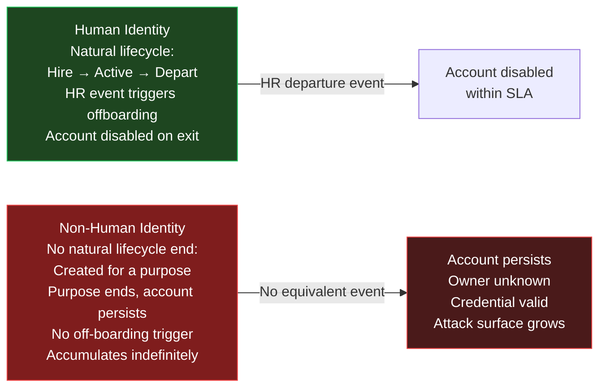
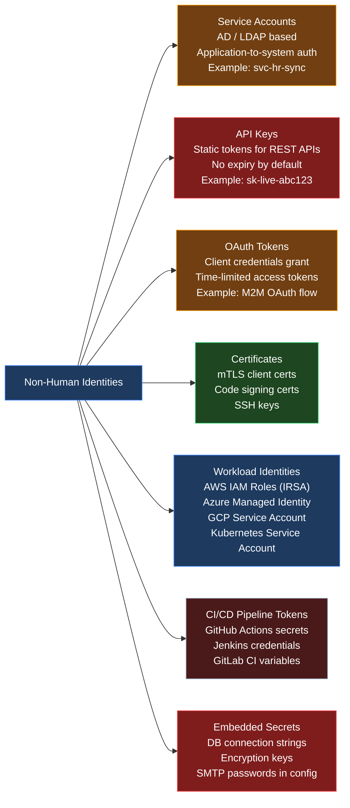
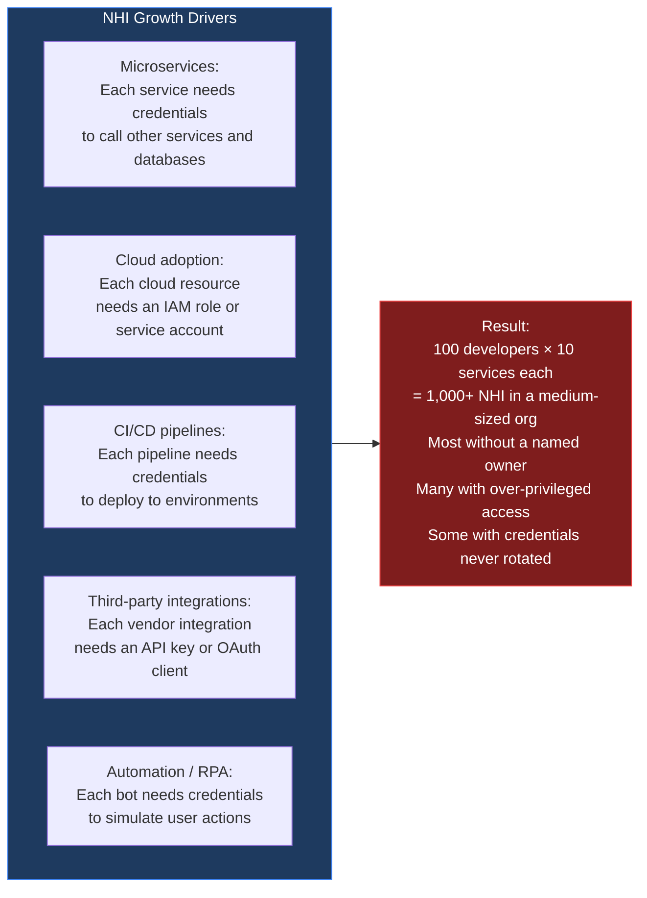
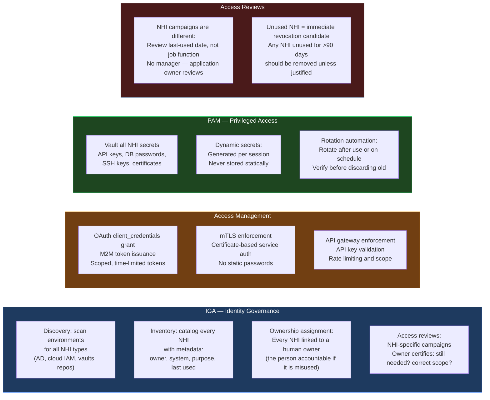
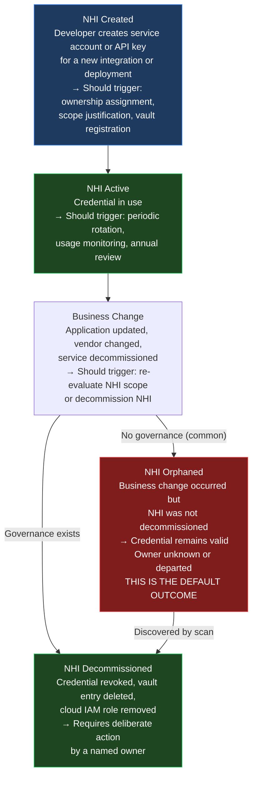
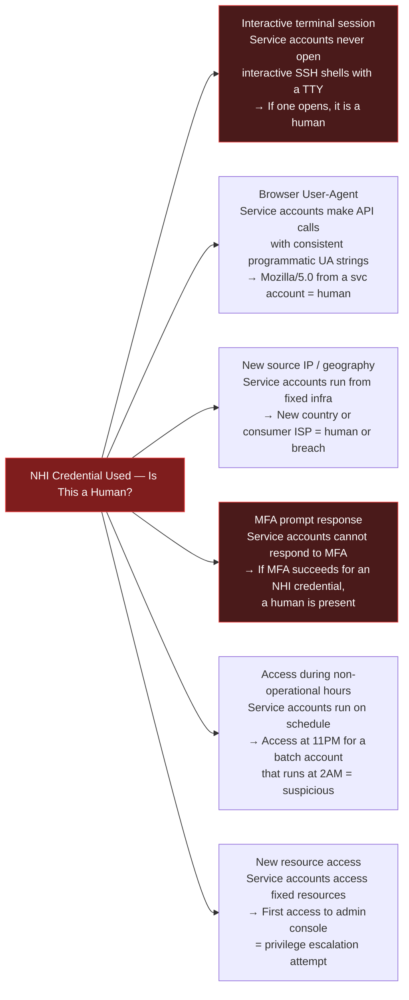

The [previous post on Zero Trust](){:target="_blank"} established that machine and non-human identities now significantly outnumber human identities in most enterprise environments — each with their own access path, credential, and trust assumption. According to [CyberArk's Identity Security Threat Landscape Report](https://www.cyberark.com/resources/ebooks/cyberark-2023-identity-security-threat-landscape-report){:target="_blank"}, organisations see non-human identities outnumbering humans by a wide margin, with the ratio growing every year as microservices, automation, and cloud workloads multiply.

The [earlier post in this series on identity types](){:target="_blank"} introduced service accounts, bot accounts, and privileged accounts at a conceptual level. This post goes deeper: what every category of NHI actually is, how NHI fundamentally differs from human identity in its lifecycle and risk profile, and how IGA, Access Management, PAM, and Access Reviews must each adapt to govern identities that never clock out and never respond to an MFA prompt.

**Agentic AI identities are intentionally out of scope here — they receive dedicated treatment in the next part of this series, where the governance challenges they introduce are materially different from the NHI types covered below.**

---

## Why NHI Is the Hidden Attack Surface

Human identity has natural decay: people leave organisations, trigger offboarding workflows, and have their accounts disabled. Non-human identities have no equivalent decay mechanism. A service account created for a project that ended in 2019 is still active in 2026 unless someone explicitly disabled it. An API key issued to a third-party integration that was decommissioned lives until someone rotates or revokes it. A certificate issued to a container image that was retired continues to be a valid authenticator until it expires — which may be years away.

This accumulation is the defining characteristic of the NHI problem:

The [2024 Verizon Data Breach Investigations Report](https://www.verizon.com/business/resources/reports/dbir/){:target="_blank"} consistently identifies credential misuse as a top initial access vector. The majority of high-profile breaches in recent years — Uber, SolarWinds, CircleCI — trace back to mismanaged non-human credentials. These are not human accounts that were phished. They are service credentials that were hardcoded, never rotated, stored in plaintext, or left active after the system they served was decommissioned.

---

## How NHI Differs from Human Identity

The governance controls designed for human identity break down in specific and predictable ways when applied to NHI. Understanding the differences is the prerequisite for designing controls that actually work.

| Dimension | Human Identity | Non-Human Identity |
|-----------|---------------|-------------------|
| **Lifecycle trigger** | HR system (hire, role change, departure) | Application team (create, integrate, decommission) |
| **Off-boarding** | HR departure event → automatic disable | No event; must be manually decommissioned |
| **Authentication** | Password + MFA | Static secret (password, API key, token, certificate) |
| **Accountability** | Named person — always attributable | System or process — may be shared across services |
| **Access review** | Manager certifies access quarterly | Requires application team knowledge; manager often cannot certify meaningfully |
| **Rotation** | Password reset is a user action | Secret rotation may require application restart or redeployment |
| **Scale** | Bounded by headcount | Unbounded — grows with every microservice, pipeline, and integration |
| **Behaviour baseline** | Varies by individual and role | Highly consistent — deviation is a strong anomaly signal |

The last point is critical: **NHI behaviour is highly predictable**, which makes anomaly detection much more effective for NHI than for human identities. A service account that calls one API endpoint every 15 minutes suddenly calling ten different endpoints is a high-confidence anomaly. A human account doing the same might just be someone exploring a new feature.

---

## The Full NHI Taxonomy

In earleir blog - [Every Type of Identity](){:target="_blank"} we introduced service accounts, bot accounts, and shared accounts. The full NHI landscape is broader:

**Service accounts** are the most familiar NHI type — directory accounts for applications and background processes. The lifecycle problem (created with purpose, persists after purpose ends) was introduced in In earleir blog - [Every Type of Identity](){:target="_blank"}.

**API keys** are static tokens issued by a service to authenticate callers. They carry no expiry by default, are often issued to multiple consumers, and are frequently hardcoded into application configuration. A single API key may be used by dozens of scripts written by developers who have since left the organisation.

**OAuth tokens (client credentials)** are the modern alternative to API keys for M2M authentication. The [OAuth 2.0 client credentials grant](https://datatracker.ietf.org/doc/html/rfc6749#section-4.4){:target="_blank"} allows an application to authenticate to an authorization server and receive a time-limited access token. This is the correct approach for M2M — but only if token issuance, scope management, and rotation are governed.

**Certificates** are used for mTLS (mutual TLS) authentication between services, code signing, and SSH access. Certificates have expiry dates — which is both a governance advantage (natural revocation) and an operational risk (unexpected expiry causes outages).

**Workload identities** are cloud-native NHI types: [AWS IAM Roles for Service Accounts (IRSA)](https://docs.aws.amazon.com/eks/latest/userguide/iam-roles-for-service-accounts.html){:target="_blank"}, [Azure Managed Identities](https://learn.microsoft.com/en-us/entra/identity/managed-identities-azure-resources/overview){:target="_blank"}, [GCP Service Accounts](https://cloud.google.com/iam/docs/service-account-overview){:target="_blank"}, and [Kubernetes Service Accounts](https://kubernetes.io/docs/concepts/security/service-accounts/){:target="_blank"}. These are designed to eliminate static credentials — the workload receives a time-limited token from the cloud platform without any hardcoded secret. They are the right architecture for cloud workloads but require governance to prevent over-privileged role assignments.

**CI/CD pipeline tokens** are credentials embedded in build and deployment systems. GitHub Actions secrets, Jenkins credentials, and GitLab CI variables hold SSH keys, cloud provider access keys, registry passwords, and deployment tokens. These credentials often have production-level access and are accessible to anyone with write access to the repository configuration.

**Embedded secrets** are the catch-all category: credentials that have been stored in application configuration files, environment variables, database connection strings, or encryption key files rather than in a vault. This is the most common and most dangerous NHI type, because the credential is discoverable by anyone with access to the file system or the code repository.

---

## Where NHI Proliferates — The Growth Drivers

NHI grows at a rate that outpaces any manual governance process:

The key insight: NHI creation is decentralised. Developers create service accounts, API keys, and pipeline tokens as part of their daily work. There is no central gate that enforces governance at the point of creation. By the time a governance program tries to inventory NHI, hundreds or thousands already exist — most without a named owner, many with permissions far broader than their original purpose required.

---

## Six Perspectives on NHI Governance

| Perspective | What They Care About | The Key Gap |
|-------------|---------------------|-------------|
| **Regulatory** | NHI credentials in scope for SOX, PCI-DSS, HIPAA; service account access must be reviewable and auditable | Most regulations assume human identity controls; NHI is often a gap in audit coverage |
| **Executive / CISO** | NHI is the credential category most likely to enable a catastrophic breach; blast radius of a compromised workload identity can be the entire cloud account | Lack of visibility: no CISO dashboard shows total NHI count, ownership rate, or rotation compliance |
| **Auditor** | Can you produce an inventory of all NHI? Who owns each one? When was it last reviewed? Is every NHI correlated to a business purpose? | NHI is rarely included in access certification campaigns; auditors increasingly ask for it |
| **Implementor / IGA Team** | NHI does not fit the standard human-identity data model; connectors exist for AD service accounts but not for API keys or cloud workload identities | IGA platforms are adding NHI modules but coverage is uneven; discovery is harder than for human accounts |
| **Administrator / Platform Team** | Responsible for vault deployment, certificate rotation, workload identity configuration — and the first call when a credential expires and breaks a service | Rotation automation is complex; cert expiry causes production outages when not monitored |
| **Developer** | Creates NHI as part of feature development; treats API keys and secrets as configuration rather than security | No tooling or workflow exists to alert developers when they create an NHI that needs governance; they move on; NHI is orphaned |

---

## How the Four IAM Pillars Work With NHI

Standard IAM controls were designed for human identities. Each pillar requires adaptation for NHI.

**IGA and NHI: The discovery challenge.** Standard IGA connectors are designed to pull user accounts from directories. NHI is scattered across Active Directory, AWS IAM, Azure Entra, GCP IAM, GitHub, Jenkins, HashiCorp Vault, and dozens of application-specific secret stores. IGA platforms are adding NHI discovery modules, but coverage is uneven. Many organisations maintain a separate CMDB or secrets inventory outside their IGA platform specifically for NHI.

**Access Management and NHI: The right protocol matters.** API keys are the least secure NHI authentication method — static, non-expiring, with no scope enforcement at issuance. OAuth client_credentials is the correct pattern for M2M: the client authenticates to an authorization server, receives a scoped, time-limited token, and the resource server validates the token rather than trusting a static key. Moving NHI from API-key-based to OAuth-token-based authentication is a fundamental NHI modernisation objective.

**PAM and NHI: Dynamic secrets change the model.** Traditional PAM vaults a static secret and controls who can check it out. Dynamic secrets — available in [HashiCorp Vault](https://developer.hashicorp.com/vault/docs/secrets/databases){:target="_blank"} and modern PAM platforms — go further: they generate a unique credential for each access request, valid for a defined window, and automatically revoke it when the window closes. A database that issues dynamic credentials means no service ever holds a static password — there is nothing to steal from a configuration file.

**Access Reviews and NHI: Different criteria, different reviewers.** A manager reviewing a team member's Salesforce access can make an informed decision based on the person's role. An application owner reviewing a service account's database access needs to know: what does this service account do? When did it last run? Does it still serve a live business process? The review criteria for NHI is usage-based, not role-based — and the reviewer must be someone with application-level knowledge, not a line manager.

---

## The Ownership Problem — Why NHI Orphaning Is the Default

The most critical NHI governance control is also the hardest to maintain: **every NHI must have a named human owner** who is accountable for its existence, its access scope, and its rotation.

Without ownership:
- No one certifies the NHI in access reviews
- No one is notified when the NHI's purpose is decommissioned
- No one rotates the credential when it should be rotated
- No one investigates when the NHI is used anomalously

Ownership is established at creation time and must be maintained through team changes. When the owner leaves the organisation — which is the human equivalent of the NHI's business purpose ending — the NHI must be reassigned or decommissioned. Most organisations have no process for this.

**The practical implementation:** Every NHI object (whether in Active Directory, an API key management system, or a secrets vault) must carry a mandatory `owner` attribute that references a current employee. IGA platforms that include NHI governance modules (SailPoint, Saviynt, ConductorOne) can enforce this by flagging NHI records where the owner's employment record is inactive — the NHI equivalent of an orphaned account.

---

## The NHI Lifecycle — A Different Clock

Human identity lifecycle follows HR events. NHI lifecycle follows application events — and application teams are rarely trained to think about identity governance.

The difference between the "governed" and "ungoverned" paths is a single trigger: does a business change event reach the person who owns the NHI? Without a process that connects application decommission events to NHI cleanup, the default outcome is always orphaning.

---

## Monitoring NHI Behaviour — Anomaly Detection at Scale

Because NHI behaviour is highly predictable and consistent, anomaly detection is far more effective for NHI than for human identities. A service account that calls one endpoint every 15 minutes for two years has a very tight behavioural envelope. Any deviation is meaningful.

Key monitoring signals for NHI:

| Signal | Normal Pattern | Anomaly Indicator |
|--------|---------------|-------------------|
| **Access frequency** | Consistent — hourly batch, nightly sync, on-demand API | Sudden spike (data exfiltration?) or silence (service broken?) |
| **Resource access scope** | Fixed set of endpoints/databases this NHI has always used | First access to a new resource the NHI has never touched |
| **Source IP / hostname** | Fixed infrastructure IPs or CIDR ranges | New IP, new geography, consumer ISP range |
| **Time of access** | Predictable — batch jobs run at 2AM, APIs respond to traffic | Access outside normal operating window |
| **Request volume** | Consistent with service load | Volume 10× normal (exfiltration or abuse) |
| **Authentication failures** | Near-zero for a healthy service | Spike in failures (credential reuse attempt?) |

These signals feed into the same SIEM/UEBA stack described in the Zero Trust post — but NHI-specific baselines must be maintained separately from human identity baselines.

---

## Detecting a Human Using an NHI Credential

One of the most critical NHI security events — and one of the hardest to detect without deliberate instrumentation — is a human using an NHI credential. This happens when:

- An attacker steals a service account password or API key and uses it interactively
- A developer uses a production service account to debug an issue "just this once"
- A shared team credential is used by multiple humans without individual accountability

The signals that distinguish human use from machine use:

**Preventive controls that reduce human misuse of NHI:**

- **IP / hostname allowlisting:** An NHI credential that can only authenticate from registered infrastructure IPs cannot be used by a human on a laptop at home.
- **mTLS with client certificate binding:** A human cannot easily present the client certificate that the service uses — reducing casual misuse even if the password is known.
- **Token binding:** OAuth tokens bound to a specific client identifier cannot be transferred and replayed from a different client.
- **Vault session brokering:** If PAM brokers all access, there is no credential to extract — a human connecting via the vault still has a session recording and a clear audit trail under their own identity.

The developer debugging scenario is worth addressing explicitly. The correct solution is not to share the service account — it is to give the developer a separate, time-limited debug access grant via PAM, under their own identity, with session recording. The service account credential stays in the vault.

---

## Vendor Approaches to NHI Governance

NHI governance has attracted dedicated vendor attention as organisations have recognised the scale of the problem:

| Vendor | NHI Capability | Positioning |
|--------|---------------|-------------|
| [SailPoint](https://www.sailpoint.com/identity-security/non-human-identity/){:target="_blank"} | NHI discovery, ownership assignment, access reviews within Identity Security Cloud | Extended their IGA platform to cover NHI; covers AD service accounts, cloud identities |
| [Saviynt](https://saviynt.com/){:target="_blank"} | NHI governance integrated with their IGA + PAM platform; cloud entitlement mapping | Strong for organisations already on Saviynt for IGA |
| [ConductorOne](https://www.conductorone.com/){:target="_blank"} | Native NHI discovery, ownership tagging, and access reviews; AI-assisted owner identification | Gen3 platform; built NHI governance from the start |
| [Veza / ServiceNow](https://veza.com/){:target="_blank"} | Access graph maps NHI to their actual permissions across cloud and data systems | Strongest for NHI in cloud environments; 30B+ permissions analysed |
| [HashiCorp Vault](https://developer.hashicorp.com/vault){:target="_blank"} | Dynamic secrets, PKI secrets engine, database credentials engine | Developer-first; dynamic secrets eliminate static NHI credentials entirely |
| [CyberArk Conjur](https://www.conjur.org/){:target="_blank"} | Machine identity management; automatic credential rotation; Kubernetes native | Purpose-built for NHI in containerised and cloud-native environments |
| [Entro Security](https://entro.security/){:target="_blank"} | Purpose-built NHI security platform; discovery across vaults, repos, cloud; risk scoring | Newer entrant; specialises exclusively in NHI lifecycle management |

**The key vendor selection question for NHI:** Does the vendor cover *all* the NHI types in your environment, or only service accounts and cloud identities? API keys stored in GitHub secrets, CI/CD pipeline tokens, and embedded secrets in configuration files are often outside the coverage of platforms designed primarily for directory-based NHI.

---

## Key Takeaways

- **NHI outnumber human identities in most organisations** and grow with every microservice, cloud workload, pipeline, and third-party integration. Unlike human identities, they have no natural off-boarding trigger — they accumulate indefinitely unless explicitly governed.

- **NHI behaviour is predictable**, which makes anomaly detection more effective for NHI than for human identities. Any deviation from an NHI's established pattern — new resource access, new source IP, interactive session — is a high-confidence anomaly signal.

- **The full NHI taxonomy extends well beyond service accounts:** API keys, OAuth tokens, mTLS certificates, SSH keys, workload identities (AWS IRSA, Azure Managed Identity, GCP SA), CI/CD pipeline tokens, and embedded secrets all require governance.

- **Every NHI must have a named human owner.** Without ownership, there is no one to certify, rotate, or decommission the NHI. Ownership must be maintained through team changes — when an owner departs, the NHI must be reassigned or decommissioned.

- **The four IAM pillars must adapt for NHI.** IGA adds NHI discovery, inventory, and ownership management. Access Management enforces OAuth + mTLS instead of static API keys. PAM vaults and rotates NHI secrets, ideally generating dynamic credentials. Access Reviews focus on usage-based evidence rather than role-based certification.

- **Human use of NHI credentials is detectable.** Interactive sessions, browser user-agents, new source IPs, and MFA responses are all signals that a human is operating under a machine identity. IP allowlisting, mTLS binding, and PAM-brokered sessions are the preventive controls.

- **Dynamic secrets are the goal.** A service account that holds a static password is a credential waiting to be stolen. A workload that receives a time-limited token generated on-demand — and has nothing to return when that token expires — is not.

---

[*Part of the IAM from First Principles series.*](){:target="_blank"}