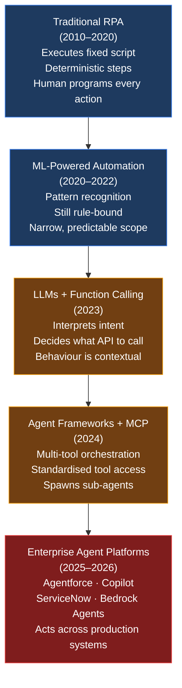
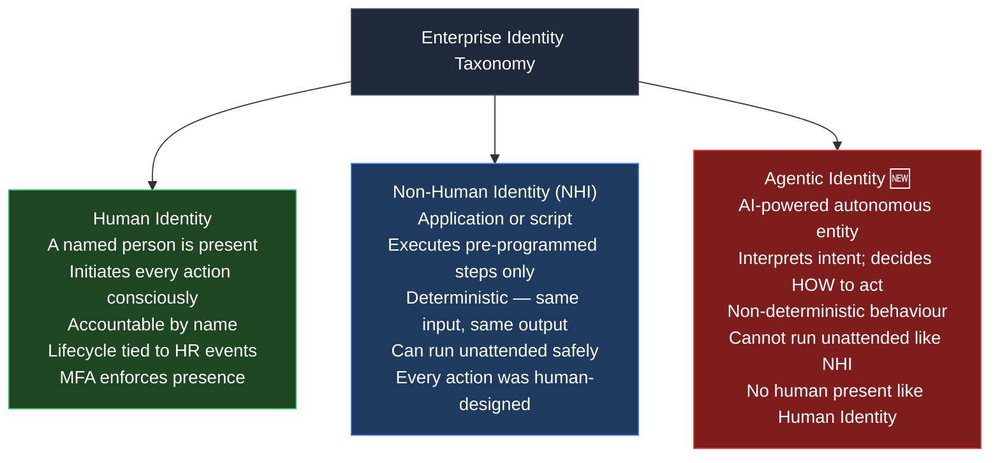
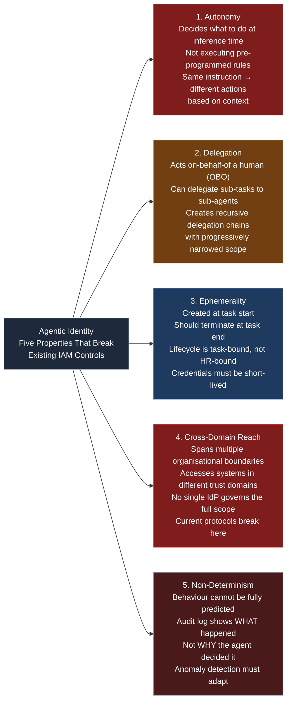
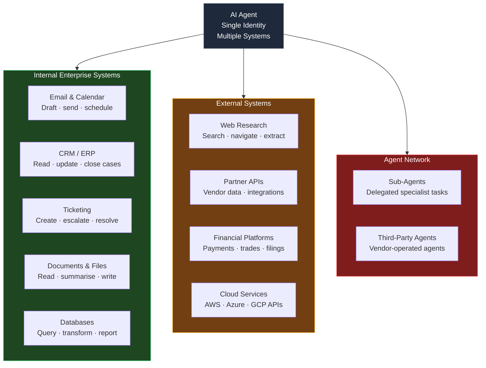
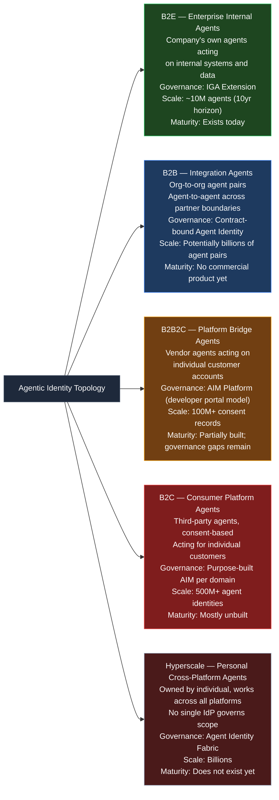
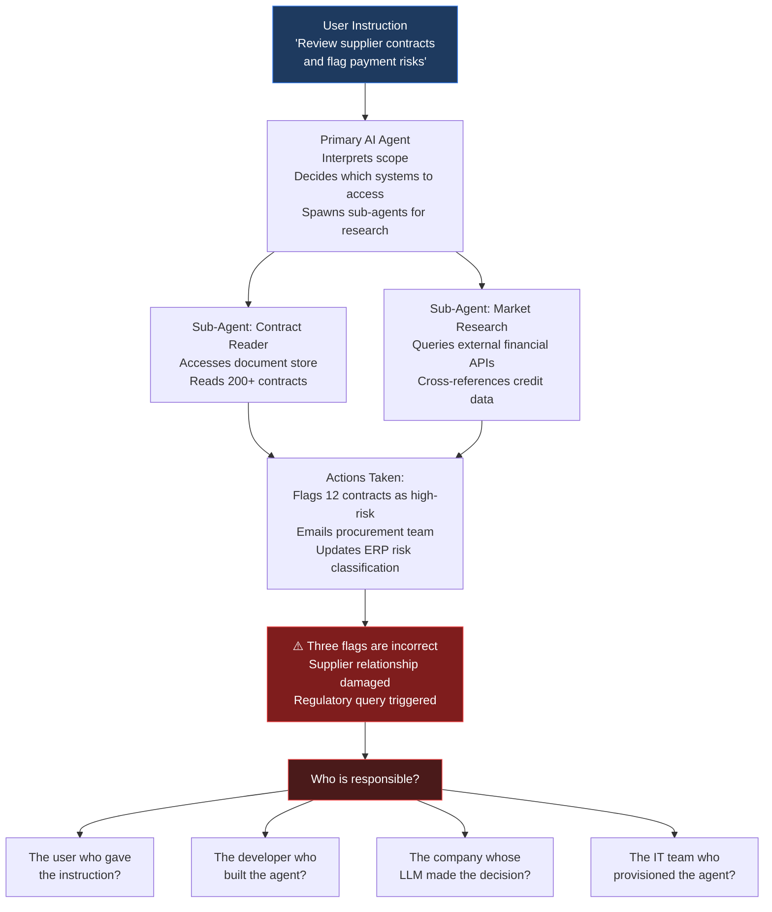
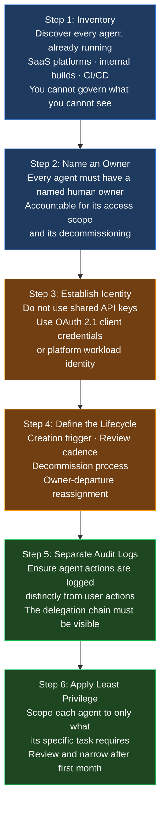

Every IAM system ever built rests on one foundational assumption: a human being is ultimately responsible for the access request being made.

A service account batch job does not violate this — a human engineer designed every step it executes. A logged-in employee does not violate it — a person is present and accountable. Even the most complex automation script runs exactly what its author programmed; no more, no less.

AI agents are the first category of entity that genuinely breaks this assumption. They interpret intent, make decisions at runtime, choose which tools to call, and produce outcomes their authors cannot fully predict in advance. They act under someone's delegated authority — accessing real systems, handling real data, taking consequential actions — without that person being present in the loop.

That makes them something new. Not a human. Not a service account. Something the identity industry has no standardised governance model for — yet.

---

## From Chatbots to Decision-Makers: The Origin Story

Understanding why agentic identity is now an urgent problem requires understanding how quickly AI systems evolved from passive to active.

The diagram traces the inflection point clearly. RPA bots and ML pipelines are sophisticated tools, but they are fully deterministic — given the same input, they always produce the same output. The identity governance model for them is straightforward: treat them as a non-human identity, vault their credentials, and review their access periodically.

Everything changed in 2023 when large language models gained the ability to call external functions. An LLM with function-calling capability does not execute a fixed script — it decides at inference time *which* function to call, *what parameters* to pass, and *what to do next* based on the result. The behaviour is contextual, not deterministic.

The [Model Context Protocol (MCP)](https://modelcontextprotocol.io/){:target="_blank"}, introduced in late 2024, standardised how agents connect to external tools. The [Agent-to-Agent (A2A) protocol](https://a2aprotocol.ai/){:target="_blank"}, introduced in 2025, standardised how agents communicate with each other. These protocols transformed agents from experimental demos into composable enterprise infrastructure.

Today, AI agents are already running inside Salesforce, ServiceNow, Microsoft 365, GitHub, and AWS — accessing production data and taking consequential actions across systems your organisation spent years governing for humans.

---

## What Is an AI Agent? The Identity Primitive Defined

Before examining the governance challenge, the definition must be precise. The term "AI agent" covers everything from a simple chatbot to a fully autonomous supply chain optimiser. From an identity perspective, what matters is a specific property:

> An AI agent is an identified and authorized software entity that takes **autonomous actions** based on **decisions made at inference time** to achieve a specified goal — **interacting with external services**, APIs, tools, or other agents in the process.

This definition comes from the [OpenID Foundation's 2025 whitepaper on Identity Management for Agentic AI](https://openid.net/wp-content/uploads/2025/10/Identity-Management-for-Agentic-AI.pdf){:target="_blank"}, the most authoritative analysis of where current identity standards succeed and fail for this new class of entity.

Three clauses in that definition carry governance weight:

- **"Autonomous actions"** — the agent decides what to do; a human does not approve each step
- **"Decisions made at inference time"** — the decision emerges from the model's reasoning, not from a programmed instruction set
- **"Interacting with external services"** — the agent crosses system boundaries, acquiring access as it goes

A chatbot that only produces text is not an agent by this definition. A workflow that books a flight, updates a CRM record, and sends a confirmation email — all from a single natural-language instruction — is.

---

## The Taxonomy Gap: Not Human, Not NHI — Something New

The [previous series](){:target="_blank"} established two major identity categories: **human identities** (governed through IGA lifecycle workflows) and **non-human identities** (service accounts, API keys, certificates, workload identities). AI agents fit cleanly into neither.

The diagram above shows exactly where the gap lies. Consider the key distinctions:

**Why an AI agent is not a human identity:**
A human identity assumes a person is present, conscious, and making each decision. Human governance controls — MFA, access reviews, manager certification — derive their validity from this. An AI agent executing a multi-day workflow at 2 AM is not supervised by a human in the moment. The governance model for human identity simply does not apply.

**Why an AI agent is not a standard NHI:**
A service account is safe to run unattended precisely because every action it can take was written, tested, and reviewed by a human before deployment. If the service account does something unexpected, it is a bug — a deterministic failure of a known program. An AI agent operating from a natural-language instruction can legitimately take actions its developers never anticipated, because that adaptability is the feature. You cannot leave it unattended the way you can a scheduled batch job, because its behaviour emerges from context at runtime.

**What agentic identity actually is:**
It occupies a new position — acting with the *automation of NHI* (no human present, continuous operation) but with the *decision-making autonomy previously exclusive to humans* (contextual reasoning, novel action paths). The IAM controls designed for either category are necessary but insufficient.

---

## The Five Defining Properties of Agentic Identity

Understanding what makes agentic identity unique requires naming the specific properties that break existing governance models.

Each property maps to a specific governance gap:

| Property | Governance Control That Breaks | Why It Breaks |
|----------|-------------------------------|---------------|
| **Autonomy** | Access review (who approves?) | Manager cannot certify what the agent might decide to do |
| **Delegation** | Audit trail (who did it?) | Agent actions logged indistinguishably from user actions |
| **Ephemerality** | Lifecycle management (when to offboard?) | No HR departure event; no trigger without explicit tooling |
| **Cross-Domain Reach** | Protocol coverage (which standard governs?) | OAuth 2.1 works in one trust domain; breaks across organisations |
| **Non-Determinism** | Anomaly detection (what is abnormal?) | No stable behavioural baseline to monitor against |

---

## The Business Case: Why Enterprises Are Deploying AI Agents

The governance challenge would be worth ignoring if enterprises were adopting agents slowly. They are not.

**CapEx reduction** is the most immediate driver. Traditional automation required expensive custom software development for every workflow — an RPA project for invoice processing, a separate integration build for HR onboarding, another for customer support routing. AI agents handle diverse, unstructured workflows from a single general-purpose system, collapsing the build-for-every-case model.

**OpEx reduction** compounds this. Agents operate 24/7 without labour cost, scale without proportional headcount increases, and complete in seconds tasks that take humans hours. An agent onboarding a new employee — creating accounts, ordering hardware, scheduling orientation — can complete a process that previously spanned three departments and two weeks in under an hour.

**Competitive pressure** is accelerating adoption beyond what internal ROI calculations would justify alone. Organisations that deploy AI agents for customer service, contract review, or market analysis gain measurable speed advantages over those that do not.

**Regulatory pressure is arriving simultaneously.** The [EU AI Act](https://artificialintelligenceact.eu/){:target="_blank"} (Article 14) mandates effective human oversight for high-risk AI systems. GDPR Article 22 restricts fully automated decision-making that produces legal or similarly significant effects. Financial regulators in multiple jurisdictions are asking the question enterprises have not yet answered: *"Who is accountable for the AI decision?"*

The governance infrastructure must be built now, not after the regulatory query arrives.

---

## Who Cares About Agentic Identity — And Why

The governance challenge looks different depending on where you sit in the organisation.

| Stakeholder | What They Care About | The Gap Today |
|-------------|---------------------|---------------|
| **Regulatory / Compliance** | EU AI Act oversight; GDPR Art. 22 automated decisions; financial services audit trails | No IAM standard covers agent-specific accountability; most audit logs cannot distinguish agent actions from user actions |
| **Executive / CISO** | Blast radius if an agent is compromised; cost of uncontrolled agent sprawl | [92% of enterprises](https://www.resilientcyber.io/p/identity-is-the-agentic-ai-problem){:target="_blank"} report legacy IAM cannot effectively manage AI and NHI risks |
| **Auditor** | Who authorized this agent? What did it access? When was it last reviewed? | Agent actions appear in logs as user actions — the delegation chain is invisible |
| **Implementor / IGA Team** | How to provision, govern, and decommission agents at scale | No production SCIM schema exists for agents; the [IETF draft-wahl-scim-agent-schema](https://datatracker.ietf.org/doc/draft-wahl-scim-agent-schema/){:target="_blank"} is still in progress |
| **Administrator / Platform Team** | How to detect anomalous behaviour in a non-deterministic system | NHI anomaly detection works on stable baselines; agent behaviour shifts with every prompt |
| **User** | What did I actually authorize? Where is my data going? | Consent is granted once at agent setup; scope is vague; ongoing actions accumulate without further approval |
| **Developer** | How to build agents that authenticate securely across systems | [OAuth 2.1](https://datatracker.ietf.org/doc/html/draft-ietf-oauth-v2-1-13){:target="_blank"} + [MCP](https://modelcontextprotocol.io/){:target="_blank"} works within a single trust domain; cross-organisational delegation is unsolved |

The critical observation: [78% of enterprises have no formally documented policies](https://www.resilientcyber.io/p/identity-is-the-agentic-ai-problem){:target="_blank"} for creating or removing AI agent identities. Agents are being deployed; the governance frameworks are not keeping pace.

---

## Where Agentic Identity Already Operates Today

Agentic identity is not a future concern. The following scenarios are in production at enterprises today.

Real enterprise examples operating today:

| Platform | Live Scenario | Consequential Actions Taken |
|----------|--------------|----------------------------|
| [Salesforce Agentforce](https://www.salesforce.com/agentforce/){:target="_blank"} | Customer service agent | Resolves support cases, issues refunds, updates account records |
| [ServiceNow AI Agents](https://www.servicenow.com/products/ai-agents.html){:target="_blank"} | Employee onboarding agent | Creates IT tickets, provisions accounts, orders equipment |
| [Microsoft Copilot](https://copilot.microsoft.com/){:target="_blank"} | Workplace productivity agent | Reads emails, drafts documents, books calendar slots |
| [GitHub Copilot Workspace](https://githubnext.com/projects/copilot-workspace){:target="_blank"} | Software development agent | Reads repositories, creates pull requests, runs test suites |
| [AWS Bedrock Agents](https://aws.amazon.com/bedrock/agents/){:target="_blank"} | Data processing agent | Queries databases, calls downstream APIs, writes to S3 |

Each of these agents holds a credential, operates under a delegated grant of authority, accesses production data, and produces outcomes that affect real business processes. The identity and governance questions they raise are not hypothetical.

The examples above, however, share one characteristic: the organisation deploying the agent also owns the platform the agent operates on. That is the simplest governance case. The picture becomes significantly more complex once agents cross organisational and platform boundaries — which is where most real-world consumer scenarios live.

---

## The Full Agentic Identity Topology

Enterprise internal deployment is only one tier of agentic identity. The [identity relationship models established in Series 1](){:target="_blank"} — B2E, B2B, B2B2C, B2C, and Hyperscale — each have a distinct agentic counterpart, with different governance models, accountability structures, and scale characteristics.

The diagram reveals the governance maturity gap starkly: only the B2E tier has any commercial governance tooling today. Every other tier is either partially addressed or completely unbuilt — yet the scale projections for B2C and Hyperscale dwarf the enterprise tier entirely.

### The Consumer Agent Problem (B2C and B2B2C)

Consider a concrete scenario: a customer uses a fintech app that deploys an AI agent to manage their portfolio on a trading platform like [Zerodha](https://kite.zerodha.com/){:target="_blank"} or an [Open Banking](https://www.openbanking.org.uk/){:target="_blank"}-enabled bank. Three parties are involved:

1. **The customer** — whose money and account is at stake
2. **The fintech** — who built the agent but does not own the trading platform
3. **The trading platform** — who holds the account but did not build the agent

This is the B2B2C identity model with an autonomous agent in the middle. The governance questions it creates are fundamentally different from the enterprise tier:

**What does consent mean when the acting party is autonomous?**

Traditional [OAuth 2.0 consent](){:target="_blank"} asks: *"Do you allow App X to read your account data?"* The user clicks Allow, and the app passively retrieves data. The scope is clear. The action is bounded.

When the "app" is an AI agent that makes autonomous trading decisions, the OAuth consent model breaks down:

- The customer consented to "read portfolio data and place trades" — but not to any specific trade
- The agent will exercise judgement about *which* trades to place and *when* — judgement the customer did not explicitly authorize
- If the agent makes a poor decision, the customer's consent to "place trades" does not capture the specific action that caused the loss

This is not a hypothetical edge case. It is the defining characteristic of every consumer-facing AI agent that takes consequential autonomous actions: **the consent was granted for a capability, not for a specific decision**. Governing that gap is one of the most critical unsolved problems in agentic identity.

**Who manages the agent's identity?**

In a B2B2C scenario the ownership question has no clean answer yet:

| Question | B2E Answer | B2B2C Answer |
|----------|-----------|--------------|
| Who provisions the agent? | The enterprise IT team | The fintech who built it |
| Who governs its access? | The enterprise IGA program | Unclear — the platform, the fintech, or both? |
| Who is accountable if it acts harmfully? | The organisation | Disputed — fintech, platform, or both? |
| Who can revoke it? | The enterprise | The customer, the platform, or the fintech? |
| Whose audit log captures the action? | The organisation's SIEM | Fragmented across fintech and platform |

The [OpenID Foundation whitepaper](https://openid.net/wp-content/uploads/2025/10/Identity-Management-for-Agentic-AI.pdf){:target="_blank"} identifies this multi-party accountability gap as one of the most complex unsolved problems for agentic standards — existing OAuth flows were designed for one user and one client, not for three-party autonomous delegation across organisations.

> **The dedicated treatment of consumer agent consent, B2B2C governance, and the regulatory implications (EU AI Act Art. 22, PSD2/Open Banking parallels) is covered in the next post in this series: *Consumer Agents and the Consent Problem*.**

---

## The Hard Questions Agentic Identity Raises

Deploying an AI agent is straightforward. Governing one is the unsolved problem. The diagram below shows how a single natural-language instruction creates an accountability chain that current IAM frameworks cannot trace.

This accountability diagram illustrates five governance questions that have no satisfactory answer in current IAM frameworks:

**1. Who is accountable for the agent's decision?**
The user gave an instruction. The developer built the system. The LLM provider trained the model. The IT team provisioned the access. When the outcome is wrong, the accountability chain is unclear — and today's audit logs make it invisible.

**2. How do you monitor behaviour you cannot predict?**
NHI anomaly detection works because service accounts have stable, predictable behaviour patterns. An AI agent's behaviour changes with every prompt, every new data input, every contextual shift. Traditional UEBA baselines do not apply.

**3. Who owns the agent when its creator leaves?**
Service account orphaning is a known problem (covered in the [NHI post](){:target="_blank"}). An AI agent that has spawned sub-agents, acquired OAuth consents from multiple users, and integrated with a dozen systems is far harder to orphan gracefully.

**4. How do you decommission an agent that has delegated?**
Revoking the primary agent's credentials does not automatically revoke the credentials of sub-agents it has already spawned and authorized. The [OpenID Foundation whitepaper](https://openid.net/wp-content/uploads/2025/10/Identity-Management-for-Agentic-AI.pdf){:target="_blank"} identifies this as one of the critical unsolved problems — propagating revocation down a delegation chain of offline-attenuated tokens.

**5. What exactly did the user consent to?**
A user who clicked "Allow" when launching a Copilot agent consented to something — but the scope of that consent may cover actions the user never anticipated. As [consent fatigue](https://openid.net/wp-content/uploads/2025/10/Identity-Management-for-Agentic-AI.pdf){:target="_blank"} grows with agent proliferation, users reflexively approve prompts without due consideration, reducing consent to a formality.

---

## Are Enterprises Ready?

The honest answer is: not yet, but the gap is visible and vendors are responding.

The readiness gaps are structural:

- [**92% of enterprises**](https://www.resilientcyber.io/p/identity-is-the-agentic-ai-problem){:target="_blank"} report that their legacy IAM solutions cannot effectively manage AI and NHI risks
- [**78%**](https://www.resilientcyber.io/p/identity-is-the-agentic-ai-problem){:target="_blank"} have no formally documented policies for creating or removing AI agent identities
- The SCIM protocol extension for agent lifecycle management — [draft-wahl-scim-agent-schema](https://datatracker.ietf.org/doc/draft-wahl-scim-agent-schema/){:target="_blank"} — is still an IETF draft with no production platform support
- [OIDC-A (OpenID Connect for Agents)](https://arxiv.org/abs/2509.25974){:target="_blank"}, the proposed standard for agent-native identity claims, is under active development but not yet mainstreamed
- Vendor responses — [Microsoft Entra Agent ID](https://learn.microsoft.com/en-us/entra/identity/){:target="_blank"}, Okta AIM, WSO2 agentic identity — are proprietary and do not currently interoperate

What works today is narrow but real. [OAuth 2.1](https://datatracker.ietf.org/doc/html/draft-ietf-oauth-v2-1-13){:target="_blank"} with MCP provides a workable foundation for agents operating *within a single trust domain* — a corporate intranet, a single cloud environment, an enterprise SaaS platform. When that boundary is crossed, or when agents begin delegating to sub-agents, current standards reveal gaps the identity community is actively working to close.

The standards will catch up. They always do. The question is what enterprises do in the interim — and the answer cannot be "nothing."

---

## Where to Start

Waiting for standards is not a viable strategy when agents are already running in your Salesforce org, your M365 tenant, and your CI/CD pipelines. The practical entry points are achievable today.

Steps 1 and 2 — inventory and ownership — are the highest-leverage starting points because they are achievable without new tooling. Every agent running in your environment today either has a named owner or it does not. That gap is visible the moment you look for it.

Steps 3 and 4 set the architecture right for new agents going forward. OAuth 2.1 client credentials (not static API keys) and a defined lifecycle trigger (what starts the agent, what ends it) are the minimum viable identity posture.

Steps 5 and 6 are where governance becomes operational. Audit log separation is critical because without it, incident response and compliance reporting become guesswork. Least-privilege scoping prevents the access sprawl that has made service accounts a persistent attack surface.

---

## Key Takeaways

- **Agentic identity is a new category** — not human identity, not NHI. An AI agent combines the automation of a service account (no human present, continuous operation) with the decision-making autonomy previously exclusive to humans. Governance controls designed for either category are necessary but insufficient for agents.

- **Five properties define it**: autonomy (decides at inference time), delegation (acts on-behalf-of, spawns sub-agents), ephemerality (task-bound lifecycle), cross-domain reach (spans trust boundaries), and non-determinism (behaviour cannot be fully predicted in advance).

- **The business case is already compelling**: CapEx reduction (no custom build per workflow), OpEx reduction (24/7 at scale), competitive pressure, and incoming regulatory obligations under the EU AI Act all drive adoption faster than governance frameworks are developing.

- **Every stakeholder faces a distinct gap**: regulators need accountability chains, executives need blast-radius visibility, auditors need delegation-aware logs, implementors need SCIM schemas that do not yet exist, and developers need cross-domain protocols that are still in draft.

- **Agents are in production now** — in Salesforce, ServiceNow, Microsoft 365, GitHub, and AWS — accessing real systems under your organisation's existing identity infrastructure.

- **The accountability question has no clean answer yet**: when an AI agent takes an incorrect consequential action, the chain of responsibility across user, developer, LLM provider, and IT team is genuinely unresolved in most governance frameworks.

- **Start with inventory and ownership** — you cannot govern agents you cannot see, and every agent without a named owner is an orphaned identity waiting to cause a problem.

---

*Part of the [IAM for the Agentic Era series](){:target="_blank"}.*