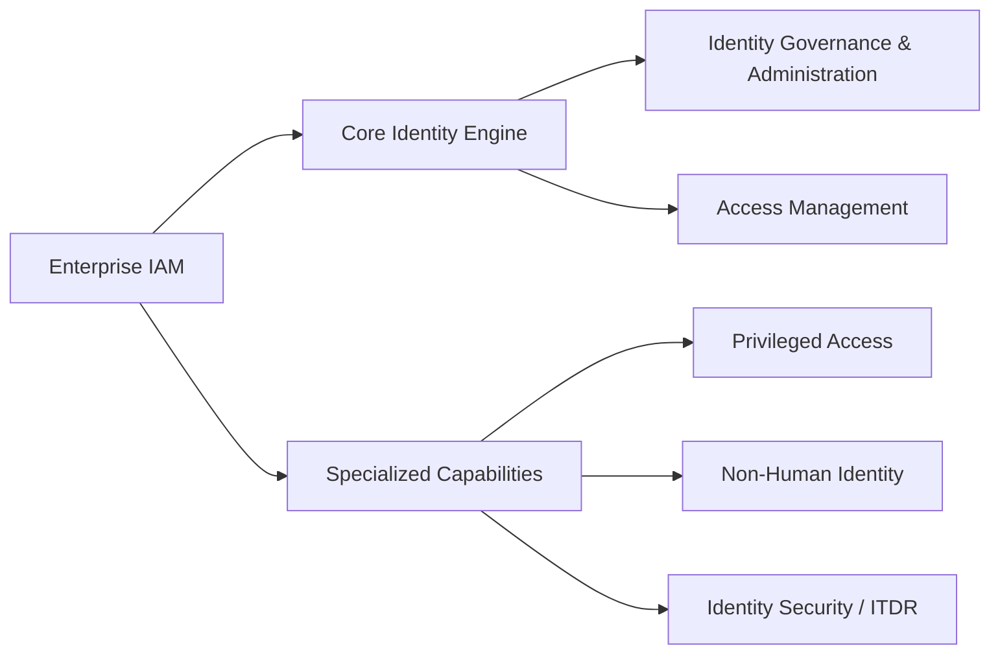
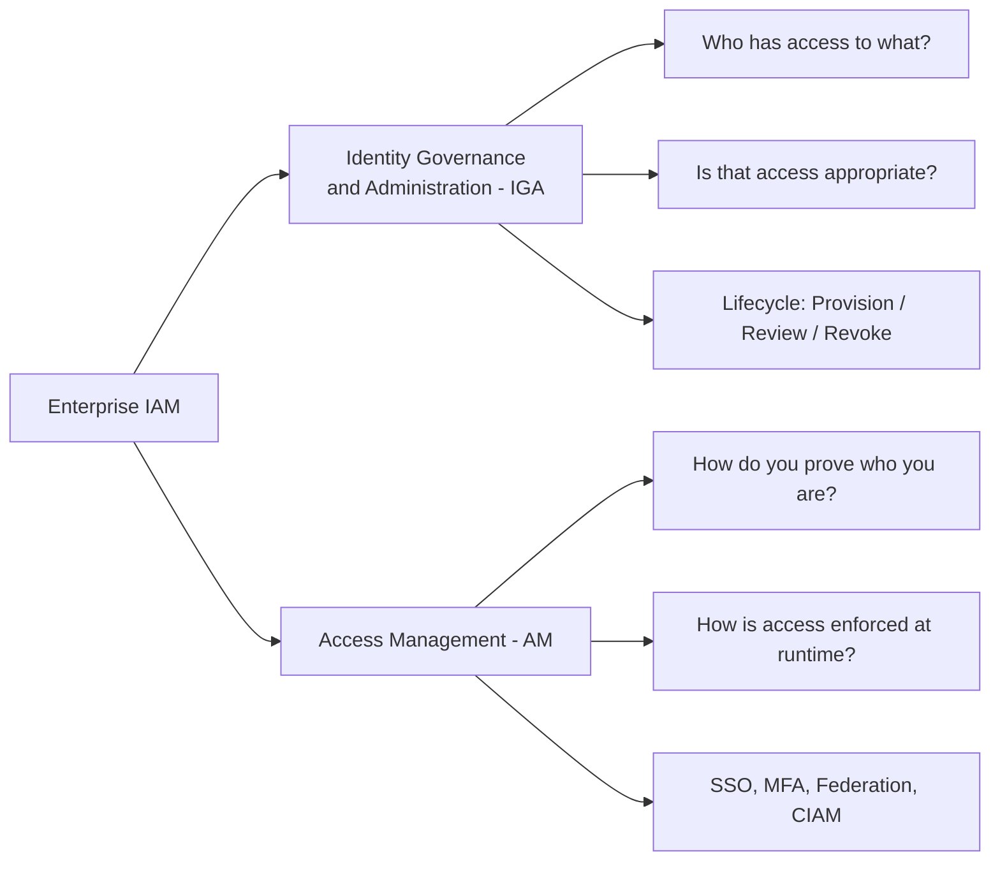
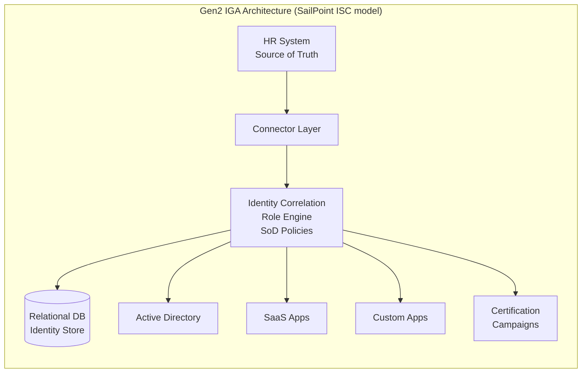
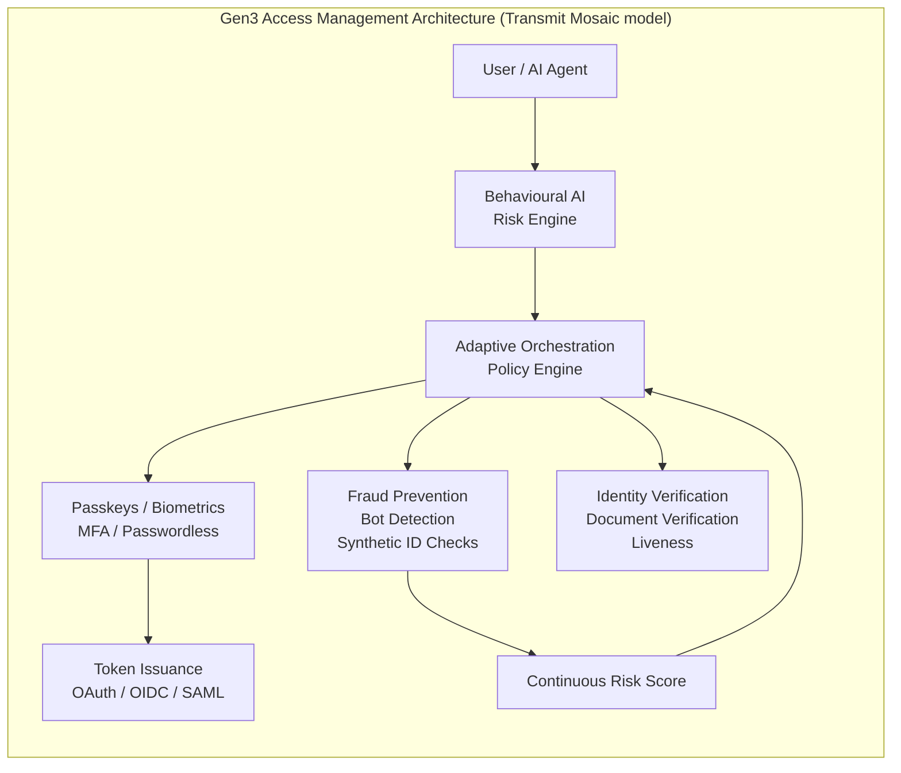
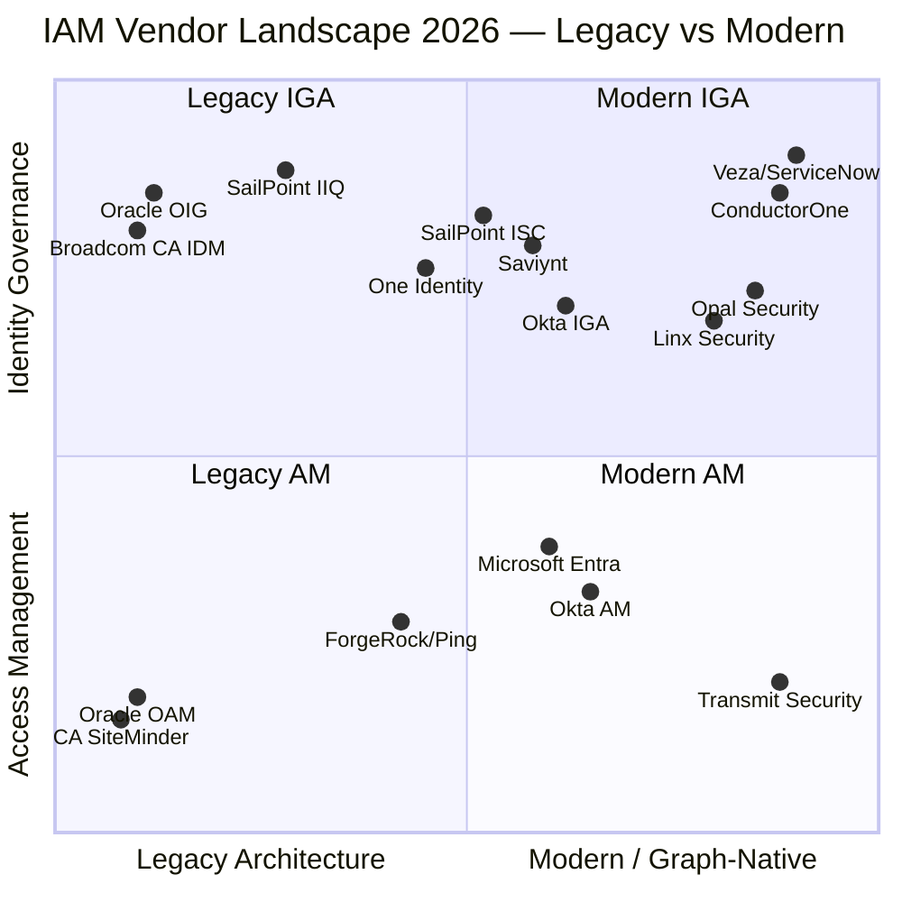
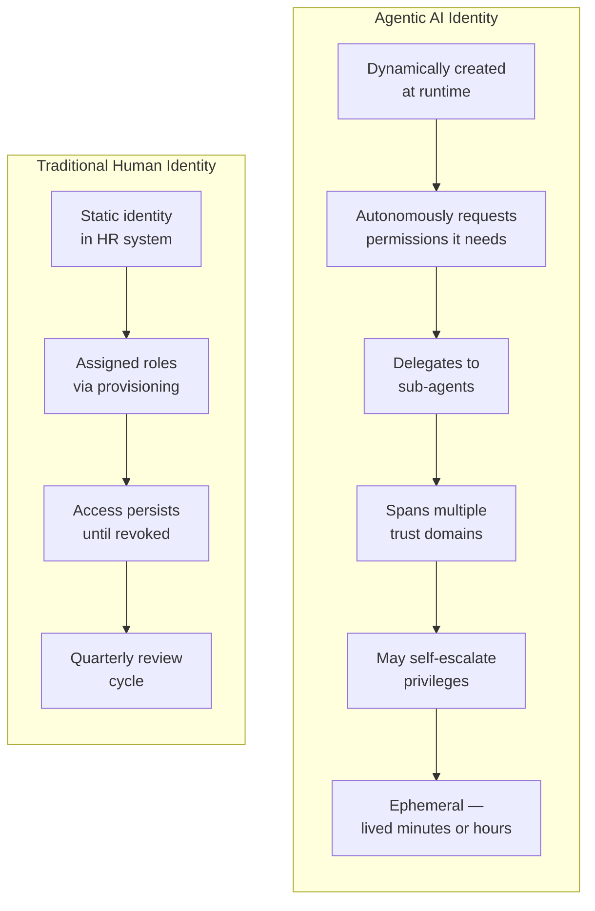
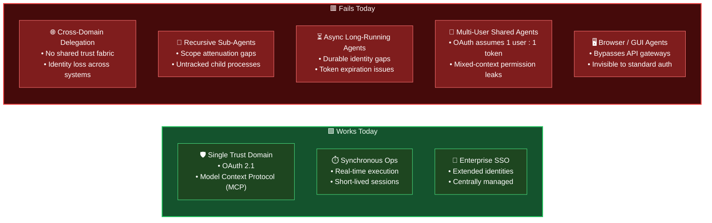
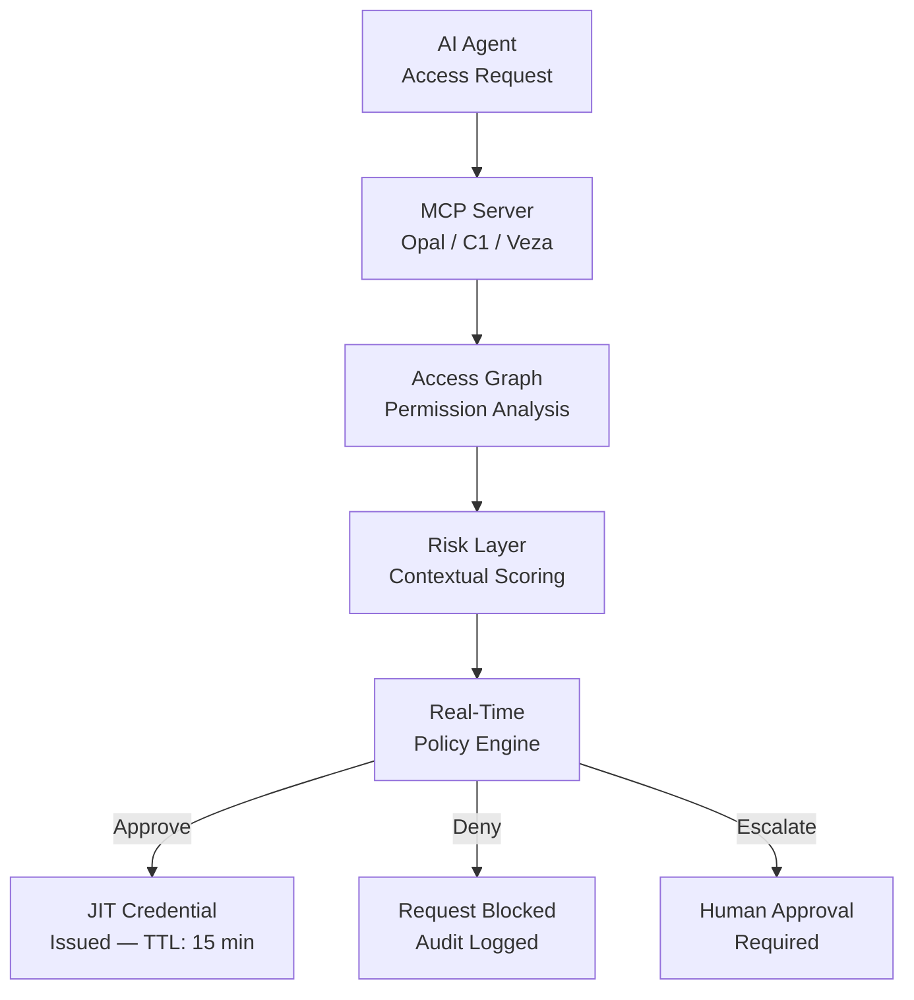
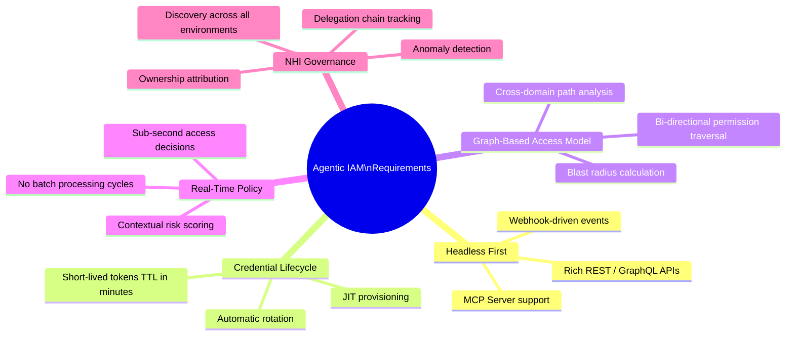

Most enterprise IAM tools were designed around one central assumption: the Identity at the other end of an access request belongs to a human being.

A person joins an organisation. That person is assigned roles. A manager approves access. The person leaves, and access is revoked. This is the lifecycle every major [IGA and Access Management platform](){:target="_blank"} was built to automate.

[Artificial intelligence agents](){:target="_blank"} do not fit this model at all.

This post maps the three generations of IAM tooling — covering both Identity Governance and Administration (IGA) and Access Management (AM) — and then examines the one challenge that is forcing every vendor, new and old, to rethink their architecture: **Agentic Identity Management**.

---

## Domains of Enterprise IAM

Before we look at generations, it is worth being precise about the pillars of the [IAM landscape](){:target="_blank"}:

> [PAM](){:target="_blank"} is highly specific. It targets less than 5% of users (admins/infrastructure).

> [NHI](){:target="_blank"} is a separate layer. It deals with software components, not human identities.

> ITDR (Identity Threat Detection and Response) is rapidly shifting from a niche use case to a core requirement.

For this current topic we will focous on the core engine of IAM — the heavy infrastructure that applies to every employee, contractor, and basic resource—IGA and AM are indeed the two main pillars.

**IGA** answers governance questions: provisioning, access reviews, role management, Segregation of Duties (SoD), compliance reporting.

**AM** answers runtime questions: authenticating users, enforcing policies at the time of access, Single Sign-On (SSO), federation, and Customer Identity (CIAM).

Both have evolved through three generations. The timelines are not perfectly synchronised, but the pattern is consistent.

---

## Identity Governance and Administration (IGA) — Three Generations

### Generation 1 — The On-Premise Monoliths (2000s–2010s)

The first generation of IGA was built when enterprise IT was synonymous with on-premise, and "identity" meant an employee account in Active Directory.

| Vendor | Product |
|--------|---------|
| Oracle | Oracle Identity Governance (OIG) / OIM |
| Broadcom (formerly CA Technologies) | CA Identity Manager / CA Identity Governance |
| IBM | IBM Security Identity Manager (ISIM) |
| Sun Microsystems / Oracle | Sun Identity Manager |

**Architecture:** Monolithic Java applications sitting on top of relational databases (Oracle DB, SQL Server, DB2). Thick GUI consoles. On-premise deployments requiring months of professional services. Connectors were custom-built using proprietary frameworks.

**Strengths:**
- Proven at enterprise scale (banks, telcos, government agencies)
- Deep SoD and audit trail capabilities
- Strong ERP integration (SAP, PeopleSoft)

**Weaknesses:**
- Extremely slow to implement (12–24 months is not unusual)
- Upgrade cycles measured in years
- No native cloud connector ecosystem
- UI designed for IT administrators, not business users
- Governance workflows are rigid and form-based

**The SQL Problem:** The entire data model — identities, roles, access rights, audit events — is stored in relational tables. This works fine when identities are discrete, long-lived records. It starts to struggle when identities are ephemeral, when access relationships number in the billions, or when you need to answer graph queries like *"show me every path by which a contractor can reach production data."*

---

### Generation 2 — The Hybrid Era (2010s–early 2020s)

The second generation arrived as cloud adoption forced IGA vendors to offer SaaS delivery while preserving the deep governance workflows enterprises required. The architecture improved; the underlying mental model — human-centric, lifecycle-driven — did not fundamentally change.

| Vendor | Product | Notes |
|--------|---------|-------|
| SailPoint | IdentityIQ (on-prem) → IdentityNow → Identity Security Cloud (ISC) | Market leader; Gartner MQ Leader consistently |
| Saviynt | Enterprise Identity Cloud | Strong in cloud governance and PAM convergence |
| Okta | Okta Identity Governance (OIG) | Extension of Okta's AM platform into IGA |
| One Identity | One Identity Manager | Strong European presence, good SoD |
| Omada | Omada Identity Cloud | European compliance focus |

**SailPoint and the Gen2.5 Question**

SailPoint's trajectory is worth examining carefully. IdentityIQ (IIQ) is unambiguously Gen1 architecture — on-premise, SQL-heavy, complex to maintain. IdentityNow, now rebranded as **Identity Security Cloud (ISC)**, is cloud-native and multi-tenant.

However, ISC is functionally a re-platforming of the same governance model: connector-based provisioning, access review campaigns, role mining, SoD policies. The underlying paradigm is still human-centric and state-based. Access profiles do not adjust based on behaviour; governance coverage is limited to applications that expose an API connector.

**Is SailPoint ISC Gen3?** Not quite. It is best described as a mature Gen2 platform delivered as SaaS. The AI enhancements are real and improving, but they are layered onto a governance model that was designed for a world of stable, predictable human identities. The architecture is microservices, but the *mental model* of identity governance has not fundamentally shifted.

---

### Generation 3 — The Graph-Native, AI-First Platforms (2020s–present)

Gen3 vendors threw away the connector-plus-SQL model and started from a different question: *"What does every identity actually have permission to do — right now — across every system?"*

The answer requires a graph, not a table.

| Vendor | Product | Key Differentiator |
|--------|---------|-------------------|
| Veza (acquired by ServiceNow, Dec 2025) | Access Graph | Patented graph maps 30B+ permissions; AI-native; MCP server support |
| ConductorOne (C1) | ConductorOne Platform | AI agent "Thomas" for autonomous governance; NHI inventory built-in |
| Opal Security | Opal Authorization Platform | Risk Layer for agentic requests; developer-native; MCP native |
| Linx Security | Linx Identity Platform | Lightweight deployment; modern UX; growing connector library |
| Lumos | Lumos Platform | SaaS-focused; strong app discovery and lifecycle automation |

**What makes Gen3 different:**

1. **Graph-based access model** — access relationships are modelled as a graph, enabling path analysis, blast-radius assessment, and answers to queries that relational schemas cannot efficiently express.

2. **AI-native, not AI-bolted-on** — the platform was designed with machine-readable access data from day one. Veza's Access Graph, for example, maps permissions down to specific data objects (individual Snowflake tables, S3 buckets, database rows), not just application-level grants.

3. **Non-Human Identity (NHI) as a first-class citizen** — Gen3 platforms treat service accounts, API keys, OAuth tokens, and AI agent identities with the same governance rigor as human identities.

4. **Headless by design** — Gen3 platforms ship rich APIs and, increasingly, MCP servers so that AI orchestration layers can query and enforce access programmatically.

5. **Developer-native integrations** — built for the infrastructure-as-code world; Git-based workflows, Terraform integration, SCIM endpoints.

---

## Access Management (AM) — Three Generations

### Generation 1 — Web SSO and Directory Services

| Vendor | Product |
|--------|---------|
| Oracle | Oracle Access Manager (OAM) / Oracle SSO |
| Broadcom (formerly CA) | CA SiteMinder / CA Single Sign-On |
| IBM | IBM Tivoli Access Manager |

**Architecture:** Agent-based. A software agent is installed on each web server or application. The agent intercepts requests and validates session cookies against a central policy server. Authentication is session-based. Identity lives in LDAP directories.

**Limitations:** Tightly coupled to on-premise web applications. No native support for modern protocols (OAuth 2.0, OIDC). SAML was added as a retrofit. Mobile and API access were afterthoughts.

---

### Generation 2 — Cloud-Ready, Protocol-First

| Vendor | Product | Notes |
|--------|---------|-------|
| ForgeRock (merged into Ping, 2023) | ForgeRock Identity Platform | Open-source roots; strong IoT/edge support; highly customizable |
| Ping Identity | PingOne / PingFederate / PingAccess | Merged with ForgeRock; enterprise CIAM + workforce AM |
| Okta | Okta Workforce Identity / Customer Identity Cloud (Auth0) | Cloud-native; largest integration network |
| Microsoft | Azure AD → Entra ID | Dominant by installed base; strong M365 ecosystem |
| WSO2 | WSO2 Identity Server / Asgardeo | Open-source roots; strong enterprise and CIAM; active agentic identity roadmap — native MCP authorization and agent first-class identity support |
| Red Hat / Community | Keycloak | Dominant open-source choice; strong OAuth 2.1 / OIDC implementation; MCP server support added in 26.x; widely deployed behind enterprise API gateways |

**Architecture:** SAML 2.0, OAuth 2.0, OpenID Connect (OIDC) as native protocols. Cloud delivery (multi-tenant SaaS) as the default. Adaptive MFA as a first-class feature. The Ping–ForgeRock merger in 2023 created a formidable Gen2 player with combined enterprise breadth and open-source flexibility.

**Mindshare Note (2026):** ForgeRock's market share has declined from 6.6% to 4.5% and Ping Identity from 7.4% to 5.8% year-over-year, reflecting consolidation pressure from Microsoft Entra ID and Okta.

**WSO2 and Keycloak — The Open Source Wild Cards**

These two deserve special mention because they represent the largest deployment footprint that most analyst reports overlook. Keycloak, backed by Red Hat, is the default choice for thousands of organisations running self-hosted IAM behind their API gateways. WSO2 Identity Server powers complex enterprise and B2B identity scenarios across Asia-Pacific and large banks globally.

Neither is a Gen3 platform in the architectural sense — both still rely on relational database backends (H2/PostgreSQL for Keycloak, RDBMS for WSO2) and LDAP-compatible directory schemas. However, both are actively extending toward agentic identity:

- **Keycloak 26.x** introduced MCP server support and has an mcp-keycloak project for agentic application management. It supports OAuth 2.1 client credentials for machine-to-machine flows — the current baseline for agent authentication.
- **WSO2 Identity Server** released dedicated agentic AI capabilities in late 2025: agents as first-class identities, native MCP server authorization, and a pre-configured application template for AI agent frameworks (LangChain, AutoGPT). WSO2 Asgardeo (its cloud-native SaaS offering) extends these capabilities to CIAM scenarios.

The important caveat: these enhancements are protocol-level additions on top of unchanged directory/RDBMS backends. The MCP authorization flows work; the underlying data model for representing agent identity, delegation chains, and ephemeral credentials remains constrained by the same legacy backend architecture that limits Gen1 and Gen2 tools generally. See *[The Legacy Backend Problem — LDAP, SQL, and Why Your IAM Foundation Is Holding Back Agentic Identity]()* for the full architectural analysis.

---

### Generation 3 — AI-Native, Behaviour-Driven, Unified

| Vendor | Product | Key Differentiator |
|--------|---------|-------------------|
| Transmit Security | Mosaic Platform | AI-native CIAM + fraud + IDV in one platform; predictive risk; passkeys; agentic threat defence |
| Strata Identity | Maverics | Identity orchestration across legacy and cloud AM; migration without rearchitecture |

**Transmit Security** was recognised as a Leader in the 2025 Gartner Magic Quadrant for Access Management and the Forrester Wave for CIAM Q4 2024. Its *Mosaic* platform unifies CIAM, fraud prevention, and identity verification — a meaningful architectural departure from Gen2 vendors that still sell these as separate product lines.

---

## The Complete Vendor Map

---

## The Agentic Identity Crisis — The Problem None of Them Were Built For

Here is the uncomfortable truth about the entire IAM landscape: **every generation above was designed for human identities.**

The rise of autonomous AI agents changes the fundamental assumptions of identity governance.

### The Numbers Are Already Alarming

- Non-Human Identities (NHIs) now [**outnumber human identities by 90:1**](https://www.artezio.com/pressroom/blog/transforming-cybersecurity-unprecedented/){:target="_blank"} in most enterprises; some report ratios as high as **144:1**.
- The NHI population [grew **44% between 2024 and 2025**](https://www.msspalert.com/news/security-teams-mssps-will-wrestle-with-agentic-ai-non-human-identities-in-2026){:target="_blank"}.
- [**92% of enterprises**](https://www.resilientcyber.io/p/identity-is-the-agentic-ai-problem) report their legacy IAM solutions cannot effectively manage AI and NHI risks.
- [**78% have no formally documented policies**](https://www.resilientcyber.io/p/identity-is-the-agentic-ai-problem){:target="_blank"} for creating or removing AI agent identities.
- The [GitGuardian State of Secrets Sprawl 2026](https://www.gitguardian.com/state-of-secrets-sprawl){:target="_blank"} report found **1.27 million AI-related secrets** exposed in public repositories — an 81% year-over-year increase.

### Why Agentic Identity Is Different

The governance model of every Gen1 and Gen2 tool was built around four assumptions that AI agents violate:

| Assumption | Human Identity | AI Agent Identity |
|-----------|---------------|------------------|
| Identity lifecycle | Long-lived (years) | Ephemeral (minutes to hours) |
| Permission acquisition | Human-approved, provisioned | Autonomously requested at runtime |
| Trust boundary | Single organisation | Multi-domain, multi-agent orchestration |
| Accountability | 1 person : 1 identity | 1 agent : spawns N sub-agents |

### The Legacy Backend Problem: SQL and LDAP

This is where the structural critique cuts deepest — and it extends beyond SQL.

**The SQL Layer**

Gen1 and Gen2 IGA tools built their access model on relational schemas. The core table structure is roughly: `IDENTITY → ROLE → ENTITLEMENT → APPLICATION`. This is an elegant model for a world where access relationships are relatively static and change through defined lifecycle events.

The agentic world breaks this model in three ways:

**1. Volume:** An enterprise with 50,000 employees may have 4.5 million NHIs (at a [90:1 ratio](https://www.artezio.com/pressroom/blog/transforming-cybersecurity-unprecedented/){:target="_blank"}). 

**2. Dynamism:** A relational schema models *state*. Agentic access is *dynamic* — an agent's effective permissions change as it acquires short-lived tokens, delegates to sub-agents, and operates across systems. The governance question is not "what role does this agent have?" but "what can this agent actually do right now, given its current credential chain?"

**3. Graph queries:** "Show me every path by which Agent X can reach Production Database Y, including through delegation chains and assumed roles" is a graph traversal problem. Relational databases can answer it with joins, but at the scale of billions of permissions ([Veza manages 30 billion+](https://newsroom.servicenow.com/press-releases/details/2025/ServiceNow-to-Expand-Security-Portfolio-With-Acquisition-of-Vezas-Leading-AI-native-Identity-Security-Platform/default.aspx){:target="_blank"}), this becomes impractical without a native graph data model.

**The LDAP Layer — The Even Older Problem**

Beneath the SQL layer in most Gen1 and many Gen2 deployments sits LDAP (Lightweight Directory Access Protocol) — a hierarchical directory designed in the 1980s to answer one question efficiently: *"Does this user exist, and what groups do they belong to?"*

LDAP has three structural properties that make it fundamentally unsuited for agentic identity:

| LDAP Design Assumption | Agentic Reality |
|------------------------|----------------|
| Read-heavy, write-rare (optimised for lookup) | Agent identity is created and destroyed constantly; writes are as frequent as reads |
| Hierarchical tree structure (`cn=user,ou=org,dc=company`) | Delegation chains are graphs with cycles, not trees |
| Static attributes on long-lived records | Agentic metadata (model version, delegation scope, TTL) is ephemeral and context-dependent |
| No native concept of "effective permissions" | Agents need runtime permission computation, not directory attribute lookup |

Furthermore, LDAP offers no native support for the concepts that Agentic IAM demands: **scope attenuation** (progressively narrowing permissions through a delegation chain), **execution-count-bound credentials**, or **real-time policy evaluation against contextual signals** (IP risk, time window, agent behaviour score).

[76% of organisations](https://www.avatier.com/blog/lightweight-directory-access-relevant/){:target="_blank"} have already added additional identity layers on top of their LDAP directories due to these limitations (SailPoint Identity Security Study). In the agentic era, that percentage will approach 100% — or organisations will replace LDAP entirely.

> For a full architectural breakdown of what the modern IAM backend should look like — covering graph databases, event-sourced identity stores, and policy-as-code engines — see the companion post: *[The Legacy Backend Problem — LDAP, SQL and Why Your IAM Foundation Is Holding Back Agentic Identity](){:target="_blank"}*.

---

## What the Standards Community Says

The OpenID Foundation's 2025 whitepaper [*"Identity Management for Agentic AI"*](https://openid.net/wp-content/uploads/2025/10/Identity-Management-for-Agentic-AI.pdf){:target="_blank"} is the most authoritative analysis of where current protocols succeed and fail. The picture it paints is sobering.

**What works today — within a single trust domain:**

OAuth 2.1 with PKCE plus MCP provides a workable foundation when an agent operates within one organisation's perimeter — authenticating via the corporate IdP, accessing internal tools under scoped permissions. The Model Context Protocol (MCP), despite initially shipping *without authentication* (fixed in community revisions), has converged on OAuth 2.1 as its standard. Enterprise SSO and SCIM provisioning can extend to agent lifecycle management with modest effort.

**Where current protocols break down:**

**Key protocol gaps the whitepaper identifies:**

- **Delegation vs. Impersonation:** Most agents today act *as* the user — using the user's credentials, indistinguishable in audit logs. The correct model is **on-behalf-of (OBO)** flows where the access token contains *two* identities: the user who delegated, and the agent acting. The `act` claim in JWT is the technical mechanism; adoption is still immature.

- **Scope Attenuation in Recursive Delegation:** When Agent A delegates to Agent B, which delegates to Agent C, standard OAuth cannot enforce that permissions only *narrow* at each hop. Emerging token formats — **Biscuits** and **Macaroons** — support offline attenuation (restricting a token without contacting the issuer), but are not yet mainstream IAM toolkit items.

- **Asynchronous Authorization (CIBA):** An agent running a workflow for days cannot hold an interactive user session open. **Client Initiated Backchannel Authentication (CIBA)** from OpenID Connect solves this — the agent requests authorization out-of-band, the user approves on their device at their convenience. Legacy platforms have no equivalent.

- **SCIM for Agents:** The standard for lifecycle management (SCIM) was designed for human users. An IETF draft (*draft-wahl-scim-agent-schema*) is extending SCIM with an `AgenticIdentity` resource type — but this is not yet supported by any production IGA platform.

- **Agent Identity Fragmentation:** Microsoft has Entra Agent ID. Okta has AIM (AI Identity Management). WSO2 has its own agent identity framework. These proprietary approaches will require repeated one-off integrations until a standard like **OIDC-A (OpenID Connect for Agents)** achieves broad adoption.

- **Dynamic Client Registration Risk:** MCP's default reliance on dynamic client registration creates anonymous clients with no accountable identity. In high-security enterprise contexts, this is unacceptable — a backdoor for anonymous agent registration.

The honest summary: the standards community recognises the problem, is actively working on it, and will solve it — but the timeline is measured in years, not months. Organisations deploying AI agents at scale today are doing so ahead of the standards.

---

## How Each Generation Responds to Agentic Identity

### Gen1 (Oracle, Broadcom CA) — Not Equipped

These platforms have no meaningful path to agentic identity governance. Their architectures assume long-lived, human identities managed through IT workflows. NHI management is an afterthought, typically handled by creating service accounts and managing them manually. The upgrade cost and complexity make modernisation economically unviable for most organisations still running these platforms.

**Verdict:** Not a realistic foundation for agentic identity. These organisations need a parallel strategy.

---

### Gen2 (SailPoint ISC, Saviynt, Okta IGA) — Retrofitting Under Pressure

Gen2 vendors are actively building NHI capabilities, but the architectural constraints are real.

- **SailPoint ISC** has added AI-driven access recommendations and is building NHI discovery. However, its governance model is still fundamentally connector-based and state-oriented. SailPoint's acquisition by Thoma Bravo and re-listing as a public company has accelerated cloud investment, but the ISC architecture is a re-platform of Gen2 governance thinking.

- **Saviynt** has invested in PAM convergence and cloud entitlement management, making it better positioned than pure IGA vendors for the cloud-native workload governance challenge.

- **Okta IGA** benefits from Okta's strong AM platform but IGA capabilities remain narrower than SailPoint or Saviynt for complex enterprise governance.

**Verdict:** Gen2 vendors can manage *known* NHIs (service accounts, API keys with assigned owners) reasonably well. They struggle with *autonomous* agents that dynamically acquire and delegate permissions at runtime. Expect continued investment but architectural limitations will cap how far they can go without a ground-up re-architecture.

---

### Gen3 (Veza/ServiceNow, C1, Opal Security) — Built for This Moment

Gen3 platforms have the most credible responses to agentic identity, though each approaches it differently.

**Veza (now part of ServiceNow):**
ServiceNow acquired Veza in March 2026, positioning the combined platform as the *"Enterprise Agent Identity Control Plane."* Veza's Access Graph already maps human, machine, and AI identities in a unified graph. The platform has launched Access Agents — AI agents that perform governance tasks autonomously — and ships a native MCP server for AI orchestration integration. This is the most architecturally complete response to agentic identity governance in the market.

**ConductorOne (C1):**
C1 launched NHI governance in 2025, adding discovery, ownership mapping, and risk alerts for service accounts, API keys, OAuth tokens, certificates, and AI agents within the same platform as human IGA. The Thomas AI agent handles access approvals, access reviews, and policy enforcement autonomously. C1 connects to other applications' MCP servers to factor in contextual signals — a genuinely headless, API-first architecture.

**Opal Security:**
Opal's 2025 Risk Layer is purpose-built for agentic authorization requests. The platform ships a native MCP server for AI-driven access automation, making it directly addressable by AI orchestration frameworks like LangChain, AutoGPT, and custom enterprise agent platforms.

---

### Gen3 AM (Transmit Security) — Defending the Authentication Perimeter

For Access Management, Transmit Security's Mosaic platform is building agentic threat defences into the authentication layer itself — detecting AI-driven attacks (deepfakes, synthetic identities, bot-driven credential stuffing), verifying agent identity claims, and applying behavioural risk scoring to non-human sessions.

The critical insight: in an agentic world, the authentication layer is not just protecting humans logging in. It must also verify the provenance and integrity of AI agents presenting themselves as authorized actors.

---

## The Headless Identity Imperative

The common thread across every credible response to agentic identity is **headless design**: the identity system must be fully programmable via API, respond in real time, issue short-lived credentials, and integrate natively with AI orchestration frameworks.

A governance platform that requires a human to open a web console and click through an approval workflow is not suitable for an AI agent that executes hundreds of access decisions per minute.

The design requirements for Agentic Identity Management:

---

## Key Takeaways

- **Three generations** of IAM tooling exist across both IGA and Access Management, each with distinct architectural signatures and capability ceilings.

- **Gen1 platforms** (Oracle, Broadcom CA) are fundamentally SQL-monolithic and LDAP-backed, designed for on-premise human identity lifecycle management. They are not a viable foundation for agentic identity at any scale.

- **Gen2 platforms** (SailPoint ISC, Saviynt, ForgeRock/Ping, Okta, WSO2, Keycloak) are cloud-delivered or open-source but still operate on human-centric governance models backed by relational databases and LDAP-compatible directories. They can manage *known* NHIs but struggle with *autonomous, dynamic* agent identities.

- **Gen3 platforms** (Veza/ServiceNow, ConductorOne, Opal Security, Transmit Security) were built with graph-native data models, AI-native governance, and headless API-first architectures — the ingredients needed for agentic identity governance.

- **The legacy backend problem is two-layered:** SQL schemas fail at volume, dynamism, and graph traversal. LDAP directories fail at everything agents need — ephemeral identities, delegation chains, and real-time policy evaluation. Both problems compound together and deserve dedicated architectural investment.

- **Standards are behind the curve:** OAuth 2.1 works within a single trust domain. Cross-domain delegation, recursive scope attenuation, async authorization, and agent-native SCIM provisioning are all under active development but not yet production-ready in mainstream platforms. Organisations deploying AI agents at scale today are ahead of the standards.

- **The market is moving fast:** ServiceNow acquired Veza for ~$1B in 2025 specifically to address the identity governance bottleneck blocking enterprise AI adoption. This signals that agentic identity is no longer a future problem — it is the present competitive battleground.

- The **headless identity imperative** is non-negotiable: any platform that requires human-in-the-loop approval for routine access decisions will be a bottleneck in an agentic architecture.

---

**Want to go deeper on the backend architecture?** The companion post *[The Legacy Backend Problem — LDAP, SQL and Why Your IAM Foundation Is Holding Back Agentic Identity]()* covers the full architectural breakdown: what LDAP was designed for, where SQL falls apart at NHI scale, and what a modern IAM backend stack should look like.

---

[*Part of the IAM for the Agentic Era series.*](){:target="_blank"}