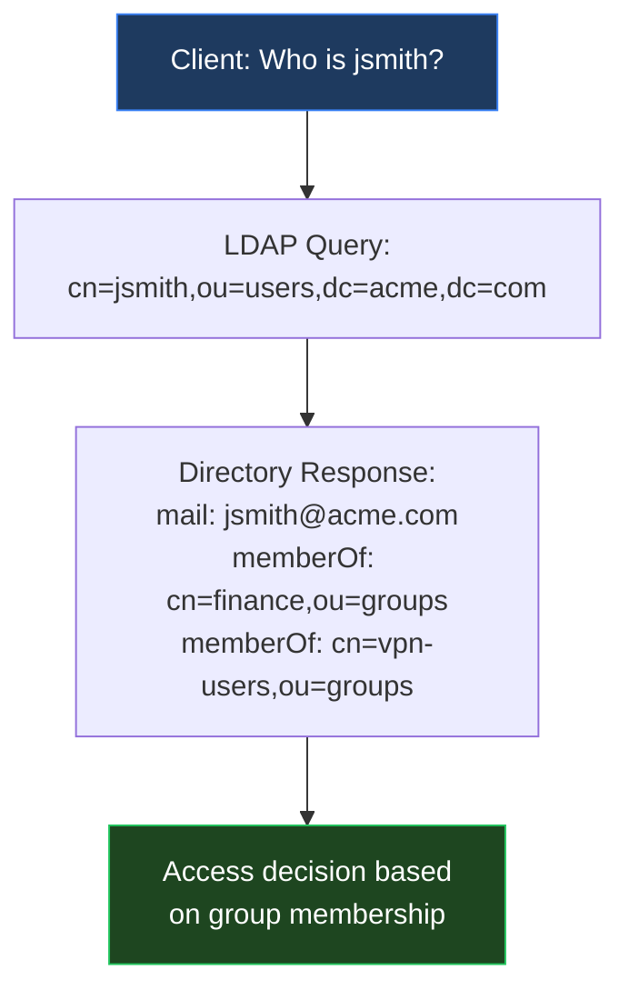
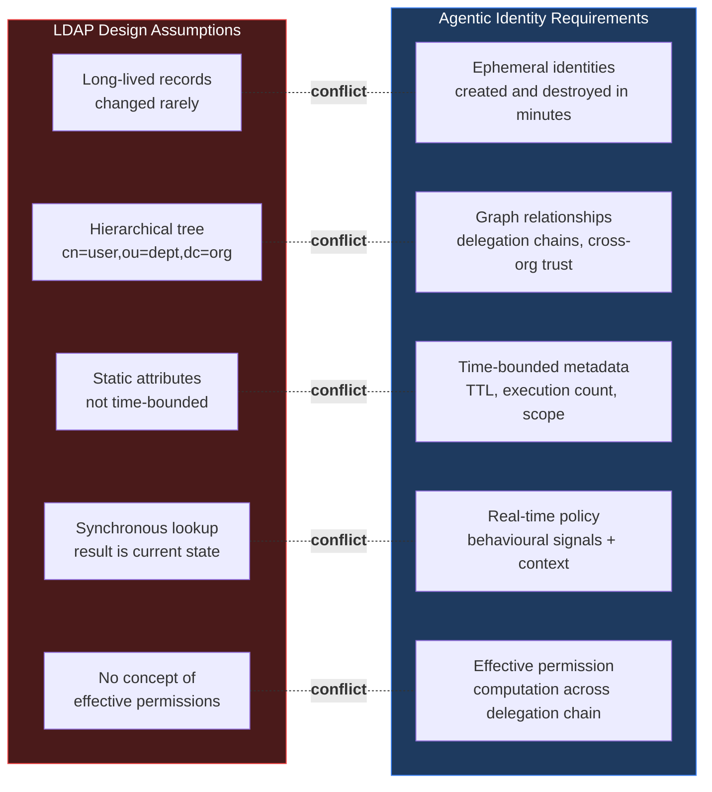
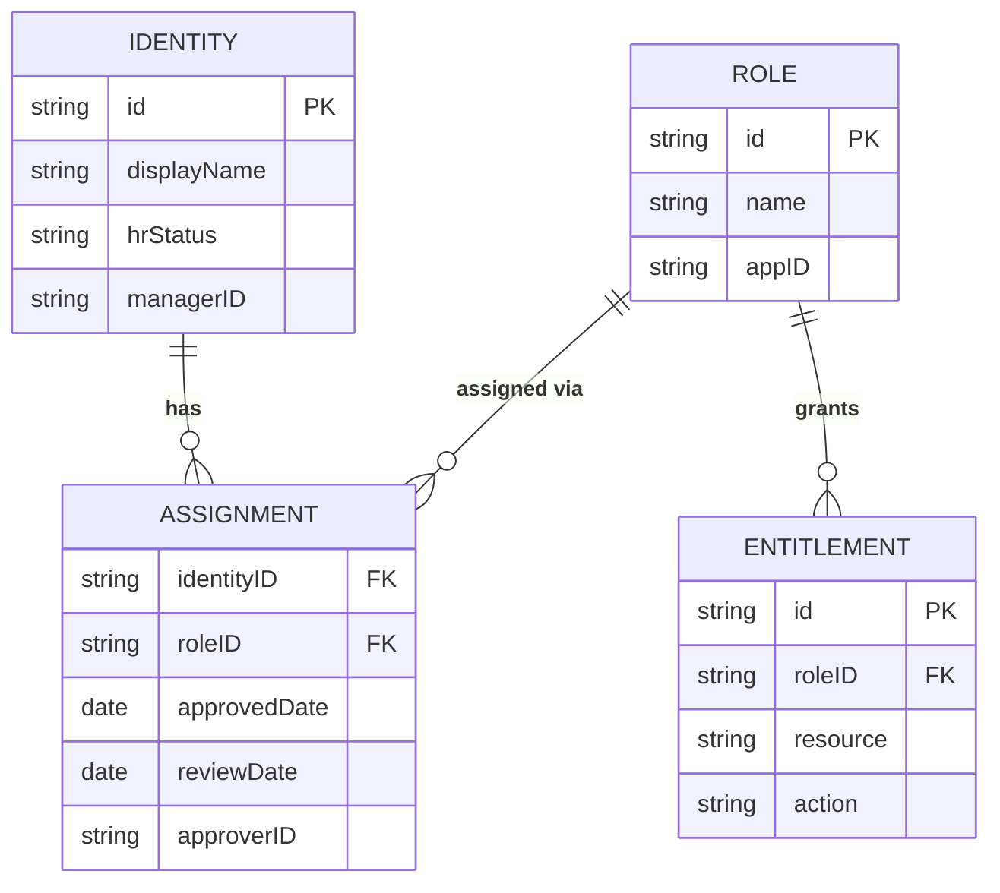
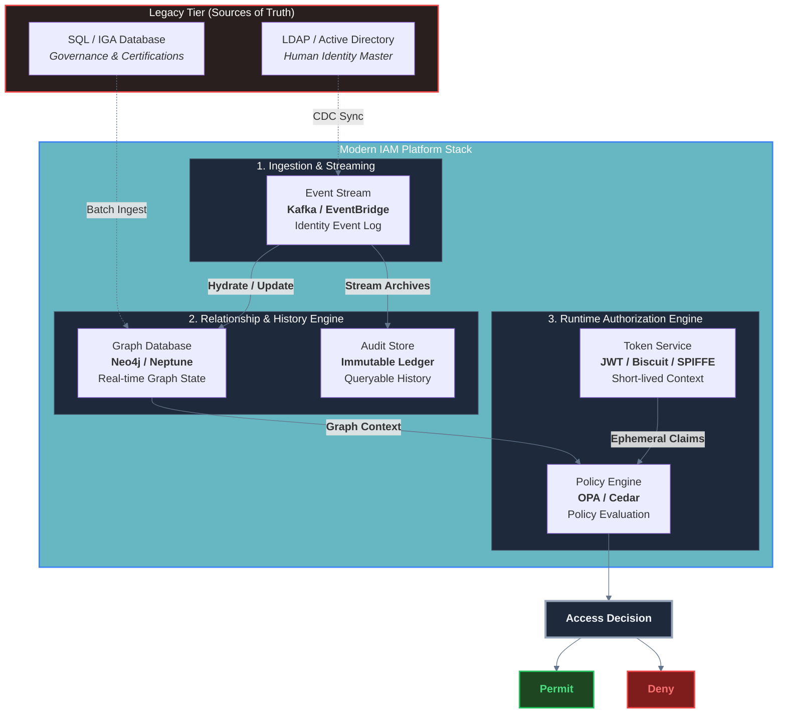
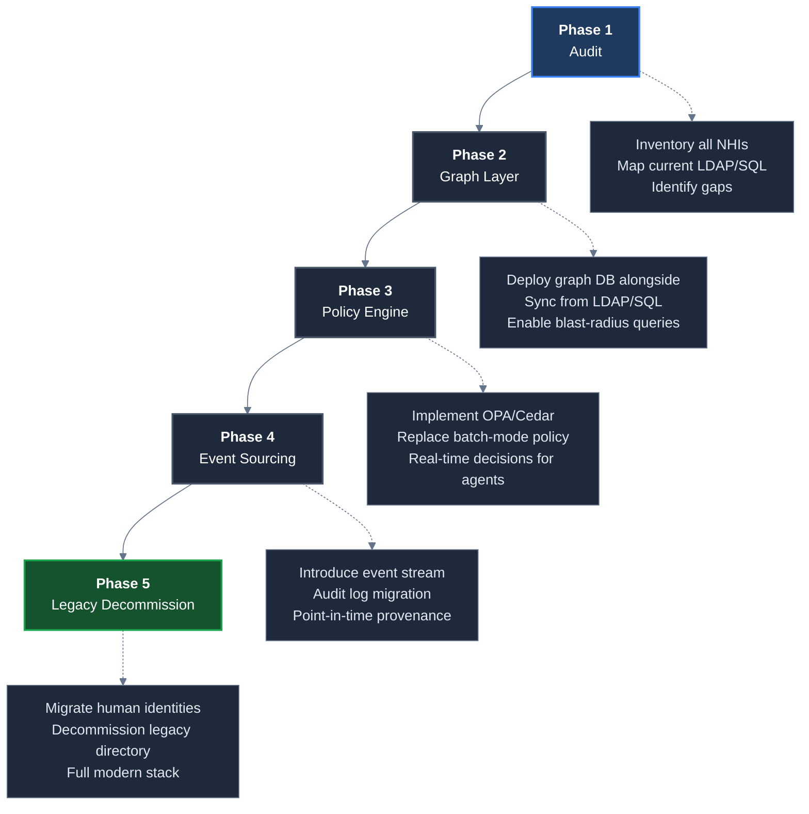

Every time a new IAM vendor promises to "solve" agentic identity by adding a feature to their platform, ask one question: *what is their backend?*

If the answer involves LDAP or a relational database as the primary identity store — and for the vast majority of platforms it does — then the feature is a facade built on a foundation that was designed before the concept of an AI agent existed.

This post is a technical examination of why the IAM backend stack — the LDAP directories and SQL schemas that underpin most of the market — creates structural friction for agentic identity management, and what a purpose-built modern backend looks like.

> This post is a companion to *[Three Generations of IAM Tools — and Why None of Them Were Built for the Agentic Era]()*.

---

## Why the Backend Matters More Than the Frontend

When organisations evaluate IAM platforms, they assess dashboards, certification workflows, connector counts, and AI feature announcements. The backend data architecture rarely appears in an RFP.

This is a mistake.

The backend determines:
- How fast access decisions can be computed at runtime
- Whether delegation chains can be traversed efficiently
- Whether ephemeral identities can be created, used, and destroyed at machine speed
- Whether policy can be enforced without a human in the loop

A modern UI bolted onto a 1990s data model is still a 1990s data model. And the data models at the core of most enterprise IAM deployments are, in substance, 1990s designs.

---

## The LDAP Problem

### What LDAP Was Designed to Do

LDAP — Lightweight Directory Access Protocol — descends from the X.500 directory standard developed in the 1980s. It was designed to answer one question efficiently:

> *"Given a username, return the attributes associated with this entry so I can authenticate and determine group membership."*

That is the entirety of the use case LDAP optimises for. It is a **read-heavy, hierarchical, attribute-lookup system**.

For this use case — a human employee authenticating to a corporate application — LDAP is adequate. Millions of enterprise deployments prove it.

### Where LDAP Breaks for Agentic Identity

The assumptions baked into LDAP's design directly contradict what agentic identity demands.

**Friction Point 1 — High-frequency writes**

LDAP is architected for infrequent writes. Directory replicas synchronise asynchronously; write amplification across replicas adds latency. In an agentic world, creating and destroying agent identities at the rate of thousands per hour is a required capability. LDAP backends under this write load become a bottleneck and a source of replication inconsistency.

**Friction Point 2 — Hierarchical tree cannot represent delegation graphs**

An LDAP Distinguished Name (DN) like `cn=agent-abc,ou=ai-agents,dc=acme,dc=com` encodes a static position in a tree. But Agent A delegating to Agent B, which delegates to Agent C — each with progressively narrowed scope — is a directed graph, not a tree position. There is no native LDAP mechanism to express *"this agent's authority is derived from, and bounded by, that agent's authority."*

**Friction Point 3 — No time-bounded attributes as a first-class concept**

LDAP attributes are static records. Expressing *"this agent credential is valid for 15 minutes and can only make 5 API calls"* requires custom schema extensions or external systems. These constraints live outside LDAP, in token metadata — which means the directory is no longer the authoritative source of truth for access rights.

**Friction Point 4 — Context-free lookups**

LDAP returns attributes. It does not evaluate policy. It cannot say *"deny this agent access because its IP is anomalous, even though the group membership would normally allow it."* This context-sensitivity is essential for agentic access control, and it requires a policy engine layer that sits entirely outside LDAP.

---

## The SQL Problem

### What Relational Schemas Were Designed to Do

The SQL identity store in most IGA platforms was designed to answer lifecycle governance questions:

- Who has access to what, right now?
- Was this access approved?
- When should it expire?
- Has it been reviewed recently?

The schema looks something like this:

This schema is correct for its intended purpose. It accurately represents stable, human-centric access relationships that change through defined lifecycle events.

### Where SQL Breaks for Agentic Identity

**Problem 1 — Volume × Complexity = Performance Collapse**

At a [90:1 NHI-to-human ratio](https://www.artezio.com/pressroom/blog/transforming-cybersecurity-unprecedented/){:target="_blank"}, an enterprise with 50,000 employees has 4.5 million NHIs. Running a SoD analysis, a certification campaign, or a blast-radius query across that population using relational joins is not just slow — it is architecturally incoherent. These operations require full table scans or multi-hop joins that relational optimisers were not designed to handle at this scale.

Veza's Access Graph manages [over 30 billion permission relationships](https://newsroom.servicenow.com/press-releases/details/2025/ServiceNow-to-Expand-Security-Portfolio-With-Acquisition-of-Vezas-Leading-AI-native-Identity-Security-Platform/default.aspx){:target="_blank"}. There is no SQL schema that efficiently stores and traverses 30 billion rows for graph-pattern queries.

**Problem 2 — State vs. Event: The Wrong Paradigm**

A relational identity store models *current state*: who has what access, right now. But agentic access is fundamentally **event-driven**:

- An agent is instantiated
- It requests a credential with a specific scope
- It uses that credential to access Resource X
- It delegates a sub-scope to Agent B
- It expires

None of these events are well-represented in a state table. The governance question for agentic identity is not *"what role does this agent have?"* but *"what did this agent do, to what resources, under what delegated authority, and what was the delegation chain?"*

That is an audit and provenance question, which requires **event sourcing** — an append-only log of identity events — not a state table with `last_modified` columns.

**Problem 3 — The Ephemeral Identity Anti-Pattern**

SQL schemas are optimised for stable records. Creating and deleting records at high frequency causes:
- Table fragmentation and index bloat
- Lock contention under high write concurrency
- Audit log growth that quickly becomes unmanageable

Attempting to represent AI agent identities in a traditional IGA SQL schema treats what should be a **token with embedded metadata** as a **record with a lifecycle** — and the mismatch creates operational pain at every layer.

---

## The Four Bottlenecks Together

### The Graph Database

The core of a modern IAM backend is a **graph database** — Neo4j, TigerGraph, or Amazon Neptune are the most enterprise-viable options. Access relationships are stored as edges between nodes (identities, resources, roles, policies), enabling:

- Sub-second traversal of delegation chains regardless of depth
- Blast-radius queries: *"if Agent X is compromised, what can it reach?"*
- Path analysis: *"show every route from Identity Y to Production Database Z"*
- Efficient queries at billions-of-edges scale that would take minutes in SQL

Veza's Access Graph is the commercially proven implementation of this approach. The graph is not a replacement for SQL — it is the right data structure for permission *relationships*, with SQL remaining appropriate for compliance *records*.

### Event-Sourced Identity Log

Identity state should be derived from an immutable event log. Every grant, revocation, delegation, credential issuance, and expiry is an event appended to a stream (Kafka, EventBridge, or a purpose-built event store).

Benefits:
- Full provenance: reconstruct the exact permission state of any agent at any point in time
- Audit by default: no separate audit table needed; the event log *is* the audit trail
- Point-in-time queries: *"what could Agent X access at 14:32 on Tuesday?"*
- Replay for forensics: reconstruct an incident's full access trajectory

This is the correct answer to the OpenID Foundation's identified gap around **closing the auditability gap** — the current inability to distinguish agent-performed actions from user-performed actions in audit logs.

### Policy-as-Code Engine

Policy evaluation must be decoupled from the identity store and executed in real time. The two leading options are:

| Engine | Language | Best For |
|--------|----------|---------|
| OPA (Open Policy Agent) | Rego | Cloud-native, Kubernetes-native, flexible |
| Amazon Cedar | Cedar | AWS-native, formally verified, high-performance |

The pattern follows the OpenID Foundation's recommended **PEP/PDP separation** (Policy Enforcement Point / Policy Decision Point from NIST SP 800-162):

- The PEP intercepts the agent's access request (API gateway, service mesh, SDK)
- The PDP evaluates the policy against current context: agent identity, delegation chain, resource sensitivity, time, behavioural risk score
- The decision is returned in milliseconds, not seconds

Legacy IGA platforms with nightly batch certification runs are **not policy engines**. They are audit tools pretending to be enforcement tools.

### Short-Lived Token Service

Agent credentials should be **short-lived tokens with embedded constraints**, not long-lived secrets stored in LDAP or SQL records.

The options:
- **JWT (JSON Web Token)** with short TTL — the current standard; widely supported
- **SPIFFE SVIDs** — cryptographically verifiable workload identity; suitable for infrastructure-level agent identity
- **Biscuits / Macaroons** — enable offline scope attenuation; allow an agent to generate a more restricted sub-token for its sub-agents without a round-trip to the authorization server

This last point directly addresses the OpenID Foundation's identified gap around recursive delegation — **scope attenuation** where permissions provably narrow at each delegation hop.

---

## The Migration Reality

Replacing LDAP and SQL entirely is a multi-year programme for most enterprises. The pragmatic path is **layered augmentation**:

Most organisations will complete Phases 1–3 within a 2-year window. Phase 4 requires organisational maturity around event-driven architecture. Phase 5 is a 5–7 year horizon for most large enterprises.

The key insight: **you do not need to decommission LDAP to start getting agentic identity right**. Deploying a graph layer that reads from LDAP and SQL — while adding the event stream and policy engine — provides the capabilities that matter for agents, without requiring a rip-and-replace of the human identity infrastructure.

---

## Key Takeaways

- **LDAP** was designed in the 1980s for read-heavy, hierarchical, attribute-lookup of human directory entries. It is structurally incompatible with ephemeral agent identities, delegation graphs, and time-bounded credentials.

- **SQL schemas** model identity state accurately but fail at NHI volume, graph-pattern queries, and the event-sourced access patterns that agentic provenance requires.

- **The combination** of LDAP + SQL + batch-mode policy + human approval workflows creates four compounding bottlenecks. The practical result is either blocked agent operations or developer bypasses (hardcoded secrets).

- **A modern IAM backend** requires: a **graph database** for permission relationships, an **event-sourced identity log** for provenance, a **real-time policy engine** (OPA/Cedar) for access decisions, and a **short-lived token service** with scope attenuation support.

- **Migration is layered, not rip-and-replace.** Deploy the graph and policy layers alongside existing LDAP/SQL infrastructure first. This unlocks agentic identity capabilities without destabilising the human identity foundation.

- **The vendors who get this right** — Veza/ServiceNow's Access Graph being the most commercially advanced example — built graph-native from day one. Gen2 platforms adding agentic features on LDAP/SQL foundations are solving the wrong layer.

---

[*Part of the IAM for the Agentic Era series.*](){:target="_blank"}