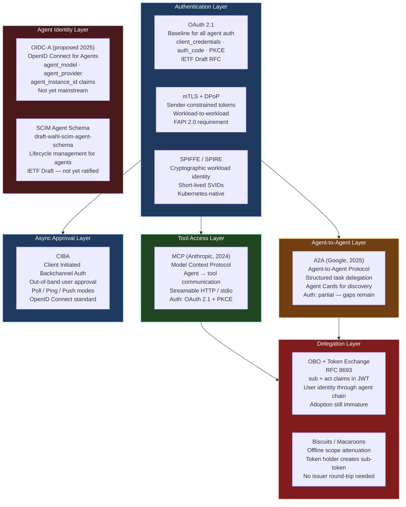
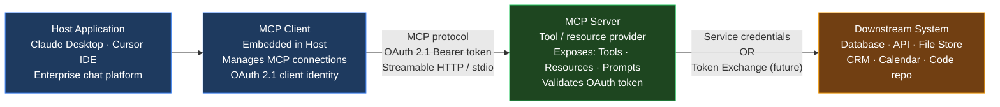
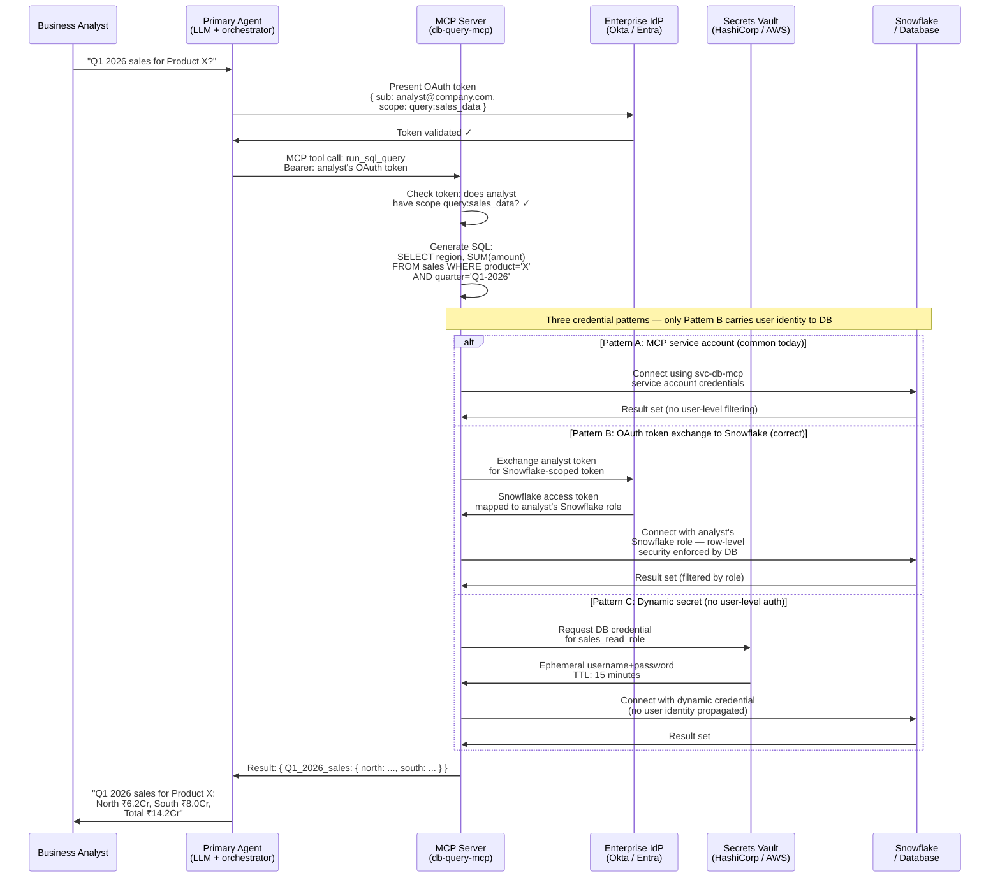
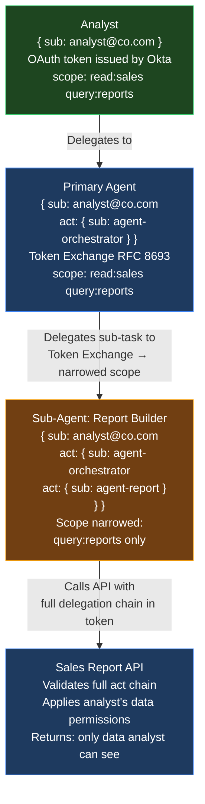
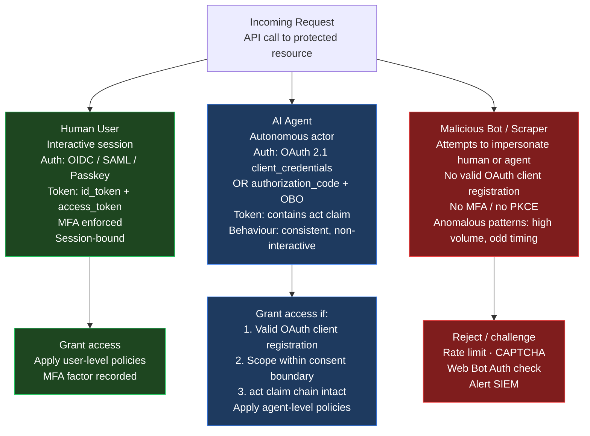
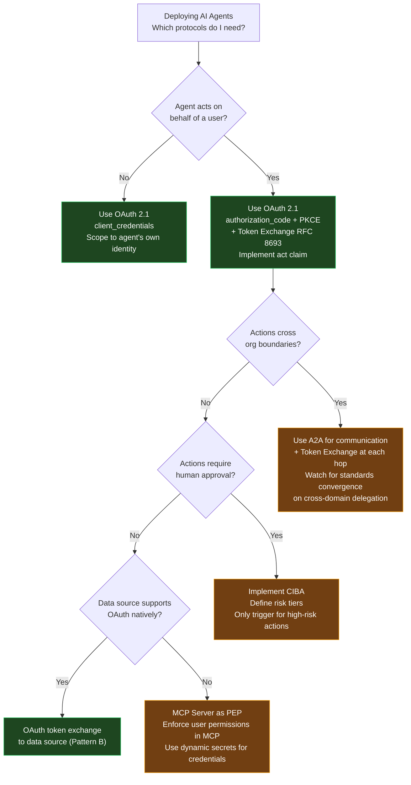

There is no law of the land for agentic identity protocols — yet.

Anthropic proposed [MCP](https://modelcontextprotocol.io/){:target="_blank"} for model-to-tool communication. Google proposed [A2A](https://a2aprotocol.ai/){:target="_blank"} for agent-to-agent communication. Microsoft ships [Entra Agent ID](https://learn.microsoft.com/en-us/entra/identity/){:target="_blank"}. The [OpenID Foundation](https://openid.net/){:target="_blank"} is finalising an agentic identity whitepaper. The IETF has open drafts for SCIM agent schemas, token exchange, and delegation chains. The EU, India, the US, and UAE are each adding regulatory requirements on top.

The result is a fragmented landscape where a single enterprise AI agent may simultaneously use five different protocols — and where a question as simple as *"did the user's permission travel to the database?"* has no standardised answer.

This post maps the full protocol landscape, explains how each protocol works, traces a concrete enterprise scenario through the full stack, and then frames what every stakeholder must understand before making implementation decisions.

---

## The Protocol Landscape — What Exists Today

Before diving into each protocol, a map of the full stack is essential. Agentic identity protocols operate at different layers — authentication, tool access, agent communication, async approval, and identity claims — and none of them is a complete solution on its own. (By the time the blog was posted on 5th of June 2026)



The diagram reveals the architectural reality: green is production-ready, amber is available but with gaps, red is emerging. No protocol at the delegation layer is production-mature. Every cross-domain scenario — agent operating across organisations, agent delegating to sub-agent — sits in that red zone.

---

## OAuth 2.1 — The Baseline Every Agent Must Use

[OAuth 2.1](https://datatracker.ietf.org/doc/html/draft-ietf-oauth-v2-1-13){:target="_blank"} is not a new protocol — it is a consolidation of OAuth 2.0 best practices into a single, security-hardened specification. Every credible agent authentication pattern today builds on it.

**What changed from OAuth 2.0:**

| OAuth 2.0 | OAuth 2.1 |
|-----------|-----------|
| Implicit flow (token in URL fragment) | Removed — too risky |
| Resource Owner Password Credentials | Removed — passwords should never travel |
| PKCE(Proof Key for Code Exchange) optional | PKCE mandatory for all clients |
| Bearer tokens default | Sender-constrained tokens (DPoP(Demonstrating Proof of Possession) or mTLS(Mutual TLS)) required for high-security |
| No specific guidance on redirect URI matching | Exact match required |

**How agents use OAuth 2.1:**

Two grant types are relevant for agents:

- **`client_credentials`** — for machine-to-machine communication where no user is present. An agent authenticates as itself and receives a token. This is appropriate when the agent is performing system-level tasks that do not represent a specific user's delegated action.

- **`authorization_code + PKCE`** — when the agent is acting on behalf of a logged-in user. The user grants consent, the agent receives a token that carries the user's identity. This is the correct pattern when user permissions must travel with the request.

The critical distinction: `client_credentials` does **not** carry user identity. If an agent uses `client_credentials` to access a database, the database sees the agent's service identity, not the user's identity. This is the root of the permission-propagation problem explored in the database scenario below.

---

## MCP — How Agents Access Tools

The [Model Context Protocol](https://modelcontextprotocol.io/){:target="_blank"} (MCP), published by Anthropic in late 2024, standardises how AI agents connect to external tools, data sources, and services. It is the most widely adopted agent connectivity standard available today.

**MCP architecture:**



MCP defines two primitives:
- **Tools** — model-controlled functions that allow the agent to take actions (`create_ticket`, `run_query`, `send_email`)
- **Resources** — application-controlled, read-only data sources that provide context (`company_policies`, `product_catalogue`)

**The authentication gap MCP initially shipped without:** The original MCP specification (November 2024) had no authentication mechanism. Community pressure and enterprise feedback led to the integration of OAuth 2.1 with PKCE as the standard in subsequent revisions. Any MCP deployment in an enterprise context must implement this; unauthenticated MCP is not acceptable for production systems.

**The remaining gap:** MCP authentication governs the agent-to-MCP-server relationship. What the MCP server does with the downstream tool (the database, the API) is not standardised. The MCP server typically uses its own service credentials for the downstream connection — the user's identity does not automatically propagate. This is the core of the database problem described in the next section.

---

## A2A — When Agents Talk to Each Other

Google's [Agent-to-Agent (A2A) Protocol](https://a2aprotocol.ai/){:target="_blank"} (2025) addresses the communication layer when one agent needs to delegate a task to another agent, potentially operated by a different organisation.

**Key A2A concepts:**

- **Agent Card**: a metadata document (served at `/.well-known/agent.json`) declaring an agent's capabilities, supported modalities, and authentication requirements
- **Task lifecycle**: `submitted → running → completed | failed | requires_input`
- **Authentication**: A2A specifies that agents must authenticate using standard OAuth 2.1 flows, but does not fully standardise what happens to authorization scope across agent boundaries

**The authorization gap A2A leaves open:**

When Agent A (in Organisation 1) delegates a task to Agent B (in Organisation 2), A2A defines how the communication happens. It does not define:

1. How Agent B proves to Organisation 1's resources that it is acting on behalf of the user who initiated the task
2. Whether the permission scope narrows at the A2A boundary (scope attenuation)
3. How Organisation 1 can revoke Agent B's delegated authority in real time

This is why cross-domain agent delegation is the hardest unsolved problem in agentic identity: the communication protocol (A2A) and the identity/authorization protocol (OAuth 2.1) are separate, and their integration across trust boundaries is not yet standardised.

---

## The Enterprise DB Scenario — All Protocols Intersecting

This is where the protocol complexity becomes tangible. Consider the question a business analyst types into their enterprise AI assistant:

> *"What were Q1 2026 sales for Product X across all regions?"*

The agent must: understand the question → identify the right data source → generate a SQL query → execute it → return a formatted answer. Here is what actually happens at the protocol layer:



**The three credential patterns explained:**

**Pattern A — MCP service account (what most deployments do today):**
The MCP server connects to Snowflake using its own service account. The user's identity does not reach the database. Row-level security and column masking in Snowflake cannot be applied per user. The MCP server itself is responsible for enforcing what data to return based on the user's OAuth scope. Risk: the MCP server becomes a single point of trust, and bugs in its permission logic expose data incorrectly.

**Pattern B — OAuth token exchange to Snowflake (architecturally correct):**
[Snowflake supports OAuth](https://docs.snowflake.com/en/user-guide/oauth-intro){:target="_blank"} natively. The MCP server exchanges the user's enterprise OAuth token for a Snowflake-scoped token. Snowflake maps the token to the analyst's Snowflake role. Row-level security, dynamic data masking, and column-level permissions in Snowflake are enforced as they would be for a human analyst. The user's permission genuinely travels to the database. This is the correct pattern but requires Snowflake OAuth configuration and an identity provider that supports token exchange ([RFC 8693](https://datatracker.ietf.org/doc/html/rfc8693){:target="_blank"}).

**Pattern C — Dynamic secrets (good for credential hygiene, not for user-level auth):**
HashiCorp Vault (or AWS Secrets Manager) generates a short-lived database credential on-demand. No static passwords exist. However, the dynamic credential maps to a Vault-defined role (e.g., `sales_read_role`), not to the specific user. User-level permissions are not enforced at the database layer. This pattern is excellent for eliminating static credentials but must be combined with Pattern B if user-level data access control is required.

**The recommendation:** Pattern B for regulated data (financial, health, PII). Pattern C for non-sensitive operational data. Pattern A only if the MCP server has robust, audited permission enforcement and the data does not require per-user access control.

---

## The Delegation Chain Problem — How Permission Travels

The database scenario shows a single-hop delegation. Real enterprise agent workflows involve multiple hops — and this is where the protocol gaps become severe.



**The `act` claim (RFC 8693):**

When a token is exchanged to represent delegation, the resulting JWT carries nested identity via the `act` (actor) claim:

```json
{
  "sub": "analyst@company.com",
  "act": {
    "sub": "agent-orchestrator-id",
    "act": {
      "sub": "agent-report-builder-id"
    }
  },
  "scope": "query:reports",
  "exp": 1749600000
}
```

The resource server (Sales Report API) can read this chain and know: *the analyst authorised this action, it was executed by the orchestrator agent, which delegated to the report-builder agent, and only `query:reports` scope was granted.* This is a complete, auditable delegation chain — and it is what the industry currently lacks in most deployments.

**Why this is not standard practice today:**

- Token Exchange (RFC 8693) has limited adoption in enterprise IdPs
- Most agents today use `client_credentials` and act as themselves, not on behalf of a user
- The `act` claim interpretation is not yet enforced by most resource servers
- Sub-agent tokens are typically new `client_credentials` grants, breaking the chain entirely

**Scope attenuation with Biscuits:**

[Biscuits](https://www.biscuitsec.org/){:target="_blank"} and [Macaroons](https://dcache.org/manuals/UserGuide-8.2/macaroons.shtml){:target="_blank"} allow a token holder to create a more restricted version of their token *without contacting the issuer*. An orchestrator agent with `scope: read:sales query:reports` can mint a sub-token for a sub-agent with `scope: query:reports` only — offline, cryptographically verifiable, without a network round-trip. This enables secure, decentralised delegation in high-throughput agent pipelines where real-time authorization server contact is a bottleneck.

---

## Human vs Agent vs Bot — The Identification Problem

When a request arrives at an API gateway, the gateway must classify the requester to apply the correct policy. This is not a binary human/machine question — it is a three-way classification with distinct governance implications.



**Detection signals at the token layer:**

| Signal | Human | AI Agent | Malicious Bot |
|--------|-------|---------|---------------|
| Grant type | `authorization_code` with MFA | `client_credentials` OR `authorization_code + OBO` | Stolen token, no valid grant |
| `act` claim | Absent | Present if OBO flow used | Absent (impersonation) |
| `agent_type` claim (OIDC-A) | Absent | Present (`llm_agent`) | Absent |
| User-Agent header | Browser or mobile SDK | `langchain/0.2`, custom agent string | `curl`, scraped browser UA |
| Request pattern | Irregular, human-speed | Consistent, programmatic | High-volume, irregular |
| Source IP | User's device / corporate VPN | Fixed infrastructure IP | Variable, VPN/TOR |
| Interactive session | Yes — cookie + session | No | Attempts to simulate |

**[Web Bot Auth](https://datatracker.ietf.org/doc/bofreq-nottingham-web-bot-auth/){:target="_blank"}** (IETF proposal, 2024) takes detection further: a legitimate agent can cryptographically sign its HTTP requests using HTTP Message Signatures, proving it is an identified, accountable agent — not an anonymous scraper. This allows the web server to distinguish between:

- *"This is agent-orchestrator-v2 operated by Acme Corp (verified)"* — grant access
- *"This request has no agent identity assertion"* — apply bot-blocking or challenge

Web Bot Auth is not yet an RFC but is gaining commercial traction with [Cloudflare](https://www.cloudflare.com/){:target="_blank"} and [Vercel](https://vercel.com/){:target="_blank"} actively contributing.

---

## Regional Governance — The Regulatory Layer on Top

Protocols define the technical mechanism. Regulatory frameworks define the *requirements* those mechanisms must satisfy. These are not the same, and they vary significantly by geography.

| Region | Key Regulation | Protocol Implication |
|--------|---------------|---------------------|
| **EU** | [EU AI Act](https://artificialintelligenceact.eu/){:target="_blank"} Art. 14: human oversight for high-risk AI; [GDPR](https://gdpr-info.eu/){:target="_blank"} Art. 22: automated decision restrictions | CIBA mandatory for decisions with legal significance; OBO `act` claims required for audit trails; scope must describe decisions not just data |
| **India** | [DPDP Act 2023](https://www.meity.gov.in/content/digital-personal-data-protection-act-2023){:target="_blank"}: consent-based personal data processing; [RBI AI circular](https://www.rbi.org.in/){:target="_blank"}: human-in-loop for financial AI | Consent record must be in Indian jurisdiction; revocation must be near-real-time; financial agents require human override capability |
| **US** | [NIST AI RMF](https://www.nist.gov/itl/ai-risk-management-framework){:target="_blank"}: risk-based AI governance; [SEC AI guidance](https://www.sec.gov/){:target="_blank"}: fiduciary AI must be explainable | No federal mandate on agent protocols yet; sector-specific requirements (healthcare: HIPAA, finance: FINRA) impose OBO and audit requirements |
| **UAE / ME** | [UAE AI Strategy](https://regulations.ai/regulations/united-arab-emirates-2017-10-national-ai-strategy-2031){:target="_blank"}; [DIFC Data Protection Law](https://www.difc.com/business/laws-and-regulations/legal-database/difc-laws/data-protection-law-difc-law-no-5-2020){:target="_blank"} | More permissive than EU; agent deployment is actively encouraged; DIFC requires audit trails for data-touching agent actions |
| **Global (FAPI 2.0)** | [Financial-grade API Security Profile](https://openid.net/specs/fapi-security-profile-2_0.html){:target="_blank"} | For any agent in financial services globally: mTLS or DPoP required (sender-constrained tokens); PKCE mandatory; PAR (Pushed Authorization Requests) required |

The practical consequence: a single enterprise deploying agents across EU, India, and the UAE must configure the same underlying protocols (OAuth 2.1, CIBA, OBO) to different compliance profiles depending on jurisdiction. This is why [IPSIE (Interoperability Profiling for Secure Identity in the Enterprise)](https://openid.net/wg/ipsie/){:target="_blank"}, the OpenID Foundation working group, is developing enterprise security profiles for AI agents — a single technical specification that maps to the major regulatory frameworks.

---

## CIBA and OIDC-A — What Is Being Built

### CIBA in Agent Workflows

[Client Initiated Backchannel Authentication](https://openid.net/specs/openid-client-initiated-backchannel-authentication-core-1_0.html){:target="_blank"} was introduced in the [consent post](){:target="_blank"} from a user perspective. From a protocol perspective, it fills a structural gap:

Long-running agent tasks cannot hold an interactive user session open. An agent processing an overnight compliance report cannot wait for the user to be logged in when it needs to approve an exception at 3 AM. CIBA provides a standardised mechanism:

1. Agent sends a CIBA request to the authorization server: `POST /bc-authorize` with `login_hint: analyst@company.com` and `binding_message: "Agent needs to approve risk exception for vendor X"`
2. IdP pushes a notification to the analyst's registered device (mobile app, Microsoft Authenticator, etc.)
3. Analyst approves or denies from their device
4. Agent polls or receives a callback with the authorization decision
5. Agent receives an access token (if approved) or handles the denial

This is the correct implementation of the EU AI Act's "effective human oversight" requirement for high-risk decisions.

### OIDC-A — Agent-Native Identity Claims

[OpenID Connect for Agents (OIDC-A)](https://arxiv.org/abs/2509.25974){:target="_blank"} (2025 proposal) extends OIDC's identity token with agent-specific claims. Where a human's `id_token` carries `sub`, `email`, `name`, an agent's identity token would carry:

| Claim | Example Value | Purpose |
|-------|-------------|---------|
| `agent_type` | `llm_agent` | Distinguishes agent from human or service account |
| `agent_model` | `claude-sonnet-4-6` | The specific model powering the agent |
| `agent_provider` | `anthropic` | The model provider |
| `agent_version` | `2.1.0` | The agent application version |
| `agent_instance_id` | `agent-uuid-abc123` | Unique identifier for this agent instance |

These claims enable:
- Risk-based access control based on model version (e.g., deny access to a model known to have a jailbreak vulnerability)
- Audit trails that identify not just that an agent acted, but which model version made the decision
- Policy enforcement that differs by agent type (`llm_agent` gets different scopes than `rpa_bot`)

OIDC-A is not yet supported by any production IdP. Microsoft Entra Agent ID, Okta AIM, and WSO2's agentic identity framework each implement proprietary equivalents. They do not interoperate.

---

## What Every Stakeholder Must Consider

Protocol decisions are not only engineering decisions. They carry CapEx, OpEx, compliance, and audit implications.

| Stakeholder | What to Evaluate Before Implementation |
|-------------|--------------------------------------|
| **Regulatory / Compliance** | Which protocols satisfy your jurisdiction's human-oversight requirements? CIBA is required for EU high-risk AI. OBO `act` claims are needed for GDPR-compliant audit trails. Verify before build. |
| **Executive / CISO** | Protocol fragmentation creates vendor lock-in risk. Proprietary agent identity (Entra Agent ID, Okta AIM) requires repeated integration work. Budget for standards convergence re-work in 18–24 months. |
| **Auditor** | Can the audit trail show: who authorised, which agent acted, which sub-agents were spawned, what the delegation chain was? If the answer is no, the protocol implementation is incomplete. |
| **Implementor / IGA Team** | Production-ready today: OAuth 2.1, MCP, CIBA. Drafts with no production support: SCIM agent schema, OIDC-A. Plan phased adoption: build on OAuth 2.1 now; layer OIDC-A when mainstream IdPs support it. |
| **Administrator / Platform Team** | Token lifetime strategy is a protocol decision with operational cost: shorter tokens mean more refreshes but smaller blast radius. MCP server credential management must be automated. CIBA notification delivery requires mobile push infrastructure. |
| **User / Customer** | CIBA is only useful if the user actually responds to approvals. Notification fatigue is a real failure mode. Design the agent's CIBA triggers carefully — not every decision needs a push notification. |
| **Developer** | Choose MCP for tool access (standardised, production-ready). Use OAuth 2.1 `authorization_code + PKCE` + token exchange for user-delegated agent flows. Implement `act` claims from day one even if no consumer enforces them today — you will need the audit trail. Avoid `client_credentials` for any flow where the user's permissions should govern the outcome. |

---

## Implementation Decision Framework

Given the current state of standards, the pragmatic path for an enterprise deploying agents today:



---

## What Must Change — The Standards Gap

The gaps are known. The work is underway. The timeline is measured in years.

| Gap | Current State | What Is Being Built |
|-----|--------------|-------------------|
| **Cross-domain agent delegation** | No standard; A2A handles communication but not authorization across org boundaries | IETF [Identity and Authorization Chaining Across Domains](https://datatracker.ietf.org/doc/draft-ietf-oauth-identity-chaining/){:target="_blank"} draft |
| **Scope attenuation in chains** | Biscuits/Macaroons exist but are not mainstream IAM toolkit items | Token Exchange RFC 8693 + offline attenuation; growing interest from platform teams |
| **Agent identity claims** | Every vendor proprietary (Entra Agent ID, Okta AIM, WSO2) | OIDC-A proposal; OpenID Foundation AI Identity Community Group |
| **Agent lifecycle management** | No standard provisioning / decommissioning | [SCIM agent schema draft](https://datatracker.ietf.org/doc/draft-wahl-scim-agent-schema/){:target="_blank"} |
| **Web agent identification** | Bots and agents indistinguishable from humans at the HTTP layer | [Web Bot Auth IETF proposal](https://datatracker.ietf.org/doc/bofreq-nottingham-web-bot-auth/){:target="_blank"} |
| **Regulatory compliance profiles** | Each organisation builds its own interpretation | [IPSIE working group](https://openid.net/wg/ipsie/){:target="_blank"} enterprise security profiles |

> **Security implications of these protocol gaps** — what happens when an agent uses a misconfigured protocol, when a token is stolen from a delegation chain, or when a confused deputy attack exploits scope ambiguity — are the subject of the next post: *Building Secure AI Agent Systems: A Practical Architecture Guide*.

---

## Key Takeaways

- **There is no single agentic identity standard today.** OAuth 2.1 is the baseline. MCP governs tool access. A2A governs agent-to-agent communication. CIBA governs async approval. OIDC-A is a proposal. Each solves a different layer, and the integration across layers — especially at trust domain boundaries — is not yet standardised.

- **The enterprise database question has three answers, only one of which carries user permissions to the data source.** OAuth token exchange to a database that supports OAuth natively (Pattern B) is architecturally correct. MCP-as-PEP (Pattern A) is practical but places all access control responsibility on the MCP server. Dynamic secrets (Pattern C) eliminate static credentials but do not propagate user identity.

- **The `act` claim in JWT (RFC 8693) is the mechanism for auditable delegation chains** — but adoption is immature. Building it in from day one, even if no resource server enforces it today, preserves the audit trail you will need when regulators ask.

- **Human vs agent vs bot detection requires signal analysis across token claims, authentication method, User-Agent headers, and behavioural patterns.** Web Bot Auth adds cryptographic proof of agent identity at the HTTP layer. No single signal is definitive.

- **Regulatory requirements add protocol constraints that vary by jurisdiction.** EU AI Act mandates CIBA for high-risk decisions. Indian DPDP mandates consent records within jurisdiction. FAPI 2.0 mandates sender-constrained tokens for financial agents globally. Build on OAuth 2.1 + PKCE + CIBA as the portable baseline.

- **Developer guidance:** Use MCP for tool access. Use `authorization_code + PKCE + token exchange` for user-delegated flows. Implement `act` claims. Avoid `client_credentials` when user permissions must govern the outcome. Design for CIBA from the start.

- **The convergence is coming.** IPSIE profiles, OIDC-A, SCIM agent schema, and cross-domain token exchange drafts are all active. Build on open standards now, anticipate a 2-year window before these reach production maturity in mainstream IdPs.

---

[*Part of the IAM for the Agentic Era series.*](){:target="_blank"}
