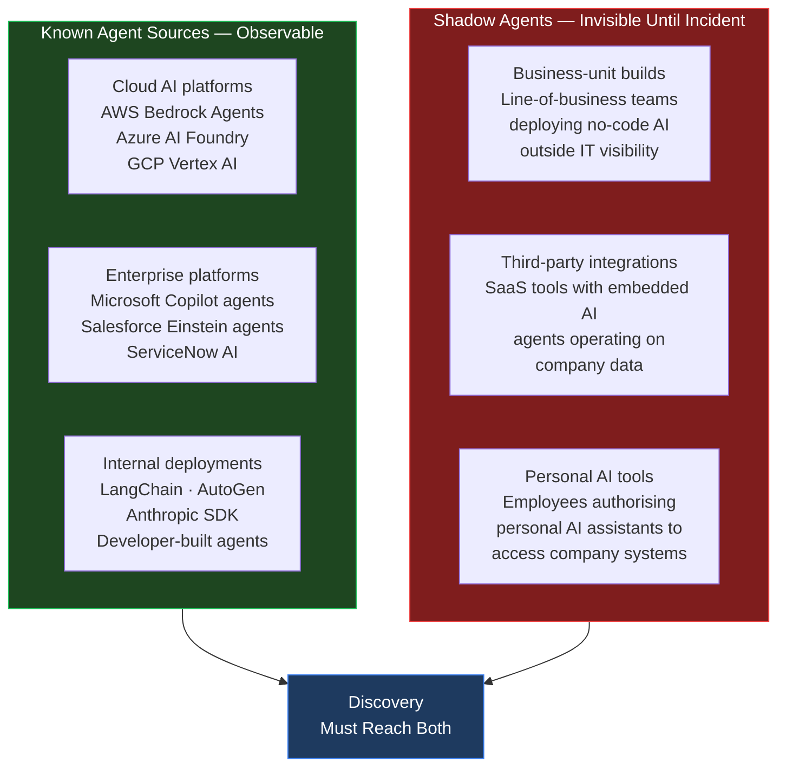
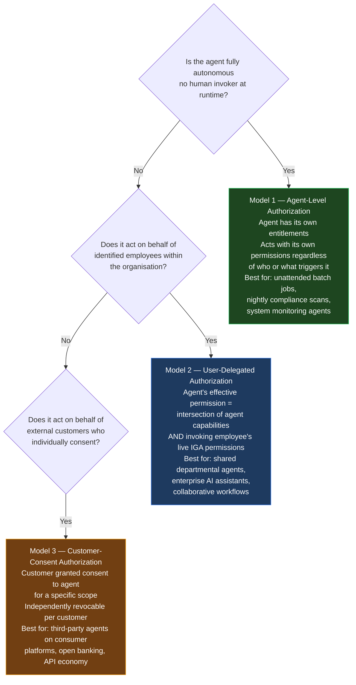
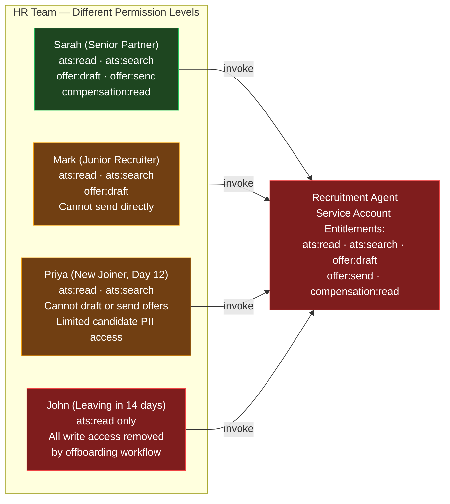
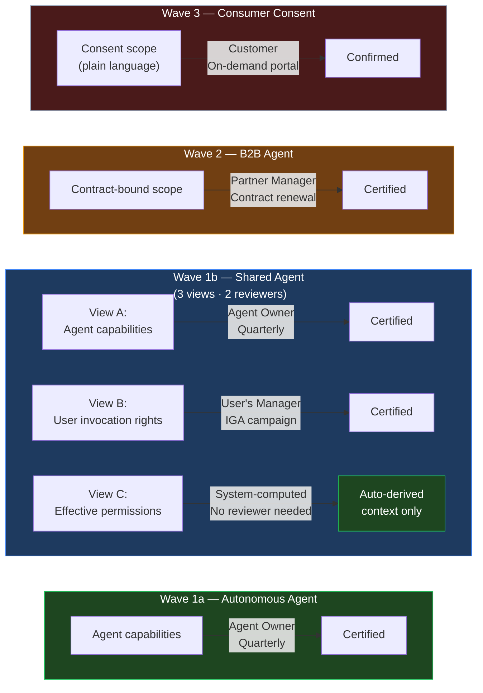

The [previous post](){:target="_blank"} established that the final layer of agent security — the one that makes every technical control durable — is governance. This post is about what that governance actually requires and why it is harder than it looks.

The broader NHI governance problem — service accounts, API keys, certificates, CI/CD tokens, workload identities — was covered in depth in [Non-Human Identities: The Hidden Attack Surface](){:target="_blank"}. The IGA mechanisms for traditional NHI (discovery, ownership, access reviews, orphan detection) were established there and are not repeated here.

What that post deliberately excluded — and what this post addresses — is the governance of **AI agent identities**. The same IGA platforms apply. But the governance model they implement is structurally wrong for how agents actually work. And the industry is beginning to notice.

---

## The Governance Gap NHI Governance Leaves Open

Traditional NHI governance assumes the entity being governed is deterministic. A service account does what its code does. If the code is reviewed and the permissions are correct, the service account is governed. An auditor can certify it. An owner can describe its purpose and confidently state that it has not changed since last review.

AI agents break this assumption at the foundation:

| Governance Dimension | Service Account | AI Agent |
|--------------------|----------------|---------|
| **Behaviour** | Deterministic — executes fixed code | Non-deterministic — LLM-driven; same prompt, different outputs |
| **Behaviour on model update** | Unchanged | Changed — possibly materially — without any deployment event |
| **Invoker** | System or schedule — no human | Often a human — the agent acts on behalf of whoever invokes it |
| **Shared use** | Shared across applications | Shared across employees, teams, or customers |
| **Owner can certify** | Yes — owner knows exactly what the service account does | Uncertain — owner can certify the registered capabilities, not the LLM's decisions |
| **Audit trail** | "Service account X called API Y at time Z" | "Agent X called API Y" — but which human invoked it? Under whose permissions? |
| **Lifecycle trigger** | Application decommission | Agent can run indefinitely; version updates are continuous |

The critical question that traditional NHI governance cannot answer for agents: when an agent takes an action, is that action bounded by the invoking human's current permissions — or by the agent's service account permissions, which may be far broader?

This is not a hypothetical. It is the default failure mode in every enterprise AI assistant deployment that uses the service account model.

---

## Discovery: Finding Agents You Did Not Know You Had

Before governance can be applied, the inventory must be complete. For traditional NHI, discovery is already hard — [service accounts accumulate silently](){:target="_blank"}, and most organisations cannot produce an accurate count. For agents, discovery is harder still:



Shadow agents are the more dangerous discovery problem. A developer who connects their personal Claude or ChatGPT instance to a company Slack workspace, or a business analyst who uses a no-code AI tool connected to Salesforce — these are agents operating on company data under individual OAuth consent, not registered with any governance system.

**Practical discovery approach:**

- **Cloud platform connectors:** [SailPoint's Agent Identity Security](https://www.sailpoint.com/solutions/security-non-human-identities){:target="_blank"} connects directly to AWS, Azure, and GCP to enumerate agent registrations. This covers Wave 1 cloud-native agents.
- **OAuth consent scan:** Any agent authorised via OAuth leaves a record in the authorisation server's consent store. Scanning for third-party OAuth applications that have received user-delegated grants reveals shadow agents operating under employee consent.
- **API gateway traffic analysis:** Agents generating API calls show up as distinct clients in gateway logs — user-agent headers, client IDs, and call patterns identify non-human callers even without a formal registration.
- **Service account creation events:** Agents created by developers are typically paired with service account creation in cloud IAM. Monitoring for new service account creation with naming patterns matching AI frameworks flags unregistered agent deployments.

The discovery cadence must be continuous, not periodic. An agent can be deployed between quarterly scans and cause damage before the next inventory cycle.

---

## Three Authorization Models — The Framework That Determines How to Govern

The most important governance decision for any agent deployment is not which tool to use. It is which authorization model applies. The wrong model makes governance impossible regardless of which platform implements it.



**Most enterprise AI assistant deployments are Model 2 — and most are governed as Model 1.** This is the core governance failure the industry is not yet talking about openly.

---

## Why the Service Account Model Fails for Shared Agents

Consider a concrete enterprise scenario. A bank's HR department deploys a Recruitment Agent. It is registered in SailPoint as an AI agent, assigned an owner (the HR Head), and given a service account with broad HR capabilities: search applicant tracking, review profiles, draft offer letters, send approved offers, access compensation bands.

Under the service account model (Model 1 applied incorrectly), the agent has one fixed set of entitlements. Four HR team members can invoke it:



Under the service account model, when any of these four people invoke the agent, the agent acts with its own entitlements — not the invoker's. Mark asks the agent to send an offer; it sends one, bypassing the senior review requirement he cannot personally skip. John, in his last week with all write access removed, invokes the agent; it drafts and queues an offer letter — an action John is no longer personally authorised to take. Priya accesses full candidate PII through the agent despite her probation access restrictions.

None of this appears in the audit trail as a violation. The log reads: *"Recruitment Agent sent offer to Candidate #1847."* The agent is the actor. The invoking human is invisible.

**This is not an edge case. It is the default outcome of the service account model applied to shared agents.** And it will occur in every department that deploys a shared AI agent without the correct authorization model.

**The Model 2 fix — user-delegated authorization:**

When the correct model is applied, the agent's effective permission at runtime is the **intersection** of its registered capabilities and the invoking employee's live IGA permissions:

- John invokes the agent → IGA shows his permissions are `ats:read` only → agent receives a delegated token scoped to `ats:read` → drafting and sending are structurally impossible in this session
- Priya completes probation → IGA grants her full HR permissions → agent automatically reflects her expanded access at next invocation, no agent reconfiguration needed
- Mark's senior review requirement is enforced at IGA → agent cannot send on his behalf without the scope → the organisational control is preserved

The mechanism is [RFC 8693 Token Exchange](https://datatracker.ietf.org/doc/html/rfc8693){:target="_blank"} with `act` claims, established in the [protocols post](){:target="_blank"}. The governance implication is that the HR Head who owns the agent in IGA does not need to manage per-user agent configurations — IGA manages the humans, and the intersection model automatically propagates those decisions to every agent invocation.

---

## Multi-Stakeholder Perspectives on Agent Governance

Agent governance is not only a technical program. It carries regulatory, audit, and organisational accountability dimensions that differ by stakeholder.

| Stakeholder | What to Evaluate for Agentic / NHI Governance |
|------------|----------------------------------------------|
| **Regulatory / Compliance** | Which authorization model applies to each agent deployment? Model 2 (user-delegated) is required for any agent that takes actions on behalf of employees with different permission levels. Model 3 (consent) is required for any agent acting on customer data — [DPDP Act 2023](https://www.meity.gov.in/content/digital-personal-data-protection-act-2023){:target="_blank"}, [GDPR Art. 22](https://gdpr-info.eu/art-22-gdpr/){:target="_blank"}, and [EU AI Act](https://artificialintelligenceact.eu/){:target="_blank"} Art. 14 all require traceable human authorization for decisions with legal significance. An agent-level service account does not satisfy these. |
| **Executive / CISO** | Agent sprawl is the new service account sprawl — and agents are faster, more capable, and harder to audit. The blast radius question: if an agent's credentials are compromised, how many systems can it access, and how many employees' actions does it emulate? Behavioural risk scoring (covered below) is the executive-level metric to demand. |
| **Auditor** | Three questions agents must answer that service accounts cannot always answer: (1) Which human authorised this action? (2) Was the agent's action within the scope of that human's current permissions? (3) Which model version made the decision? If the audit trail cannot answer all three, the governance program is incomplete. |
| **Implementor / IGA Team** | Extend existing IGA with agent discovery connectors (AWS Bedrock, Azure AI Foundry, GCP Vertex AI). Assign owners to every agent. Implement access reviews for agent entitlements at the same cadence as privileged human accounts. But recognise the model gap: IGA today implements Model 1 for agents. Model 2 requires OAuth Token Exchange integration between IGA and the authorisation server — this is the tooling gap most platforms have not yet closed. |
| **Administrator / Platform Team** | Agent registration is an operational task requiring: unique OAuth client registration per agent type, scope definitions per task, token lifetime configuration (≤ 15 minutes for access tokens), and automated rotation of service credentials. Agent decommissioning must be operational SLA-bound: revoke credentials within 24 hours of retirement. |
| **User / Employee** | When you invoke a shared enterprise AI agent, you should expect that it cannot do things you personally cannot do. If an agent appears to have broader capabilities than your own access level, that is a governance failure — report it to your IT team. The agent acting on your behalf should not be able to bypass your own access controls. |
| **Developer** | Build agents with the authorization model in mind from the start. Model 1 agents should use `client_credentials` with explicitly defined scopes. Model 2 agents must request a user-delegated token via RFC 8693 Token Exchange at invocation time — not cache a service account token and act as themselves. The audit trail difference between these two patterns is the difference between governance and liability exposure. |

---

## What Vendors Are Building — And Where the Gaps Remain

### SailPoint: Agentic Fabric

[SailPoint Agent Identity Security](https://www.sailpoint.com/solutions/security-non-human-identities){:target="_blank"}, part of the [Agentic Fabric](https://www.sailpoint.com/products/agentic-fabric){:target="_blank"}, extends their Identity Security Cloud to cover AI agents as a fourth identity type alongside humans, non-employees, and machines. Capabilities: direct connectors to AWS, Azure, and GCP for agent discovery; ownership assignment with succession planning; certification campaigns for agent entitlements; behavioural risk scoring with anomaly-triggered remediation.

**What it solves:** Wave 1a (autonomous enterprise agents — Model 1). Discovery, inventory, ownership, access reviews, and behavioural monitoring are well-served within the SailPoint ecosystem.

**What it does not yet solve:** Model 2 (user-delegated authorization for shared agents) — the intersection-based authorization model is not a standard SailPoint feature. Agents governed in Agentic Fabric today still operate as service accounts with static entitlements; the HR department's Recruitment Agent problem is not addressed.

---

### Ping Identity: Runtime Enforcement for Agents

[Ping's agentic identity approach](https://www.pingidentity.com/){:target="_blank"} focuses on runtime authorisation — continuous, contextual enforcement at the moment of each agent API call, not just at provisioning time. Capabilities: runtime policy enforcement, human-in-the-loop guardrails for high-risk actions, real-time behavioural monitoring.

**What it solves:** Runtime enforcement of least privilege; CIBA integration for human approval gates; agent-to-system authorisation within the Ping ecosystem.

**What it does not yet solve:** Cross-platform agent governance; the Model 2 intersection authorisation model; B2B agent governance where two organisations' agents interact.

---

### The Vendor Landscape — A Consolidated View

| Vendor | Model 1<br/>(Autonomous) | Model 2<br/>(User-Delegated) | Model 3<br/>(Consumer Consent) | B2B Agent<br/>Governance |
|--------|:---:|:---:|:---:|:---:|
| [SailPoint](https://www.sailpoint.com/solutions/security-non-human-identities){:target="_blank"} | ✅ Production | ⚠️ Gap | ❌ Not in scope | ❌ Not in scope |
| [Saviynt](https://saviynt.com/){:target="_blank"} | ✅ Production | ⚠️ Gap | ❌ Not in scope | ❌ Not in scope |
| [Ping Identity](https://www.pingidentity.com/){:target="_blank"} | ✅ Runtime enforcement | ⚠️ Partial | ⚠️ Protocol only | ❌ Not in scope |
| [ConductorOne](https://www.conductorone.com/){:target="_blank"} | ✅ Growing | ⚠️ Gap | ❌ Not in scope | ❌ Not in scope |
| [Microsoft Entra Agent ID](https://learn.microsoft.com/en-us/entra/identity/){:target="_blank"} | ✅ Azure-native | ✅ Partial (Managed Identity + Conditional Access) | ❌ Not in scope | ❌ Not in scope |
| Purpose-built AIM (no commercial product yet) | — | — | 🔜 Needed | 🔜 Needed |

Summary: every major IGA vendor is implementing Model 1 for agents — treating them as a fourth identity type alongside service accounts, which is better than no governance but does not solve the shared agent problem. Model 2 has no production IGA implementation. Model 3 (consumer consent governance at scale) and B2B agent governance have no commercial solution at all.

---

## The Four Waves — A Governance Map

Agent adoption is not a single event. It is rolling across four distinct waves, each requiring different governance, with different commercial tooling available:

| Wave | Description | Scale (5-yr) | Governance State |
|------|------------|-------------|-----------------|
| **Wave 1a** | Autonomous enterprise agents — no human invoker at runtime (compliance scanner, nightly batch, monitoring) | 10M+ enterprise agent identities | ✅ Served by current IGA platforms (Model 1) |
| **Wave 1b** | Shared enterprise agents — multiple employees invoke a common agent (AI assistants, departmental copilots) | Majority of current enterprise AI deployments | ⚠️ Governed as service accounts (wrong model); Model 2 tooling gap |
| **Wave 2** | B2B agent-to-agent interactions — both parties are autonomous agents, both carry organisational liability | 500M–2B agent relationships | ❌ No commercial governance product; API management is insufficient |
| **Wave 3** | Consumer platform agents — third-party vendors' agents acting on individual customers' accounts under consent | 500M+ agent identities; 50B+ consent records | ❌ No purpose-built commercial product; consent governance at this scale is unbuilt |
| **Wave 4** | Personal cross-platform agents — one person's agent operating across multiple platforms | 20B+ agent identities | ❌ Standards not yet defined |

Waves 1b and 2 are happening right now. The governance tooling for Wave 1b exists in prototype at best. The tooling for Wave 2 does not exist commercially.

---

## What Access Certification Looks Like for Agents — Wave by Wave

The familiar access certification interface in an IGA campaign presents reviewable units that managers and application owners recognise:

<div style="font-family: -apple-system, BlinkMacSystemFont, 'Segoe UI', Helvetica, Arial, sans-serif; font-size: 14px; line-height: 1.8; background-color: #f6f8fa; padding: 15px; border-radius: 6px; border: 1px solid #d0d7de;">
<!-- 
```
[Employee Name]  →  [Application]  →  [Role / Entitlement]              [Certify | Revoke]
[Service Account (with description)]  →  [App]  →  [Entitlement]        [Certify | Revoke]
```
-->
  <!-- Row 1 -->
  <div style="display: flex; justify-content: space-between; align-items: center; margin-bottom: 16px; border-bottom: 1px solid #e1e4e8; padding-bottom: 12px;">
    <div>
      <span style="background-color: #ddf4ff; color: #0969da; padding: 4px 8px; border-radius: 4px; font-weight: 600;">Priya Mehta</span>
      <span style="color: #57606a; margin: 0 8px;">&rarr;</span>
      <span style="background-color: #dafbe1; color: #1a7f37; padding: 4px 8px; border-radius: 4px; font-weight: 500;">AWS Production <span style="font-size: 12px; color: #57606a;">(Cloud Infrastructure)</span></span>
      <span style="color: #57606a; margin: 0 8px;">&rarr;</span>
      <span style="background-color: #fff8c5; color: #9a6700; padding: 4px 8px; border-radius: 4px; font-weight: 500;">Administrator <span style="font-size: 12px; color: #57606a;">(Full Read/Write Access)</span></span>
    </div>
    <div style="display: flex; gap: 6px;">
      <button style="background-color: #2da44e; color: white; border: none; padding: 6px 12px; border-radius: 6px; cursor: pointer; font-weight: 600; font-size: 13px;">Certify</button>
      <button style="background-color: #cf222e; color: white; border: none; padding: 6px 12px; border-radius: 6px; cursor: pointer; font-weight: 600; font-size: 13px;">Revoke</button>
    </div>
  </div>

  <!-- Row 2 -->
  <div style="display: flex; justify-content: space-between; align-items: center;">
    <div>
      <span style="background-color: #f2e6ff; color: #6f42c1; padding: 4px 8px; border-radius: 4px; font-weight: 600;">svc-payment-processor <span style="font-size: 12px; color: #57606a;">(Automated Billing System)</span></span>
      <span style="color: #57606a; margin: 0 8px;">&rarr;</span>
      <span style="background-color: #dafbe1; color: #1a7f37; padding: 4px 8px; border-radius: 4px; font-weight: 500;">Stripe API <span style="font-size: 12px; color: #57606a;">(Payment Gateway Portal)</span></span>
      <span style="color: #57606a; margin: 0 8px;">&rarr;</span>
      <span style="background-color: #fff8c5; color: #9a6700; padding: 4px 8px; border-radius: 4px; font-weight: 500;">Refund_Initiator <span style="font-size: 12px; color: #57606a;">(Ability to issue customer refunds)</span></span>
    </div>
    <div style="display: flex; gap: 6px;">
      <button style="background-color: #2da44e; color: white; border: none; padding: 6px 12px; border-radius: 6px; cursor: pointer; font-weight: 600; font-size: 13px;">Certify</button>
      <button style="background-color: #cf222e; color: white; border: none; padding: 6px 12px; border-radius: 6px; cursor: pointer; font-weight: 600; font-size: 13px;">Revoke</button>
    </div>
  </div>
</div>


The reviewer understands what they are certifying. The context is clear. The decision is binary.

The [rubber-stamping problem](){:target="_blank"} in human access reviews happens when context is absent. For agents, the same failure occurs — but the blast radius when a reviewer certifies something they cannot interpret is larger, because agents act autonomously at scale. Certification view design directly determines review quality.

---

### Wave 1a — Autonomous Agent (Familiar Territory)

Unattended autonomous agents map cleanly onto the service account view. One reviewer certifies the agent's capability set:

<div style="font-family: -apple-system, BlinkMacSystemFont, 'Segoe UI', Helvetica, Arial, sans-serif; font-size: 14px; line-height: 1.6; background-color: #f6f8fa; padding: 20px; border-radius: 6px; border: 1px solid #d0d7de; max-width: 900px;">
    <!-- 
    ```
    Agent: ComplianceScanner-v2     │  Type: Autonomous    │  Owner: Sarah Chen (Risk Lead)
    Model Version: claude-haiku-4-5 │  Auto-update: NO     │  Last Active: 2026-06-06

    Application          Entitlement                     Last Used    Decision
    ─────────────────────────────────────────────────────────────────────────────
    CoreBankingDB     →  audit:read_all_transactions     Daily        [Certify | Revoke]
    LoanOrigination   →  audit:read_loan_records         Daily        [Certify | Revoke]
    ReportingEngine   →  report:generate_compliance      Weekly       [Certify | Revoke]
    ```
    -->
  <!-- Header Metadata Section -->
  <div style="display: grid; grid-template-columns: repeat(3, 1fr); gap: 12px; background-color: #ffffff; padding: 12px 16px; border-radius: 6px; border: 1px solid #e1e4e8; margin-bottom: 20px; box-shadow: 0 1px 3px rgba(0,0,0,0.05);">
    <div><strong style="color: #57606a;">Agent:</strong> <span style="background-color: #f2e6ff; color: #6f42c1; padding: 2px 6px; border-radius: 3px; font-weight: 600;">ComplianceScanner-v2</span></div>
    <div><strong style="color: #57606a;">Type:</strong> <span style="color: #24292f; font-weight: 500;">Autonomous</span></div>
    <div><strong style="color: #57606a;">Owner:</strong> <span style="color: #0969da; font-weight: 500;">Sarah Chen (Risk Lead)</span></div>
    <div><strong style="color: #57606a;">Model Version:</strong> <span style="font-family: monospace; background-color: #eaeef2; padding: 2px 4px; border-radius: 3px;">claude-haiku-4-5</span></div>
    <div><strong style="color: #57606a;">Auto-update:</strong> <span style="color: #cf222e; font-weight: 600;">NO</span></div>
    <div><strong style="color: #57606a;">Last Active:</strong> <span style="color: #24292f;">2026-06-06</span></div>
  </div>

  <!-- Permissions Table -->
  <table style="width: 100%; border-collapse: collapse; text-align: left;">
    <thead>
      <tr style="border-bottom: 2px solid #d0d7de; color: #57606a; font-weight: 600; font-size: 13px;">
        <th style="padding: 8px 12px;">Application</th>
        <th style="padding: 8px 12px;"></th>
        <th style="padding: 8px 12px;">Entitlement</th>
        <th style="padding: 8px 12px;">Last Used</th>
        <th style="padding: 8px 12px; text-align: right;">Decision</th>
      </tr>
    </thead>
    <tbody style="color: #24292f;">
      <!-- Row 1 -->
      <tr style="border-bottom: 1px solid #e1e4e8;">
        <td style="padding: 12px;"><span style="background-color: #dafbe1; color: #1a7f37; padding: 4px 8px; border-radius: 4px; font-weight: 500;">CoreBankingDB</span></td>
        <td style="color: #57606a; font-weight: bold; text-align: center;">&rarr;</td>
        <td style="padding: 12px;"><span style="font-family: monospace; background-color: #fff8c5; color: #9a6700; padding: 3px 6px; border-radius: 3px;">audit:read_all_transactions</span></td>
        <td style="padding: 12px; color: #57606a; font-size: 13px;">Daily</td>
        <td style="padding: 12px; text-align: right; white-space: nowrap;">
          <button style="background-color: #2da44e; color: white; border: none; padding: 5px 10px; border-radius: 6px; cursor: pointer; font-weight: 600; font-size: 12px; margin-right: 4px;">Certify</button>
          <button style="background-color: #cf222e; color: white; border: none; padding: 5px 10px; border-radius: 6px; cursor: pointer; font-weight: 600; font-size: 12px;">Revoke</button>
        </td>
      </tr>
      <!-- Row 2 -->
      <tr style="border-bottom: 1px solid #e1e4e8;">
        <td style="padding: 12px;"><span style="background-color: #dafbe1; color: #1a7f37; padding: 4px 8px; border-radius: 4px; font-weight: 500;">LoanOrigination</span></td>
        <td style="color: #57606a; font-weight: bold; text-align: center;">&rarr;</td>
        <td style="padding: 12px;"><span style="font-family: monospace; background-color: #fff8c5; color: #9a6700; padding: 3px 6px; border-radius: 3px;">audit:read_loan_records</span></td>
        <td style="padding: 12px; color: #57606a; font-size: 13px;">Daily</td>
        <td style="padding: 12px; text-align: right; white-space: nowrap;">
          <button style="background-color: #2da44e; color: white; border: none; padding: 5px 10px; border-radius: 6px; cursor: pointer; font-weight: 600; font-size: 12px; margin-right: 4px;">Certify</button>
          <button style="background-color: #cf222e; color: white; border: none; padding: 5px 10px; border-radius: 6px; cursor: pointer; font-weight: 600; font-size: 12px;">Revoke</button>
        </td>
      </tr>
      <!-- Row 3 -->
      <tr>
        <td style="padding: 12px;"><span style="background-color: #dafbe1; color: #1a7f37; padding: 4px 8px; border-radius: 4px; font-weight: 500;">ReportingEngine</span></td>
        <td style="color: #57606a; font-weight: bold; text-align: center;">&rarr;</td>
        <td style="padding: 12px;"><span style="font-family: monospace; background-color: #fff8c5; color: #9a6700; padding: 3px 6px; border-radius: 3px;">report:generate_compliance</span></td>
        <td style="padding: 12px; color: #57606a; font-size: 13px;">Weekly</td>
        <td style="padding: 12px; text-align: right; white-space: nowrap;">
          <button style="background-color: #2da44e; color: white; border: none; padding: 5px 10px; border-radius: 6px; cursor: pointer; font-weight: 600; font-size: 12px; margin-right: 4px;">Certify</button>
          <button style="background-color: #cf222e; color: white; border: none; padding: 5px 10px; border-radius: 6px; cursor: pointer; font-weight: 600; font-size: 12px;">Revoke</button>
        </td>
      </tr>
    </tbody>
  </table>
</div>

**Reviewer: Agent Owner.** Same quarterly cadence as service account review. This wave is manageable with current tooling — no new review process is needed.

---

### Wave 1b — Shared Agent (Three Distinct Views Required)

A shared enterprise agent used by multiple employees — an HR assistant, a finance co-pilot, a sales agent — requires **three certification views** that must be kept separate. Combining them into one screen creates a view that only an IAM architect can interpret. That is the rubber-stamping guarantee.

**View A — Agent Capability Review**
*Reviewer: Agent Owner — certifies what the agent can maximally do, regardless of who invokes it*

<div style="font-family: -apple-system, BlinkMacSystemFont, 'Segoe UI', Helvetica, Arial, sans-serif; font-size: 14px; line-height: 1.6; background-color: #f6f8fa; padding: 20px; border-radius: 6px; border: 1px solid #d0d7de; max-width: 950px;">
    <!-- 
    ```
    Agent: RecruitmentAgent-v3     │  Type: Shared (4 invokers)  │  Owner: Meera Iyer (HR Head)
    Model Version: claude-sonnet   │  Auto-update: YES ⚠️         │  Re-certify required on model update

    Application     Entitlement            Justification              Decision
    ─────────────────────────────────────────────────────────────────────────────────
    ATS          →  ats:read               Read candidate profiles    [Certify | Revoke]
    ATS          →  ats:search             Search candidate pool      [Certify | Revoke]
    ATS          →  offer:draft            Draft offer letters        [Certify | Revoke]
    ATS          →  offer:send             Send approved offers       [Certify | Revoke]
    HRSystem     →  compensation:read      Access salary bands        [Certify | Revoke]
    ```
    -->
  <!-- Header Metadata Section -->
  <div style="display: grid; grid-template-columns: repeat(3, 1fr); gap: 12px; background-color: #ffffff; padding: 12px 16px; border-radius: 6px; border: 1px solid #e1e4e8; margin-bottom: 20px; box-shadow: 0 1px 3px rgba(0,0,0,0.05);">
    <div><strong style="color: #57606a;">Agent:</strong> <span style="background-color: #f2e6ff; color: #6f42c1; padding: 2px 6px; border-radius: 3px; font-weight: 600;">RecruitmentAgent-v3</span></div>
    <div><strong style="color: #57606a;">Type:</strong> <span style="color: #24292f; font-weight: 500;">Shared (4 invokers)</span></div>
    <div><strong style="color: #57606a;">Owner:</strong> <span style="color: #0969da; font-weight: 500;">Meera Iyer (HR Head)</span></div>
    <div><strong style="color: #57606a;">Model Version:</strong> <span style="font-family: monospace; background-color: #eaeef2; padding: 2px 4px; border-radius: 3px;">claude-sonnet</span></div>
    <div><strong style="color: #57606a;">Auto-update:</strong> <span style="background-color: #fff8c5; color: #9a6700; padding: 2px 6px; border-radius: 3px; font-weight: 600;">YES ⚠️</span></div>
    <div style="grid-column: span 1;"><strong style="color: #57606a;">Notice:</strong> <span style="color: #cf222e; font-size: 13px; font-weight: 500;">Re-certify required on model update</span></div>
  </div>

  <!-- Permissions Table -->
  <table style="width: 100%; border-collapse: collapse; text-align: left;">
    <thead>
      <tr style="border-bottom: 2px solid #d0d7de; color: #57606a; font-weight: 600; font-size: 13px;">
        <th style="padding: 8px 12px;">Application</th>
        <th style="padding: 8px 12px; width: 30px;"></th>
        <th style="padding: 8px 12px;">Entitlement</th>
        <th style="padding: 8px 12px;">Justification</th>
        <th style="padding: 8px 12px; text-align: right; width: 160px;">Decision</th>
      </tr>
    </thead>
    <tbody style="color: #24292f;">
      <!-- Row 1 -->
      <tr style="border-bottom: 1px solid #e1e4e8;">
        <td style="padding: 12px;"><span style="background-color: #dafbe1; color: #1a7f37; padding: 4px 8px; border-radius: 4px; font-weight: 500;">ATS</span></td>
        <td style="color: #57606a; font-weight: bold; text-align: center;">&rarr;</td>
        <td style="padding: 12px;"><span style="font-family: monospace; background-color: #fff8c5; color: #9a6700; padding: 3px 6px; border-radius: 3px;">ats:read</span></td>
        <td style="padding: 12px; color: #24292f; font-size: 13px;">Read candidate profiles</td>
        <td style="padding: 12px; text-align: right; white-space: nowrap;">
          <button style="background-color: #2da44e; color: white; border: none; padding: 5px 10px; border-radius: 6px; cursor: pointer; font-weight: 600; font-size: 12px; margin-right: 4px;">Certify</button>
          <button style="background-color: #cf222e; color: white; border: none; padding: 5px 10px; border-radius: 6px; cursor: pointer; font-weight: 600; font-size: 12px;">Revoke</button>
        </td>
      </tr>
      <!-- Row 2 -->
      <tr style="border-bottom: 1px solid #e1e4e8;">
        <td style="padding: 12px;"><span style="background-color: #dafbe1; color: #1a7f37; padding: 4px 8px; border-radius: 4px; font-weight: 500;">ATS</span></td>
        <td style="color: #57606a; font-weight: bold; text-align: center;">&rarr;</td>
        <td style="padding: 12px;"><span style="font-family: monospace; background-color: #fff8c5; color: #9a6700; padding: 3px 6px; border-radius: 3px;">ats:search</span></td>
        <td style="padding: 12px; color: #24292f; font-size: 13px;">Search candidate pool</td>
        <td style="padding: 12px; text-align: right; white-space: nowrap;">
          <button style="background-color: #2da44e; color: white; border: none; padding: 5px 10px; border-radius: 6px; cursor: pointer; font-weight: 600; font-size: 12px; margin-right: 4px;">Certify</button>
          <button style="background-color: #cf222e; color: white; border: none; padding: 5px 10px; border-radius: 6px; cursor: pointer; font-weight: 600; font-size: 12px;">Revoke</button>
        </td>
      </tr>
      <!-- Row 3 -->
      <tr style="border-bottom: 1px solid #e1e4e8;">
        <td style="padding: 12px;"><span style="background-color: #dafbe1; color: #1a7f37; padding: 4px 8px; border-radius: 4px; font-weight: 500;">ATS</span></td>
        <td style="color: #57606a; font-weight: bold; text-align: center;">&rarr;</td>
        <td style="padding: 12px;"><span style="font-family: monospace; background-color: #fff8c5; color: #9a6700; padding: 3px 6px; border-radius: 3px;">offer:draft</span></td>
        <td style="padding: 12px; color: #24292f; font-size: 13px;">Draft offer letters</td>
        <td style="padding: 12px; text-align: right; white-space: nowrap;">
          <button style="background-color: #2da44e; color: white; border: none; padding: 5px 10px; border-radius: 6px; cursor: pointer; font-weight: 600; font-size: 12px; margin-right: 4px;">Certify</button>
          <button style="background-color: #cf222e; color: white; border: none; padding: 5px 10px; border-radius: 6px; cursor: pointer; font-weight: 600; font-size: 12px;">Revoke</button>
        </td>
      </tr>
      <!-- Row 4 -->
      <tr style="border-bottom: 1px solid #e1e4e8;">
        <td style="padding: 12px;"><span style="background-color: #dafbe1; color: #1a7f37; padding: 4px 8px; border-radius: 4px; font-weight: 500;">ATS</span></td>
        <td style="color: #57606a; font-weight: bold; text-align: center;">&rarr;</td>
        <td style="padding: 12px;"><span style="font-family: monospace; background-color: #fff8c5; color: #9a6700; padding: 3px 6px; border-radius: 3px;">offer:send</span></td>
        <td style="padding: 12px; color: #24292f; font-size: 13px;">Send approved offers</td>
        <td style="padding: 12px; text-align: right; white-space: nowrap;">
          <button style="background-color: #2da44e; color: white; border: none; padding: 5px 10px; border-radius: 6px; cursor: pointer; font-weight: 600; font-size: 12px; margin-right: 4px;">Certify</button>
          <button style="background-color: #cf222e; color: white; border: none; padding: 5px 10px; border-radius: 6px; cursor: pointer; font-weight: 600; font-size: 12px;">Revoke</button>
        </td>
      </tr>
      <!-- Row 5 -->
      <tr>
        <td style="padding: 12px;"><span style="background-color: #e2f0fd; color: #0969da; padding: 4px 8px; border-radius: 4px; font-weight: 500;">HRSystem</span></td>
        <td style="color: #57606a; font-weight: bold; text-align: center;">&rarr;</td>
        <td style="padding: 12px;"><span style="font-family: monospace; background-color: #fff8c5; color: #9a6700; padding: 3px 6px; border-radius: 3px;">compensation:read</span></td>
        <td style="padding: 12px; color: #24292f; font-size: 13px;">Access salary bands</td>
        <td style="padding: 12px; text-align: right; white-space: nowrap;">
          <button style="background-color: #2da44e; color: white; border: none; padding: 5px 10px; border-radius: 6px; cursor: pointer; font-weight: 600; font-size: 12px; margin-right: 4px;">Certify</button>
          <button style="background-color: #cf222e; color: white; border: none; padding: 5px 10px; border-radius: 6px; cursor: pointer; font-weight: 600; font-size: 12px;">Revoke</button>
        </td>
      </tr>
    </tbody>
  </table>
</div>


Note the `Auto-update: YES` flag. If the platform auto-updates the underlying model, the agent's behaviour may change without any deployment event — making the previous certification stale. Model version update must trigger re-certification for View A, just as an application change triggers a fresh access review.

**View B — User Invocation Rights**
*Reviewer: Each user's manager, via the standard IGA certification campaign*

This appears as a familiar entitlement line item alongside the user's other access. The question is simple: *should this person be allowed to invoke this agent?*

<div style="font-family: -apple-system, BlinkMacSystemFont, 'Segoe UI', Helvetica, Arial, sans-serif; font-size: 14px; line-height: 1.6; background-color: #f6f8fa; padding: 20px; border-radius: 6px; border: 1px solid #d0d7de; max-width: 950px;">
    <!-- 
    ```
    Mark Fernandez   (Junior Recruiter)   →  can invoke: RecruitmentAgent-v3       [Certify | Revoke]
    Priya Sharma     (New Joiner, Day 12) →  can invoke: RecruitmentAgent-v3       [Certify | Revoke]
    John Okonkwo     (On Notice, 14 days) →  can invoke: RecruitmentAgent-v3  ⚠️  Offboarding → [Revoke]
    ```
    -->
  <!-- Row 1 -->
  <div style="display: flex; justify-content: space-between; align-items: center; margin-bottom: 12px; border-bottom: 1px solid #e1e4e8; padding-bottom: 12px;">
    <div>
      <span style="background-color: #ddf4ff; color: #0969da; padding: 4px 8px; border-radius: 4px; font-weight: 600;">Mark Fernandez</span>
      <span style="color: #57606a; font-size: 13px; margin-left: 4px;">(Junior Recruiter)</span>
      <span style="color: #57606a; margin: 0 12px; font-weight: bold;">&rarr;</span>
      <span style="color: #24292f; font-weight: 500; margin-right: 6px;">can invoke:</span>
      <span style="background-color: #f2e6ff; color: #6f42c1; padding: 4px 8px; border-radius: 4px; font-weight: 600; font-family: monospace;">RecruitmentAgent-v3</span>
    </div>
    <div style="display: flex; gap: 6px;">
      <button style="background-color: #2da44e; color: white; border: none; padding: 6px 12px; border-radius: 6px; cursor: pointer; font-weight: 600; font-size: 12px;">Certify</button>
      <button style="background-color: #cf222e; color: white; border: none; padding: 6px 12px; border-radius: 6px; cursor: pointer; font-weight: 600; font-size: 12px;">Revoke</button>
    </div>
  </div>

  <!-- Row 2 -->
  <div style="display: flex; justify-content: space-between; align-items: center; margin-bottom: 12px; border-bottom: 1px solid #e1e4e8; padding-bottom: 12px;">
    <div>
      <span style="background-color: #ddf4ff; color: #0969da; padding: 4px 8px; border-radius: 4px; font-weight: 600;">Priya Sharma</span>
      <span style="color: #57606a; font-size: 13px; margin-left: 4px;">(New Joiner, Day 12)</span>
      <span style="color: #57606a; margin: 0 12px; font-weight: bold;">&rarr;</span>
      <span style="color: #24292f; font-weight: 500; margin-right: 6px;">can invoke:</span>
      <span style="background-color: #f2e6ff; color: #6f42c1; padding: 4px 8px; border-radius: 4px; font-weight: 600; font-family: monospace;">RecruitmentAgent-v3</span>
    </div>
    <div style="display: flex; gap: 6px;">
      <button style="background-color: #2da44e; color: white; border: none; padding: 6px 12px; border-radius: 6px; cursor: pointer; font-weight: 600; font-size: 12px;">Certify</button>
      <button style="background-color: #cf222e; color: white; border: none; padding: 6px 12px; border-radius: 6px; cursor: pointer; font-weight: 600; font-size: 12px;">Revoke</button>
    </div>
  </div>

  <!-- Row 3 (Risk Warning Row) -->
  <div style="display: flex; justify-content: space-between; align-items: center; background-color: #fff8c5; margin: -4px -4px 0 -4px; padding: 12px 8px; border-radius: 4px; border: 1px solid #d4a72c;">
    <div>
      <span style="background-color: #ddf4ff; color: #0969da; padding: 4px 8px; border-radius: 4px; font-weight: 600;">John Okonkwo</span>
      <span style="color: #cf222e; font-size: 13px; margin-left: 4px; font-weight: 600;">(On Notice, 14 days)</span>
      <span style="color: #57606a; margin: 0 12px; font-weight: bold;">&rarr;</span>
      <span style="color: #24292f; font-weight: 500; margin-right: 6px;">can invoke:</span>
      <span style="background-color: #f2e6ff; color: #6f42c1; padding: 4px 8px; border-radius: 4px; font-weight: 600; font-family: monospace;">RecruitmentAgent-v3</span>
      <span style="margin-left: 12px; background-color: #cf222e; color: white; padding: 2px 6px; border-radius: 4px; font-size: 11px; font-weight: bold; text-transform: uppercase; letter-spacing: 0.5px;">⚠️ Offboarding</span>
    </div>
    <div>
      <button style="background-color: #cf222e; color: white; border: none; padding: 6px 16px; border-radius: 6px; cursor: pointer; font-weight: 700; font-size: 12px; box-shadow: 0 1px 2px rgba(0,0,0,0.15);">Revoke Only</button>
    </div>
  </div>
</div>


**View C — Effective Permission View**
*System-derived, read-only — no reviewer required; shown as context alongside View B*

This is not a certification item. It is informational context that answers the manager's actual decision-making question: *"If I allow Mark to invoke this agent, can it do things he cannot personally do?"* The intersection model computes it automatically.

<div style="font-family: -apple-system, BlinkMacSystemFont, 'Segoe UI', Helvetica, Arial, sans-serif; font-size: 14px; line-height: 1.6; background-color: #f6f8fa; padding: 20px; border-radius: 6px; border: 1px solid #d0d7de; max-width: 750px;">
    <!-- 
    ```
    Mark Fernandez via RecruitmentAgent-v3:
    ats:read             Mark ✓ + Agent ✓  →  EFFECTIVE  ✅
    ats:search           Mark ✓ + Agent ✓  →  EFFECTIVE  ✅
    offer:draft          Mark ✓ + Agent ✓  →  EFFECTIVE  ✅
    offer:send           Mark ✗ + Agent ✓  →  BLOCKED by IGA  ❌
    compensation:read    Mark ✗ + Agent ✓  →  BLOCKED by IGA  ❌
    ```
    -->  
  <!-- Header Context Row -->
  <div style="margin-bottom: 16px; padding-bottom: 8px; border-bottom: 2px solid #d0d7de;">
    <span style="background-color: #ddf4ff; color: #0969da; padding: 4px 8px; border-radius: 4px; font-weight: 600;">Mark Fernandez</span>
    <span style="color: #57606a; font-weight: 500; margin: 0 6px;">via</span>
    <span style="background-color: #f2e6ff; color: #6f42c1; padding: 4px 8px; border-radius: 4px; font-weight: 600; font-family: monospace;">RecruitmentAgent-v3</span>
    <span style="color: #24292f; font-weight: 600;">:</span>
  </div>

  <!-- Evaluation Matrix Table -->
  <table style="width: 100%; border-collapse: collapse; text-align: left;">
    <thead>
      <tr style="border-bottom: 1px solid #e1e4e8; color: #57606a; font-weight: 600; font-size: 13px;">
        <th style="padding: 6px 12px; width: 180px;">Entitlement</th>
        <th style="padding: 6px 12px; text-align: center; width: 90px;">User Auth</th>
        <th style="padding: 6px 12px; text-align: center; width: 30px;">+</th>
        <th style="padding: 6px 12px; text-align: center; width: 90px;">Agent Auth</th>
        <th style="padding: 6px 12px; text-align: center; width: 40px;">&rarr;</th>
        <th style="padding: 6px 12px;">Result</th>
      </tr>
    </thead>
    <tbody style="font-weight: 500;">
      <!-- Row 1: ats:read -->
      <tr style="border-bottom: 1px solid #eaeef2; background-color: #ffffff;">
        <td style="padding: 10px 12px;"><span style="font-family: monospace; background-color: #fff8c5; color: #9a6700; padding: 3px 6px; border-radius: 3px;">ats:read</span></td>
        <td style="padding: 10px 12px; text-align: center; color: #1a7f37;">Mark &nbsp;&#x2713;</td>
        <td style="padding: 10px 12px; text-align: center; color: #57606a;">+</td>
        <td style="padding: 10px 12px; text-align: center; color: #1a7f37;">Agent &#x2713;</td>
        <td style="padding: 10px 12px; text-align: center; color: #57606a;">&rarr;</td>
        <td style="padding: 10px 12px;"><span style="background-color: #dafbe1; color: #1a7f37; padding: 4px 8px; border-radius: 4px; font-weight: 600; font-size: 12px;">EFFECTIVE &nbsp;&#x2705;</span></td>
      </tr>
      <!-- Row 2: ats:search -->
      <tr style="border-bottom: 1px solid #eaeef2; background-color: #ffffff;">
        <td style="padding: 10px 12px;"><span style="font-family: monospace; background-color: #fff8c5; color: #9a6700; padding: 3px 6px; border-radius: 3px;">ats:search</span></td>
        <td style="padding: 10px 12px; text-align: center; color: #1a7f37;">Mark &nbsp;&#x2713;</td>
        <td style="padding: 10px 12px; text-align: center; color: #57606a;">+</td>
        <td style="padding: 10px 12px; text-align: center; color: #1a7f37;">Agent &#x2713;</td>
        <td style="padding: 10px 12px; text-align: center; color: #57606a;">&rarr;</td>
        <td style="padding: 10px 12px;"><span style="background-color: #dafbe1; color: #1a7f37; padding: 4px 8px; border-radius: 4px; font-weight: 600; font-size: 12px;">EFFECTIVE &nbsp;&#x2705;</span></td>
      </tr>
      <!-- Row 3: offer:draft -->
      <tr style="border-bottom: 1px solid #eaeef2; background-color: #ffffff;">
        <td style="padding: 10px 12px;"><span style="font-family: monospace; background-color: #fff8c5; color: #9a6700; padding: 3px 6px; border-radius: 3px;">offer:draft</span></td>
        <td style="padding: 10px 12px; text-align: center; color: #1a7f37;">Mark &nbsp;&#x2713;</td>
        <td style="padding: 10px 12px; text-align: center; color: #57606a;">+</td>
        <td style="padding: 10px 12px; text-align: center; color: #1a7f37;">Agent &#x2713;</td>
        <td style="padding: 10px 12px; text-align: center; color: #57606a;">&rarr;</td>
        <td style="padding: 10px 12px;"><span style="background-color: #dafbe1; color: #1a7f37; padding: 4px 8px; border-radius: 4px; font-weight: 600; font-size: 12px;">EFFECTIVE &nbsp;&#x2705;</span></td>
      </tr>
      <!-- Row 4: offer:send -->
      <tr style="border-bottom: 1px solid #eaeef2; background-color: #fff8c5;">
        <td style="padding: 10px 12px;"><span style="font-family: monospace; background-color: #eaeef2; color: #24292f; padding: 3px 6px; border-radius: 3px; opacity: 0.7;">offer:send</span></td>
        <td style="padding: 10px 12px; text-align: center; color: #cf222e; font-weight: bold;">Mark &nbsp;&#x2717;</td>
        <td style="padding: 10px 12px; text-align: center; color: #57606a;">+</td>
        <td style="padding: 10px 12px; text-align: center; color: #1a7f37;">Agent &#x2713;</td>
        <td style="padding: 10px 12px; text-align: center; color: #57606a;">&rarr;</td>
        <td style="padding: 10px 12px;"><span style="background-color: #ffebe9; color: #cf222e; padding: 4px 8px; border-radius: 4px; font-weight: 600; font-size: 12px; border: 1px solid #ffc1c0;">BLOCKED by IGA &nbsp;&#x274c;</span></td>
      </tr>
      <!-- Row 5: compensation:read -->
      <tr style="background-color: #fff8c5;">
        <td style="padding: 10px 12px;"><span style="font-family: monospace; background-color: #eaeef2; color: #24292f; padding: 3px 6px; border-radius: 3px; opacity: 0.7;">compensation:read</span></td>
        <td style="padding: 10px 12px; text-align: center; color: #cf222e; font-weight: bold;">Mark &nbsp;&#x2717;</td>
        <td style="padding: 10px 12px; text-align: center; color: #57606a;">+</td>
        <td style="padding: 10px 12px; text-align: center; color: #1a7f37;">Agent &#x2713;</td>
        <td style="padding: 10px 12px; text-align: center; color: #57606a;">&rarr;</td>
        <td style="padding: 10px 12px;"><span style="background-color: #ffebe9; color: #cf222e; padding: 4px 8px; border-radius: 4px; font-weight: 600; font-size: 12px; border: 1px solid #ffc1c0;">BLOCKED by IGA &nbsp;&#x274c;</span></td>
      </tr>
    </tbody>
  </table>
</div>


The manager sees: Mark can use the agent, but it cannot exceed his own IGA permissions. The agent does not amplify his access. This context — computed automatically — is what allows a non-technical manager to certify View B with confidence. Showing them View C without the intersection model would mean the agent could send offers on Mark's behalf regardless of his own access level; that is the service account failure described earlier in this post.

---

### Wave 2 — B2B Agent Certification (Contract-Bound)

For partner agents, the reviewer is the **Partner Manager or Procurement Lead** — not a user's line manager. The certification item is scoped to the business contract. The last-used-date logic applies exactly as it does to human entitlements.

<div style="font-family: -apple-system, BlinkMacSystemFont, 'Segoe UI', Helvetica, Arial, sans-serif; font-size: 14px; line-height: 1.6; background-color: #f6f8fa; padding: 20px; border-radius: 6px; border: 1px solid #d0d7de; max-width: 950px;">
    <!-- 
    ```
    Organisation: PrimePack Ltd          │  Contract: Supplier Agreement SA-2024-0187
    Agent: PrimePack-InventoryAgent-v2   │  Contract Expiry: 2027-03-31

    Authorised Operation            Contract Clause   Last Used       Decision
    ────────────────────────────────────────────────────────────────────────────
    inventory:read_stock_levels     Section 4.2       Daily           [Certify | Revoke]
    orders:submit_purchase_order    Section 5.1       Weekly          [Certify | Revoke]
    pricing:read_catalog            Section 4.1       Daily           [Certify | Revoke]
    pricing:negotiate_quote         Section 5.3       NEVER used ⚠️   [Flag | Revoke]
    ```
    -->
  
  <!-- Header Metadata Section -->
  <div style="display: grid; grid-template-columns: repeat(2, 1fr); gap: 12px; background-color: #ffffff; padding: 12px 16px; border-radius: 6px; border: 1px solid #e1e4e8; margin-bottom: 20px; box-shadow: 0 1px 3px rgba(0,0,0,0.05);">
    <div><strong style="color: #57606a;">Organisation:</strong> <span style="color: #24292f; font-weight: 600;">PrimePack Ltd</span></div>
    <div><strong style="color: #57606a;">Contract:</strong> <span style="font-family: monospace; background-color: #eaeef2; padding: 2px 4px; border-radius: 3px; font-weight: 500;">Supplier Agreement SA-2024-0187</span></div>
    <div><strong style="color: #57606a;">Agent:</strong> <span style="background-color: #f2e6ff; color: #6f42c1; padding: 2px 6px; border-radius: 3px; font-weight: 600;">PrimePack-InventoryAgent-v2</span></div>
    <div><strong style="color: #57606a;">Contract Expiry:</strong> <span style="color: #24292f; font-weight: 500;">2027-03-31</span></div>
  </div>

  <!-- Operations Table -->
  <table style="width: 100%; border-collapse: collapse; text-align: left;">
    <thead>
      <tr style="border-bottom: 2px solid #d0d7de; color: #57606a; font-weight: 600; font-size: 13px;">
        <th style="padding: 8px 12px;">Authorised Operation</th>
        <th style="padding: 8px 12px;">Contract Clause</th>
        <th style="padding: 8px 12px;">Last Used</th>
        <th style="padding: 8px 12px; text-align: right; width: 160px;">Decision</th>
      </tr>
    </thead>
    <tbody style="color: #24292f;">
      <!-- Row 1 -->
      <tr style="border-bottom: 1px solid #e1e4e8; background-color: #ffffff;">
        <td style="padding: 12px;"><span style="font-family: monospace; background-color: #fff8c5; color: #9a6700; padding: 3px 6px; border-radius: 3px;">inventory:read_stock_levels</span></td>
        <td style="padding: 12px; color: #24292f; font-size: 13px;">Section 4.2</td>
        <td style="padding: 12px; color: #57606a; font-size: 13px;">Daily</td>
        <td style="padding: 12px; text-align: right; white-space: nowrap;">
          <button style="background-color: #2da44e; color: white; border: none; padding: 5px 10px; border-radius: 6px; cursor: pointer; font-weight: 600; font-size: 12px; margin-right: 4px;">Certify</button>
          <button style="background-color: #cf222e; color: white; border: none; padding: 5px 10px; border-radius: 6px; cursor: pointer; font-weight: 600; font-size: 12px;">Revoke</button>
        </td>
      </tr>
      <!-- Row 2 -->
      <tr style="border-bottom: 1px solid #e1e4e8; background-color: #ffffff;">
        <td style="padding: 12px;"><span style="font-family: monospace; background-color: #fff8c5; color: #9a6700; padding: 3px 6px; border-radius: 3px;">orders:submit_purchase_order</span></td>
        <td style="padding: 12px; color: #24292f; font-size: 13px;">Section 5.1</td>
        <td style="padding: 12px; color: #57606a; font-size: 13px;">Weekly</td>
        <td style="padding: 12px; text-align: right; white-space: nowrap;">
          <button style="background-color: #2da44e; color: white; border: none; padding: 5px 10px; border-radius: 6px; cursor: pointer; font-weight: 600; font-size: 12px; margin-right: 4px;">Certify</button>
          <button style="background-color: #cf222e; color: white; border: none; padding: 5px 10px; border-radius: 6px; cursor: pointer; font-weight: 600; font-size: 12px;">Revoke</button>
        </td>
      </tr>
      <!-- Row 3 -->
      <tr style="border-bottom: 1px solid #e1e4e8; background-color: #ffffff;">
        <td style="padding: 12px;"><span style="font-family: monospace; background-color: #fff8c5; color: #9a6700; padding: 3px 6px; border-radius: 3px;">pricing:read_catalog</span></td>
        <td style="padding: 12px; color: #24292f; font-size: 13px;">Section 4.1</td>
        <td style="padding: 12px; color: #57606a; font-size: 13px;">Daily</td>
        <td style="padding: 12px; text-align: right; white-space: nowrap;">
          <button style="background-color: #2da44e; color: white; border: none; padding: 5px 10px; border-radius: 6px; cursor: pointer; font-weight: 600; font-size: 12px; margin-right: 4px;">Certify</button>
          <button style="background-color: #cf222e; color: white; border: none; padding: 5px 10px; border-radius: 6px; cursor: pointer; font-weight: 600; font-size: 12px;">Revoke</button>
        </td>
      </tr>
      <!-- Row 4 (Warning Row for Unused Privilege) -->
      <tr style="background-color: #fff8c5;">
        <td style="padding: 12px;"><span style="font-family: monospace; background-color: #eaeef2; color: #24292f; padding: 3px 6px; border-radius: 3px; opacity: 0.8;">pricing:negotiate_quote</span></td>
        <td style="padding: 12px; color: #24292f; font-size: 13px;">Section 5.3</td>
        <td style="padding: 12px; color: #cf222e; font-weight: 600; font-size: 13px;">NEVER used ⚠️</td>
        <td style="padding: 12px; text-align: right; white-space: nowrap;">
          <button style="background-color: #0969da; color: white; border: none; padding: 5px 10px; border-radius: 6px; cursor: pointer; font-weight: 600; font-size: 12px; margin-right: 4px;">Flag</button>
          <button style="background-color: #cf222e; color: white; border: none; padding: 5px 10px; border-radius: 6px; cursor: pointer; font-weight: 600; font-size: 12px;">Revoke</button>
        </td>
      </tr>
    </tbody>
  </table>
</div>


The `pricing:negotiate_quote` scope that has never been used is a revocation candidate — the same logic as a human entitlement unused for 14 months. No current IGA or procurement platform renders this view. The reviewer here needs procurement expertise, not IAM expertise — which is another reason why B2B agent governance requires a different tooling layer than enterprise IGA.

---

### Wave 3 — Consumer Consent (Customer Is the Reviewer)

For consumer platform agents, the reviewer is **the customer** — not an IT team. The governance portal translates technical OAuth scopes into plain language that a customer can act on. Technical entitlements are never shown.

<div style="font-family: -apple-system, BlinkMacSystemFont, 'Segoe UI', Helvetica, Arial, sans-serif; font-size: 14px; line-height: 1.6; background-color: #f6f8fa; padding: 20px; border-radius: 6px; border: 1px solid #d0d7de; max-width: 750px;">
    <!-- 
    ```
    Your Authorised Agents                          [Account Settings → Privacy & Access]

    FinanceAdvisorBot  (by WealthManage Inc.)       Authorised: 15 Jan 2026  │  Last active: 2 days ago
    ✅  View your portfolio balance and holdings
    ✅  Place buy and sell orders up to ₹1,00,000 per transaction
    ❌  Transfer funds outside your account  (not authorised)

    [Review and Continue]    [Revoke Access]
    ```
    -->
  
  <!-- Header Navigation Row -->
  <div style="display: flex; justify-content: space-between; align-items: center; margin-bottom: 20px; padding-bottom: 12px; border-bottom: 2px solid #d0d7de;">
    <span style="font-size: 16px; font-weight: 600; color: #24292f;">Your Authorised Agents</span>
    <span style="font-family: monospace; font-size: 12px; background-color: #eaeef2; color: #57606a; padding: 4px 8px; border-radius: 4px; font-weight: 500;">Account Settings &rarr; Privacy & Access</span>
  </div>

  <!-- Agent Details Card -->
  <div style="background-color: #ffffff; border: 1px solid #e1e4e8; border-radius: 6px; padding: 16px; box-shadow: 0 1px 3px rgba(0,0,0,0.05); margin-bottom: 20px;">
    
    <!-- Meta Summary Line -->
    <div style="display: flex; justify-content: space-between; align-items: flex-start; flex-wrap: wrap; gap: 8px; margin-bottom: 16px; border-bottom: 1px solid #f6f8fa; padding-bottom: 12px;">
      <div>
        <span style="background-color: #f2e6ff; color: #6f42c1; padding: 4px 8px; border-radius: 4px; font-weight: 600; font-size: 15px;">FinanceAdvisorBot</span>
        <span style="color: #57606a; font-size: 13px; margin-left: 6px;">(by WealthManage Inc.)</span>
      </div>
      <div style="font-size: 13px; color: #57606a;">
        <span>Authorised: <strong style="color: #24292f; font-weight: 500;">15 Jan 2026</strong></span>
        <span style="margin: 0 8px; color: #d0d7de;">│</span>
        <span>Last active: <strong style="color: #24292f; font-weight: 500;">2 days ago</strong></span>
      </div>
    </div>

    <!-- Rule Scope Matrix -->
    <div style="margin-bottom: 24px; padding-left: 4px;">
      <!-- Rule 1 -->
      <div style="display: flex; align-items: flex-start; margin-bottom: 10px;">
        <span style="color: #1a7f37; margin-right: 10px; font-weight: bold;">&#x2705;</span>
        <span style="color: #24292f; font-weight: 500;">View your portfolio balance and holdings</span>
      </div>
      <!-- Rule 2 -->
      <div style="display: flex; align-items: flex-start; margin-bottom: 10px;">
        <span style="color: #1a7f37; margin-right: 10px; font-weight: bold;">&#x2705;</span>
        <span style="color: #24292f; font-weight: 500;">Place buy and sell orders up to <span style="font-family: inherit; font-weight: 600; color: #0969da;">₹1,00,000</span> per transaction</span>
      </div>
      <!-- Rule 3 -->
      <div style="display: flex; align-items: flex-start; background-color: #fff8c5; margin: 4px -8px; padding: 6px 8px; border-radius: 4px; border-left: 3px solid #d4a72c;">
        <span style="color: #cf222e; margin-right: 10px; font-weight: bold;">&#x274c;</span>
        <span style="color: #57606a; font-weight: 400;">Transfer funds outside your account <span style="font-size: 12px; color: #cf222e; font-weight: 600; margin-left: 4px; text-transform: uppercase; letter-spacing: 0.3px;">(not authorised)</span></span>
      </div>
    </div>

    <!-- Interactive Execution Actions -->
    <div style="display: flex; gap: 8px;">
      <button style="background-color: #2da44e; color: white; border: none; padding: 8px 16px; border-radius: 6px; cursor: pointer; font-weight: 600; font-size: 13px; box-shadow: 0 1px 2px rgba(0,0,0,0.05);">Review and Continue</button>
      <button style="background-color: #f6f8fa; color: #cf222e; border: 1px solid #d0d7de; padding: 8px 16px; border-radius: 6px; cursor: pointer; font-weight: 600; font-size: 13px;">Revoke Access</button>
    </div>

  </div>
</div>


This is not a quarterly campaign — it is a persistent portal accessible on demand. The governance cadence is customer-driven, not calendar-driven. Any customer who cannot find this portal, or who has never been shown it, is a governance gap regardless of how technically correct the underlying OAuth implementation is.

---

### Certification Scope — Who Reviews What



**The design principle that prevents rubber-stamping:** each view should ask a question that the designated reviewer can answer without IAM expertise. An HR manager can answer *"Should Mark be allowed to use the Recruitment Agent?"* with View C shown as context. They cannot answer *"Is this OAuth client_credentials scope intersection appropriate?"* Separating View A (agent owner certifies capabilities), View B (manager certifies who can invoke), and View C (system-computed, no certifier) keeps each decision within the reviewer's competence — and that is what makes genuine certification possible at scale, not just evidence-generation.

---

## What Better Agent Governance Requires

The governance framework that addresses the full agent lifecycle — not just the service account extension — requires capabilities that current IGA platforms are building toward but have not yet delivered:

```mermaid
flowchart TB
    subgraph Discovery["Discovery — Find Every Agent"]
        direction LR
        D1["Cloud platform connectors<br/>AWS · Azure · GCP"]
        D2["OAuth consent scan<br/>Find shadow agents<br/>via authorisation server"]
        D3["API gateway traffic<br/>Identify unregistered<br/>agent clients"]
    end

    subgraph Registry["Registry — Record and Classify"]
        direction LR
        R1["Unique identity per agent<br/>Owner · Purpose · Model version<br/>Authorization model (1 / 2 / 3)"]
        R2["Behavioral baseline<br/>Expected API calls<br/>Scope · Volume · Timing"]
        R3["Version tracking<br/>Model updates logged<br/>Behavioral re-baselining on update"]
    end

    subgraph Runtime["Runtime — Enforce at Every Call"]
        direction LR
        RT1["Token Exchange at invocation<br/>Model 2: intersection of<br/>agent capabilities × user permissions"]
        RT2["Scope attenuation<br/>Sub-agents receive<br/>narrower-than-parent scope"]
        RT3["CIBA gate for high-risk actions<br/>Human approval before<br/>irreversible or sensitive operations"]
    end

    subgraph Governance["Ongoing Governance"]
        direction LR
        G1["Quarterly access reviews<br/>Same cadence as<br/>privileged human accounts"]
        G2["Behavioral anomaly alerts<br/>Scope drift · Volume spike<br/>New resource access"]
        G3["Lifecycle automation<br/>Agent version update →<br/>behavioral re-review trigger"]
        G4["Decommission SLA<br/>Credential revocation<br/>within 24 hours of retirement"]
    end

    Discovery --> Registry --> Runtime --> Governance

    style Discovery fill:#1e3a5f,stroke:#3b82f6,color:#fff
    style Registry fill:#1e4620,stroke:#22c55e,color:#fff
    style Runtime fill:#713f12,stroke:#f59e0b,color:#fff
    style Governance fill:#1e4620,stroke:#22c55e,color:#fff
```



The critical element that is missing from the current IGA approach and must be added: **model version as a governance event**. When an AI agent's underlying model is updated — whether through an automatic platform update or a developer-initiated version change — the agent's behaviour may change materially. Current IGA treats this as a non-event; the agent's service account and entitlements do not change. Mature agent governance treats a model version update as a lifecycle event that triggers: behavioural baseline re-establishment, risk re-classification, and for high-risk agents, re-certification before the updated model is allowed to take consequential actions.

---

## Key Takeaways

- **Governing agents as service accounts is a patch, not a solution.** The service account lifecycle is already broken in most organisations — orphaned accounts, static permissions, invisible audit trails. Copying that governance model to AI agents makes the same problems autonomous.

- **Three authorization models determine the correct governance approach.** Model 1 (agent-level) is correct only for fully autonomous, unattended agents. Model 2 (user-delegated intersection) is correct for shared enterprise agents — the majority of current enterprise AI assistant deployments. Model 3 (customer consent) is required for any agent acting on individual customer accounts. Most organisations are applying Model 1 where Model 2 is required.

- **Discovery must be continuous and must reach shadow agents.** OAuth consent scans, API gateway traffic analysis, and cloud platform connectors together find agents that no formal registration process would surface. An agent operating under an employee's personal OAuth consent on company systems is a governance gap even if every formally deployed agent is properly registered.

- **Model version updates are governance events.** When the LLM powering an agent is updated — by the platform automatically, or by the developer — the agent's behaviour may change materially. A service account whose underlying code did not change is not equivalent. Agent governance frameworks must treat model version changes as lifecycle events that trigger re-baselining and risk re-review.

- **The four waves are not sequential.** Waves 1b and 2 are happening in parallel right now. IGA platforms have reasonable coverage for Wave 1a. Wave 1b (shared enterprise agents) is the most immediate governance gap — it is the majority of current enterprise AI deployments, and the tooling for the correct authorization model does not yet exist as a standard IGA feature.

- **The governance cadence for agents mirrors privileged accounts.** Quarterly access reviews, owner assignment at creation, re-review on model version update, credential revocation within 24 hours of decommission. The [IGA joiner-mover-leaver framework](){:target="_blank"} applies — with the addition that for agents, model updates are the equivalent of a role change event.

---

[*Part of the IAM for the Agentic Era series.*](){:target="_blank"}
